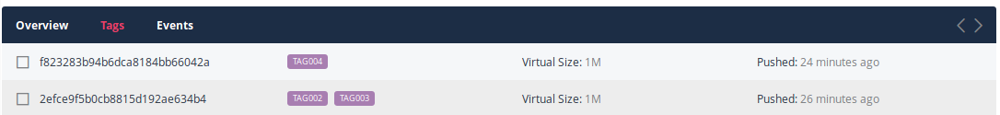
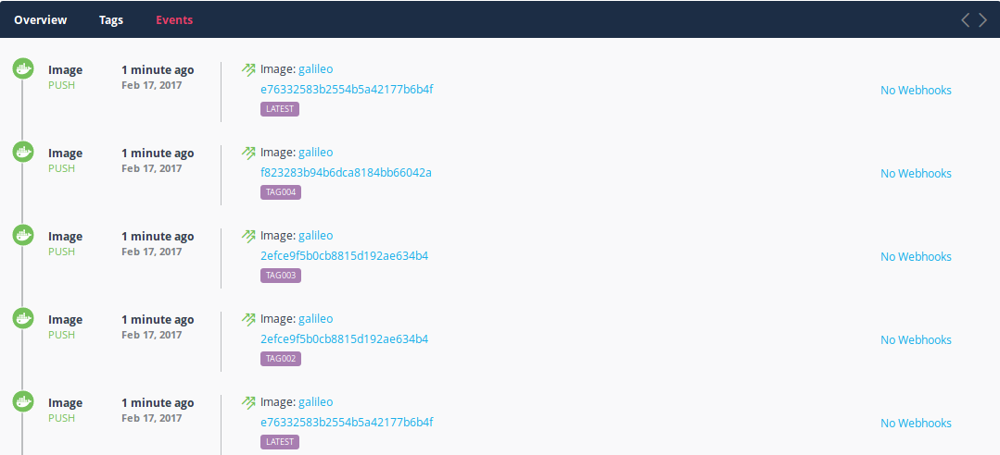

Puppet Container Registry supports local repositories, which are repositories from which Docker images can be pushed and pulled.

You can create local repositories with the Puppet Container Registry web UI, or with a `docker push` command.

## Creating a local repository with the web UI

<ol>
  <li>Click <b>Repositories</b>.</li>
  <li>Click the <b>Create Local Repository</b> icon.</li>
  <li>Enter a name for your repository.</li>
  <li>Click <b>Create</b> to create the local repository.</li>
</ol>

<h3>Creating and editing the local repository's README</h3>

When you create a new local repository, you'll be prompted to create a README for the repo. The README information is stored in the local repository's **Overview** view. 

Edit an existing README by clicking **Edit Read Me**. 

> **Note:** The editing field supports Markdown styling. 

<h3>View manifest tags</h3>

The <b>Tags</b> view shows the list of Docker image manifests (indicated by their SHA) and the tags that apply to each manifest.

<h3>View push event history</h3>

The <b>Events</b> view shows the <b>push</b> events that have occurred. This includes details on:

<ul>
  <li>When the image was pushed</li>
  <li>The image manifest SHA</li>
  <li>The image tag</li>
</ul>

## Making a local repository public

You can make a local Puppet Container Registry repository public, thus allowing anonymous `docker pull` access from the repository.

To make a local repository public:

<ol>
  <li>In the Puppet Container Registry web UI, select a remote repository, then click the <b>Repository Settings</b> (wrench) icon at the top right.</li>
  <li>Under <b>Repository</b>, select <b>Public</b>.</li>
  <li>Click <b>Yes</b> to save this change.</li>
</ol>

Users can now <code>docker pull</code> from this repository without authenticating. Pushes to this repository still need to be authenticated.

## Authenticating with Docker for use with local repositories

When using a Puppet Container Registry local repository, you may need to authenticate with Docker before running Docker push or pull commands. To authenticate, you'll log into Docker as the `TOKEN` user and supply an API token. 

1. In the Puppet Container Registry web UI, click the **Settings** (gear) icon at the top right.</li>
2. Click <b>API Tokens</b>, then click <b>Create Token</b>. A token will be created and obfuscated with asterisks. 
3. Click <b>Copy</b> to copy the token to your clipboard.
4. On the command line, log into Docker with your API token and the username TOKEN, as in the following example:

~~~
docker login -u TOKEN -p 1abc2def34g5h6ijklmnop7q89 europa.example.com
~~~

## Creating a local repository with `docker push`

Create a new local repository by doing a `docker push` to a Puppet Container Registry registry that does not yet exist.

Before you begin, make sure you have [authenticated with Docker](#authenticating-with-docker-for-use-with-local-repositories).

~~~
docker push europa.example.com:80/newrepository:latest
~~~

## Pushing and pulling from Docker with local repositories

Doing a `docker push` or `docker pull` with a Puppet Container Registry registry is the same as with any Docker registry.

### `docker push`

Before you begin, make sure you have [authenticated with Docker](#authenticating-with-docker-for-use-with-local-repositories).

Puppet Container Registry Enterprise edition supports multi-tenant. When doing a `docker push` to Puppet Container Registry Enterprise, you must include the Puppet Container Registry <b>username</b>.

~~~
docker push europa.example.com:80/<USERNAME>/galileo:tag009
~~~

### `docker pull`

You can pull images from a <b>Public</b> Puppet Container Registry local repository without authentication. If the repository is not public, make sure you have [authenticated with Docker](#authenticating-with-docker-for-use-with-local-repositories).

Puppet Container Registry Enterprise edition supports multi-tenant. When doing a `docker pull` from Puppet Container Registry Enterprise, you must include the Puppet Container Registry <b>username</b>.

~~~
docker pull europa.example.com/<USERNAME>/galileo:tag009
~~~

