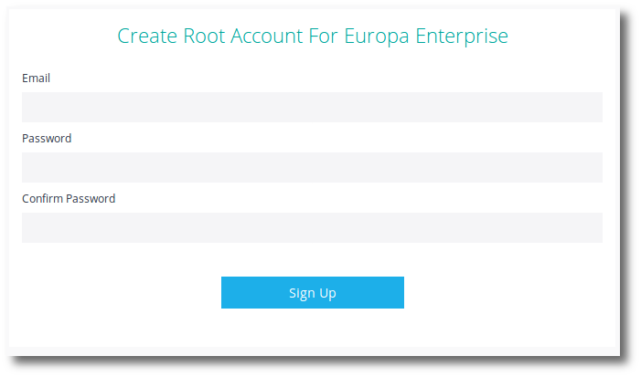
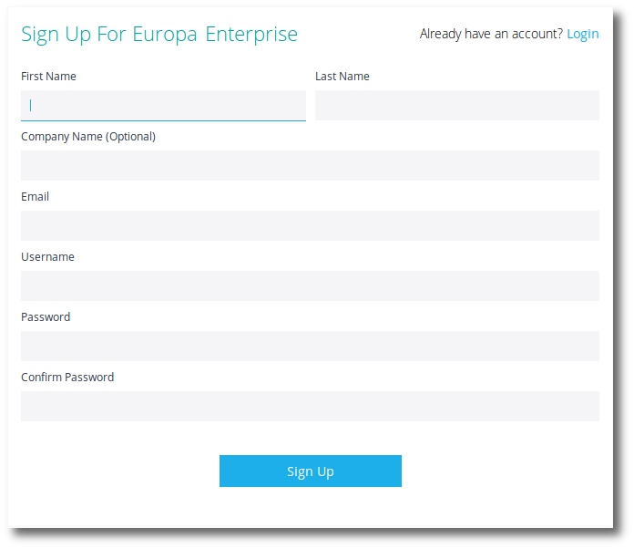
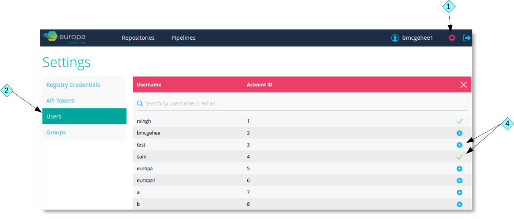
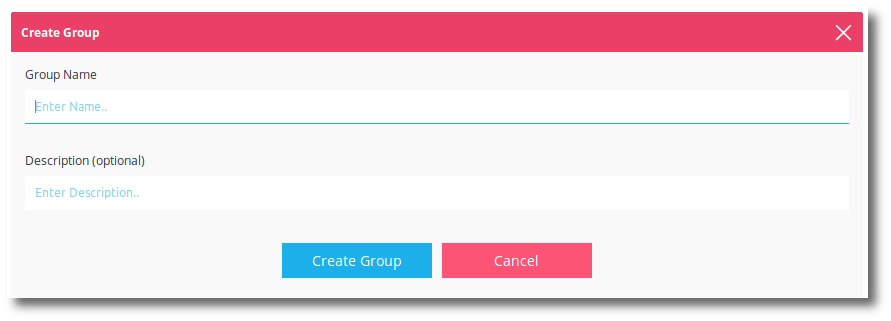

Puppet Container Registry Enterprise Edition is a fully feature multi-tenant docker registry that includes role based access controls and single sign-on.

To begin with Puppet Container Registry Enterprise Edition, follow the Puppet Container Registry [getting gtarted guide](./getting-started.html).

<h2>Create a root account</h2>

You will be asked to create the first Puppet Container Registry administrator account. This user will always have full access to Puppet Container Registry.

After creating this account, <b>immediately login with this account</b>.

<h2>License</h2>

You will be prompted to install a license before you can use Puppet Container Registry Enterprise Edition. A license can be retrieved from the <a href="https://licenses.puppet.com/">Pipelines License Manager</a>.

<h2>Users</h2>

Puppet Container Registry Enterprise Edition is a multi-tenant system where each user will have their own repositories. Users can share their account with other users and create groups to specify role based access controls (RBAC).

With Puppet Container Registry Enterprise Edition users can easily <b>Sign Up</b> for an account.

<h3>Adding users to your account</h3>

As a user of Puppet Container Registry Enterprise Edition you can add other users to your account to allow them access to the repositories and pipelines in your account. This can be done under settings.

<ol>
  <li>Click the <b>gear</b> on the top right of Puppet Container Registry.</li>
  <li>Click the <b>Users</b> link on the left menu.</li>
  <li>Click the <b>Add Users</b> link (or <b>Add Team Member</b> button) to add a user to your account.</li>
  <li>Select the <b>User(s)</b> that you wish to share your account with.</li>
</ol>

Realize that until you assign the user to a group, with permissions, they will have no permissions.

## Groups

Puppet Container Registry Enterprise Edition users can share their account with other users. Assigning a user to a group defines what permissions that user has in your account.

<h3>Create a group</h3>

To create a group in Puppet Container Registry Enterprise Edition:

<ol>
  <li>Click the <b>gear</b> on the top right of Puppet Container Registry.</li>
  <li>Click the <b>Groups</b> link on the left menu.</li>
  <li>Click the <b>Create Group</b> link (or <b>Create New Group</b> button) to add a group to your account.</li>

  

  <li>Enter a <b>Group Name</b>.</li>
  <li>Enter a group <b>Description</b> (optional).</li>
  <li>Click <b>Create Group</b>.
</ol>

<h3>Edit group permissions</h3>

After creating a group, you can edit the permissions for that group by clicking the <b>Edit Group Permissions</b> icon at the right of the group.

<h3>Group permissions</h3>

<h5>Account permissions</h5>

The account permissions represent global activities that can be done in the account.

<table>
  <tr><th>Account Permissions</th></tr>
  <tr><td>Local Repositories</td><td>Create</td><td>Permission to create a local Puppet Container Registry repository or mirror repository. The user can create the repository from the web UI. The user will require <b>Local Repository - Push</b> to be able to create the repository with a <code>docker push</code>.</td></tr>
  <tr><td>Remote Repositories</td><td>Connect</td><td>Permission to connect to a remote docker repository. The user may need <b>Registry Credentials - Read</b> and/or <b>Registry Credentials - Create</b>.</td></tr>
  <tr><td>Pipelines</td><td>Create</td><td>Permission to create a Puppet Container Registry pipeline. The user will need further <b>Pipeline</b> permissions to work with the pipeline.</td></tr>
  <tr><td>Groups</td><td>Read</td><td>Permission to view the existing groups and their associated permissions.</td></tr>
  <tr><td>Groups</td><td>Modify</td><td>Permission to create new groups. Permission to modify the existing groups and their associated permissions. Permission to delete groups. The user will require <b>Groups - Read</b>.</td></tr>
  <tr><td>Users</td><td>Read</td><td>Permission to view the accounts current users.</td></tr>
  <tr><td>Users</td><td>Modify</td><td>Permission to add / remove users from the account. Requires <b>Users - Read</b>.</td></tr>
  <tr><td>Registry Credentials</td><td>Read</td><td>Permission to view the existing registry credentials.</td></tr>
  <tr><td>Registry Credentials</td><td>Modify</td><td>Permission to modify existing registry credentials. Requires <b>Registry Credentials - Read</b>.</td></tr>
  <tr><td>Registry Credentials</td><td>Create</td><td>Permission to create new registry credentials. Requires <b>Registry Credentials - Read</b>.</td></tr>
  <tr><td>Registry Credentials</td><td>Delete</td><td>Permission to delete existing registry credentials. Requires <b>Registry Credentials - Read</b>.</td></tr>
</table>

<h5>Local Repositories Permissions</h5>

The Puppet Container Registry local repository permissions represent what activities can be done in a local repository or mirror repository. These permissions can be assigned as a wildcard for all local repositories or assigned to a specific existing local repository.

<table>
  <tr><th>Local Repositories Permissions</th></tr>
  <tr><td>Full Control</td><td>Full permission allowing any activity noted below.</td></tr>
  <tr>        <td>Push</td><td>Permission to push images to this local repository (pushing to mirror repositories is not allowed).</td></tr>
  <tr>        <td>Pull</td><td>Permission to pull images from this local repository or mirror repository.</td></tr>
  <tr>        <td>Read</td><td>Permission to view the repository in the Puppet Container Registry web UI.</td></tr>
  <tr>      <td>Modify</td><td>Permission to modify the repository; including setting webhooks, making the repository public / private, and editing the Read.me. Requires <b>Read</b> permission.</td></tr>
  <tr>      <td>Delete</td><td>Permission to delete the local or mirror repository. Requires <b>Read</b> permission.</td></tr>
</table>

<h5>Remote repositories permissions</h5>

The Puppet Container Registry remote repository permissions represent what activities can be done with a connected remote repository in Puppet Container Registry. These permissions can be assigned as a wildcard for all remote repositories or assigned to a specific existing remote repository.

<table>
  <tr><th>Remote Repositories Permissions</th></tr>
  <tr><td>Full Control</td><td>Full permission allowing any activity noted below.</td></tr>
  <tr>        <td>Read</td><td>Permission to view the repository in the Puppet Container Registry web UI.</td></tr>
  <tr>      <td>Modify</td><td>Permission to modify the repository including setting webhooks and editing the Read.me. Requires <b>Read</b> permission.</td></tr>
  <tr>  <td>Disconnect</td><td>Permission to disconnect the remote repository. Requires <b>Read</b> permission.</td></tr>
</table>

<h5>Pipelines permissions</h5>

The Puppet Container Registry pipeline permissions represent what activities can be done with a pipeline in Puppet Container Registry. These permissions can be assigned as a wildcard for all  pipelines or assigned to a specific existing pipeline.

<table>
  <tr><th>Pipeline permissions</th></tr>
  <tr><td>Full control</td><td>Full permission allowing any activity noted below.</td></tr>
  <tr>        <td>Read</td><td>Permission to view the pipeline in the Puppet Container Registry web UI.</td></tr>
  <tr>      <td>Modify</td><td>Permission to modify the pipeline including setting webhooks and editing the Read.me. Requires <b>Read</b> permission.</td></tr>
  <tr>      <td>Delete</td><td>Permission to delete the pipeline. Requires <b>Read</b> permission.</td></tr>
</table>

