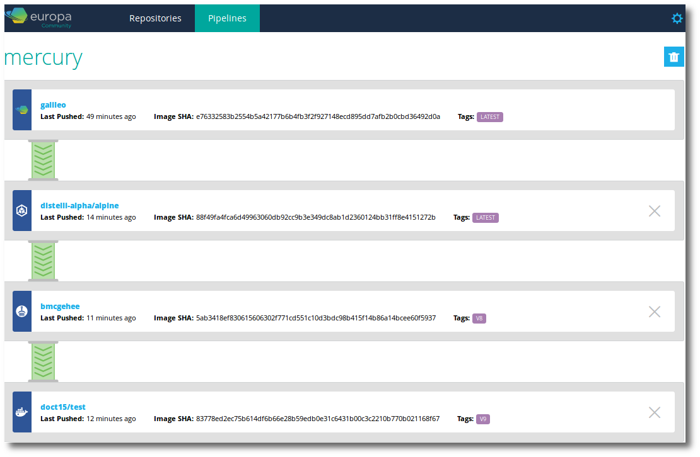

Puppet Container Registry promotion pipelines automate the process of pushing new images from a local repository to downstream local or remote Docker repositories. 

A promotion pipeline must begin with a Puppet Container Registry local repository. For example, in the promotion pipeline shown below, any new images to the local Puppet Container Registry repository <b>galileo</b> will be pushed to all three of the downstream remote repositories.

## Create a promotion pipeline

> **Before you begin**, make sure you have [created at least one local repository](./local-repo.html) and [added one or more remote repositories](./remote-repo.html) to Puppet Container Registry. 

1. In the Puppet Container Registry web UI, click **Pipelines**.
1. Create a new promotion pipeline. Click **Add Pipeline** or the New Pipeline icon in the left corner, and give your new promotion pipeline a name. 
1. Click **Connect Repository** and select the name of the local repository that will serve as the source repository for your promotion pipeline. 
    When Docker images are pushed to this repository, a promotion pipeline run will be automatically triggered. 
1. Click **Add Stage** and select the name of the local or remote repository that will be automatically updated when a new image is pushed to your source repository. 

   > **Note:** [Mirror repositories](./remote-repo.html) cannot be used in promotion pipelines.

1. As necessary, repeat step 4 to add additional stages to the promotion pipeline. 

Your basic promotion pipeline is now set up, and will automatically push new images from your source repository to each stage of the promotion pipeline. 

## Enable manual promotion for a promotion pipelines stage

In some instances, you might want to manually approve whether certain images are pushed to the downstream stages in your promotion pipeline. To enable more granular control over which images are promoted to a certain promotion pipeline stage, use the **auto-promote** controls.

1. In the Puppet Container Registry web UI, click **Pipelines** and select the name of the promotion pipeline. 
1. Uncheck the **Auto Promote on Image Event** box above the stage you wish to manage manually. 

## Manually promote an image 

When a stage in your promotion pipeline is not receiving new images automatically, use the manual promotion controls to specify the particular images that you wish to promote to that stage. 

1. Locate the stage in your promotion pipeline that is not auto-promoting on image events, and click **Promote**. 
2. In the **Promote Image** screen, click the **Select an image** field. A list of recent push events to the previous stage's repository will appear. Select the image you wish to promote to the destination repository. 
3. (Optional) The destination tag field will be automatically populated with the tag assigned to your selected image, but you can edit this field to use a different tag. 
4. Click **Promote**. Your selected image will be promoted, and any remaining automatic promotion stages in the promotion pipeline will be activated. 

> **Note:** It might take a few minutes for a large image to finish the promotion process. 

## Using promotion pipelines to manage geographically distributed infrastructure

Promotion pipelines can help you to use Puppet Container Registry geographically. Your Docker builds and deploys can be done from the closest Puppet Container Registry server while Puppet Container Registry handles the propogation of the images to other geographically located Puppet Container Registry servers.

