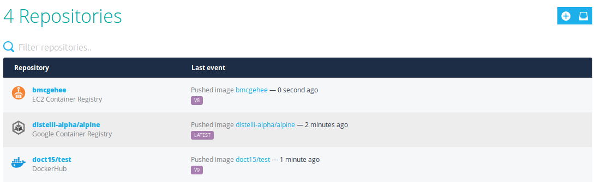

Remote repositories are hosted in third party-registries such as EC2 Container Registry or Google Container Registry. Puppet Container Registry can scan these remote registries and allow you to create pipelines to them and mirror remote repositories locally.

## Connect a remote repository

Puppet Container Registry can connect to Docker repositories in other Docker registries, including DockerHub, AWS ECR, and Google CGR. After you've connected it, Puppet Container Registry will monitor and report on events in your remote repository, including tracking manifests and tags over time.

1. In the Puppet Container Registry web UI, click **Repositories**. If this is the first repository you're adding to Puppet Container Registry, click **Connect a Remote Repository**. Otherwise, click the **Add Remote Repository** icon. 
1. On the **Connect a repository** page, select the repository's credentials or add a new set of credentials. 

   > **Note:** Supported Docker registry providers are Google Container Registry, DockerHub, and Amazon EC2 Container Registry.

1. Select or enter the repository name.
1. (Optional) Create a webhook for the remote repository by adding the webhook URL and secret. This webhook will be sent when a push event occurs in the remote repository.
1. Click **Connect Repository**.  

Now that your remote repository is connected to Puppet Container Registry, you can add it to a [promotion pipeline](./pipeline.html).

## Mirroring remote repositories

Puppet Container Registry can create a mirror repository that acts as a local version of a remote repository. After set up, the mirror repository periodically automatically syncs with the remote repository that it duplicates and pulls down new images, ensuring that your mirror repository stays up to date. 

A single remote repository can be used to create multiple mirror repositories, but each mirror repository has exactly one source repository. 

> **Important:** You can pull images from your mirror repository, but pushing to it is not allowed.

## Set up a mirrored repository

> **Before you begin**, make sure you have [added one or more remote repositories](./remote-repo.html) to Puppet Container Registry. 

1. In the Puppet Container Registry web UI, click **Repositories**, then click the **Mirror one or multiple repositories** icon. 
1. On the **Mirror one or multiple repositories** page, select the repository's credentials or add a new set of credentials. 

    > **Note:** Supported Docker registry providers are Google Container Registry, DockerHub, and Amazon EC2 Container Registry.
   
1. Review the list of remote repositories and deselect any you do not wish to mirror. 

    > **Tip:** Use the search and filter tools to locate repositories or see lists of repositories that meet certain criteria. 

1. For each remote repository selected for mirroring, review the proposed mirror repository name. If you wish to make changes to the proposed names, use the **Edit** icon.

     > **Note:** By default, Puppet Container Registry automatically suggests the last component of the remote repository's name as the name for the mirrored repository. For example, a remote repository named `quadrophenia/leeds` would receive `leeds` as a suggested mirror repositroy name. 

    Puppet Container Registry will flag any proposed mirror repository name that duplicates the name of an existing local repositories. Resolve these conflicts by renaming the mirror repository using the **Edit** icon. 
    
1. When you've finished selecting your chosen repositories and have ensured that there are no naming conflicts, click **Mirror Repositories.**

Puppet Container Registry will now connect to the repositories you've specified, create the mirror repositories, and perform an initial sync, which may take a few minutes to complete. 

## Changing a mirror repository's source repository

After a local mirror repository has been created, the source repository cannot be changed. If you need to change the source of a mirrored repository, delete the mirrored repostory and create a new one connected to the desired remote repository.  

## Deleting a mirrored repository

If you wish to delete a mirror repository, navigate to the repository's details page in the Puppet Container Registry web UI and click the **Delete Repository** icon. 

> **Important:** If a mirror repository has been created from a remote source repository, you cannot delete the source repository without first deleting the mirror repository. 

    
    
    
