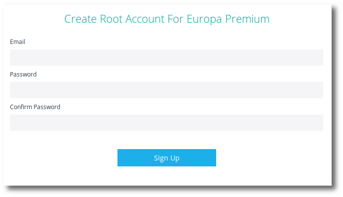
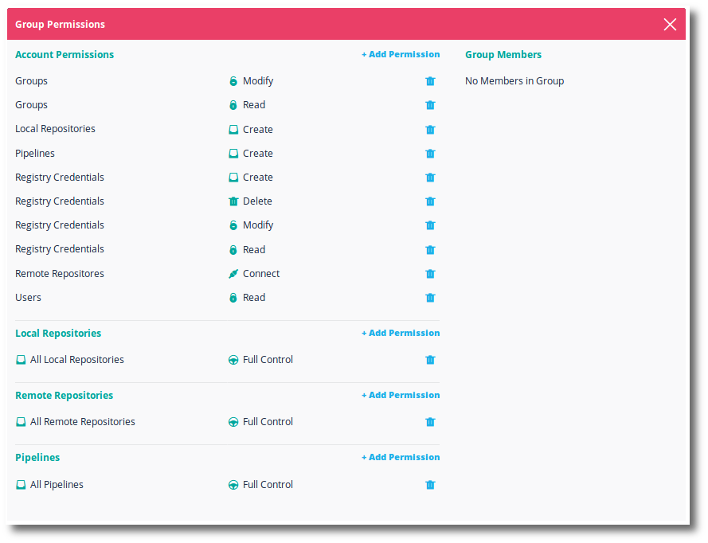
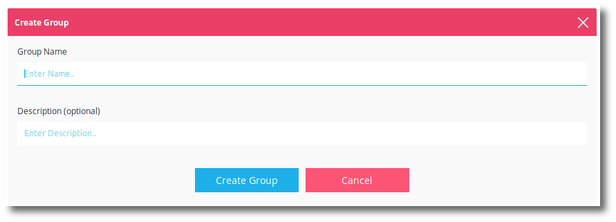
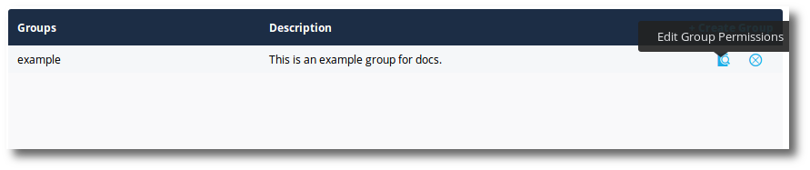

Puppet Container Registry Team Edition is a fully feature multi-user docker registry that includes role based access controls.

To begin with Puppet Container Registry Team edition, follow the Puppet Container Registry [getting gtarted guide](./getting-started.html).

<h3>Create a root account</h3>

You will be asked to create the first Puppet Container Registry administrator account. This user will always have full access to Puppet Container Registry.

After creating this account, <b>immediately login with this account</b>.

<h3>Licenses</h3>

You will be prompted to install a license before you can use Puppet Container Registry Team Edition. A license can be retrieved from the <a href="https://licenses.puppet.com/">Pipelines License Manager</a>.

<h3>RBAC groups</h3>

By default, all new users signing up for Puppet Container Registry Team Edition will have full access. There is a permissions group called <b>AllUsers</b> that all new users are immediately enrolled in. The users can not be removed from this group. The permissions for this group can be modified. It is recommended that these permissions are reviewed on an initial install of Puppet Container Registry Team Edition.

To view this, while logged in as the administrator account:

<ol>
  <li>Click the <b>Repositories</b> button at the top.</li>
  <li>Click the <b>gear</b> at the top right.</li>
  <li>Click <b>Groups</b> on the left.</li>
  <li>Click on the <b>AllUsers</b> group.</li>
</ol> 

This group controls the permissions of any new users signing in to Puppet Container Registry Team edition. As noted, by default, it gives full permissions to everything.

The <b>root</b> account always has full permissions.

## Groups

With Puppet Container Registry Team Edition all users share the same repositories and pipelines. Assigning a user to a group defines what permissions that user has in Puppet Container Registry Team Edition.

By default, all new users signing up for Puppet Container Registry Team Edition will have full access. There is a permissions group called <b>AllUsers</b> that all new users are immediately enrolled in. The users can not be removed from this group. The permissions for this group can be modified.

> **Note:** The <b>AllUsers</b> group is used only in Puppet Container Registry Team Edition. For a more robust multi-tenant solution, upgrade to Puppet Container Registry Enterprise.

To understand this model, realize that users with multiple permissions to the same object will be granted the fullest permission of the multiple permissions. This means that when you add a user to a group with fewer permissions than the AllUsers group, the users will still have full permissions granted by the AllUsers group.

Also realize, that by default users can change group permissions and lock themselves, or others, out of Puppet Container Registry Team Edition. The root account is not subject to permissions and can resolve any issues.

There are several ways to approach this:

<h5>The open model</h5>

One approach is to leave the system as is and allow all users to modify groups as they see fit.

<h5>The closed model</h5>

With this approach the root user removes <b>Group - Modify</b> and <b>Group - Read</b> from the <b>AllUsers</b> group.

<h5>The admin model</h5>

In this approach, the root user takes control of the permissions, removing <b>Group - Modify</b> from the AllUsers group.

Next, if necessary, create a group called <b>GroupModify</b> and grant this group <b>Group - Modify</b> permissions. 

Assign trusted users to the <b>GroupModify</b> group who will be allowed to edit group permissions.

<h3>Create a group</h3>

To create a group in Puppet Container Registry Team Edition:

<ol>
  <li>Click the <b>gear</b> on the top right of Puppet Container Registry.</li>
  <li>Click the <b>Groups</b> link on the left menu.</li>
  <li>Click the <b>Create Group</b> link (or <b>Create New Group</b> button) to add a group to your account.</li>

  

  <li>Enter a <b>Group Name</b>.</li>
  <li>Enter a group <b>Description</b> (optional).</li>
  <li>Click <b>Create Group</b>.
</ol>

<h3>Edit group permissions</h3>

After creating a group, you can edit the permissions for that group by clicking the <b>Edit group permissions</b> icon at the right of the group.

<h3>Group permissions</h3>

<h5>Account permissions</h5>

The account permissions represent global activities that can be done in the account.

<table>
  <tr><th colspan=3>Account Permissions</th></tr>
  <tr><td>Local Repositories</td><td>Create</td><td>Permission to create a local Puppet Container Registry repository. The user can create the repository from the web UI. The user will require <b>Local Repository - Push</b> to be able to create the repository with a <code>docker push</code>.</td></tr>
  <tr><td>Remote Repositories</td><td>Connect</td><td>Permission to connect to a remote docker repository. The user may need <b>Registry Credentials - Read</b> and/or <b>Registry Credentials - Create</b>.</td></tr>
  <tr><td>Pipelines</td><td>Create</td><td>Permission to create a Puppet Container Registry pipeline. The user will need further <b>Pipeline</b> permissions to work with the pipeline.</td></tr>
  <tr><td>Groups</td><td>Read</td><td>Permission to view the existing groups and their associated permissions.</td></tr>
  <tr><td>Groups</td><td>Modify</td><td>Permission to create new groups. Permission to modify the existing groups and their associated permissions. Permission to delete groups. The user will require <b>Groups - Read</b>.</td></tr>
  <tr><td>Users</td><td>Read</td><td>Permission to view the accounts current users.</td></tr>
  <tr><td>Users</td><td>Modify</td><td>Permission to add / remove users from the account. Requires <b>Users - Read</b>.</td></tr>
  <tr><td>Registry Credentials</td><td>Read</td><td>Permission to view the existing registry credentials.</td></tr>
  <tr><td>Registry Credentials</td><td>Modify</td><td>Permission to modify existing registry credentials. Requires <b>Registry Credentials - Read</b>.</td></tr>
  <tr><td>Registry Credentials</td><td>Create</td><td>Permission to create new registry credentials. Requires <b>Registry Credentials - Read</b>.</td></tr>
  <tr><td>Registry Credentials</td><td>Delete</td><td>Permission to delete existing registry credentials. Requires <b>Registry Credentials - Read</b>.</td></tr>
</table>

<h5>Local repository permissions</h5>

The Puppet Container Registry local repository permissions represent what activities can be done in a local repository. These permissions can be assigned as a wildcard for all local repositories or assigned to a specific existing local repository.

<table>
  <tr><th colspan=2>Local Repositories Permissions</th></tr>
  <tr><td>Full Control</td><td>Full permission allowing any activity noted below.</td></tr>
  <tr>        <td>Push</td><td>Permission to push images to this local repository.</td></tr>
  <tr>        <td>Pull</td><td>Permission to pull images from this local repository.</td></tr>
  <tr>        <td>Read</td><td>Permission to view the repository in the Puppet Container Registry web UI.</td></tr>
  <tr>      <td>Modify</td><td>Permission to modify the repository; including setting webhooks, making the repository public / private, and editing the Read.me. Requires <b>Read</b> permission.</td></tr>
  <tr>      <td>Delete</td><td>Permission to delete the local repository. Requires <b>Read</b> permission.</td></tr>
</table>

<h5>Remote repository permissions</h5>

The Puppet Container Registry remote repository permissions represent what activities can be done with a connected remote repository in Puppet Container Registry. These permissions can be assigned as a wildcard for all remote repositories or assigned to a specific existing remote repository.

<table>
  <tr><th colspan=2>Remote Repositories Permissions</th></tr>
  <tr><td>Full Control</td><td>Full permission allowing any activity noted below.</td></tr>
  <tr>        <td>Read</td><td>Permission to view the repository in the Puppet Container Registry web UI.</td></tr>
  <tr>      <td>Modify</td><td>Permission to modify the repository including setting webhooks and editing the Read.me. Requires <b>Read</b> permission.</td></tr>
  <tr>  <td>Disconnect</td><td>Permission to disconnect the remote repository. Requires <b>Read</b> permission.</td></tr>
</table>

<h5>Pipelines permissions</h5>

The Puppet Container Registry pipeline permissions represent what activities can be done with a pipeline in Puppet Container Registry. These permissions can be assigned as a wildcard for all  pipelines or assigned to a specific existing pipeline.

<table>
  <tr><th colspan=2>Pipeline Permissions</th></tr>
  <tr><td>Full Control</td><td>Full permission allowing any activity noted below.</td></tr>
  <tr>        <td>Read</td><td>Permission to view the pipeline in the Puppet Container Registry web UI.</td></tr>
  <tr>      <td>Modify</td><td>Permission to modify the pipeline including setting webhooks and editing the Read.me. Requires <b>Read</b> permission.</td></tr>
  <tr>      <td>Delete</td><td>Permission to delete the pipeline. Requires <b>Read</b> permission.</td></tr>
</table>
