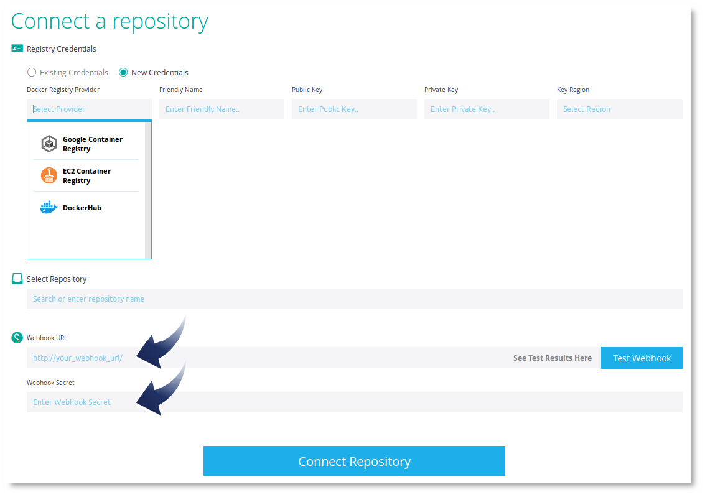
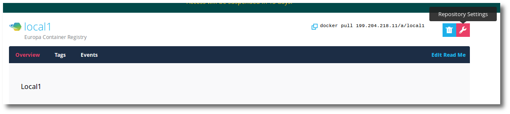
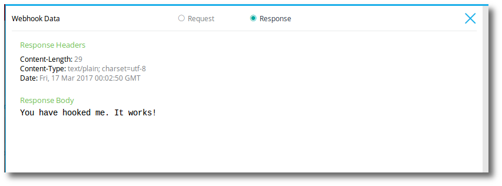
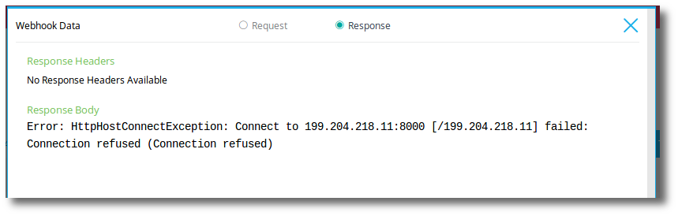
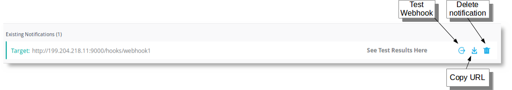

Webhooks in Puppet Container Registry provides notifications on repository push events. This includes both local Puppet Container Registry repositories and remote repositories. When connecting a remote repository, Puppet Container Registry monitors the repository for new image pushes. When a new tag or image are pushed, a webhook will be generated by Puppet Container Registry.

<h3>Webhooks</h3>

You can create a webhook when adding a remote repository to Puppet Container Registry.

Note: If you create a remote repository and add the webhook during creation, for this example, lets assume there are 100 image/tags in the remote repo. When Puppet Container Registry learns about the 100 images already existing in the repository, 100 webhooks will be sent. One for each newly learned image/tag.

An existing repository can be edited through <b>Repository Settings</b>.

<h3>Create a webhook</h3>

To create a webhook:

<ol>
  <li>Navigate to the <b>Repository Settings</b> where you wish to receive webhooks.</li>

  

  <li>Set the <b>Webhook URL</b> appropriate for your system receiving the webhook.</li>
  <li>Set the <b>Webhook Secret</b> if required by your system.</li>
  <li>Click the <b>Test Webhook</b> button to validate both the send and receipt of the webhook. This assume your system receiving the webhook is up, configured, and listening.</li>

  
The test may result in:

  <ul>
    <li><b>Error</b>.</li>
    <li><b>Success (nnn)</b> where nnn is the HTTP status code. Typically you would expect a <b>200</b>.</li>
  </ul>

  <li>You will want to validate the response by clicking <b>View Details</b>.</li>
  <li>Click <b>(x) Response</b> to view the response and verify it is correct.</li>

  

  
Or not correct, and why.

  

  <li>When you are ready, click <b>Add Notification</b>.</li>
</ol>

You can add many webhook notifications.

