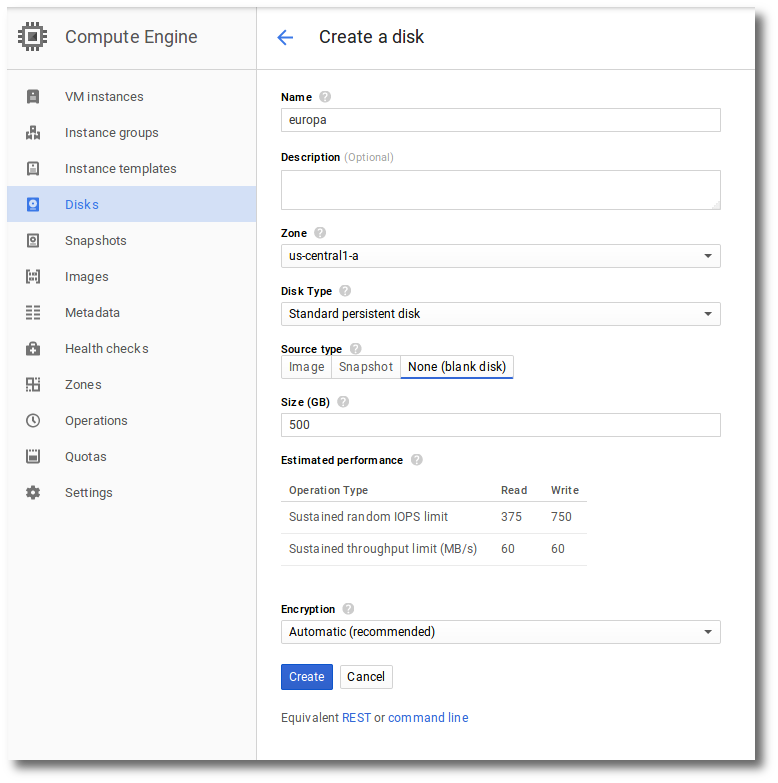
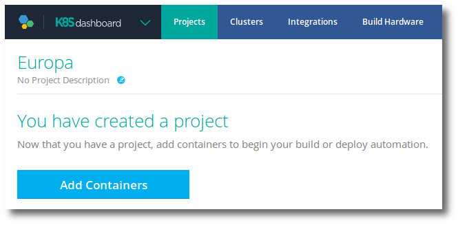
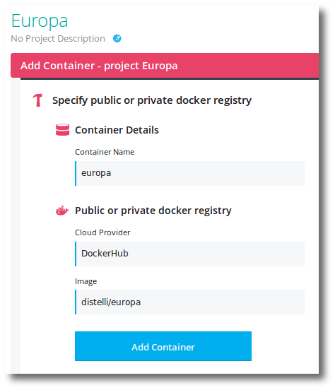
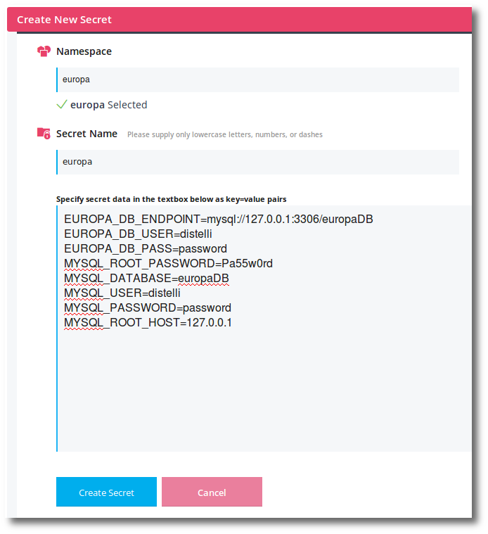
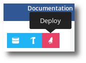
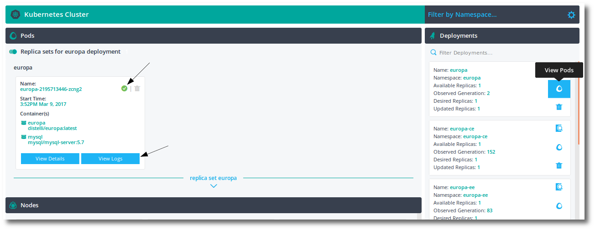
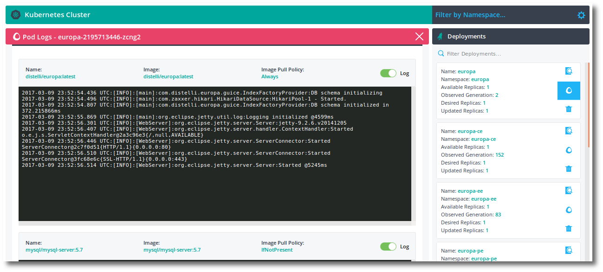
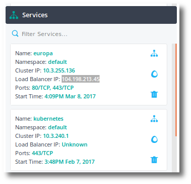

This document will walk through getting you started running Puppet Container Registry Docker Registry containers with Kubernetes.

<h3>Requirements</h3>

Puppet Container Registry requires a large store to store docker layers. Currently Puppet Container Registry supports AWS S3 and Filesystem. The example in this document will use Filesystem.

Puppet Container Registry requires a database. This must be MySQL 5.7. The example in this document will use the mysql/mysql:5.7 docker image.

<h3>Cluster</h3>

First you will need a Kubernetes cluster to run the containers. This document will use Google Cloud Platform for exemplification.

Ensure you have a cluster being managed by Pipelines. For information on creating a cluster in Google with Pipelines see [Adding a Google Cluster](https://puppet.com/docs/pipelines-for-containers/cluster-add.html).

<h3>Persistent Disk</h3>

For persistence of data and docker image layers you will need a persistent disk. To create this in the Google Cloud Platform:

<ol>
  <li>Login to <a href="https://console.cloud.google.com" target="_blank">Google Cloud Platform</a>.</li>
  <li>Ensure you have selected the correct Google Cloud Platform <b>project</b>.</li>
  <li>Click the <b>menu icon</b> on the top left.</li>
  <li>Select <b>Compute Engine</b> from the menu.</li>
  <li>Select <b>Disks</b> on the left.</li>
  <li>Click <b>Create Disk</b>.</li>

  

  <li>Set the values as shown above. Important that the <b>Zone</b> is the same zone used by your cluster. Also note the <b>Source Type</b> is None (blank disk).</li>
  <li>Click <b>Create</b> to create the persistent disk.</li>
</ol>

If you wish, instead of using the Google cloud console to provision the persistent disk, you can use the google command line tool:

<code>gcloud compute disks create --size 500GB europa --project YOUR_GOOGLE_PROJECT</code>

You will be prompted to select the zone for your persistent disk. Ensure you select the correct Zone for your cluster.

<h3>Namespace</h3>

The Kubernetes deployment specification exemplified below specifically uses namespace <b>europa</b>. You will need to create this namespace before deploying. 

To create the <b>europa</b> namespace with Pipelines for Containers see [Creating a Namespace](https://puppet.com/docs/pipelines-for-containers/cluster-namespace.html).

<h3>Project</h3>

Create a <b>Project</b> for the Puppet Container Registry and MySQL containers. For more information on creating projects in Pipelines for Containers see [Creating a project](https://puppet.com/docs/pipelines-for-containers/project.html).

<h3>Containers</h3>

Add the europa container to the project.

<ol>
  <li>Click <b>Add Containers</b>.</li>
  <li>Select <b>Specify Registry</b>.</li>

  

  <li>Fill in the values as shown above for your container. This will require you to have a Dockerhub login integrated with Pipelines.</li>
  <li>Click the <b>Add Container</b> button.</li>

  
Your container has been added to the project. Click <b>Close</b>.

</ol>

For more information on adding containers see [Adding containers to a project](https://puppet.com/docs/pipelines-for-containers/container.html).

<h3>Secrets</h3>

Several environment variables need to be available to initialize MySQL and europa. These will be implemented as secrets. The secrets will be created in the <b>europa</b> namespace. For more information on creating secrets see [Creating K8S secrets](https://puppet.com/docs/pipelines-for-containers/cluster-namespace.html).

Create the following secrets in the europa namespace:

~~~
EUROPA_DB_ENDPOINT=mysql://127.0.0.1:3306/europaDB
EUROPA_DB_USER=distelli
EUROPA_DB_PASS=password
MYSQL_ROOT_PASSWORD=Pa55w0rd
MYSQL_DATABASE=europaDB
MYSQL_USER=distelli
MYSQL_PASSWORD=password
MYSQL_ROOT_HOST=127.0.0.1
~~~

<h3>Deployment</h3>

We are ready to create the europa deployment. This will be done in Pipelines for Containers from the europa project.

1. Navigate to the <b>europa project</b> created above.
1. Click the <b>rocket deploy icon</b> at the top right.

  

1. Select the <b>cluster</b>.
1. Click the <b>Create a new deployment</b> button.
1. Paste the following Kubernetes deployment specification yaml into Pipelines for Containers.

~~~
apiVersion: extensions/v1beta1
kind: Deployment
metadata:
  name: europa
  namespace: europa
spec:
  replicas: 1
  strategy:
    rollingUpdate:
      maxSurge: 1
      maxUnavailable: 1
    type: RollingUpdate
  template:
    metadata:
      labels:
        deployment: europa
        app: europa
    spec:
      containers:
        - name: europa
          image: puppet/puppet-container-registry-enterprise:latest
          ports:
          - containerPort: 80
            hostPort: 80
            protocol: TCP
            name: http
          - containerPort: 443
            hostPort: 443
            protocol: TCP
            name: https
          env:
            - name: EUROPA_DB_ENDPOINT
              valueFrom:
                secretKeyRef:
                  key: EUROPA_DB_ENDPOINT
                  name: europa
            - name: EUROPA_DB_USER
              valueFrom:
                secretKeyRef:
                  key: EUROPA_DB_USER
                  name: europa
            - name: EUROPA_DB_PASS
              valueFrom:
                secretKeyRef:
                  key: EUROPA_DB_PASS
                  name: europa
          volumeMounts:
          - mountPath: /europa/repo
            name: europa-disk
            subPath: europa/repo
        - name: mysql
          image: mysql/mysql-server:5.7
          ports:
          - containerPort: 3306
            hostPort: 3306
            protocol: TCP
            name: mysql
          env:
            - name: MYSQL_ROOT_PASSWORD
              valueFrom:
                secretKeyRef:
                  key: MYSQL_ROOT_PASSWORD
                  name: europa
            - name: MYSQL_DATABASE
              valueFrom:
                secretKeyRef:
                  key: MYSQL_DATABASE
                  name: europa
            - name: MYSQL_USER
              valueFrom:
                secretKeyRef:
                  key: MYSQL_USER
                  name: europa
            - name: MYSQL_PASSWORD
              valueFrom:
                secretKeyRef:
                  key: MYSQL_PASSWORD
                  name: europa
            - name: MYSQL_ROOT_HOST
              valueFrom:
                secretKeyRef:
                  key: MYSQL_ROOT_HOST
                  name: europa
          volumeMounts:
          - mountPath: /var/lib/mysql
            name: europa-disk
            subPath: var/lib/mysql
      volumes:
      - name: europa-disk
        gcePersistentDisk:
          pdName: europa
      dnsPolicy: ClusterFirst
      restartPolicy: Always
~~~

1. Give the deployment a <b>Deployment Description (required)</b>.
1. Click the <b>Deploy</b> button.

You can monitor the deploy by clicking the <b>Monitor Deployment</b> button.

Note, the first deployment with a new persistent disk will take at least 5 minutes or possibly more. 

<h3>Service</h3>

Lastly, a load balancer service needs to be created to make the europa docker registry and web interface available. Create the following service in Pipelines for Containers. For more information on creating a service see [Creating a service](https://puppet.com/docs/pipelines-for-containers/project.html).

~~~
apiVersion: v1
kind: Service
metadata:
  name: europa
spec:
  ports:
    - name: http
      port: 80
      protocol: TCP
      targetPort: 80
    - name: https
      port: 443
      protocol: TCP
      targetPort: 443
  selector:
    deployment: europa
    run: europa
  type: LoadBalancer
~~~

<h3>Validation</h3>

You can verify the deployment is running in Pipelines for Containers.

<ol>
  <li>Navigate to the cluster where <b>europa</b> is deployed.</li>
  <li>Look on the right under <b>Deployments</b> for the <b>europa</b> deployment and click the <b>View Pods</b> icon.</li>
</ol>

This will filter the replica sets on the left to only the pods assicated with the europa deployment.

You can see by the <b>green check mark</b> that the deploy is successful and running.

You can click on the <b>View Logs</b> button to view the running logs.

You will also want to look at your load balancer service to discover the public load balancer IP address.

Navigate to that load balancer IP with your browser and begin using europa.

Of note, if you followed the instructions exactly above, your <b>Storage</b> will be <b>File System</b> of <code>/europa/repo</code>.

You can follow the getting started instructions here [Getting started with Puppet Container Registry](./getting-started.html).

