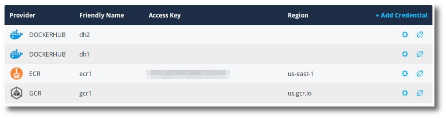

Puppet Container Registry can connect to docker repositories in other docker registries, including:

<ul>
  <li>DockerHub</li>
  <li>AWS ECR</li>
  <li>Google GCR</li>
</ul>

Puppet Container Registry will monitor and report on events in this remote repository. Include tracking manifests and tags over time.

Puppet Container Registry can send a webhook when a push occurs in the remote repository.

<!--Puppet Container Registry can mirror new images from this remote repository to other repositories in a mirror.-->

## Registry credentials

Registry credentials, in Puppet Container Registry, provides a mechanism to store remote docker registry credentials for use in connecting to remote docker repositories.

Currently supported registry credentials include:

<ul>
  <li>Google Container Registry</li>
  <li>Dockerhub</li>
  <li>EC2 Container Registry</li>
</ul>

