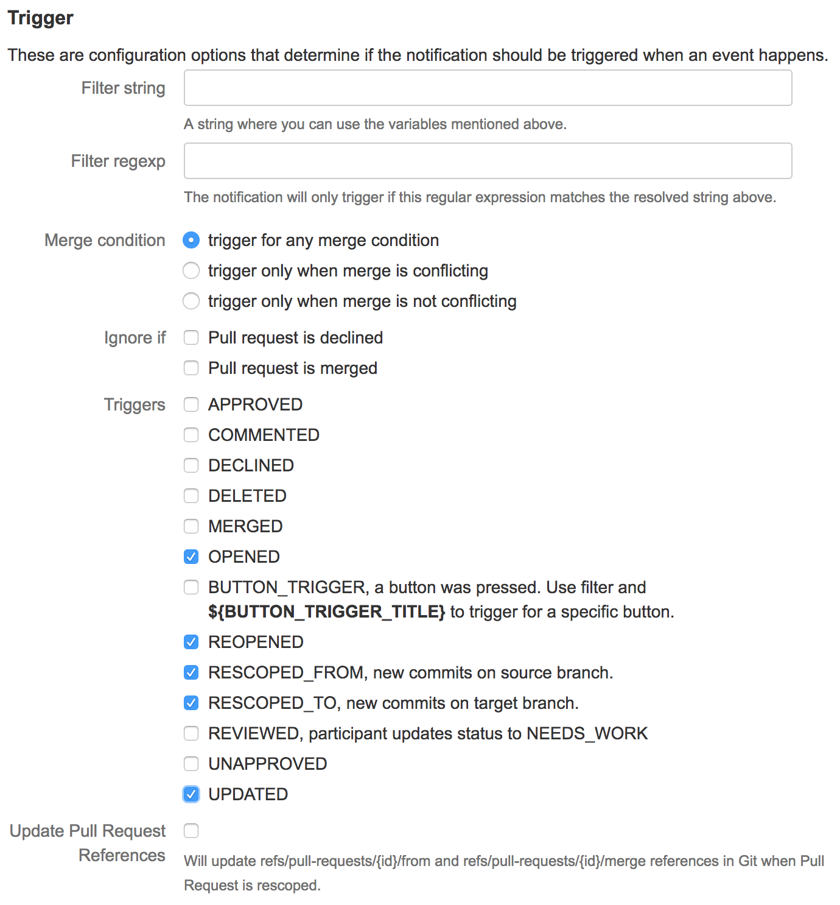
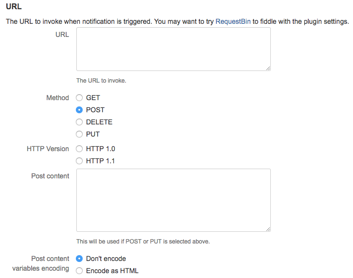
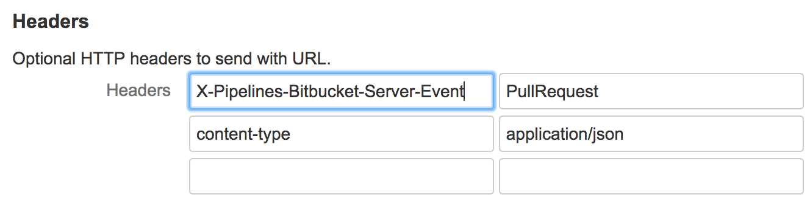

# Configure Bitbucket Server repositories

In order to make full use of the core features of Continuous Delivery for Puppet Enterprise \(PE\), Bitbucket Server users must enable two plugins. These plugins enable the webhooks and pull request notifications Continuous Delivery for PE uses to automate testing and deployment of your code.

You can enable the two plugins in any order you wish, but you must enable both on each Bitbucket Server repository you use with Continuous Delivery for PE.

## Configure the Bitbucket Server webhooks plugin

Continuous Delivery for PE uses webhooks to learn when new code is committed to your Bitbucket Server repostory, so that the code can be automatically tested and deployed according to your pipeline's specifications. Bitbucket Server requires the installation and configuration of a webhooks plugin in order to enable this feature.

### About this task

**Important:** You must enable this plugin on each Bitbucket Server repository you use with Continuous Delivery for PE.

### Procedure

1.  Install the [Web Post Hooks for Bitbucket Server](https://marketplace.atlassian.com/apps/1211539/web-post-hooks-for-bitbucket-server?hosting=server&tab=overview) plugin.

2.  In the Bitbucket Server web UI, in the repository you're connecting, click **Repository settings**.

3.  Click **Hooks**.

4.  Click the toggle to enable Post-Receive Webhooks. When prompted, enter the URL provided in the Continuous Delivery for PE web UI.

    Your custom URL is shown in the Continuous Delivery for PE web UI when you add a new control repo or module, select Bitbucket Server as your source control, and select your organization, repository, and branch.

    **Tip:** If you're not automatically prompted to enter this URL, click the plugin's **Edit** icon.


## Configure the Bitbucket Server pull request plugin

A core feature of Continuous Delivery for PE is its ability to automatically test new or updated pull request code. Bitbucket Server requires the installation and configuration of a pull request notification plugin in order to enable this feature.

### About this task

**Important:** You must enable this plugin on each Bitbucket Server repository you use with Continuous Delivery for PE.

### Procedure

1.  Install the [Pull Request Notifier for Bitbucket](https://marketplace.atlassian.com/apps/1213177/pull-request-notifier-for-bitbucket?hosting=server&tab=overview) plugin.

2.  In the Bitbucket Server web UI, in the repository you're connecting, click **Repository settings**.

3.  Click **Pull request notifications**.

4.  In the **Trigger** section of the page, make the following selections:

    

5.  In the **URL** section of the page, make the following selections:

    

6.  In the **URL** section, in the **URL** text field, enter the custom URL provided by Continuous Delivery for PE.

    **Tip:** Your custom URL is shown in the Continuous Delivery for PE web UI when you add a new control repo or module, select Bitbucket Server as your source control, and select your organization, repository, and branch.

7.  In the **URL** section, paste the following webhook body into the **Post content** text field:

    ```
    {
    "id": ${PULL_REQUEST_ID},
    "title": "${PULL_REQUEST_TITLE}",
    "version": "${PULL_REQUEST_VERSION}",
    "action": "${PULL_REQUEST_ACTION}",
    "state": "${PULL_REQUEST_STATE}",
    "url": "${PULL_REQUEST_URL}",
    "userDisplayName": "${PULL_REQUEST_USER_DISPLAY_NAME}",
    "userEmail": "${PULL_REQUEST_USER_EMAIL_ADDRESS}",
    "userId": ${PULL_REQUEST_USER_ID},
    "username": "${PULL_REQUEST_USER_NAME}",
    "userSlug": "${PULL_REQUEST_USER_SLUG}",
    "userGroup": "${PULL_REQUEST_USER_GROUPS}",
    "authorDisplayName": "${PULL_REQUEST_AUTHOR_DISPLAY_NAME}",
    "authorEmail": "${PULL_REQUEST_AUTHOR_EMAIL}",
    "authorId": ${PULL_REQUEST_AUTHOR_ID},
    "authorName": "${PULL_REQUEST_AUTHOR_NAME}",
    "authorSlug": "${PULL_REQUEST_AUTHOR_SLUG}",
    "mergeCommit": "${PULL_REQUEST_MERGE_COMMIT}",
    "fromSshCloneUri": "${PULL_REQUEST_FROM_SSH_CLONE_URL}",
    "fromSha": "${PULL_REQUEST_FROM_HASH}",
    "fromRef": "${PULL_REQUEST_FROM_ID}",
    "fromBranch": "${PULL_REQUEST_FROM_BRANCH}",
    "fromRepoId": ${PULL_REQUEST_FROM_REPO_ID},
    "fromRepoName": "${PULL_REQUEST_FROM_REPO_NAME}",
    "fromProjectId": ${PULL_REQUEST_FROM_REPO_PROJECT_ID},
    "fromProjectKey": "${PULL_REQUEST_FROM_REPO_PROJECT_KEY}",
    "fromRepoSlug": "${PULL_REQUEST_FROM_REPO_SLUG}",
    "toSshCloneUri": "${PULL_REQUEST_TO_SSH_CLONE_URL}",
    "toSha": "${PULL_REQUEST_TO_HASH}",
    "toRef": "${PULL_REQUEST_TO_ID}",
    "toBranch": "${PULL_REQUEST_TO_BRANCH}",
    "toRepoId": ${PULL_REQUEST_TO_REPO_ID},
    "toRepoName": "${PULL_REQUEST_TO_REPO_NAME}",
    "toProjectId": ${PULL_REQUEST_TO_REPO_PROJECT_ID},
    "toProjectKey": "${PULL_REQUEST_TO_REPO_PROJECT_KEY}",
    "toRepoSlug": "${PULL_REQUEST_TO_REPO_SLUG}"
    }
    ```

8.  In the **Headers** section of the page, enter the following:

    

    |**Tip:** Copy the headers from the table below and paste them into the Bitbucket Server web UI as shown in the image above.

|
    |    ```
X-Pipelines-Bitbucket-Server-Event
    ```

|    ```
PullRequest
    ```

|
    |    ```
content-type
    ```

|    ```
application/json
    ```

|

9.  Click **Save**.


