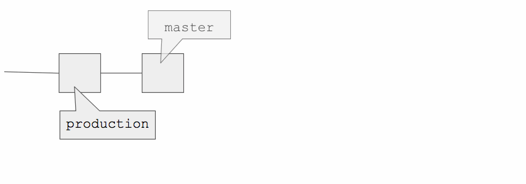
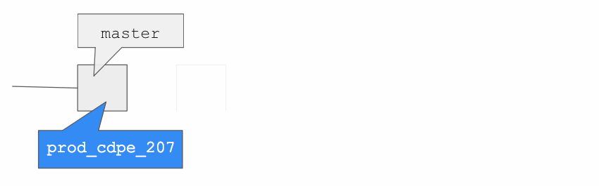

# Deployment policies

Deployment policies are prescriptive workflows for Puppet code deployment that are built into Continuous Delivery for Puppet Enterprise \(PE\). You select the best deployment policy for your situation, and Continuous Delivery for PE does all the Git heavy lifting for you, so your code is quickly and easily deployed to the right nodes.

## Which deployment policy should I use?

Continuous Delivery for PE has four built-in deployment policies, each with a different branching workflow. Use the table below to select the best deployment policy for your circumstances. 

|Deployment policy|Best for...|
|-----------------|-----------|
|Direct deployment policy|-   Small or trivial changes

-   Changes that you have a high level of confidence will not cause issues when deployed

|
|Temporary branch policy|-   Fully tested changes

-   Changes you'd like to have validated through deployment

-   Workflows that don't require extensive logging of historic data

|
|Incremental branch policy|-   Fully tested changes

-   Changes you'd like to have validated through deployment

-   Workflows that require robust historic data and the ability to pinpoint the date and time a particular change was implemented

|
|Blue-green branch policy|-   Fully tested changes

-   Changes you'd like to have validated through deployment

-   Workflows that require robust historic data and the ability to pinpoint the date and time a particular change was implemented

-   Workflows that benefit from an automatically maintained redundant fallback branch

|

## Direct deployment policy

The direct deployment policy is the most basic of the four deployment policies offered in Continuous Delivery for PE. This policy is best to use if you wish to simply deploy a certain commit to a specified environment, then run Puppet on that environment \(and only that environment\) to deploy your changes.  

When you kick off a deployment using the direct deployment policy, Continuous Delivery for PE performs the following steps.

**Step 1: `puppet-code deploy`**

Using Code Manager, Continuous Delivery for PE synchronizes the selected code change with your PE instance by running `puppet-code deploy` on Puppet Server.

**Step 2: Temporary environment group**

Continuous Delivery for PE creates a new environment group that's a child of the node group you selected when setting up your deployment. The child node group inherits all the rules, configuration settings, and variables of its parent node group. A Puppet Query Language query pins all the nodes associated with the parent node group to the child node group.

This environment node group is temporary; once the deployment is complete, it will be automatically deleted. It's likely that you won't ever need to interact directly with this environment group.

**Step 3: Running Puppet**

Continuous Delivery for PE uses the orchestrator to kick off a Puppet run on the nodes in the child node group. The orchestrated Puppet run updates nodes as quickly as the concurrency limits of Puppet Server allow. You can monitor the progress of this process on the deployment details page in the Continuous Delivery for PE web UI.

**Step 4: Clean-up**

When the Puppet run is complete, Continuous Delivery for PE deletes the child environment group and moves the HEAD of your target branch in your source control repository to the commit you chose to deploy.

## Temporary branch policy

During a deployment using the temporary branch policy, Continuous Delivery for PE creates a temporary Git branch containing the code you wish to deploy, and a temporary environment group containing the nodes you're deploying code to. Your new code is then mapped to the temporary environment group in batches, allowing you to be certain that your new Puppet code works with each node before the changes are deployed to the full environment.

When you kick off a deployment using the temporary branch policy, Continuous Delivery for PE performs the following steps.

**Step 1: New branch**

Continuous Delivery for PE creates a new branch in your source control repository with the commit you've selected at its tip. This branch is temporary; once the deployment is complete, it will be automatically deleted. It's likely that you won't ever need to interact directly with this temporary branch.

**Step 2: `puppet-code deploy`**

Using Code Manager, Continuous Delivery for PE synchronizes the code changes with your PE instance by running `puppet-code deploy` on Puppet Server.

**Step 3: Temporary environment group**

Continuous Delivery for PE creates a new environment group that's a child of the node group you selected when setting up your deployment. The child node group inherits all the rules, configuration settings, and variables of its parent node group. A Puppet Query Language query pins all the nodes associated with the parent node group to the child node group.

This environment node group is temporary; once the deployment is complete, it will be automatically deleted. It's likely that you won't ever need to interact directly with this environment group.

**Step 4: Running Puppet**

Continuous Delivery for PE uses the orchestrator to kick off a Puppet run on the nodes in the child node group. Puppet runs on a few nodes at a time, based on the stagger settings you specified when setting up the deployment. You can monitor the progress of this process on the deployment details page in the Continuous Delivery for PE web UI.

**Step 5: Clean-up**

When all the Puppet runs have completed successfully \(or in the event that the termination conditions you specified are met\), Continuous Delivery for PE deletes the child environment group, moves the HEAD of the target branch in your source control repository to point to your chosen commit, and deletes the temporary Git branch created at the beginning of this process.  

## Incremental branch policy

The incremental branch policy functions much like the temporary branch policy, with one exception: the Git branch created when the deployment is initiated isn't destroyed when the deployment is complete. Instead, this new branch remains in your source control system, providing a historic record of the changes made to your environments.

During a deployment using the incremental branch policy, Continuous Delivery for PE creates a new Git branch containing the code you wish to deploy, and a temporary environment group containing the nodes you're deploying code to. Your new code is then mapped to the temporary environment group in batches, allowing you to be certain that your new Puppet code works with each node before the changes are deployed to the full environment.

When you kick off a deployment using the incremental branch policy, Continuous Delivery for PE performs the following steps.

**Step 1: New branch**

Continuous Delivery for PE creates a new branch in your source control repository with the commit you've selected at its tip. The name of this new branch contains the environment you're deploying to and the deployment's ID number.

**Step 2: `puppet-code deploy`**

Using Code Manager, Continuous Delivery for PE synchronizes the code changes with your PE instance by running `puppet-code deploy` on Puppet Server.

**Step 3: Temporary environment group**

Continuous Delivery for PE creates a new environment group that's a child of the node group you selected when setting up your deployment. The child node group inherits all the rules, configuration settings, and variables of its parent node group. A Puppet Query Language query pins all the nodes associated with the parent node group to the child node group.

This environment node group is temporary; once the deployment is complete, it will be automatically deleted. It's likely that you won't ever need to interact directly with this environment group.

**Step 4: Running Puppet**

Continuous Delivery for PE uses the orchestrator to kick off a Puppet run on the nodes in the child node group. Puppet runs on a few nodes at a time, based on the stagger settings you specified when setting up the deployment. You can monitor the progress of this process on the deployment details page in the Continuous Delivery for PE web UI.

**Step 5: Clean-up**

When all the Puppet runs have completed successfully \(or in the event that the termination conditions you specified are met\), Continuous Delivery for PE deletes the child environment group. Because you selected the incremental branch policy, the Git branch created at the beginning of this process is not deleted.  

CAUTION:

Using the incremental branch policy means that you will amass a collection of formerly used branches in your source control system. These branches are intended for use as a historic record of past changes to your environments. Garbage collection of old branches isn't performed by Continuous Delivery for PE; you must manually delete unneeded branches according to your company's policies about historic data retention.  

## Blue-green branch policy

A blue-green branch deployment policy uses redundancy to minimize risk when deploying code to production. Continuous Delivery for PE automatically alternates the use of two branches, deploying your changes by mapping the nodes in your target environment to the active branch while the passive branch remains stable.

In contrast to the temporary branch policy, which deletes each deployment branch when the deployment is complete, or the incremental branch policy, which creates and preserves a new branch for each deployment, the blue-green branch policy creates and preserves two branches \(`_blue` and `_green`\), and reuses these two branches in alternating order.

When you kick off a deployment using the blue-green branch policy, Continuous Delivery for PE performs the following steps.

**Step 1: Blue and green branches**

During your first deployment for a given environment using the blue-green branch policy, Continuous Delivery for PE creates a new Git branch \(the `_blue` branch\) containing the code you wish to deploy, and follows the process outlined below. During your second deployment with this policy, a new `_green` branch is created and used. From this point on, the branches are simply reused in alternating order; the third deployment will use the `_blue` branch, the fourth will use the `_green` branch, and so on.

**Step 2: `puppet-code deploy`**

Using Code Manager, Continuous Delivery for PE synchronizes the code changes with your PE instance by running `puppet-code deploy` on Puppet Server.

**Step 3: Temporary environment group**

Continuous Delivery for PE creates a new environment group that's a child of the node group you selected when setting up your deployment. The child node group inherits all the rules, configuration settings, and variables of its parent node group. A Puppet Query Language query pins all the nodes associated with the parent node group to the child node group.

This environment node group is temporary; when the deployment is complete, it will be automatically deleted. It's likely that you won't ever need to interact directly with this environment group.

**Step 4: Running Puppet**

Continuous Delivery for PE uses the orchestrator to kick off a Puppet run on the nodes in the child node group. Puppet runs on a few nodes at a time, based on the stagger settings you specified when setting up the deployment. You can monitor the progress of this process on the deployment details page in the Continuous Delivery for PE web UI.

**Step 5: Clean-up**

When all the Puppet runs have completed successfully \(or in the event that the termination conditions you specified are met\), Continuous Delivery for PE deletes the child environment group. Because you selected the blue-green branch policy, the Git branch is not deleted, but is preserved for later reuse.

