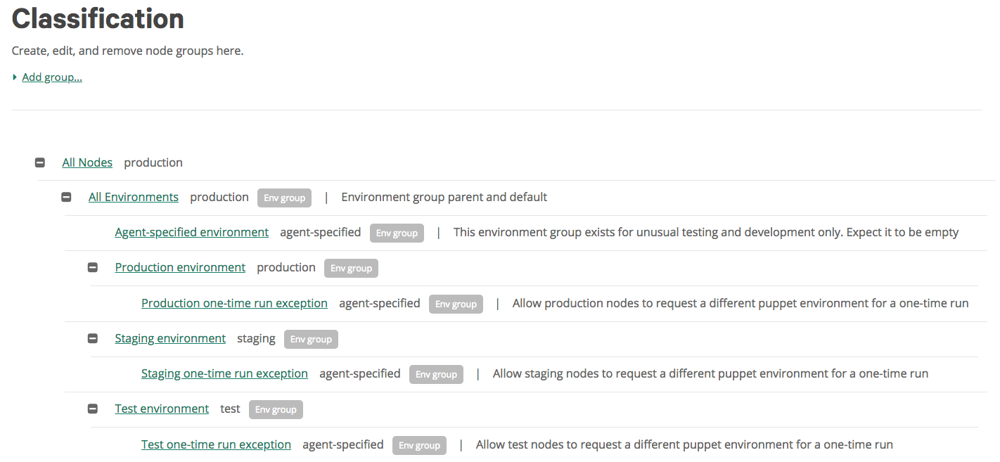

# Start deploying Puppet code

In this getting started guide, you'll learn how to set up a control repo, manually kick off a deployment, create a deployment pipeline, and gain insight into how Continuous Delivery for PE works behind the scenes to deploy code changes to your nodes.

## Before you begin

Make sure you're ready to get started by completing the following:

1.  Integrate your PE instance. See [Integrate with Puppet Enterprise](integrate_with_puppet_enterprise.md#) for instructions.

## Add a control repo

A control repo in Continuous Delivery for PE tracks the changes made on the active development branch of your source control system. When adding a control repo to Continuous Delivery for PE, it's important to connect the master Git branch.

### About this task

When you set up your new control repo, Continuous Delivery for PE adds a webhook to the associated repository in your source control system. The webhook reports new commit activity on the repository to Continuous Delivery for PE, making it easy for you to track code changes and take action.

### Procedure

1.  In the Continuous Delivery for PE web UI, click **Control Repos**, then click **Add Control Repo**.

2.  Follow the prompts to select your source control, organization, and your chosen repository.

3.  When prompted to select a branch, choose the branch that's under active development. This should be your "master" branch.

    **Important:** When working with Continuous Delivery for PE, only commit to the master branch and to any feature branches \(which will eventually be merged back into the master branch\). Do not push code changes to any of your other Git branches, as doing so can create conflicts with Continuous Delivery for PE workflows.

4.  **Bitbucket Server users**: See [Configure Bitbucket Server repositories](configure_bitbucket.md#) for instructions on how to set up the two plugins required to make Continuous Delivery for PE fully operational on your repository.

5.  Edit the name of your new control repo.

    **Tip:** The control repo name must contain only alphanumeric characters, dashes, and underscores.

6.  Click **Add**. The control repo is now shown in the master list on the Control repos page.

## Introducing deployments

Deployments in Continuous Delivery for PE use the PE tools you're familiar with--Code Manager, orchestration, and Puppet environments--to deploy your new code, but don't require you to use Git to move your commits between Puppet environments. Instead, Continuous Delivery for PE does that work for you.

Before we learn how deployments work, it's important to define some key terms.

-   **Environment node group**

    An environment is a set of nodes used for a particular purpose. An environment node group is node group you create in Puppet to represent an environment. Environment node groups define which nodes belong to which environment.

    Environment node groups can be very broad, such as Staging--all nodes used to stage changes prior to shipping them to production. They can also be smaller and more specific, such as Denver Production Forge Servers. When Continuous Delivery for PE deploys changes, it deploys them to one environment node group at a time.

    A node cannot be in two environment node groups at once.

-   **Puppet environment**

    A Puppet environment is a Git branch that gets turned into a directory on your Puppet master.

    A Puppet environment specifies the resources that the Puppet master will use when compiling catalogs for agent nodes. The code management tools built into Puppet Enterprise create and maintain your Puppet environments based on the branches in your control repo.

    For example, if your control repo has a production branch, a development branch, and a testing branch, code management creates a production Puppet environment, a development Puppet environment, and a testing Puppet environment.

Continuous Delivery for PE manages the journey from changes made in version control to checkout in a Puppet environment to deployment on nodes in an environment node group. When you kick off a deployment, you're in essence telling Continuous Delivery for PE that "I want to deploy the changes in commit \#x on the master branch to nodes in my environment node group \#y." Continuous Delivery for PE then talks to your version control system, to Code Manager, to the node classifier, and to the orchestrator to guide and automate deployment of the change you've requested to the right group of nodes.

The basic steps in this process are as follows:

1.  You initiate a deployment and specify the commit to be deployed and the target environment node group.

2.  Continuous Delivery for PE updates the target branch and Puppet environment.

3.  The orchestrator runs Puppet against the impacted nodes to apply the code change.

## Create environment node groups

In order for code deployments managed by Continuous Delivery for PE to work correctly, your environment node groups should be set up in a specific hierarchy.

### About this task

Continuous Delivery for PE deploys changes to environment node groups. By setting up environment node groups, you define the groups of nodes that you can choose to deploy changes to.

### Procedure

1.  In the PE console, click **Classification**.

2.  Click **Add group...** and create a new node group with the following specifications:

    -   Parent name: All Nodes

    -   Group name: All Environments

    -   Environment: production

    -   Environment group: yes

    -   Description: Environment group parent and default

3.  Open the new All Environments node group and add a new rule:

    -   Fact: name

    -   Operator: ~

    -   Value: .\*

4.  Edit the Agent-specified environment node group so that All Environments is its parent. This group should have no rules, and won't match any nodes.

5.  Edit the Production environment node group so that All Environments is its parent. If necessary, modify its rules so that it matches only the correct nodes.

6.  For each of your environment groups \(such as testing, staging, and production\), create an environment node group.

    1.  Create a Git branch to represent the environment.

    2.  Run `puppet code deploy <ENVIRONMENT_NAME>`.

    3.  Create a new environment node group with the following specifications:

        -   Parent name: All Environments

        -   Group name: All <ENVIRONMENT\_NAME\>

        -   Environment: <ENVIRONMENT\>

        -   Environment group: Yes

    4.  Associate the relevant nodes with the environment group by creating rules or pinning nodes.

        Best practices for associating nodes with environment node groups:

        -   Use the `pp_environment` trusted fact, or a similar custom fact, to define which environment each node belongs to. Write a rule in each environment group that uses `pp_environment` or your custom fact to match nodes.

        -   See if other facts or trusted facts can be used to create rules that match nodes to one and only one environment group

        -   If trusted facts, custom facts, or other facts cannot be used to determine node environments, use pinning. Pin each node to only one environment group.

    5.  Specify the Git branch corresponding to the environment.

7.  For each of your newly created environment groups, create a child environment group. Nodes from the parent environment group will be allowed to drop into this exception group to test code from Git feature branches. Give each child environment group the following specifications:

    -   Parent name: All <ENVIRONMENT\>

    -   Group name: <ENVIRONMENT\> one-time run exception

    -   Environment: Agent-specified

    -   Environment group: Yes

    -   Description: Allow <ENVIRONMENT\> nodes to request a different Puppet environment for a one-time run

    Once the child environment node group is set up, give it the rule `(agent_specified_environment ~ .+)`. Do not pin any nodes to this node group.  

### Result:

The resulting environment node groups should have a format similar to this:

Now that your environment nodes groups are configured, we can deploy new code to your nodes.

## Deploy code manually

Use the manual deployment workflow to push a code change to a specified group of nodes on demand.

### About this task

### Procedure

1.  In the Continuous Delivery for PE web UI, click **Control Repos**, then select the control repo you wish to deploy from.

2.  Click **New Deployment** .

3.  Select your Puppet Enterprise instance, the branch on which you made the change you're going to deploy \(this should be master\), and the commit you want to deploy.

4.  Select the Puppet environment you wish to deploy the change to.

5.  Select a deployment policy. For purposes of this getting started guide, select **Direct Deployment**.

    See [Deployment policies](deployment_policies.md#) to learn more about the four deployment policies and how they work.

6.  Set termination conditions for this deployment, and choose the number of nodes that can fail before the deployment is stopped.

7.  Give the deployment a name, then click **Deploy**.

### Result:

Monitor the progress of your deployment on the deployment details page that opens when you launch the deployment.

## Deploy code automatically with a pipeline

You can use a control repo pipeline to automatically deploy new code to a specified set of nodes every time a commit is made.

### About this task

### Procedure

1.  In the Continuous Delivery for PE web UI, click **Control Repos**. Click the name of the control repo you wish to add the pipeline to.

    Continuous Delivery for PE automatically creates a pipeline for the branch you selected when setting up the control repo \(this should be the master branch\). You'll see this branch name at the top of the Control Repo Pipeline area of the web UI.

2.  Every pipeline needs at least one stage. Click **Add Stage**.

3.  In the Add a Pipeline Stage window, select **Add a Deployment**.

4.  Select your Puppet Enterprise instance and the node group you wish to deploy changes to every time this pipeline runs.

5.  Select a deployment policy. For purposes of this getting started guide, select **Direct Deployment**.

    See [Deployment policies](deployment_policies.md#) to learn more about the four deployment policies and how they work.

6.  Set termination conditions for this pipeline's deployments, and choose the number of nodes that can fail before the deployment is stopped.

7.  Click **Add Stage** and close the Add a Pipeline Stage window. Your new stage, showing the details of the deployment, is added to the pipeline.

8.  To see the pipeline in action, make a trivial change \(such as adding a new line to the README file\) on the master branch of your control repo. Commit your change.

    The control repo's Overview area now shows you the push event initiated by your code commit, and a deployment event. The deployment reports its status here, and will update to show its success or failure once the deployment is complete.

    Each event summary includes a link to the commit in the control repo. Deployment events also include a deployment number; clicking on this number takes you to the Deployment Details page, where you can see more information.

9.  You can run the same deployment again from the web UI by retriggering the webhook. In the Overview area, locate the push event you wish to rerun, and click **View Webhook** .

    The webhook's request and response data is shown in the Webhook Data pane, which can be useful for troubleshooting.

10. Click **Redeliver Webhook**, and confirm your action. The Overview area now shows the new event triggered by the redelivery of the webhook.

    **Note:** If you've made changes to your pipeline since the last time this webhook was delivered, the redelivered webhook will follow the current pipeline's sequence and rules.

### Result:

Congratulations! You've reached the end of the Getting started with Continuous Delivery for PE guide. You're now familiar with the core workflows used with Continuous Delivery for PE, and have a basic understanding of how the software helps you test and deploy Puppet code.

