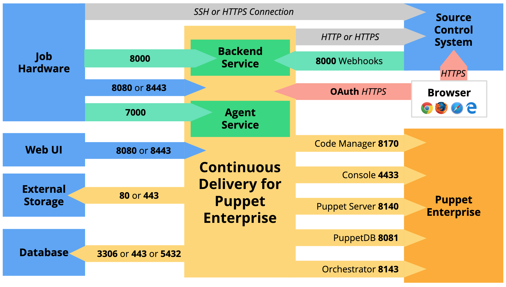

# System requirements

Refer to these system requirements for your Continuous Delivery for Puppet Enterprise \(PE\) installation.

## Continuous Delivery for PE architecture

Continuous Delivery for Puppet Enterprise \(PE\) communicates with your PE installation, your source control system, and the servers you've designated as job hardware, as well as with the various components of the software.

The following diagram shows the architecture and port requirements of a typical Continuous Delivery for PE installation. 

**Important:** Continuous Delivery for PE uses TCP \(Transmission Control Protocol\) connections.

|Job hardware and web UI configuration|Default port number|
|-------------------------------------|-------------------|
|HTTP|8080|
|HTTPS|8443|

|External storage configuration|Default port number|
|------------------------------|-------------------|
|Artifactory using HTTP|80|
|Artifactory using HTTPS|443|
|Amazon S3|443|

|Database configuration|Default port number|
|----------------------|-------------------|
|MySQL \(external\)|3306|
|Amazon DynamoDB \(external\)|443|
|PE-PostgreSQL \(local\)|5432|

## Hardware requirements

Before installing Continuous Delivery for PE, ensure that your system meets these requirements.

|Installation architecture|Memory|Storage|CPUs|
|-------------------------|------|-------|----|
|Installation using disk object storage|8 GB|100 GB|4|
|Installation using external \(Artifactory or Amazon S3\) object storage|8 GB|50 GB|4|

## Supported external databases

Continuous Delivery for PE uses a database to persist information. By default, the `puppetlabs-cd4pe` module creates a new installation of PE-PostgreSQL on the node where you install Continuous Delivery for PE. If you prefer to use an external database, the following are supported.

|External database|Supported versions|Notes|
|:----------------|:-----------------|:----|
|MySQL|5.7|Your MySQL database must use the `latin1` character set and `latin1_swedish_ci` collation.|
|Amazon DynamoDB|n/a|Based on your usage, you might need to tune your tables' read/write capacity in order to reduce page load times.|

## Job hardware requirements

System requirements for your job hardware vary considerably based on the size of your Continuous Delivery for PE installation, the type of jobs you run, and how frequently you run them.

The size of the load placed on a job hardware server determines how robust that server's resources need to be. Determining that load involves a huge number of variables, from the number of jobs that run concurrently to the languages those jobs are written in. As a result, it's nearly impossible to provide one-size-fits-all system requirements for job hardware.

Instead, we've developed a sizing chart based on the estimated number of concurrent jobs a job hardware server is expected to regularly handle. While this chart represents our best estimates and understanding, it's provided only as a starting point. Testing and experience will help you fine-tune your job hardware and determine the optimum resource configuration for your installation's unique circumstances.

|Estimated concurrent job load|Memory|Disk storage|CPUs|
|-----------------------------|------|------------|----|
|2 - 4 concurrent spec tests|4 GB|100 GB|2|
|4 - 8 concurrent spec tests|8 GB|100 GB|4|
|6 - 12 concurrent spec tests|8 GB|100 GB|6|

When setting up your job hardware, keep these facts in mind:

-   Disk storage requirements are minimal, and don't increase with added load. After a job run is complete, the job's log is passed to the object storage, and all data related to the job run is erased from the job hardware.
-   You can run more jobs concurrently without increasing CPUs, but the jobs will run more slowly.

### Job hardware requirements for Docker-based jobs

To run Docker-based jobs, your job hardware must have a modern version of Docker CE or Docker EE installed. The [`puppetlabs/docker`](https://forge.puppet.com/puppetlabs/docker) module is our preferred way to install Docker and keep it up to date.

Job hardware used for Docker-based jobs also requires internet access. If you're working in an air-gapped environment, set up an internal Docker registry by following the [Docker documentation](https://docs.docker.com/registry/deploying/#considerations-for-air-gapped-registries).

## Supported Puppet Enterprise versions

The following versions of Puppet Enterprise \(PE\) are supported for use with Continuous Delivery for PE.

|PE version|
|----------|
|2019.2.x|
|2019.1.x|
|2018.1.x|

### PE version-specific feature limitations

A small number of Continuous Delivery for PE features are not available on all supported versions of PE.

-   Impact analysis reports for module code are supported on PE 2018.1.9 and newer versions in the 2018.1 series, PE 2019.1.1 and newer versions in the 2019.1 series, and all 2019.2.x series versions.

## Supported browsers

The following browsers are supported for use with the Continuous Delivery for PE web UI.

|Browser|Supported versions|
|-------|------------------|
|Google Chrome|Current version as of release|
|Mozilla Firefox|Current version as of release|
|Microsoft Edge|Current version as of release|
|Apple Safari|Current version as of release|

