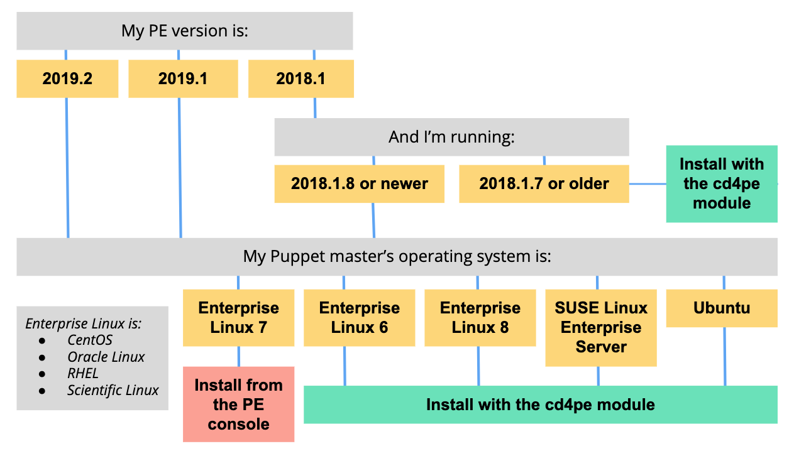

# Installing

In order for your organization to begin using Continuous Delivery for Puppet Enterprise, you must first complete the initial installation and setup process.

## Which installation method should I use?

The best method for your Continuous Delivery for PE installation depends on your PE version and the operating system running on your Puppet master. Use the following chart to select the best installation method for your circumstances.

-   **[System requirements](cd_system_requirements.md#)**  
Refer to these system requirements for your Continuous Delivery for Puppet Enterprise \(PE\) installation.
-   **[Install Continuous Delivery for PE from the PE console](install_pe_console.md#)**  
Users of supported PE versions who are running Enterprise Linux 7 on their Puppet master can install Continuous Delivery for PE directly from the PE console. This installation method is available for PE 2019.2.x, 2019.1.x, and PE 2018.1.8 and later versions in the 2018.1.x series.
-   **[Install Continuous Delivery for PE using the cd4pe module](install_module.md#)**  
Use version 1.1.0 or later of the `puppetlabs-cd4pe` module to install and configure Continuous Delivery for Puppet Enterprise \(PE\). This module installs Docker, configures the Continuous Delivery for PE Docker image and service for you, and creates a Docker volume for disk storage. You can also use the module to configure your Continuous Delivery for PE root account and to manage a MySQL container.
-   **[Generate a trial license](generating_a_license.md)**  
 Puppet License Manager is the centralized hub for purchasing and tracking licenses for many Puppet products, including Continuous Delivery for PE. Use Puppet License Manager to generate a free 30-day trial license for Continuous Delivery for PE.
-   **[Alternative installation methods](alternative_installation_methods.md)**  
This section includes alternative methods for installing Continuous Delivery for Puppet Enterprise \(PE\).

