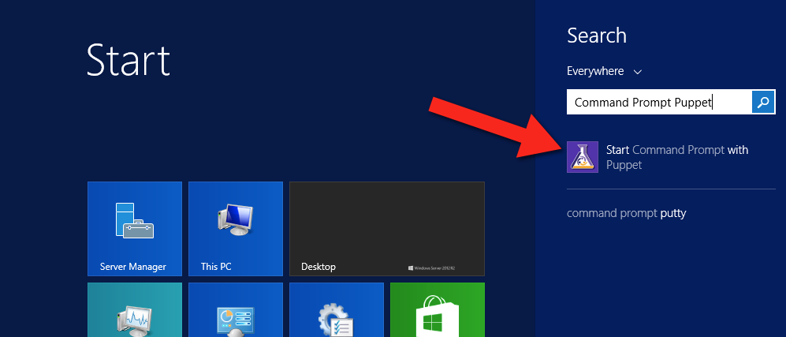
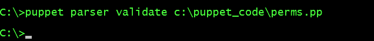
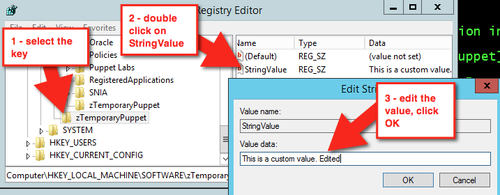

[install_pe_windows]: https://docs.puppetlabs.com/pe/latest/install_windows.html
[type]: https://docs.puppetlabs.com/references/stable/type.html
[provider]: https://docs.puppetlabs.com/references/stable/type.html#providers
[approved]: https://forge.puppetlabs.com/approved
[supported]: https://forge.puppetlabs.com/supported

## Windows module pack

The Puppet Forge is an online community of Puppet modules submitted by Puppet Labs and community members. The Forge makes it easier for you to manage Puppet and can save you time by using pre-written modules, rather than writing your own. In addition to being rated by the community, modules in the Forge can be [Puppet Approved][approved] or [Puppet Supported][supported]. The major difference is that Approved modules are not available for [Puppet Enterprise support services](https://puppetlabs.com/services/customer-support), but are still tested and adhere to a standard for style and quality.

The Windows module pack includes several Windows compatible modules that help you complete common specific tasks. You can find more Windows modules by searching the Forge. Only the modules by Puppet Labs are supported with Puppet Enterprise. The rest have been reviewed and recommended by Puppet Labs but are not eligible for commercial support.

 The Windows module pack enables the following:

* Read, create, and write registry keys with [`registry`](https://forge.puppetlabs.com/puppetlabs/registry).
* Interact with PowerShell through the Puppet DSL with [`powershell`](https://forge.puppetlabs.com/puppetlabs/powershell).
* Manage Windows PowerShell DSC (Desired State Configuration) resources using [`dsc`](https://forge.puppetlabs.com/puppetlabs/dsc).
* Reboot Windows as part of management as necessary through [`reboot`](https://forge.puppetlabs.com/puppetlabs/reboot).
* Enforce fine-grained access control permissions using [`acl`](https://forge.puppetlabs.com/puppetlabs/acl).
* Manage Windows Server Update Service configs on client nodes [`wsus_client`](https://forge.puppetlabs.com/puppetlabs/wsus_client).
* Install or remove Windows features with [`windowsfeature`](https://forge.puppetlabs.com/puppet/windowsfeature).
* Download files for use during management via [`download_file`](https://forge.puppetlabs.com/puppet/download_file).
* Build IIS sites and virtual applications with [`iis`](https://forge.puppetlabs.com/puppet/iis).
* Install packages with [`chocolatey`](https://forge.puppetlabs.com/chocolatey/chocolatey).
* Manage environment variables with [`windows_env`](https://forge.puppetlabs.com/badgerious/windows_env).

This guide covers creating a managed permission with `ACL`, creating managed registry keys and values with `registry`, and installing and creating your own packages with `chocolatey`.

### Prerequisites

Before you install and begin working with the Windows pack of modules, you should have [installed Puppet Enterprise][install_pe_windows].

## Install the Windows module pack

These steps show you how to install the module pack locally, but you can also install it on the Puppet master and pluginsync will push the module pack to all of your nodes.

1. On your Windows **Start** page, click **Start Command Prompt with Puppet**.

   

2. To list modules that you currently have installed, type `puppet module list` in your **Command Prompt** window. If you're just getting started, you likely have no modules installed yet.

   

3. Next, to install the `puppetlabs/windows` module pack, type `puppet module install puppetlabs/windows`. Notice that you get a nice output of everything that's installed.

   ~~~puppet
   C:\>puppet module install puppetlabs/windows
   Notice: Preparing to install into
   C:/ProgramData/PuppetLabs/code/environments/production/modules ...
   Notice: Downloading from https://forgeapi.puppetlabs.com ...
   Notice: Installing -- do not interrupt ...
   C:/ProgramData/PuppetLabs/code/environments/production/modules
   └─┬ puppetlabs-windows (v2.1.0)
   ├─┬ chocolatey-chocolatey (v1.2.0)
   │ └── badgerious-windows_env (v2.2.2)
   ├── puppet-download_file (v1.2.1)
   ├── puppet-iis (v1.4.1)
   ├── puppet-windowsfeature (v1.1.0)
   ├── puppetlabs-acl (v1.1.1)
   ├── puppetlabs-powershell (v1.0.5)
   ├── puppetlabs-reboot (v1.2.0)
   ├─┬ puppetlabs-registry (v1.1.2)
   │ └── puppetlabs-stdlib (v4.9.0)
   └── puppetlabs-wsus_client (v1.0.0)
   ~~~

## Task 1: Manage permissions with `acl`

The [`puppetlabs-acl`](https://forge.puppetlabs.com/puppetlabs/acl) module helps you manage access control lists (ACLs), which provide a way to interact with permissions for the Windows file system. This module enables you to set basic permissions up to very advanced permissions using SIDs (Security Identifiers) with an [access mask](https://msdn.microsoft.com/en-us/library/aa394063.aspx), inheritance, and propagation strategies. First, you'll start with querying some existing permissions.

### Discovery

ACL is a custom [type][] and [provider][], so you can use `puppet resource` to look at existing file and folder permissions. For some types, you can use the command `puppet resource <TYPE NAME>` to get all instances of that type. However, there could be thousands of ACLs on a Windows system, so it's best to specify the folder you want to review the types in. Here, check `c:\Users` to see what permissions it contains.

In the command prompt, type `puppet resource acl c:\Users`.

You can clean that output up just a little, as follows:

~~~puppet
acl { 'c:\Users':
  inherit_parent_permissions => 'false',
  permissions                => [
   {identity => 'SYSTEM', rights=> ['full']},
   {identity => 'Administrators', rights => ['full']},
   {identity => 'Users', rights => ['read', 'execute'], affects => 'self_only'},
   {identity => 'Users', rights => ['read', 'execute'], affects => 'children_only'},
   {identity => 'Everyone', rights => ['read', 'execute'], affects => 'self_only'},
   {identity => 'Everyone', rights => ['read', 'execute'], affects => 'children_only'}
  ],
}
~~~

As you can see, this particular folder does not inherit permissions from its parent folder; instead, it sets its own permissions and determines how child files and folders inherit the permissions set here.

* `{'identity' => 'SYSTEM', 'rights'=> ['full']}` states that the "SYSTEM" user will have full rights to this folder, and by default all children and grandchildren files and folders (as these are the same defaults when creating permissions in Windows).
* `{'identity' => 'Users', 'rights' => ['read', 'execute'], 'affects' => 'self_only'}` gives read and execute permissions to Users but only on the current directory.
* `{'identity' => 'Everyone', 'rights' => ['read', 'execute'], 'affects' => 'children_only'}` gives read and execute permissions to everyone, but only on subfolders and files.

>**Note**: You will likely see what appears to be the same permission for a user/group twice (both "Users" and "Everyone" above), where one affects only the folder itself and the other is about children only. They are in fact different permissions.

### Create a Puppet Managed Permission

1. Run this code to create your first Puppet managed permission. Then, save it as `perms.pp`.

   ~~~puppet
   file{'c:/tempperms':
    ensure => directory,
   }

   # By default, the acl will create an implicit relationship to any
   # file resources it finds that match the location.
   acl {'c:/tempperms':
    permissions => [
      {identity => 'Administrators', rights => ['full']},
      {identity => 'Users', rights => ['read','execute']}
    ],
   }
   ~~~

   

2. To validate your manifest, at the command prompt, type `puppet parser validate c:\path\to\perms.pp`. If the parser returns nothing, it means validation passed.

   

3. To apply the manifest, type `puppet apply c:\path\to\perms.pp`. Your output should look similar to the output below.

   ~~~powershell
   Notice: Compiled catalog for win2012r2x64 in environment production in 0.12 seconds
   Notice: /Stage[main]/Main/File[c:/tempperms]/ensure: created
   Notice: /Stage[main]/Main/Acl[c:/tempperms]/permissions: permissions changed [
   ] to [
    { identity => 'BUILTIN\Administrators', rights => ["full"] },
    { identity => 'BUILTIN\Users', rights => ["read", "execute"] }
   ]
   Notice: Applied catalog in 0.05 seconds
   ~~~

4. Review the permissions in your Windows UI. In **Windows Explorer**, right-click **tempperms** and click **Properties**. Then, click the **Security** tab. It should appear similar to the image below.

   

5. Optional: It might appear that you have more permissions than you were hoping for here. This is because by default Windows inherits parent permissions. In this case, you might not want to do that. Adjust the `acl` resource to not inherit parent permissions by changing the `perms.pp` file to look like the below by adding `inherit_parent_permissions => false`.

   ~~~puppet
   acl {'c:/tempperms':
     inherit_parent_permissions => false,
     permissions                => [
       {identity => 'Administrators', rights => ['full']},
       {identity => 'Users', rights => ['read','execute']}
     ],
   }
   ~~~

6. Save the file, and return to the command prompt to run `puppet parser validate c:\path\to\perms.pp` again.

7. When it validates, run `puppet apply c:\path\to\perms.pp`.

   You should get output similar to the following:

   ~~~powershell
   C:\>puppet apply c:\puppet_code\perms.pp
   Notice: Compiled catalog for win2012r2x64 in environment production in 0.08 seconds
   Notice: /Stage[main]/Main/Acl[c:/tempperms]/inherit_parent_permissions: inherit_
   parent_permissions changed 'true' to 'false'
   Notice: Applied catalog in 0.02 seconds
   ~~~

8. To check the permissions again, type `icacls c:\tempperms`. The command, `icacls`, is specifically for displaying and modifying ACLs.The output should be similar to the following:

   ~~~powershell
   C:\>icacls c:\tempperms
   c:\tempperms BUILTIN\Administrators:(OI)(CI)(F)
                BUILTIN\Users:(OI)(CI)(RX)
                NT AUTHORITY\SYSTEM:(OI)(CI)(F)
                BUILTIN\Users:(CI)(AD)
                CREATOR OWNER:(OI)(CI)(IO)(F)
   Successfully processed 1 files; Failed processing 0 files
   ~~~

   The output shows each permission, followed by a list of specific rights in parentheses. This output shows there are more permissions than you specified in `perms.pp`. Puppet will happily manage permissions next to unmanaged or existing permissions. In the case of removing inheritance, by default Windows copies those existing inherited permissions (or Access Control Entries, ACEs) over to the existing ACL so you have some more permissions that you might not want.

9. Remove the extra permissions, so that only the permissions you've specified are on the folder. To do this, in your `perms.pp` set `purge => true` as follows:

   ~~~puppet
   acl {'c:/tempperms':
     inherit_parent_permissions => false,
     purge                      => true,
     permissions                => [
       {identity => 'Administrators', rights => ['full']},
       {identity => 'Users', rights => ['read','execute']}
     ],
   }
   ~~~

10. Run the parser command as you have before. If it still returns no errors, then you can apply the change.

11. To apply the change, type `puppet apply c:\path\to\perms.pp`. The output should be similar to below:

    ~~~powershell
    C:\>puppet apply c:\puppet_code\perms.pp
    Notice: Compiled catalog for win2012r2x64 in environment production in 0.08 seco
    nds
    Notice: /Stage[main]/Main/Acl[c:/tempperms]/permissions: permissions changed [
    { identity => 'BUILTIN\Administrators', rights => ["full"] },
    { identity => 'BUILTIN\Users', rights => ["read", "execute"] },
    { identity => 'NT AUTHORITY\SYSTEM', rights => ["full"] },
    { identity => 'BUILTIN\Users', rights => ["mask_specific"], mask => '4', child_types => 'containers' },
    { identity => 'CREATOR OWNER', rights => ["full"], affects => 'children_only' }
    ] to [
    { identity => 'BUILTIN\Administrators', rights => ["full"] },
    { identity => 'BUILTIN\Users', rights => ["read", "execute"] }
    ]
    Notice: Applied catalog in 0.05 seconds
    ~~~

    Puppet outputs a notice as it is removing each of the permissions.

12. Take a look at the output of `icacls` again. Type `icacls c:\tempperms`.

    ~~~powershell
    c:\>icacls c:\tempperms
    c:\tempperms BUILTIN\Administrators:(OI)(CI)(F)
                BUILTIN\Users:(OI)(CI)(RX)
    Successfully processed 1 files; Failed processing 0 files
    ~~~

    Now the permissions have been set up for this directory. You can get into more advanced permission scenarios if you read the [usage scenarios](https://forge.puppetlabs.com/puppetlabs/acl#usage) on this module's Puppet Forge page. You can also read an in-depth [blog post about ACLs](https://puppetlabs.com/blog/managing-permissions-windows-access-control-lists) on the Puppet Labs Blog.

## Task 2: Create Puppet managed registry keys with `registry`

Eventually, you will likely need to use the registry to access and set highly available settings, among other things. The [puppetlabs-registry](https://forge.puppetlabs.com/puppetlabs/registry) module, which is also a [Puppet Supported Module](https://forge.puppetlabs.com/supported) enables you to set both registry keys and values.

### Discovery

`puppetlabs-registry` is a custom [type][] and [provider][], so you can use `puppet resource` to look at existing registry settings. It is also somewhat limited, like the `acl` module in that it is restricted to only what is specified. Specify `HKLM\Software\Microsoft\Windows` and see what you get.

Type `puppet resource registry_key 'HKLM\Software\Microsoft\Windows'`.

Not that interesting, but now take a look at a registry value.

Type `puppet resource registry_value 'HKLM\SYSTEM\CurrentControlSet\Services\BITS\DisplayName'`:

~~~puppet
registry_value { 'HKLM\SYSTEM\CurrentControlSet\Services\BITS\DisplayName':
  ensure => 'present',
  data   => ['Background Intelligent Transfer Service'],
  type   => 'string',
}
~~~

That's a bit more interesting than a registry key. Keys are like file paths (directories) and values are like files that can have data and be of [different types](https://forge.puppetlabs.com/puppetlabs/registry#parameters).

### Exercise

1. Create your first Puppet managed registry keys and values:

   ~~~puppet
   registry_key { 'HKLM\Software\zTemporaryPuppet':
        ensure => present,
   }

   # By default the registry creates an implicit relationship to any file
   # resources it finds that match the location.
   registry_value {'HKLM\Software\zTemporaryPuppet\StringValue':
     ensure => 'present',
     data   => 'This is a custom value.',
     type   => 'string',
   }

   #forcing a 32-bit registry view; watch where this is created:
   registry_key { '32:HKLM\Software\zTemporaryPuppet':
     ensure => present,
   }

   registry_value {'32:HKLM\Software\zTemporaryPuppet\StringValue':
     ensure => 'present',
     data   => 'This is a custom 32-bit value.',
     type   => 'expand',
   }
   ~~~

2. Save the file as `registry.pp`.

3. Validate the manifest. In the command prompt, type `puppet parser validate c:\path\to\registry.pp`. If the parser returns nothing, it means validation passed.

4. Now, apply the manifest by typing `puppet apply c:\path\to\registry.pp`. Your output should look similar to below.

   ~~~powershell
   Notice: Compiled catalog for win2012r2x64 in environment production in 0.11 seco
   nds
   Notice: /Stage[main]/Main/Registry_key[HKLM\Software\zTemporaryPuppet]/ensure: c
   reated
   Notice: /Stage[main]/Main/Registry_value[HKLM\Software\zTemporaryPuppet\StringVa
   lue]/ensure: created
   Notice: /Stage[main]/Main/Registry_key[32:HKLM\Software\zTemporaryPuppet]/ensure
   : created
   Notice: /Stage[main]/Main/Registry_value[32:HKLM\Software\zTemporaryPuppet\Strin
   gValue]/ensure: created
   Notice: Applied catalog in 0.03 seconds
   ~~~

5. Next, inspect the registry and see what you have. Press **Start + R**, then type `regedit` and press **Enter**. Once the Registry Editor opens, find your keys under `HKEY_LOCAL_MACHINE`.

   

   Note that the 32-bit keys were created under the 32-bit section of Wow6432Node for Software.

6. Apply the manifest again by typing, `puppet apply c:\path\to\registry.pp`.

   ~~~powershell
   Notice: Compiled catalog for win2012r2x64 in environment production in 0.11 seconds
   Notice: Applied catalog in 0.02 seconds
   ~~~

7. Nothing changed, so there is no work for Puppet to do. In **Registry Editor**, change the data. Select `HKLM\Sofware\zTemporaryPuppet` and in the right box, double-click `StringValue`. Edit the value data, and click **OK**.

   

   This time, changes have been made, so typing `puppet apply c:\path\to\registry.pp` results in a different output.

   ~~~powershell
   Notice: Compiled catalog for win2012r2x64 in environment production
   in 0.11 seconds
   Notice: /Stage[main]/Main/Registry_value[HKLM\Software\zTemporaryPuppet\StringValue]/data:
   data changed 'This is a custom value. Edited' to 'This is a custom value.'
   Notice: Applied catalog in 0.03 seconds
   ~~~

   Puppet automatically corrects the configuration drift.

8. Next, clean up and remove the keys and values. Make your `registry.pp` file look like the below:

   ~~~puppet
   registry_key { 'HKLM\Software\zTemporaryPuppet':
     ensure => absent,
   }

   #forcing a 32 bit registry view, watch where this is created
   registry_key { '32:HKLM\Software\zTemporaryPuppet':
     ensure => absent,
   }
   ~~~

9. Validate it with `puppet parser validate c:\path\to\registry.pp` and apply it again with `puppet apply c:\path\to\registry.pp`.

   ~~~powershell
   Notice: Compiled catalog for win2012r2x64 in environment production in 0.06 seconds
   Notice: /Stage[main]/Main/Registry_key[HKLM\Software\zTemporaryPuppet]/ensure: removed
   Notice: /Stage[main]/Main/Registry_key[32:HKLM\Software\zTemporaryPuppet]/ensure
   : removed
   Notice: Applied catalog in 0.02 seconds
   ~~~

   Refresh the view in your Registry Editor. The values are gone.

   

### Real-world usage

Here's a real world example that disables error reporting:

~~~puppet
class puppetconf::disable_error_reporting {
  registry_value { 'HKEY_LOCAL_MACHINE\SOFTWARE\Microsoft\Windows\Windows Error Reporting\ForceQueue':
    type => dword,
    data => '1',
  }

  registry_value { 'HKEY_LOCAL_MACHINE\SOFTWARE\Microsoft\Windows\Windows Error Reporting\DontShowUI':
    type => dword,
    data => '1',
  }

  registry_value { 'HKEY_LOCAL_MACHINE\SOFTWARE\Microsoft\Windows\Windows Error Reporting\DontSendAdditionalData':
    type => dword,
    data => '1',
  }

  registry_key { 'HKEY_LOCAL_MACHINE\SOFTWARE\Microsoft\Windows\Windows Error Reporting\Consent':
    ensure       => present,
  }

  registry_value { 'HKEY_LOCAL_MACHINE\SOFTWARE\Microsoft\Windows\Windows Error Reporting\Consent\DefaultConsent':
   type => dword,
   data => '2',
  }
}
~~~

### Want more info about the registry module?

Read the blog post about [the re-introduction of the registry module](https://puppetlabs.com/blog/re-introducing-puppetlabs-registry-module), ["Puppet works on Windows?" post](https://puppetlabs.com/blog/puppet-works-on-windows), view the ["Getting Started with Puppet on Windows"](https://puppetlabs.com/presentations/getting-started-puppet-windows-josh-cooper-puppet-labs) presentation from PuppetConf 2014 by Josh Cooper, and the ["Workshop: Puppet for Windows Users"](https://puppetlabs.com/presentations/workshop-puppet-windows-users-ethan-brown-puppet-labs) from PuppetConf 2014 by Ethan Brown. You can also see a reference and examples in the documentation of the module on the [Forge](https://forge.puppetlabs.com/puppetlabs/registry/readme).

## Task 3: Create, install and repackage packages with `chocolatey`

[Chocolatey](https://chocolatey.org) is a package manager for Windows that is similar in design and execution to package managers on non-Windows systems. The [chocolatey module](https://forge.puppetlabs.com/chocolatey/chocolatey) is a [Puppet Approved Module](https://forge.puppetlabs.com/approved), so it's not elligible for Puppet Enterprise support services. The module has the capability to intall and configure Chocolatey itself, and then manage software on Windows with Chocolatey packages.

### Discovery

Chocolatey has a custom provider for the package resource type, so you can use `puppet resource` to view existing packages.

Type `puppet resource package --param provider | more`. The additional provider parameter in this command outputs all types of installed packages that are detected by multiple providers.

### Install Chocolatey

You are going to install Chocolatey (choco.exe) itself. You can do this following the instructions on [Chocolatey's home page](https://chocolatey.org), or you can use the module to ensure Chocolatey is installed.

1. Create a new manifest in the `chocolatey` module called `chocolatey.pp` with the following contents:

   ~~~puppet
   include chocolatey
   ~~~

2. Validate the manifest by typing `puppet parser validate c:\path\to\chocolatey.pp`in the command prompt. If the parser returns nothing, it means validation passed.

3. Now apply the manifest with `puppet apply c:\path\to\chocolatey.pp`. Your output should look similar to the below.

   ~~~powershell
   Notice: Compiled catalog for win2012r2x64 in environment production in 0.58 seconds
   Notice: /Stage[main]/Chocolatey::Install/Windows_env[chocolatey_PATH_env]/ensure
   : created
   Notice: /Stage[main]/Chocolatey::Install/Windows_env[chocolatey_ChocolateyInstal
   l_env]/ensure: created
   Notice: /Stage[main]/Chocolatey::Install/Exec[install_chocolatey_official]/retur
   ns: executed successfully
   Notice: /Stage[main]/Chocolatey::Install/Exec[install_chocolatey_official]: Trig
   gered 'refresh' from 2 events
   Notice: Finished catalog run in 13.22 seconds
   ~~~

   In a production scenario, you're likely to have a Chocolatey.nupkg file somewhere internal. In cases like that, you can use the [internal nupkg for Chocolatey installation](https://forge.puppetlabs.com/chocolatey/chocolatey#use-an-internal-chocolateynupkg-for-chocolatey-installation):

   ~~~puppet
   class {'chocolatey':
     chocolatey_download_url => 'https://internalurl/to/chocolatey.nupkg',
     use_7zip                => false,
     log_output              => true,
   }
   ~~~

### Install a package

Normally, when installing packages you copy them locally first, make any required changes to bring everything they download to an internal location, repackage the package with the edits, and/or build your own packages to host on your internal package repository (feed). For this exercise, however, you directly install a portable Notepad++ from Chocolatey's [community feed](https://chocolatey.org/packages). The [Notepad++ Commandline](https://chocolatey.org/packages/notepadplusplus.commandline) package is portable and shouldn't greatly effect an existing system.

1. Update the manifest (`chocolatey.pp`) with the following contents:

   ~~~puppet
   package {'notepadplusplus.commandline':
     ensure   => installed,
     provider => chocolatey,
   }
   ~~~

2. Validate the manifest by typing `puppet parser validate c:\path\to\chocolatey.pp`in the command prompt. If the parser returns nothing, it means validation passed.

3. Now, apply the manifest with `puppet apply c:\path\to\chocolatey.pp`. Your output should look similar to below.

   ~~~
   Notice: Compiled catalog for win2012r2x64 in environment production in 0.75 seconds
   Notice: /Stage[main]/Main/Package[notepadplusplus.commandline]/ensure: created
   Notice: Applied catalog in 15.51 seconds
   ~~~

   If you want to use this package for a production scenario, you need an internal custom feed. This is simple to set up with the [`chocolatey_server` module](https://forge.puppetlabs.com/chocolatey/chocolatey_server). You could also use Sonatype Nexus, Artifactory, or a CIFS share if you want to host packages with a non-Windows option, or you can use anything on Windows that exposes a NuGet OData feed (Nuget is the packaging infrastructure that Chocolatey uses). See the [How To Host Feed](https://github.com/chocolatey/choco/wiki/How-To-Host-Feed) page of the `chocolatey` wiki for more in-depth information. You could also store packages on your Puppet master and use a file resource to verify they are in a specific local directory prior to ensuring the packages.

#### Copy an existing package and make it internal (repackaging packages)

Chocolatey's [community feed](https://chocolatey.org/packages) has quite a few packages but they are geared towards community and use the internet for downloading from official distribution sites. However, they are attractive as they have everything necessary to install a piece of software on your machine. Through the repackaging process, by which you take a community package and bring all of the bits internal and/or embed them into the pacakge, you can completely internalize a package to host on an internal Chocolatey/NuGet repository. This gives you complete control over a package and removes the aforementioned production trust and control issues.

To make the existing package local, use these steps.

1. Download the package from Chocolatey's community feed by going to the [package page](https://chocolatey.org/packages/notepadplusplus.commandline) and clicking the download link.

   

2. Rename the downloaded file to end with `.zip` and unpack the file as a regular archive.

   

3. Delete the `_rels` and `package` folders and the `[Content_Types].xml` file. These are created during `choco pack` and should not be included, as they will be regenerated (and their existence leads to issues).

   

4. Next, open `tools\chocolateyInstall.ps1`.

   ~~~powershell
   Install-ChocolateyZipPackage 'notepadplusplus.commandline' 'https://notepad-plus-plus.org/repository/6.x/6.8.7/npp.6.8.7.bin.zip' "$(Split-Path -parent $MyInvocation.MyCommand.Definition)"
   ~~~

5. Download the zip file and place it in the tools folder of the package.

   

6. Next, edit `chocolateyInstall.ps1` to point to this embedded file instead of reaching out to the internet (if the size of the file is over 50MB, you might want to put it on a file share somewhere internally for better performance).

   ~~~powershell
   $toolsDir   = "$(Split-Path -parent $MyInvocation.MyCommand.Definition)"
   Install-ChocolateyZipPackage 'notepadplusplus.commandline' "$toolsDir\npp.6.8.7.bin.zip" "$toolsDir"
   ~~~

   The double quotes allow for string interpolation (meaning variables get interpreted instead of taken literally).

7. Next, open the `*.nuspec` file to view its contents and make any necessary changes.

   ~~~xml
   <?xml version="1.0"?>
   <package xmlns="http://schemas.microsoft.com/packaging/2010/07/nuspec.xsd">
     <metadata>
       <id>notepadplusplus.commandline</id>
       <version>6.8.7</version>
       <title>Notepad++ (Portable, CommandLine)</title>
       <authors>Don Ho</authors>
       <owners>Rob Reynolds</owners>
       <projectUrl>https://notepad-plus-plus.org/</projectUrl>
       <iconUrl>https://cdn.rawgit.com/ferventcoder/chocolatey-packages/02c21bebe5abb495a56747cbb9b4b5415c933fc0/icons/notepadplusplus.png</iconUrl>
       <requireLicenseAcceptance>false</requireLicenseAcceptance>
       <description>Notepad++ is a ... </description>
       
Notepad++ is a free (as in "free speech" and also as in "free beer") source code editor and Notepad replacement that supports several languages. 

       <tags>notepad notepadplusplus notepad-plus-plus</tags>
     </metadata>
   </package>
   ~~~

   Some organizations will change the version field to denote this is an edited internal package, for example changing `6.8.7` to `6.8.7.20151202`. For now, this is not necessary.

   Now you can navigate via the command line to the folder with the `.nuspec` file (from a Windows machine unless you've installed Mono and built choco.exe from source) and use `choco pack`. You can also be more specific and type `choco pack path\to\notepadplusplus.commandline.nuspec`. The output should be similar to below.

   ~~~
   Attempting to build package from 'notepadplusplus.commandline.nuspec'.
   Successfully created package 'notepadplusplus.commandline.6.8.7.nupkg'
   ~~~

   Normally you test on a system to ensure that the package you just built is good prior to pushing the package (just the *.nupkg) to your internal repository. This can be done by using `choco.exe` on a test system to install (`choco install notepadplusplus.commandline -source %cd%` - change `%cd%` to `$pwd` in PowerShell.exe) and uninstall (`choco uninstall notepadplusplus.commandline`). Another method of testing is to run the manifest pointed to a local source folder, which is what you are going to do.

8. Create `c:\packages` and copy the resulting package file (`notepadplusplus.commandline.6.8.7.nupkg`) into it.

   

   This won't actually install on this system since you just installed the same version from Chocolatey's community feed. So you need to remove the existing package first. To remove it, edit your `chocolatey.pp` to set the package to absent.

   ~~~puppet
   package {'notepadplusplus.commandline':
     ensure   => absent,
     provider => chocolatey,
   }
   ~~~

9. Validate the manifest with `puppet parser validate path\to\chocolatey.pp`. Apply the manifest to ensure the change `puppet apply c:\path\to\chocolatey.pp`.

   ~~~powershell
   Notice: Compiled catalog for win2012r2x64 in environment production in 1.03 seconds
   Notice: /Stage[main]/Main/Package[notepadplusplus.commandline]/ensure: removed
   Notice: Applied catalog in 12.20 seconds
   ~~~

   You can validate that the package has been removed by checking for it in the package install location or by using `choco list -lo`.

   

10. Update the manifest (`chocolatey.pp`) to use the custom package.

    ~~~puppet
    package {'notepadplusplus.commandline':
      ensure   => latest,
     provider => chocolatey,
     source   => 'c:\packages',
    }
    ~~~

11. Validate the manifest with the parser and then apply it again. You will see Puppet creating the new install in the output.

    ~~~
    Notice: Compiled catalog for win2012r2x64 in environment production in 0.79 seconds
    Notice: /Stage[main]/Main/Package[notepadplusplus.commandline]/ensure: created
    Notice: Applied catalog in 14.78 seconds
    ~~~

12. In an earlier step, you added a `*.zip` file to the package, so that you can inspect it and be sure the custom package was installed. Navigate to `C:\ProgramData\chocolatey\lib\notepadplusplus.commandline\tools` (if you have a default install location for Chocolatey) and see if you can find the `*.zip` file.

   

   You can also validate the `chocolateyInstall.ps1` by opening and viewing it to see that it is the custom file you changed.

#### Create a package

Creating your own packages is, for some system administrators, surprisingly simple compared to other packaging standards.

Ensure you have at least Chocolatey CLI (choco.exe) version `0.9.9.11` or greater for this next part.

1. From the command prompt, enter `choco new -h` to see a help menu of what the available options are.

2. Next, use `choco new vagrant` to create a package named 'vagrant'. The output should be similar to the following:

   ~~~
   Creating a new package specification at C:\temppackages\vagrant
   Generating template to a file
    at 'C:\temppackages\vagrant\vagrant.nuspec'
   Generating template to a file
    at 'C:\temppackages\vagrant\tools\chocolateyinstall.ps1'
   Generating template to a file
    at 'C:\temppackages\vagrant\tools\chocolateyuninstall.ps1'
   Generating template to a file
    at 'C:\temppackages\vagrant\tools\ReadMe.md'
   Successfully generated vagrant package specification files
    at 'C:\temppackages\vagrant'
   ~~~

   It comes with some files already templated for you to fill out (you can also create your own custom templates for later use).

3. Open `vagrant.nuspec`, and edit it to look like this:

   ~~~xml
   <?xml version="1.0" encoding="utf-8"?>
   <package xmlns="http://schemas.microsoft.com/packaging/2015/06/nuspec.xsd">
     <metadata>
       <id>vagrant</id>
       <title>Vagrant (Install)</title>
       <version>1.8.4</version>
       <authors>HashiCorp</authors>
       <owners>my company</owners>
       <description>Vagrant - Development environments made easy.</description>
     </metadata>
     <files>
       <file src="tools\**" target="tools" />
     </files>
   </package>
   ~~~

   Unless you are sharing with the world, you don't need most of what is in the nuspec template file, so only required items are included above. The important thing you should do when creating a package is match the version of the package in this nusepec file to the version of the underlying software as closely as possible. You will package the most recent version of Vagrant into this package you've created, so the version of the package in the nuspec file should match. In this example, Vagrant 1.8.4 is being packaged. [More on versioning](https://github.com/chocolatey/choco/wiki/CreatePackages#versioning-recommendations).

4. Open `chocolateyInstall.ps1` and edit it to look like the following:

   ~~~powershell
   $ErrorActionPreference = 'Stop';

   $packageName= 'vagrant'
   $toolsDir   = "$(Split-Path -parent $MyInvocation.MyCommand.Definition)"
   $fileLocation = Join-Path $toolsDir 'vagrant_1.8.4.msi'

   $packageArgs = @{
     packageName   = $packageName
     fileType      = 'msi'
     file         = $fileLocation

     silentArgs    = "/qn /norestart"
     validExitCodes= @(0, 3010, 1641)
   }

   Install-ChocolateyInstallPackage @packageArgs
   ~~~

   >**Note**: The above is [`Install-ChocolateyINSTALLPackage`](https://github.com/chocolatey/choco/wiki/HelpersInstallChocolateyInstallPackage), not to be confused with [`Install-ChocolateyPackage`](https://github.com/chocolatey/choco/wiki/HelpersInstallChocolateyPackage). The names are very close to each other, however the latter will also download software from a URI (URL, ftp, file) which is not necessary for this example.

5. Delete the `ReadMe.md` and `chocolateyUninstall.ps1` files. [Download Vagrant](https://www.vagrantup.com/downloads.html) and move it to the tools folder of the package.

   >**Note**: Normally if a package is over 100MB, it is recommended to move the software installer/archive to a share drive and point to it instead. For this example, you will just bundle it as is.

6. Now pack it up by using `choco pack`. Copy the new `vagrant.1.8.4.nupkg` file to `c:\packages`.

7. Open the manifest, and add the new package you just created. Your `chocolatey.pp` file should look like the below.

   ~~~puppet
   package {'vagrant':
     ensure   => installed,
     provider => chocolatey,
     source   => 'c:\packages',
   }
   ~~~

8. Save the file and make sure to validate with the Puppet parser.

9. Then use `puppet apply path\to\chocolatey.pp` to run the manifest.

   ~~~
   Notice: Compiled catalog for win2012r2x64 in environment production in 0.70 seconds
   Notice: /Stage[main]/Main/Package[vagrant]/ensure: created
   Notice: Applied catalog in 31.51 seconds
   ~~~

11. Open Control Panel, Programs and Features and take a look — Vagrant is installed!

   

#### Uninstalling

   To verify that the choco `autoUninstaller` feature is turned on, use `choco feature` to list the features and their current state. If you're using `include chocolatey` or `class chocolatey` to ensure Chocolatey is installed, the configuration will be applied automatically (unless you have explicitly disabled it). Also, starting in Chocolatey version `0.9.10`, it is enabled by default.

1. If you see `autoUninstaller - [Disabled]`, you need to enable it. To do this, in the command prompt, type `choco feature enable -n autoUninstaller` . You should see a similar success message:

   ~~~
   Enabled autoUninstaller
   ~~~

2. To remove Vagrant, edit your `chocolatey.pp` manifest to `ensure => absent`. Then save and validate the file.

   ~~~puppet
   package {'vagrant':
     ensure   => absent,
     provider => chocolatey,
     source   => 'c:\packages',
   }
   ~~~

3. Next, run `puppet apply path\to\chocolatey.pp` to apply the manifest.

   ~~~
   Notice: Compiled catalog for win2012r2x64 in environment production in 0.75 seconds
   Notice: /Stage[main]/Main/Package[vagrant]/ensure: removed
   Notice: Applied catalog in 40.85 seconds
   ~~~

   

   And it's no longer installed!

### Real-world usage

The following example ensures that Chocolatey, the Chocolatey Simple Server (an internal Chocolatey package repository), and some packages are installed. It requires the additional [`chocolatey/chocolatey_server` module](https://forge.puppetlabs.com/chocolatey/chocolatey_server).

In `c:\packages` you must have packages for [Chocolatey](https://chocolatey.org/packages/chocolatey), [Chocolatey.Server](https://chocolatey.org/packages/chocolatey.server), [RoundhousE](https://chocolatey.org/packages/roundhouse), [Launchy](https://chocolatey.org/packages/launchy), and [Git](https://chocolatey.org/packages/git), as well as any of their dependencies.

~~~puppet
case $operatingsystem {
  'windows':    {
    Package {
      provider => chocolatey,
      source   => 'C:\packages',
    }
  }
}

# include chocolatey
class {'chocolatey':
  chocolatey_download_url => 'file:///C:/packages/chocolatey.0.9.9.11.nupkg',
  use_7zip                => false,
  log_output              => true,
}

# This contains the bits to install the custom server.
# include chocolatey_server
class {'chocolatey_server':
  server_package_source => 'C:/packages',
}

package {'roundhouse':
  ensure   => '0.8.5.0',
}

package {'launchy':
  ensure          => installed,
  install_options => ['-override', '-installArgs','"', '/VERYSILENT','/NORESTART','"'],
}

package {'git':
  ensure => latest,
}

~~~

### Want more Chocolatey?

You can learn more about Chocolatey by visiting [Chocolatey.org](https://chocolatey.org), reading the [documentation on GitHub](https://github.com/chocolatey/choco/wiki), and by watching ["Chocolatey and Puppet - Managing Your Windows Software Since 2011"](https://www.youtube.com/watch?v=NNM2H4GsWYA) from PuppetConf 2015 by Rob Reynolds. To learn specifically what the provider offers and have a reference of what is available, the module and documentation are on the [Puppet Forge](https://forge.puppetlabs.com/chocolatey/chocolatey).

