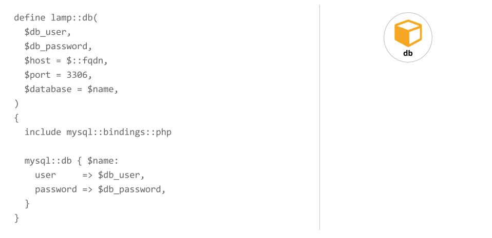
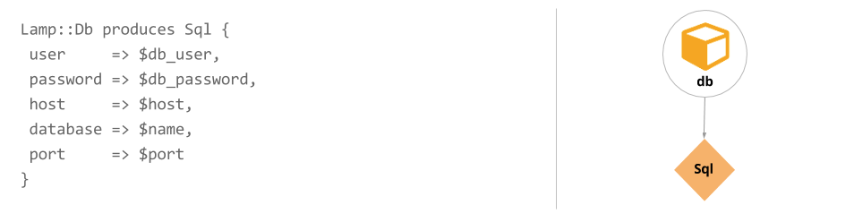

> **Note**: Before you author applications for use with application orchestration, we recommend you have hands-on experience writing [Puppet code]({{puppet}}/lang_summary.html). You should also be familiar with [Puppet modules]({{puppet}}/modules_fundamentals.html).

Although Puppet application orchestration can help you manage any distributed set of infrastructure, it's primarily designed to configure an application stack. The simple application stack used in the following extended example comprises a database server on one machine and a web server that connects to the database on another machine.

With previous Puppet coding techniques, you'd write classes and defined types to define the configuration for these services, and you'd pass in class parameter data to tell the web server class how to connect to the database. With application orchestration, you can write Puppet code so this information can be exchanged automatically. And when you run Puppet, the services will be configured in the correct order, rather than repeatedly until convergence.

## Application orchestration workflow

The following diagrams illustrate the major steps in the application orchestration workflow---from authoring your application to configuring it with the Puppet orchestrator.

### Step 1: Create the application definition and its parts

#### Create service resources and application components

In the applications you compose, application components share information with each other by exporting and consuming environment-wide [service resources](./app_orchestration_produce_consume.html).

First, in this example, called `lamp`, we create the `Sql` service resource in `lamp/lib/puppet/type/sql.rb`.

<a href="./images/app_orch_create_service_resource.png"> (Click to enlarge)</a>

An [application component](./app_orchestration_app_definition.html#application-components) is an independent bit of Puppet code that can be used alongside one or more other components to create an application. Components are often defined types that consist of traditional Puppet resources that describe the configuration of the component (file, package, and service, for example).

Next, the database component is defined in `lamp/manifests/db.pp`.

<a href="./images/app_orch_define_components1.png"> (Click to enlarge)</a>

The [produces statement](./app_orchestration_produce_consume.html#the-produces-statement), contained in `lamp/manifests/db.pp` expresses that the `Lamp::Db` component produces the `Sql` service resource. The produces statement is included outside of the defined type.

<a href="./images/app_orch_produces.png"> (Click to enlarge)</a>

#### Create the application definition

The [application definition (or model)](./app_orchestration_app_definition.html) is where you connect all the pieces together. It describes the relationship between the application components and the exchanged service resources. As it shares the name of the module, it is in `lamp/manifests/init.pp`.

<a href="./images/app_orch_application_definition.png"> (Click to enlarge)</a>

### Step 2: Instantiate your application

The [application instance](./app_orchestration_declare_instance.html) is where you create a unique version of your application and specify which nodes to use for each component.

<a href="./images/app_orch_application_instance.png"> (Click to enlarge)</a>

### Step 3: Use the orchestrator commands to run Puppet and configure your application

- [puppet app show](./orchestrator_app.html#run-the-puppet-app-show-command) shows the details of your application instances.

- [puppet job run](./orchestrator_job_run.html#using-the-puppet-job-run-command) runs Puppet across all the nodes in the order specified in your application instance.

- [puppet job list](./orchestrator_job_status_view.html#view-a-running-or-completed-job) shows running and completed Orchestration jobs.

<a href="./images/app_orch_orchestrator_cli.png">   (Click to enlarge)</a>

At the start of a job run, the orchestrator prints a Job Plan that shows what’s included in the run and the expected node run priority. The nodes are grouped by depth. Nodes in level 0 have no dependencies and will run first. Nodes in the levels below are dependent on nodes in higher levels. 

<a href="./images/app_orch_run1.png">   (Click to enlarge)</a>

As your job progresses, the orchestrator will print results of each node run after it completes. A "Success!" message prints when all jobs complete.

<a href="./images/app_orch_run2.png"> (Click to enlarge)</a>

## Documentation links 

- [Creating application definitions](./app_orchestration_app_definition.html)
- [Declaring application instances](./app_orchestration_declare_instance.html)
- [Producing and consuming service resources](./app_orchestration_produce_consume.html)
- [Writing custom service resource types](./app_orchestration_writing_service_resources.html)
- [Using availability tests](./app_orchestration_availability_tests.html)
