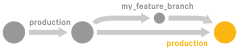

The Puppet orchestrator---used alongside other PE tools, such as Code Manager---allows you to control when and how infrastructure changes are made before they reach your production environment.

The Direct Puppet workflow gives you precise control over rolling out changes, from updating data and classifying nodes, to deploying new Puppet code. In this workflow, you configure your Puppet agents to use cached catalogs during scheduled runs, and you send new catalogs only when you're ready, via Puppet orchestrator jobs. Scheduled runs will continue to enforce the desired state of the last orchestration job until you send another new catalog.

## Direct Puppet workflow

In the Direct Puppet workflow, you set a up a node group for testing and validating code on a feature branch before you merge and promote it into your production environment.

**Assumptions and prerequisites:**

- To use this workflow, you must [enable cached catalogs for use with the orchestratror](./orchestrator_install.html#enable-cached-catalogs-for-use-with-the-orchestrator-optional) so that they enforce cached catalogs by default and compile new catalogs only when instructed to by Puppet orchestrator jobs.

- This workflow also assumes you're familiar with [Code Manager](./cmgmt_managing_code.html). It involves making changes to your Puppet control repo---adding or updating modules, editing manifests, or changing your Hiera data. You'll also run deploy actions from the Code Manager command line tool and the Puppet orchestrator, so ensure you have access to a host with [PE client tools installed](./install_pe_client_tools.html).

### Set up a node group for testing new features

The first step in the Direct Puppet workflow is to use the PE console to set up a node group for testing your new feature or code. 

1. In the PE console, [create an environment node group for branch testing](./console_classes_groups.html#creating-environment-node-groups).

2. Set the **Parent name** to the environment group that contains the nodes you want to test. In this workflow, we'll use **Production environment**.

3. Set the **Environment** to **agent-specified** and select **Environment group**.

   

4. In the **Rules** tab of the branch testing environment group, add the following rule:

   Option | Value
   -------|------
   Fact   | `agent_specified_environment`
   Operator | `~`
   Value | `^.+`

   This rule matches any nodes from the parent group that have the `agent_specified_environment` fact set. By matching nodes to this group, you give the nodes permission to override the server-specified environment and use their agent-specified environment instead.

### Create a feature branch

After you've set up a node group, you'll need to create a new branch of your control repository on which you can make changes to your feature code.

1. Branch your [control repository](./cmgmt_control_repo.html), and name the new branch. For example, 'my_feature_branch'.

   

2. Make changes to the code on your feature branch. Commit and push the changes to the `my_feature_branch`.

### Deploy code to the Puppet master and test it

Now that you've made some changes to the code on your feature branch, you're ready to use Code Manager to push those to the Puppet master.

1. To deploy the feature branch to the Puppet master, run the following Code Manager command:

   ~~~
   puppet code deploy --wait my_feature_branch
   ~~~

   

   > **Note:** After this code deployment, there is a short delay while Puppet Server loads the new code.

2. To test your changes, run Puppet on a few agent-specified development nodes in the `my_feature_branch` environment, run the following orchestrator command:

   ~~~
   puppet job run --nodes my-dev-node1,my-dev-node2 --environment my_feature_branch
   ~~~

   >**Tip:** You can also use the PE console to [create a job targeted at a list of nodes](./orchestrator_job_run_console.html#run-a-job-on-a-node-list) in the `my_feature_branch` environment. 

   

3. Validate your testing changes. Open the links in the orchestrator command output, or use the Job ID linked on the [Job list page](.//orchestrator_review_console.html#job-list-page), to review the node run reports in the console. Ensure the changes have the effect you intend.

### Merge and promote your code

If everything works as expected on the development nodes, and you're ready to promote your changes into production.

1.  Merge `my_feature_branch` into the `production` branch in your control repo.

    

2. To deploy your updated `production` branch to the Puppet master, run the following Code Manager command:

   ~~~
   puppet code deploy --wait production
   ~~~

### Preview the job

Before running Puppet across the `production` environment, preview the job with the `puppet job plan` command. 

1. To ensure the job will capture all the nodes in the `production` environment, as well as the agent-specified development nodes that just ran with the `my_feature_branch` environment, use the following query as the job target:

   ~~~
   puppet job plan --query 'inventory {environment in ["production", "my_feature_branch"]}
   ~~~
   
### Run the job on the production environment

If you're satisfied with the changes in the preview, you're ready to enforce changes to the `production` environment. 

1. Run the orchestrator job.

   ~~~
   puppet job run --query 'inventory {environment in ["production", "my_feature_branch"]}
   ~~~
   
   >**Tip:** You can also use the PE console to [create a job targeted at this PQL query](./orchestrator_job_run_console.html#run-a-job-on-a-pql-query).

   

### Validate your production changes

Check the node run reports in the console to confirm that the changes were applied as intended. If so, you're done!

Repeat this process as you develop and promote your code.
