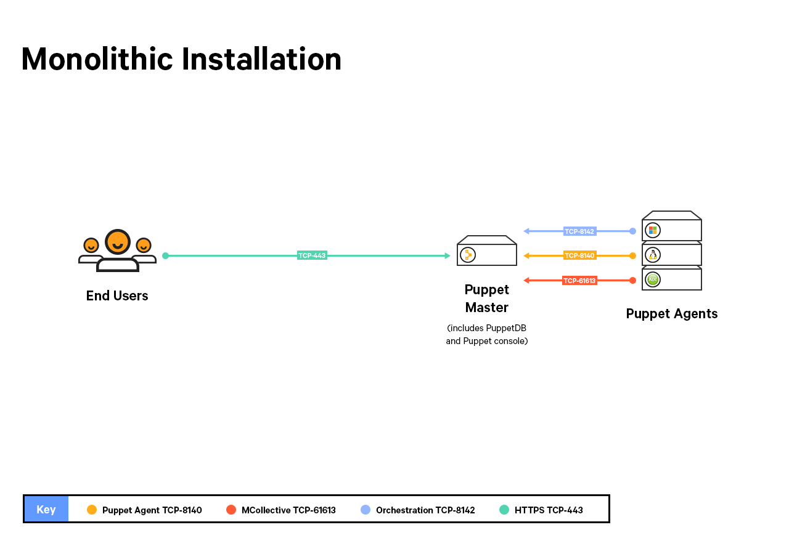
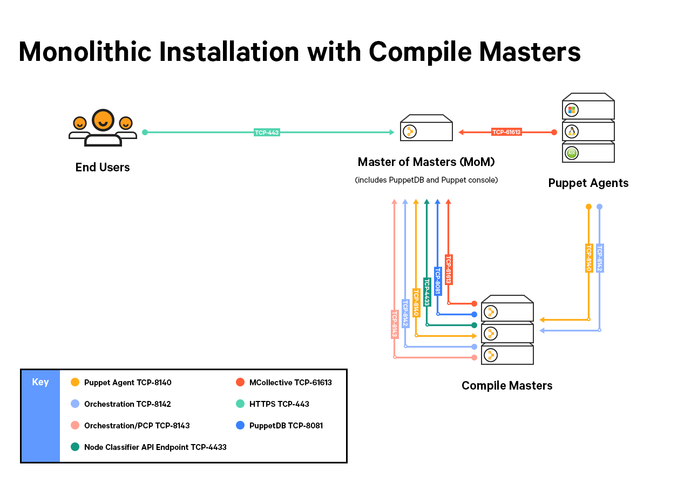
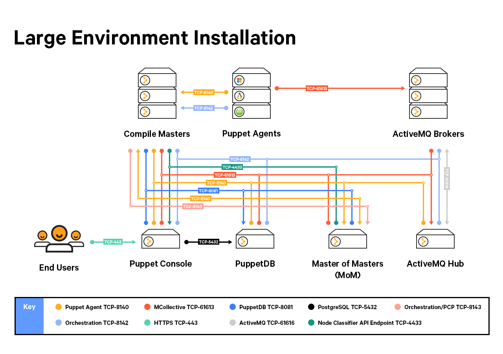

Before installing Puppet Enterprise at your site, make sure that your nodes and network are properly configured.

## Timekeeping and name resolution

Before installing PE, there are some basic network requirements you need to consider and prepare for. The most important requirements include syncing time and creating a plan for name resolution.

### Timekeeping

We recommend using NTP or an equivalent service to ensure that time is in sync between your Puppet master and any Puppet agent nodes. If time drifts out of sync in your PE infrastructure, you may encounter issues such as nodes disappearing from live manangement in the console. A service like NTP ([available as a Puppet supported module](https://forge.puppetlabs.com/puppetlabs/ntp)) will ensure accurate timekeeping.

### Name resolution

* Decide on a preferred name or set of names agent nodes can use to contact the Puppet master server.
* Ensure that the Puppet master server can be reached via domain name lookup by all of the future Puppet agent nodes at the site.

You can also simplify configuration of agent nodes by using a CNAME record to make the Puppet master reachable at the hostname `puppet`. (This is the default Puppet master hostname that is automatically suggested when installing an agent node.)

## Firewall configuration

[mono_port_diagram]: ./images/mono_port_diagram.svg
[split_port_diagram]: ./images/split_port_diagram.svg
[lei_port_diagram]: ./images/lei_port_diagram.svg
[mono_port_compile]: ./images/mono_port_compile.svg

Puppet Enterprise requires access to certain ports for its network traffic. The following diagrams show port usages for standard PE installations. 

A separate list provides [additional port usage information](#additional-port-usage-for-all-installation-types). 

### For monolithic installs

<a href="./images/mono_port_diagram.png"> (Click to enlarge)</a>

<table>
  <tr>
    <th>Port</th>
    <th>Use</th>
  </tr>
  <tr>
    <td>8140</td>
    <td>
     <ul>
      <li>The Puppet master uses this port to accept inbound traffic/requests from Puppet agents.</li>
      <li>The PE console sends request to the Puppet master on this port.</li>
      <li>Certificate requests are passed over this port unless ca_port is set differently.</li>
      <li>Puppet Server <a href="https://docs.puppet.com/pe/latest/status_api.html#puppet-services-status-check">status checks</a> are sent over this port.</li>
      <li>Classifier group: “PE Master”</li>
     </ul>
    </td>
  </tr>
  <tr>
    <td>443</td>
    <td>
     <ul>
      <li>This port provides host access to the PE console.</li>
      <li>The PE Console accepts HTTPS traffic from end-users on this port.</li>
      <li>Classifier group: “PE Console”</li>
     </ul>
   </td>
  </tr>
  <tr>
    <td>61613</td>
    <td>
     <ul>
      <li>MCollective uses this port to accept inbound traffic/requests from Puppet agents.</li>
      <li>Any host used to invoke commands must be able to reach MCollective on this port.</li>
      <li>Classifier group: “PE ActiveMQ Broker”</li>
     </ul>
    </td>
  </tr>
  <tr>
    <td>8142</td>
    <td>
     <ul>
      <li>Orchestrator and the Run Puppet button use this port on the MoM to accept inbound traffic/responses from Puppet agents (via the PXP agent).</li>
      <li>Classifier group: “PE Orchestrator”</li>
     </ul>
    </td>
  </tr>
</table>

### For monolithic installs with compile masters

<a href="./images/mono_compile_port_diagram.png"> (Click to enlarge)</a>

<table>
  <tr>
    <th>Port</th>
    <th>Use</th>
  </tr>
  <tr>
    <td>8140</td>
    <td>
     <ul>
      <li>The Puppet master uses this port to accept inbound traffic/requests from Puppet agents.</li>
      <li> The Puppet master uses this port to send status checks to compile masters. (Not required to run PE.)</li>
      <li>The PE console sends request to the Puppet master on this port.</li>
      <li>Certificate requests are passed over this port unless ca_port is set differently.</li>
      <li>Puppet Server <a href="https://docs.puppet.com/pe/latest/status_api.html#puppet-services-status-check">status checks</a> are sent over this port.</li>
      <li>Classifier group: “PE Master”</li>
     </ul>
    </td>
  </tr>
  <tr>
    <td>443</td>
    <td>
     <ul>
      <li>This port provides host access to the PE console.</li>
      <li>The PE Console accepts HTTPS traffic from end-users on this port.</li>
      <li>Classifier group: “PE Console”</li>
     </ul>
   </td>
  </tr>
  <tr>
    <td>61613</td>
    <td>
     <ul>
      <li>MCollective uses this port to accept inbound traffic/requests from Puppet agents.</li>
      <li>Any host used to invoke commands must be able to reach MCollective on this port.</li>
      <li>Classifier group: “PE ActiveMQ Broker”</li>
     </ul>
    </td>
  </tr>
    <tr>
    <td>4433</td>
    <td>
     <ul>
      <li>This port is used as a Classifier / Console Services API endpoint.</li>
      <li>The Puppet master needs to be able to talk to the PE console over this port.</li>
      <li>Classifier group: “PE Console”</li>
     </ul>
    </td>
  </tr>
   <tr>
   <td>8081</td>
    <td>
     <ul>
      <li>PuppetDB accepts traffic/requests on this port.</li>
      <li>The Puppet master and PE console send traffic to PuppetDB on this port.</li>
      <li>PuppetDB <a href="https://docs.puppet.com/pe/latest/status_api.html#puppet-services-status-check">status checks</a> are sent over this port.</li>
      <li>Classifier group: “PE PuppetDB”</li>
     </ul>
    </td>
  </tr>
  <tr>
    <td>8142</td>
    <td>
     <ul>
      <li>Orchestrator and the Run Puppet button use this port on the MoM and compile masters to accept inbound traffic/responses from Puppet agents (via the PXP agent).</li>
      <li>Classifier group: “PE Orchestrator”</li>
     </ul>
    </td>
  </tr>
  <tr>
    <td>8143</td>
    <td>
     <ul>
      <li>Orchestrator uses this port to accept connections from PCP brokers to relay communications. The orchestrator client also uses this port to communicate with the orchestration services running on the MoM. If you install the client on a workstation, this port must be available on the workstation.</li>
      <li>Classifier group: “PE Orchestrator”</li>
     </ul>
    </td>
  </tr>
</table>

### For split installs

<a href="./images/split_port_diagram.png"> (Click to enlarge)</a>

<table>
  <tr>
    <th>Port</th>
    <th>Use</th>
  </tr>
  <tr>
    <td>8140</td>
    <td>
     <ul>
      <li>The Puppet master uses this port to accept inbound traffic/requests from Puppet agents.</li>
      <li>The PE console sends request to the Puppet master on this port.</li>
       <li> In an LEI, the Puppet master uses this port to send status checks to compile masters. (Not required to run PE.)</li>
      <li>Certificate requests are passed over this port unless ca_port is set differently.</li>
      <li>Puppet Server <a href="https://docs.puppet.com/pe/latest/status_api.html#puppet-services-status-check">status checks</a> are sent over this port.</li>
      <li>Classifier group: “PE Master”</li>
     </ul>
    </td>
  </tr>
  <tr>
  <tr>
    <td>443</td>
    <td>
     <ul>
      <li>This port provides host access to the PE console.</li>
      <li>The PE Console accepts HTTPS traffic from end-users on this port.</li>
      <li>Classifier group: “PE Console”</li>
     </ul>
   </td>
  </tr>
    <td>8081</td>
    <td>
     <ul>
      <li>PuppetDB accepts traffic/requests on this port.</li>
      <li>The Puppet master and PE console send traffic to PuppetDB on this port.</li>
      <li>PuppetDB <a href="https://docs.puppet.com/pe/latest/status_api.html#puppet-services-status-check">status checks</a> are sent over this port.</li>
      <li>Classifier group: “PE PuppetDB”</li>
     </ul>
    </td>
  </tr>
  <tr>
    <td>61613</td>
    <td>
     <ul>
      <li>MCollective uses this port to accept inbound traffic/requests from Puppet agents.</li>
      <li>Any host used to invoke commands must be able to reach MCollective on this port.</li>
      <li>Classifier group: “PE ActiveMQ Broker”</li>
     </ul>
    </td>
  </tr>
  <tr>
    <td>5432</td>
    <td>
     <ul>
      <li>PostgreSQL runs on this port.</li>
      <li>The PE console node will need to connect to the PuppetDB node hosting the PostgreSQL database on this port.</li>
      <li>Classifier group: “PE PuppetDB”</li>
     </ul>
    </td>
  </tr>
  <tr>
    <td>4433</td>
    <td>
     <ul>
      <li>This port is used as a Classifier / Console Services API endpoint.</li>
      <li>The Puppet master needs to be able to talk to the PE console over this port.</li>
      <li>Classifier group: “PE Console”</li>
     </ul>
    </td>
  </tr>
  <tr>
    <td>61616</td>
    <td>
     <ul>
      <li>This port is used for ActiveMQ hub and spoke communication.</li>
      <li>Classifier group: “PE ActiveMQ Broker”</li>
     </ul>
   </td>
  </tr>
  <tr>
    <td>8142</td>
    <td>
     <ul>
      <li>Orchestrator and the Run Puppet button use this port on the MoM and compile masters to accept inbound traffic/responses from Puppet agents (via the PXP agent).</li>
      <li>Classifier group: “PE Orchestrator”</li>
     </ul>
    </td>
  </tr>
  <tr>
    <td>8143</td>
    <td>
     <ul>
      <li>Orchestrator uses this port to accept connections from PCP brokers to relay communications. The orchestrator client also uses this port to communicate with the orchestration services running on the MoM. If you install the client on a workstation, this port must be available on the workstation.</li>
      <li>Classifier group: “PE Orchestrator”</li>
     </ul>
    </td>
  </tr>
</table>

### For large environment installations

See the split installation port/use table for explanations of the ports and their uses.

<a href="./images/lei_port_diagram.png"> (Click to enlarge)</a>

> ## Additional port usage for all installation types
>
>- Port **3000**: If you are installing PE using the web-based installer, ensure port **3000** is open. You can close this port when the installation is complete. If necessary, [instructions for port forwarding to the web-based installer](./install_pe_mono.html#port-forwarding-to-the-installer) are available in the installation instructions. (This applies to both split and mono installs.)
>
>- Port **8150** and **8151**: Razor uses port 8150 for HTTP and 8151 for HTTPS. Any node classified as a Razor server must be able to use these ports.
>
>- Port **4432**: Local connections for node classifier, activity service, and RBAC [status checks](./status_api.html#puppet-services-status-check) are sent over this port. Remote connections should use port **4433**. 
>
>- Port **8170**: If you use Code Manager, it requires this port. Code manager [status checks](./status_api.html#puppet-services-status-check) are sent over this port.