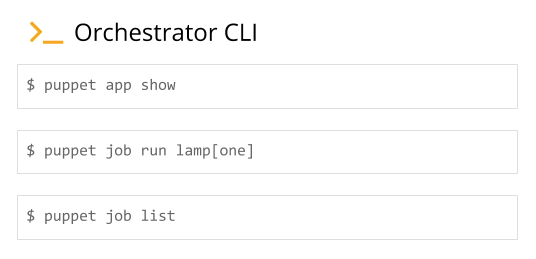

# Deploying applications with Puppet Application Orchestration: workflow

Although Puppet Application Orchestration can help you manage any distributed set of infrastructure, it's primarily designed to configure an application stack. The simple application stack used in the following extended example comprises a database server on one machine and a web server that connects to the database on another machine.

With previous Puppet coding techniques, you'd write classes and defined types to define the configuration for these services, and you'd pass in class parameter data to tell the web server class how to connect to the database. With application orchestration, you can write Puppet code so this information can be exchanged automatically. And when you run Puppet, the services will be configured in the correct order, rather than repeatedly until convergence.

## Application orchestration workflow

The application orchestration workflow illustrate the major steps in the application orchestration workflow—from authoring your application to configuring it with the orchestrator.

### Before you begin

Before you author applications for use with application orchestration, we recommend you have hands-on experience writing Puppet code. You should also be familiar with modules.

### Procedure

1.  Create the service resources and application components.

    In the applications you compose, application components share information with each other by exporting and consuming environment-wide service resources.

    An application component is an independent bit of Puppet code that can be used alongside one or more other components to create an application. Components are often defined types that consist of traditional Puppet resources that describe the configuration of the component \(file, package, and service, for example\).

    1.  Create the `Sql` service resource in `lamp/lib/puppet/type/sql.rb`.

        

    2.  Define the database application component in `lamp/manifests/db.pp`.

        

    3.  In `lamp/manifests/db.pp`, write the produces statement, which expresses that the `Lamp::Db` component produces the `Sql` service resource. The produces statement is included outside of the defined type.

        

2.  Create the application definition.

    The application definition \(or model\) is where you connect all the pieces together. It describes the relationship between the application components and the exchanged service resources.

    Since the application defintion shares the name of the module, you put it in `lamp/manifests/init.pp`.

    

3.  Instantiate the application.

    In the application instance, create a unique version of your application and specify which nodes to use for each component.

    

4.  Use the orchestrator commands to run Puppet and configure the application.

    1.  Run `puppet app show` to see the details of your application instance.

    2.  Run `puppet job run` to run Puppet across all the nodes in the order specified in your application instance.

    3.  Run `puppet job list` to show running and completed orchestrator jobs.

        

        At the start of a job run, the orchestrator prints a job plan that shows what’s included in the run and the expected node run priority. The nodes are grouped by depth. Nodes in level 0 have no dependencies and will run first. Nodes in the levels below are dependent on nodes in higher levels.

        

        As your job progresses, the orchestrator will print results of each node run after it completes. A "Success!" message prints when all jobs complete.

        

**Related topics**  

[Declaring application instances](declaring_application_instances.md#)

[Application definitions](creating_application_definitions.md#)

[Producing and consuming service resources](producing_and_consuming_service_resources.md#)

[Running jobs on the command line](Jobs_on_the_command_line.md)

