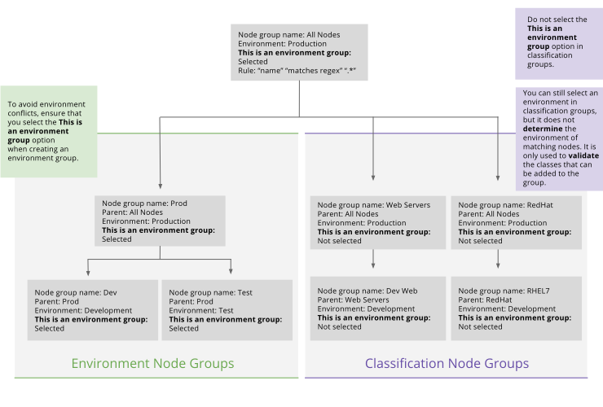

# Environment-based testing

An environment-based testing workflow is an effective approach for testing new code before pushing it to production.

This diagram shows a design pattern for architecting and laying out node groups to implement the recommended environment-based workflow. The differences illustrated here between environment node groups and classification node groups are purely conventional; the node classifier makes no such distinction on a technical level, and does not show environment and classification groups separately. It is up to you to maintain design separation between environment node groups and classification node groups.

Before testing and promoting data using an environment-based workflow, you must have configured:

-   A test environment that's a child of the production environment
-   Classification node groups that include nodes assigned dynamically or statically

## Test and promote a parameter

Test and promote a parameter when using an environment-based testing workflow.

### Procedure

1.  Create a classification node group with the test environment that is a child of a classification group that uses the production environment.

2.  In the child group, set a test parameter. The test parameter overrides the value set by the parent group using the production environment.

3.  If you're satisfied with your test results, manually change the parameter in the parent group.

4.  \(Optional\) Delete the child test group.

## Test and promote a class

Test and promote a class when using an environment-based testing workflow.

### Procedure

1.  Create a classification node group with the test environment that is a child of a classification group that uses the production environment.

    The node classifier validates your parameters against the test environment.

2.  If you're satisfied with your test results, change the environment for the node group from test to production.

## Testing code with canary nodes using alternate environments

Puppet Enterprise allows you to centrally manage which nodes are in which environments.

In most cases the environments are long-lived, such as development, testing, and production, and nodes don't move between these environments after their initial environment has been set.

When an agent node matches the rules specified in environment node groups, the agent is classified in that environment regardless of any environments specified in the agent's own `puppet.conf` file. Agents can't override this server-specified environment. That's the desired behavior in most cases.

A notable exception is when you want to test new Puppet code before deployment, and you have a code promotion workflow based on environments. In this case, you can specify that certain nodes are allowed to use an agent-specified environment. You map the agent-specified environment to a feature branch in your version control system. This override enables you to quickly test the code in your feature branch without permanently changing the environment that the node is in.

**Tip:** To apply an agent-specified environment for more than one run, specify the environment in the node's `puppet.conf` file. Doing this also sets the `agent_specified_environment` fact to `true`. The node will continue to get the agent-specified environment until you remove the environment from its `puppet.conf` file, or change the rules in the testing environment group.

If you want to specify a node's environment long-term — for example, if you always want the node to be a test node — include it in the agent-specified environment node group.

## Test code with canary nodes using alternate environments

In this example, we test new code by adding to a branch testing environment group nodes that have `agent_specified_environment` set to `true`. We then complete a single Puppet run on nodes within that branch that have an agent-specified environment.

### Before you begin

You must have an environment for development.

### Procedure

1.  Create an environment node group for development with these options:

    -   **Parent name** — **Production environment**

    -   **Environment** — **development**

    -   **Environment group** — Select this option.

2.  In the development environment group, add nodes dynamically or statically.

3.  Create an environment node group for branch testing with these options.

    -   **Parent name** — **Development environment**

    -   **Environment** — **agent-specified**

    -   **Environment group** — Select this option.

4.  Create a rule to match the nodes that you want to test on. In the **Rules** tab of the branch testing environment group, add the rule `agent_specified_environment``matches regex``^.+`.

    This rule matches any nodes from the parent group that have the `agent_specified_environment` fact set to `true`. By matching nodes to this group, you give the nodes permission to override the server-specified environment, and use their agent-specified environment instead.

5.  Run Puppet: `puppet agent -t --environment <MYFEATUREBRANCH>`

    `<MYFEATUREBRANCH>` is the name of the Puppet environment with your test code. If you’re using the r10k or Code Manager workflow, this is the name of your Git branch.

    During the Puppet run, the agent sets the `agent_specified_environment` fact to `<MYFEATUREBRANCH>`. Based on the rules you set in step 4, the server allows the agent to override its environment and the agent uses the test environment for a single Puppet run.

