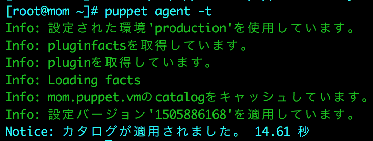

# Enhancements

These are the enhancements added to PE 2017.3.x.

## Specify proxy when using the install script \(2017.3.6\)

On Enterprise Linux systems, if you have a proxy between the agent and the master, you can now use the install script to specify an `http_proxy_host` to be used during package installation, for example `-s agent:http_proxy_host=<PROXY_FQDN>`. Previously, specifying a proxy host using the install script added the setting to `puppet.conf` without using it for installation.

## Unused data is cleaned up during installation \(2017.3.6\)

When installing the agent on Solaris and AIX systems, the installer now cleans up binaries copied into the `/tm`p folder, improving system performance in some cases.

## SSL cipher suites added to the PE module \(2017.3.6\)

SSL cipher suites for Puppet Enterprise services are now managed through the `puppet_enterprise` module. The `puppet_enterprise::ssl_cipher_suites` parameter sets the SSL cipher suites for core Puppet services, including the port used, 8140. This parameter expects an array of SSL ciphers, for example:

```
puppet_enterprise::ssl_cipher_suites: ['ECDHE-ECDSA-AES256-GCM-SHA384', 'ECDHE-RSA-AES256-GCM-SHA384', 'ECDHE-ECDSA-CHACHA20-POLY1305']
```

Console SSL ciphers are managed separately through the `puppet_enterprise::profile::console::proxy::ssl_ciphers` parameter.

Cipher names are in RFC format.

## Auto explain settings added for PE-PostgreSQL \(2017.3.6\)

You can enable and configure `auto_explain` for PE-PostgreSQL by providing a hash of auto explain settings under the Hiera key `puppet_enterprise::profile::database::auto_explain_settings`. For example: 

```
puppet_enterprise::profile::database::auto_explain_settings: 
 auto_explain.log_min_duration: '10s'   
 auto_explain.log_verbose: true
```

 For details about auto explain settings, see the[PostgreSQL documentation](https://www.postgresql.org/docs/9.6/static/auto-explain.html).

## Options added to support script \(2017.3.6\)

The support script now includes options to encrypt the resulting tarball \(`--encrypt`\) and specify the number of days of logs to collect \(`--log-age`\).

## Agent support added \(2017.3.4\)

The agent release included in this version of PE adds support for:

-   macOS 10.13 "High Sierra"

-   Amazon Linux 2

-   AArch64 architecture on RHEL 7


## Skip PostgreSQL validation on upgrade \(2017.3.4\)

For upgrades, a new `force` option enables you to bypass validating PostgreSQL migration, for example:

```
sudo ./puppet-enterprise-installer -c pe.conf -- --force
```

This option can be useful when upgrading installations that use an external PostgreSQL instance, when the installer is unable to validate PostgreSQL.

## Specify PuppetDB blacklisted facts \(2017.3.4\)

Using the `facts_blacklist` setting in Hiera, you can now specify a list of facts that should not be stored in the PuppetDB database.

## Task metadata is available in the console \(2017.3.4\)

On the **Run a task** page, when you select a task to run, you can click **view task metadata** to open an info pane of task and parameter information.

## Use prefixes to exclude environments from deploy with r10k \(2017.3.4\)

The new `ignore_branch_prefixes` subsetting lets you designate specific environments that should not be deployed.

## Control whether local changes to Git modules are overwritten \(2017.3.4\)

Two new flags that specify whether local changes to Git modules should be overwritten have been added to r10k. Use `r10k puppetfile install --force` to overwrite local changes when installing updates, and `r10k deploy --no-force` to preserve local changes on deploy.

## Control the state of the Puppet service during agent install \(2017.3.2\)

You can now control the state of the Puppet service when you install \*nix or Windows agents with an install script. This capability enables manually kicking off the initial Puppet run or doing so with a provisioning system.

Use these flags to control the Puppet service:

|Option|\*nix|Windows|Values|
|------|-----|-------|------|
|ensure|`--puppet-service-ensure <VALUE>`|`-PuppetServiceEnsure <VALUE>`|-   running

-   stopped


|
|enable|`--puppet-service-enable <VALUE>`|`-PuppetServiceEnable <VALUE>`|-   true

-   false

-   manual

-   mask


|

## Reinitialize an high availability replica \(2017.3.2\)

If you encounter certain errors on your primary master replica after provisioning, you can now reinitialize the replica. Reinitializing destroys and re-creates all of the databases on the replica.

## Easier entry and editing of console node data \(2017.3.2\)

Existing configuration data in the console can now be modified, and within the **Classes** section, the parameter value field was expanded to enable easier editing of structured values.

## Structured fact keys in the console are sorted alphabetically \(2017.3.2\)

In the console's node detail screen, keys of structured facts are now sorted alphabetically, making them more legible and scannable.

## MSI properties in Windows simplified agent install script \(2017.3.1\)

The simplified agent install script for Windows now supports setting certain MSI properties as flags in the PowerShell script. You can combine agent configurations with MSI properties.

|MSI Property|PowerShell flag|
|------------|---------------|
|`INSTALLDIR`|`-InstallDir`|
|`PUPPET_AGENT_ACCOUNT_USER`|`-PuppetAgentAccountUser`|
|`PUPPET_AGENT_ACCOUNT_PASSWORD`|`-PuppetAgentAccountPassword`|
|`PUPPET_AGENT_ACCOUNT_DOMAIN`|`-PuppetAgentAccountDomain`|

For example:

```
[Net.ServicePointManager]::ServerCertificateValidationCallback = {$true}; $webClient = New-Object System.Net.WebClient; $webClient.DownloadFile('https://<MASTER HOSTNAME>:8140/packages/current/install.ps1', 'install.ps1'); .\install.ps1 -PuppetAgentAccountUser "svcPuppet" -PuppetAgentAccountPassword "s3kr3t_P@ssword"
```

```
[Net.ServicePointManager]::ServerCertificateValidationCallback = {$true}; $webClient = New-Object System.Net.WebClient; $webClient.DownloadFile('https://<MASTER HOSTNAME>:8140/packages/current/install.ps1', 'install.ps1'); .\install.ps1 -PuppetAgentAccountUser "svcPuppet" -PuppetAgentAccountPassword "s3kr3t_P@ssword" agent:splay=true agent:environment=development
```

## Package task fields prepopulated \(2017.3.1\)

When you run a task from a package's detail page, the Run a task window opens with the **Task** and **Parameter** fields prepopulated with the approprate information.

## Default global `hiera.yaml` no longer includes `common.yaml` or `nodes/clientcert` \(2017.3.0\)

In order to keep environment-specific data within the environment folder, the default global `hiera.yaml` now supports console data only and doesn't include the previous YAML file hierarchy. If you rely on the default global YAML file hierarchy of `nodes/%{clientcert}.yaml` and `common.yaml`, create a Hiera 5 compatible hiera.yaml file in your control-repo environment folder instead. For example: [https://github.com/puppetlabs/control-repo/blob/production/hiera.yaml](https://github.com/puppetlabs/control-repo/blob/production/hiera.yaml)

## PostgreSQL 9.6 upgrade \(2017.3.0\)

This version of PE upgrades PostgreSQL to version 9.6. If you use an external PostgreSQL instance, you must upgrade it before you upgrade PE.

**Note:** If you're upgrading a split installation of a PE version earlier than 2016.4.3 with an external PostgreSQL instance, you must upgrade with the `--force` flag, for example:

```
/opt/puppetlabs/puppet/bin/puppet infrastructure configure --detailed-exitcodes --modulepath=/opt/puppetlabs/server/data/enterprise/modules --no-noop --upgrade-from=<PREVIOUS PE VERSION> --force
```

If you're upgrading with high availability enabled, you must upgrade and then forget the existing replica, and provision and enable a new replica.

## Purge nodes without restart \(2017.3.0\)

You can now purge nodes without running Puppet on your master and reloading it. However, if you use compile masters, you must still run Puppet on all compile masters in order to revoke a node's certificate and have the change take effect.

## PuppetDB "time-to-live" default \(2017.3.0\)

PuppetDB now uses 14 days for a default “time-to-live” value \(`node-purge-ttl`\) before it deletes nodes that have been deactivated or expired. This default can be changed as needed, as documented in the Configuring PE section.

## Simplified file sync reset \(2017.3.0\)

A new file sync reset procedure allows you to more easily recover from a failure state.

## New location for MCollective logs \(2017.3.0\)

On non- Windows systems, MCollective server logs now appear in `/var/log/puppetlabs/mcollective`, consistent with other log files.

## Puppet Server enhancements \(2017.3.0\)

-   The Puppet Server`max_requests_per_instance` setting, which controls the maximum number of requests per instance of a  JRuby interpreter, increased from 10,000 to 100,000 with this release of PE. This change provides a performance boost while still clearing short-lived environments.

-   Puppet Server now uses Jetty 9.4 instead of Jetty 9.2.

-   The sample Grafana dashboard for Puppet Server metrics visualizes new metrics added in this release.


## Orchestrator enhancements \(2017.3.0\)

-   When using the `puppet task` or `puppet job` commands on the orchestrator CLI, you can pass PQL queries or node list targets in a text file by specifying the full path to the file prefixed with `@` \(for example `puppet job run --nodes @/path/to/file.txt`\). You can also use a text file to pass parameters, in JSON format, when using the `puppet task` command.
-   The `puppet job run` command now accepts a `--description` flag. The job description is displayed when you run `puppet job show <JOB_ID>`.

-   In the console, you can now create jobs from the **Overview**, **Events**, and **Classification** node groups pages, instead of only the **Jobs** page.

    Additionally, you can select any job from the job details page and rerun it without having to recreate the settings from the original job. Jobs with application targets run from the command line cannot be rerun from the console, as the console doesn’t support application targets.


-   The orchestrator includes a run mode in which you can override an agent's `no-op = true` setting \(set in `puppet.conf`\). When you use this run mode, all nodes run in enforcement mode, and a new catalog is enforced on all nodes. In the console, run mode is available as a job setting. On the command line, use the `--no-noop` flag.

## Console enhancements \(2017.3.0\)

-   A new **Packages** tab on each node's inventory page shows the complete list of installed packages with sortable version, provider, and Puppet management information.

-   We've improved console performance by implementing report count caching on the Reports and Overview pages.


## Security enhancements \(2017.3.0\)

-   Connections to PE databases can now be made only with certificates. Usernames and passwords are no longer allowed by default.

-   Unlabeled RBAC tokens stored in the database are now hashed. If you label tokens, they are stored unencrypted.


## New Puppet agent platforms \(2017.3.0\)

This release adds support for the Puppet agent on Debian 9 \(Stretch\).

## Internationalization enhancements

These are the internationalization enhancements added to Japanese PE and other Puppet products in PE 2017.3.

These enhancements form version 2 of the PE Japanese release, which ships in the PE 2017.3 tarball, available [here](https://puppet.com/download-puppet-enterprise/ja). This release builds upon Japanese features released in PE 2017.2, which was [version 1](https://docs.puppet.com/pe/2017.2/release_notes.html#pe-is-now-available-in-japanese) of PE in Japanese.

Documentation in Japanese is available at [http://puppet.com/ja/docs/](http://puppet.com/ja/docs).

### **Text-based installer**

The PE text-based installer is now available in Japanese. This installer option is an alternative to the Japanese web-based installer, which became available in PE 2017.2. Locale detection is built in, so users with system locale set to Japanese are automatically guided through the installation in Japanese.

**Note:** You must have gettext installed on the system that you're installing on in order to display translated text.

### **Puppet agent**

Error and informational messages that are output when running Puppet now display in Japanese when you have your system locale set to Japanese. These messages are also added to log files in Japanese.



**Tip:** Translations are disabled by default and all logs and error messages display in English. You can enable translation by setting `puppet_enterprise::master::disable_i18n` to `false`. If you enable translations, verify that `environment_timeout` is set to `unlimited` in `puppet.conf` so that translations can be cached instead of recalculated with every catalog compilation. If you use Code Manager, `environment_timeout` is set to `unlimited` by default. Without Code Manager, `environment_timeout` is set to `0` by default. For more details, see [Disabling internationalized strings](https://puppet.com/docs/puppet/5.3/config_about_settings.html#disabling-internationalized-strings).

### Puppet Access

The Puppet Access command line tool lets you manage authentication tokens for accessing APIs and command line tools for PE services. Now, you can interact with the Puppet Access tool in Japanese when your system locale is set to Japanese.

### Tasks

New in this release, tasks allow you to run ad-hoc tasks across your infrastructure. Tasks are available in Japanese. To run tasks in Japanese from the console, make sure your browser is set to Japanese. To run tasks in Japanese from the command line interface \(CLI\), or the orchestrator API `/command/task` endpoint, make sure your system locale is set to Japanese.


### Module READMEs

In addition to the [seven supported modules](https://docs.puppet.com/pe/2017.2/release_notes.html#pe-is-now-available-in-japanese) that have been available in Japanese since PE 2017.2, the READMEs for supported Apache, Azure, and PostgreSQL modules are now available in Japanese. To view READMEs in Japanese on the Forge, make sure your browser is set to Japanese. To view them in Japanese on GitHub or in your local directory, navigate to the `readmes` folder in the module's directory structure.

### User documentation

Code Manager user documentation is now available in Japanese. Use Code Manager to manage and deploy Puppet code.

### LearningVM

The Puppet Learning VM is an interactive, guided tour that teaches you how to use PE. Both the Quest Guide and the Learning VM itself are now available in Japanese. To view the Quest Guide in Japanese, make sure your bowser is set to Japanese. To use the Learning VM in Japanese, make sure your system locale is set to Japanese. The Quest Guide contains instructions for changing your locale settings on the virtual machine. The Quest Guide and Learning VM are available at [https://learn.puppet.com](https://learn.puppet.com).

### **MySQL module**

The MySQL module has been fully internationalized. This is the first module to be released with end-to-end internationalization. To see error and warning messages from the MySQL module in Japanese, make sure your system locale is set to Japanese.

**Tip:** Translations are disabled by default and all logs and error messages display in English. You can enable translation by setting `puppet_enterprise::master::disable_i18n` to `false`. If you enable translations, verify that `environment_timeout` is set to `unlimited` in `puppet.conf` so that translations can be cached instead of recalculated with every catalog compilation. If you use Code Manager, `environment_timeout` is set to `unlimited` by default. Without Code Manager, `environment_timeout` is set to `0` by default. For more details, see [Disabling internationalized strings](https://puppet.com/docs/puppet/5.3/config_about_settings.html#disabling-internationalized-strings).

**Related topics**  


[Installing Puppet Enterprise](installing_pe.md#)

[Token-based authentication](rbac_token_auth_intro.md#)

[Running jobs with Puppet orchestrator](running_jobs_with_puppet_orchestrator_overview.md#)

[Managing code with Code Manager](code_mgr.md)

