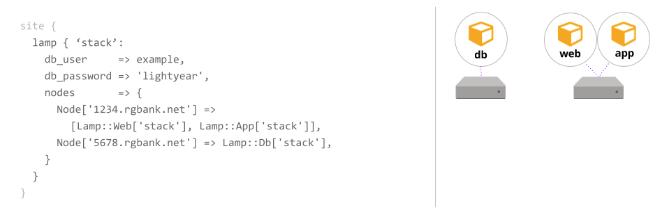
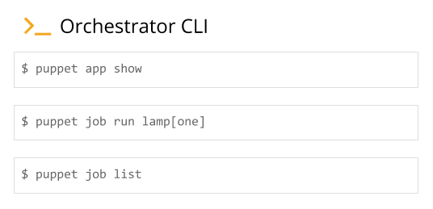

# Deploying applications with Puppet Application Orchestration: workflow

Although Puppet Application Orchestration can help you manage any distributed set of infrastructure, it's primarily designed to configure an application stack. The simple application stack used in the following extended example comprises a database server on one machine and a web server that connects to the database on another machine.

With previous Puppet coding techniques, you'd write classes and defined types to define the configuration for these services, and you'd pass in class parameter data to tell the web server class how to connect to the database. With application orchestration, you can write Puppet code so this information can be exchanged automatically. And when you run Puppet, the services will be configured in the correct order, rather than repeatedly until convergence.

## Application orchestration workflow

The application orchestration workflow illustrates the major steps in the application orchestration workflow—from authoring your application to configuring it with the orchestrator.

### Before you begin

Prior hands-on experience writing Puppet code is required to author applications for use with application orchestration. You should also be familiar with modules.

### About this task

Details about the code for this LAMP application module are available at [puppetlabs/appmgmt-module-lamp](https://github.com/puppetlabs/appmgmt-module-lamp).

### Procedure

1.  Create the service resources and application components.

    In the applications you compose, application components share information with each other by exporting and consuming environment-wide service resources.

    An application component is an independent bit of Puppet code that can be used alongside one or more other components to create an application. Components are often defined types that consist of traditional Puppet resources that describe the configuration of the component \(file, package, and service, for example\).

    1.  Create the `Sql` service resource in `lamp/lib/puppet/type/sql.rb`.

        ```
        Puppet::Type.newtype :sql, :is_capability => true do
          newparam :name, :namevar => true
          newparam :user
          newparam :password
          newparam :port
          newparam :host
        end
        
        ```

    2.  Define the database application component in `lamp/manifests/db.pp`.

        ```
        # Creates and manages a database
        define lamp::db(
          $db_user,
          $db_password,
          $host = $::fqdn,
          $port = 3306,
          $database = $name,
        )
        {
          include mysql::bindings::php
        
          mysql::db { $name:
            user     => $db_user,
            password => $db_password,
          }
        }					   
        
        ```

    3.  Define the HTTP resource in `lamp/manifests/web.pp`.

        ```
        define lamp::web(
          $port = '80',
          $docroot = '/var/www/html',
          ){
          class { 'apache':
            default_mods => false,
            default_vhost => false,
          }
        
          apache::vhost { $name:
            port    => $port,
            docroot => $docroot,
          }
        
        }
        Lamp::Web produces Http {
          ip       => $::ipaddress,
          port     => $port,
          host     => $::fqdn
        }
        ```

    4.  Define the application server component in `lamp/manifests/app.pp`.

        ```
        # Creates and manages an app server
        define lamp::app (
          $docroot,
          $db_name,
          $db_port,
          $db_user,
          $db_host,
          $db_password,
          $host = $::fqdn,
        ) {
          notify { "Hello! This is the ${name}'s rgbank::web component" }
        
          ...
        
        }
        ```

    5.  Create the web component.

    6.  In `lamp/manifests/db.pp`, write the produces statement, which expresses that the `Lamp::Db` component produces the `Sql` service resource. The produces statement is included outside of the defined type.

        ```
        Lamp::Db produces Sql {
          user     => $db_user,
          password => $db_password,
          host     => $host,
          database => $name,
          port     => $port
        }					   
        ```

2.  Create the application definition.

    The application definition \(or model\) is where you connect all the pieces together. It describes the relationship between the application components and the exchanged service resources.

    Since the application definition shares the name of the module, you put it in `lamp/manifests/init.pp`.

    ```
    application lamp (
      $db_user,
      $db_password,
      $docroot = '/var/www/html',
    ) {
    
      lamp::web { $name:
        docroot => $docroot,
        export  => Http["lamp-${name}"],
      }
    
      lamp::app { $name:
        docroot => $docroot,
        consume => Sql["lamp-${name}"],
      }
    
      lamp::db { $name:
        db_user     => $db_user,
        db_password => $db_password,
        export      => Sql["lamp-${name}"],
      }
    
    }			  
    ```

3.  Instantiate the application.

    In the application instance, create a unique version of your application and specify which nodes to use for each component.

    

4.  Use the orchestrator commands to run Puppet and configure the application.

    1.  Run `puppet app show` to see the details of your application instance.

    2.  Run `puppet job run` to run Puppet across all the nodes in the order specified in your application instance.

    3.  Run `puppet job list` to show running and completed orchestrator jobs.

        

        At the start of a job run, the orchestrator prints a job plan that shows what’s included in the run and the expected node run priority. The nodes are grouped by depth. Nodes in level 0 have no dependencies and will run first. Nodes in the levels below are dependent on nodes in higher levels.

        ![Screen shot showing the output of puppet job run Lamp[stack] with expected node run priority.](app_orch_run1.png)

        As your job progresses, the orchestrator will print results of each node run after it completes. A "Success!" message prints when all jobs complete.

        


**Related information**  


[Declaring application instances](declaring_application_instances.md#)

[Application definitions](creating_application_definitions.md#)

[Producing and consuming service resources](producing_and_consuming_service_resources.md#)

[Running jobs on the command line](Jobs_on_the_command_line.md)

