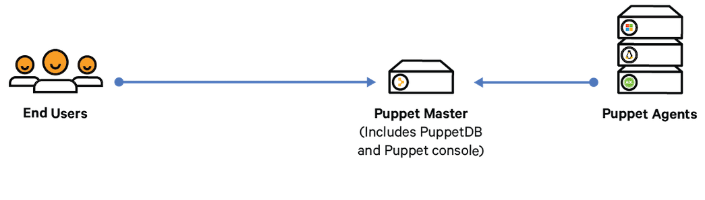

# Choosing an architecture

There are several configurations available for Puppet Enterprise. The configuration you use depends on the number of nodes in your environment, the resources required to serve your agent catalogs, and your availability requirements.

|Configuration|Description|Node limit|
|-------------|-----------|----------|
|Monolithic installation \(Recommended\)|The master, console, and PuppetDB are all installed on one node. This installation type is the easiest to install, upgrade, and troubleshoot. **Tip:** You can add high availability to this configuration.

|Up to several thousand|
|Monolithic installation with compile masters|The master of masters, console, and PuppetDB are installed on one node, and one or more compile masters help distribute the agent catalog compilation workload. **Tip:** You can add high availability to this configuration.

|Less than 20,000|
|Split installation|The master, console, and PuppetDB are each installed on separate nodes. Use this installation type only if you have a limit on the number of permitted cores per server, or if you are managing more than 20,000 nodes.|More than 20,000|
|Large environment installation|The master of masters, console, and PuppetDB are each installed on separate nodes, and one or more compile masters help distribute the agent catalog compilation workflow.|Unlimited|

## Monolithic installation

## Monolithic installation with compile masters

## Split installation

## Large environment installation

