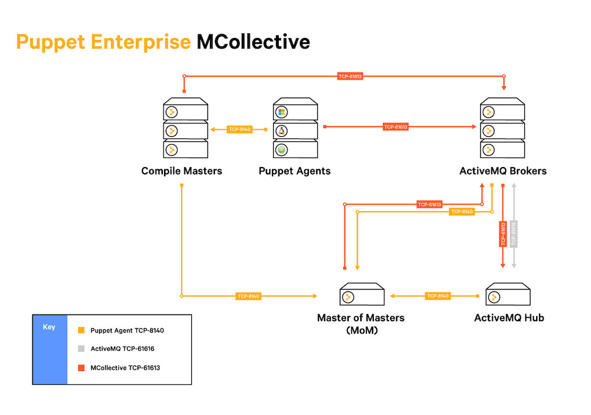
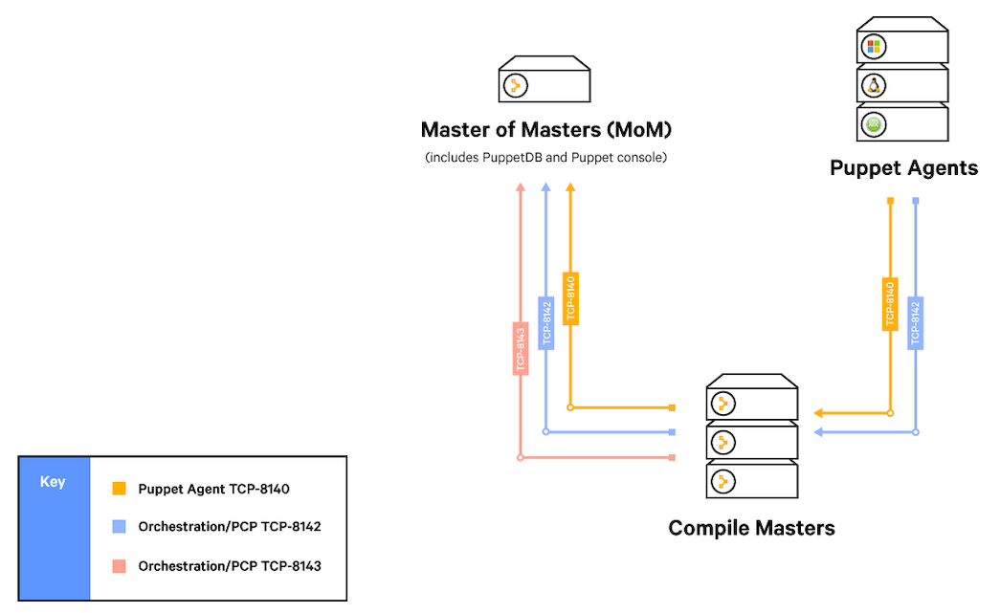

# Moving from MCollective to Puppet orchestrator

Puppet Enterprise 2018.1 is the last release to support MCollective. To prepare for these changes, migrate your MCollective work to  Puppet orchestrator to automate tasks and create consistent, repeatable administrative processes.

A benefit of moving to Puppet orchestrator is that its architecture requires less infrastructure than MCollective. These diagrams illustrate how distributing the Puppet agent workload with additional compile masters also requires additional ActiveMQ Brokers in an MCollective environment.

## Move from MCollective to Puppet orchestrator

Move your MCollective workflows to orchestrator and take advantage of its integration with Puppet Enterprise console and commands, APIs, role-based access control, and event tracking.

### Before you begin

Compare your current MCollective workflows to the corresponding features of PE.

|Feature|In MCollective|In Puppet Enterprise|
|-------|--------------|--------------------|
|Deploy configuration changes and enforce the state of selected nodes.|Commands `mco puppet runonce` and `mco puppet runall` from [mcmcollective-puppet-agent](https://github.com/puppetlabs/mcollective-puppet-agent)

|[Running Puppet on nodes](run_puppet_on_nodes.md#)

|
|Install, uninstall, update, and check the status of packages on a node.|Command `mco package *` from [mcollective-package-agent](https://github.com/puppetlabs/mcollective-package-agent)|[puppetlabs-package](https://forge.puppet.com/puppetlabs/package) module that installs with PE|
|Start, stop, and check the status of services running on a node.|Command `mco service *` from [mcollective-service-agent](https://github.com/puppetlabs/mcollective-service-agent)|[puppetlabs-service](https://forge.puppet.com/puppetlabs/service) module that installs with PE|
|Limit user access to tasks that run on selected nodes.|[mcollective-actionpolicy-auth](https://github.com/puppetlabs/mcollective-actionpolicy-auth)|[PE role-based access control \(RBAC\)](managing_access.md)|
|Make one-off changes to selected nodes.

|MCollective RPC Agents|[PE tasks](running_tasks.md)|
|Target nodes that meet specific conditions.|Filtering on facts|[Puppet Query Language](https://puppet.com/docs/puppetdb/5.2/api/query/v4/pql.html)|
|Discover facts about the nodes in your infrastructure.|MCollective facts|[puppetlabs-facter\_task](https://github.com/puppetlabs/puppetlabs-facter_task) module that installs with PE|

### About this task

### Procedure

1.  If your installation of MCollective uses ActiveMQ hubs and spokes to manage large deployments, install compile masters to share the Puppet agent workload.

2.  To replace MCollective RPC agents, recreate them as Puppet tasks.

3.  To filter nodes by facts, run Puppet on a PQL query that selects the target you want.

4.  To create plans that combine multiple tasks into a single command, install Bolt.

5.  When you are ready, remove MCollective from the nodes in your infrastructure.

**Related information**  

[Creating and managing local users and user roles](rbac_user_roles_intro.md#)

[Installing compile masters](installing_compile_masters.md#)

[Running tasks](running_tasks.md)

[Run Puppet on on a PQL query](running_puppet_on_demand_from_the_cli.md#)

[Installing Bolt](https://puppet.com/docs/bolt/0.x/bolt_installing.html)

[Removing MCollective](removing_mcollective.md)

