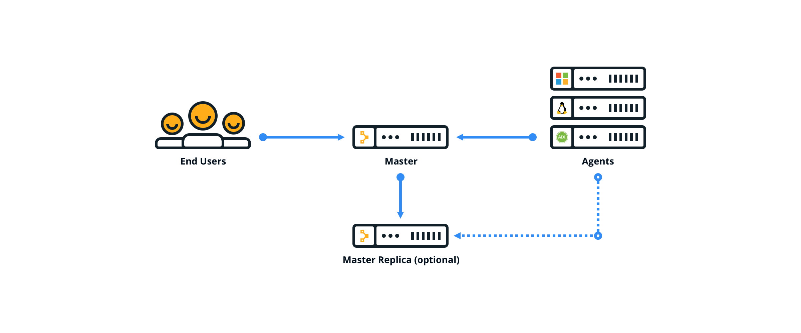
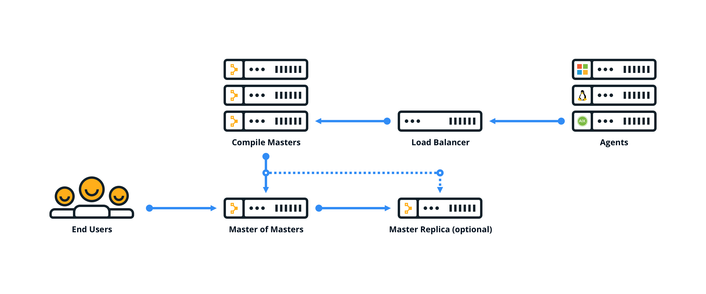
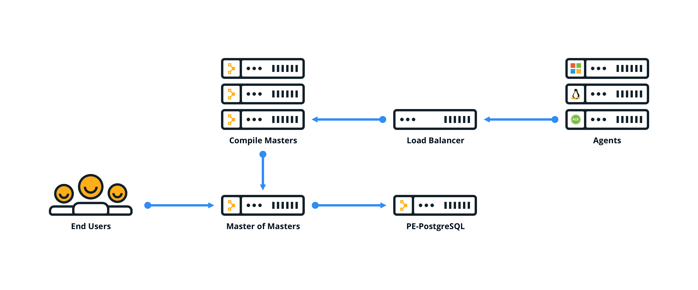

# Choosing an architecture

There are several configurations available for Puppet Enterprise. The configuration you use depends on the number of nodes in your environment and the resources required to serve agent catalogs.

|Configuration|Description|Node limit|
|-------------|-----------|----------|
|Monolithic installation \(Recommended\)|All infrastructure components are installed on the master. This installation type is the easiest to install, upgrade, and troubleshoot.|Up to 4,000|
|Monolithic installation with compile masters|Similar to a monolithic installation, plus one or more compile masters and a load balancer which help distribute the agent catalog compilation workload.|4,000–20,000|
|Monolithic installation with compile masters and standalone PE-PostgreSQL|Similar to a monolithic installation with compile masters, plus a separate node which hosts the PE-PostgreSQL instance.|More than 20,000|

**Tip:** You can add high availability to a monolithic installation, with or without compile masters, by configuring a replica of your master or master of masters. High availability isn't supported with standalone PE-PostgreSQL

## Monolithic installation

## Monolithic installation with compile masters

## Monolithic installation with compile masters and standalone PE-PostgreSQL

