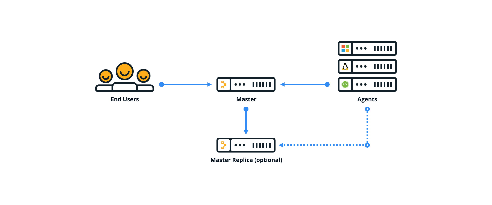
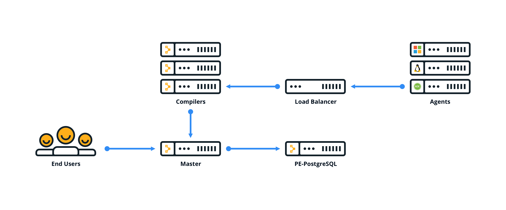

# Choosing an architecture

There are several configurations available for Puppet Enterprise. The configuration you use depends on the number of nodes in your environment and the resources required to serve agent catalogs.

|Configuration|Description|Node limit|
|-------------|-----------|----------|
|Monolithic installation \(Recommended\)|All infrastructure components are installed on the master. This installation type is the easiest to install, upgrade, and troubleshoot.|Up to 4,000|
|Monolithic installation with compilers|Similar to a monolithic installation, plus one or more compilers and a load balancer which help distribute the agent catalog compilation workload.|4,000–20,000|
|Monolithic installation with compilers and standalone PE-PostgreSQL|Similar to a monolithic installation with compilers, plus a separate node which hosts the PE-PostgreSQL instance.|More than 20,000|

**Tip:** You can add high availability to a monolithic installation, with or without compilers, by configuring a replica of your master. High availability isn't supported with standalone PE-PostgreSQL

## Monolithic installation

## Monolithic installation with compilers

## Monolithic installation with compilers and standalone PE-PostgreSQL

