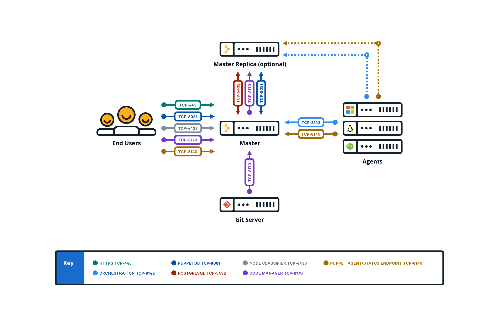

# System configuration

Before installing Puppet Enterprise, make sure that your nodes and network are properly configured.

**Note:** Port numbers are Transmission Control Protocols \(TCP\), unless noted otherwise.

**Parent topic:**[System requirements](system_requirements.md)

## Timekeeping and name resolution

Before installing , there are network requirements you need to consider and prepare for. The most important requirements include syncing time and creating a plan for name resolution.

### Timekeeping

Use NTP or an equivalent service to ensure that time is in sync between your master, which acts as the certificate authority, and any agent nodes. If time drifts out of sync in your infrastructure, you might encounter issues such as agents recieving outdated certificates. A service like NTP \(available as a supported module\) ensures accurate timekeeping.

### Name resolution

Decide on a preferred name or set of names that agent nodes can use to contact the master. Ensure that the master can be reached by domain name lookup by all future agent nodes.

You can simplify configuration of agent nodes by using a CNAME record to make the master reachable at the hostname `puppet`, which is the default master hostname that is suggested when installing an agent node.

## Web URLs used for deployment and management

PE uses some external web URLs for certain deployment and management tasks. You might want to ensure these URLs are reachable from your network prior to installation, and be aware that they might be called at various stages of configuration.

|URL|Enables|
|---|-------|
|[forgeapi.puppet.com](http://forgeapi.puppet.com/)|Puppet module downloads.|
|[pm.puppetlabs.com](http://pm.puppetlabs.com/)|Agent module package downloads.|
|[s3.amazonaws.com](http://s3.amazonaws.com/)|Agent module package downloads \(redirected from pm.pupptlabs.com\).|
|[rubygems.org](http://rubygems.org/)|Puppet and Puppet Server gem downloads.|
|[github.com](http://github.com/)|Third-party module downloads not served by the Forge and access to control repositories.|

## Firewall configuration for standard installations

These are the port requirements for standard installations.

|Port|Use|
|----|---|
|8140|-   The master uses this port to accept inbound traffic/requests from agents.

-   The console sends requests to the master on this port.

-   Certificate requests are passed over this port unless `ca_port` is set differently.

-   Puppet Server status checks are sent over this port.

-   Classifier group: **PE Master**

|
|443|-   This port provides host access to the console

-   The console accepts HTTPS traffic from end users on this port.

-   Classifier group: **PE Console**

|
|4433|-   This port is used as a classifier / console services API endpoint.

-   The master communicates with the console over this port.

-   Classifier group: **PE Console**

|
|8081|-   PuppetDB accepts traffic/requests on this port.

-   The master and console send traffic to PuppetDB on this port.

-   PuppetDB status checks are sent over this port.

-   Classifier group: **PE PuppetDB**

|
|8142|-   Orchestrator and the **Run Puppet** button use this port on the master to accept inbound traffic/responses from agents via the Puppet Execution Protocol agent.

-   Classifier group: **PE Orchestrator**

|
|8170|-   Code Manager uses this port to deploy environments, run webhooks, and make API calls.

|
|5432|-   This port is used to replicate PostgreSQL data between the master and replica.

|
|8150 and 8151|-   Razor uses port 8150 for HTTP and 8151 for HTTPS. Any node classified as a Razor server must be able to use these ports.

|

## Firewall configuration for large installations with compilers

These are the port requirements for large installations with compilers.

|Port|Use|
|----|---|
|8140|-   The master uses this port to accept inbound traffic/requests from agents.

-   The console sends requests to the master on this port.

-   Certificate requests are passed over this port unless `ca_port` is set differently.

-   Puppet Server status checks are sent over this port.

-   The master uses this port to send status checks to compilers. \(Not required to run PE.\)

-   Classifier group: **PE Master**

|
|443|-   This port provides host access to the console

-   The console accepts HTTPS traffic from end users on this port.

-   Classifier group: **PE Console**

|
|4433|-   This port is used as a classifier / console services API endpoint.

-   The master communicates with the console over this port.

-   Classifier group: **PE Console**

|
|8081|-   PuppetDB accepts traffic/requests on this port.

-   The master and console send traffic to PuppetDB on this port.

-   PuppetDB status checks are sent over this port.

-   Classifier group: **PE PuppetDB**

|
|8142|-   Orchestrator and the **Run Puppet** button use this port on the master to accept inbound traffic/responses from agents via the Puppet Execution Protocol agent.

-   Classifier group: **PE Orchestrator**

|
|8143|-   Orchestrator uses this port to accept connections from Puppet Communications Protocol brokers to relay communications. The orchestrator client also uses this port to communicate with the orchestration services running on the master. If you install the client on a workstation, this port must be available on the workstation.

-   Classifier group: **PE Orchestrator**

|
|8170|-   Code Manager uses this port to deploy environments, run webhooks, and make API calls.

|
|5432|-   This port is used to replicate PostgreSQL data between the master and replica.

|
|8150 and 8151|-   Razor uses port 8150 for HTTP and 8151 for HTTPS. Any node classified as a Razor server must be able to use these ports.

|

## Firewall configuration for extra-large installations with compilers and standalone PE-PostgreSQL

These are the port requirements for extra-large installations with compilers and standalone PE-PostgreSQL

|Port|Use|
|----|---|
|8140|-   The master uses this port to accept inbound traffic/requests from agents.

-   The console sends requests to the master on this port.

-   Certificate requests are passed over this port unless `ca_port` is set differently.

-   Puppet Server status checks are sent over this port.

-   The master uses this port to send status checks to compilers. \(Not required to run PE.\)

-   Classifier group: **PE Master**

|
|443|-   This port provides host access to the console

-   The console accepts HTTPS traffic from end users on this port.

-   Classifier group: **PE Console**

|
|4433|-   This port is used as a classifier / console services API endpoint.

-   The master communicates with the console over this port.

-   Classifier group: **PE Console**

|
|8081|-   PuppetDB accepts traffic/requests on this port.

-   The master and console send traffic to PuppetDB on this port.

-   PuppetDB status checks are sent over this port.

-   Classifier group: **PE PuppetDB**

|
|8142|-   Orchestrator and the **Run Puppet** button use this port on the master to accept inbound traffic/responses from agents via the Puppet Execution Protocol agent.

-   Classifier group: **PE Orchestrator**

|
|8143|-   Orchestrator uses this port to accept connections from Puppet Communications Protocol brokers to relay communications. The orchestrator client also uses this port to communicate with the orchestration services running on the master. If you install the client on a workstation, this port must be available on the workstation.

-   Classifier group: **PE Orchestrator**

|
|8170|-   Code Manager uses this port to deploy environments, run webhooks, and make API calls.

|
|5432|-   The standalone PE-PostgreSQL node uses this port to accept inbound traffic/requests from the master.

|
|8150 and 8151|-   Razor uses port 8150 for HTTP and 8151 for HTTPS. Any node classified as a Razor server must be able to use these ports.

|

