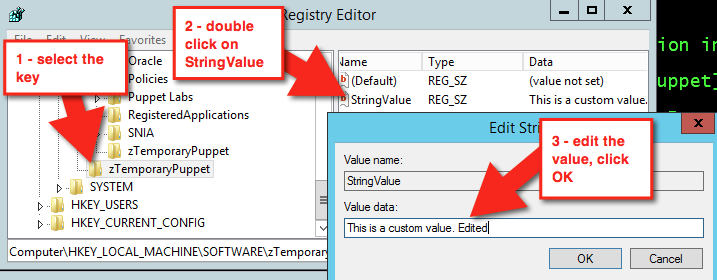
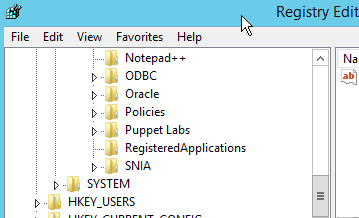

# Create managed keys

Learn how to make managed registry keys, and see Puppet correct configuration drift when you try and alter them in Registry Editor.

## Procedure

1.  Create your first Puppet managed registry keys and values:

    ```
    registry_key { 'HKLM\Software\zTemporaryPuppet':
         ensure => present,
    }
    
    # By default the registry creates an implicit relationship to any file
    # resources it finds that match the location.
    registry_value {'HKLM\Software\zTemporaryPuppet\StringValue':
      ensure => 'present',
      data   => 'This is a custom value.',
      type   => 'string',
    }
    
    #forcing a 32-bit registry view; watch where this is created:
    registry_key { '32:HKLM\Software\zTemporaryPuppet':
      ensure => present,
    }
    
    registry_value {'32:HKLM\Software\zTemporaryPuppet\StringValue':
      ensure => 'present',
      data   => 'This is a custom 32-bit value.',
      type   => 'expand',
    }
    ```

2.  Save the file as `registry.pp`.

3.  Validate the manifest. In the command prompt, run `puppet parser validate c:\<FILE PATH>\registry.pp`

    If the parser returns nothing, it means validation passed.

4.  Now, apply the manifest by running `puppet apply c:\<FILE PATH>\registry.pp` in the command prompt. Your output should look similar to below.

    ```
    Notice: Compiled catalog for win2012r2x64 in environment production in 0.11 seco
    nds
    Notice: /Stage[main]/Main/Registry_key[HKLM\Software\zTemporaryPuppet]/ensure: c
    reated
    Notice: /Stage[main]/Main/Registry_value[HKLM\Software\zTemporaryPuppet\StringVa
    lue]/ensure: created
    Notice: /Stage[main]/Main/Registry_key[32:HKLM\Software\zTemporaryPuppet]/ensure
    : created
    Notice: /Stage[main]/Main/Registry_value[32:HKLM\Software\zTemporaryPuppet\Strin
    gValue]/ensure: created
    Notice: Applied catalog in 0.03 seconds
    ```

5.  Next, inspect the registry and see what you have. Press **Start + R**, then type `regedit` and press **Enter**. Once the Registry Editor opens, find your keys under **HKEY\_LOCAL\_MACHINE**.

    

    Note that the 32-bit keys were created under the 32-bit section of Wow6432Node for Software.

6.  Apply the manifest again by running `puppet apply c:\<FILE PATH>\registry.pp`

    ```
    Notice: Compiled catalog for win2012r2x64 in environment production in 0.11 seconds
    Notice: Applied catalog in 0.02 seconds
    ```

    Nothing changed, so there is no work for Puppet to do.

7.  In Registry Editor, change the data. Select **HKLM\\Software\\zTemporaryPuppet** and in the right box, double-click **StringValue**. Edit the value data, and click **OK**.

    

    This time, changes have been made, so running `puppet apply c:\path\to\registry.pp` results in a different output.

    ```
    Notice: Compiled catalog for win2012r2x64 in environment production
    in 0.11 seconds
    Notice: /Stage[main]/Main/Registry_value[HKLM\Software\zTemporaryPuppet\StringValue]/data:
    data changed 'This is a custom value. Edited' to 'This is a custom value.'
    Notice: Applied catalog in 0.03 seconds
    ```

    Puppet automatically corrects the configuration drift.

8.  Next, clean up and remove the keys and values. Make your `registry.pp` file look like the below:

    ```
    registry_key { 'HKLM\Software\zTemporaryPuppet':
      ensure => absent,
    }
    
    #forcing a 32 bit registry view, watch where this is created
    registry_key { '32:HKLM\Software\zTemporaryPuppet':
      ensure => absent,
    }
    ```

9.  Validate it with `puppet parser validate c:\path\to\registry.pp` and apply it again with puppet apply `c:\path\to\registry.pp`

    ```
    Notice: Compiled catalog for win2012r2x64 in environment production in 0.06 seconds
    Notice: /Stage[main]/Main/Registry_key[HKLM\Software\zTemporaryPuppet]/ensure: removed
    Notice: /Stage[main]/Main/Registry_key[32:HKLM\Software\zTemporaryPuppet]/ensure
    : removed
    Notice: Applied catalog in 0.02 seconds
    ```

    Refresh the view in your Registry Editor. The values are gone.

    


## Example

Here’s a real world example that disables error reporting:

```
class puppetconf::disable_error_reporting {
  registry_value { 'HKEY_LOCAL_MACHINE\SOFTWARE\Microsoft\Windows\Windows Error Reporting\ForceQueue':
    type => dword,
    data => '1',
  }

  registry_value { 'HKEY_LOCAL_MACHINE\SOFTWARE\Microsoft\Windows\Windows Error Reporting\DontShowUI':
    type => dword,
    data => '1',
  }

  registry_value { 'HKEY_LOCAL_MACHINE\SOFTWARE\Microsoft\Windows\Windows Error Reporting\DontSendAdditionalData':
    type => dword,
    data => '1',
  }

  registry_key { 'HKEY_LOCAL_MACHINE\SOFTWARE\Microsoft\Windows\Windows Error Reporting\Consent':
    ensure       => present,
  }

  registry_value { 'HKEY_LOCAL_MACHINE\SOFTWARE\Microsoft\Windows\Windows Error Reporting\Consent\DefaultConsent':
   type => dword,
   data => '2',
  }
}
```

