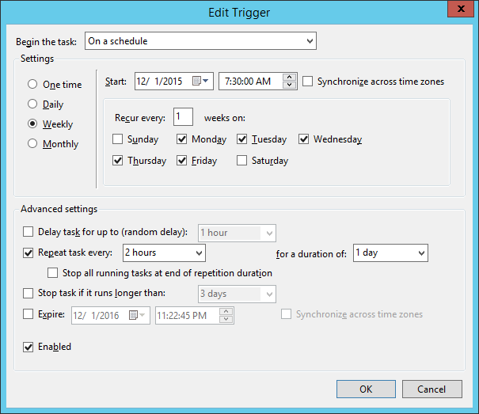

# Schedule a recurring task

Regularly scheduled tasks are often necessary on Windows to perform routine system maintenance.

## About this task

If you need to sync files from another system on the network, perform backups to another disk, or execute log or index maintenance on SQL Server, you can use Puppet to schedule and perform regular tasks. The following shows how to regularly delete files.

## Procedure

1.  To delete all files recursively from `C:\Windows\Temp` at 8 AM each day, create a resource called `scheduled_task` with these attributes:

    ```
    scheduled_task { 'Purge global temp files':
       ensure    => present,
       enabled   => true,
       command   => 'c:\\windows\\system32\\cmd.exe',
       arguments => '/c "del c:\\windows\\temp\\*.* /F /S /Q"',
       trigger   => {
          schedule   => daily,
          start_time => '08:00',
      }
    }
    ```


## Results

After you set up Puppet to manage this task, the Task Scheduler includes the task you specified:


## Example

In addition to creating a trivial daily task at a specified time, the scheduled task resource supports a number of other more advanced scheduling capabilities, including more fine-tuned scheduling. For example, to change the above task to instead perform a disk clean-up every 2 hours, modify the trigger definition:

```
scheduled_task { 'Purge global temp files every 2 hours':
   ensure  => present,
   enabled => true,
   command   => 'c:\\windows\\system32\\cmd.exe',
   arguments => '/c "del c:\\windows\\temp\\*.* /F /S /Q"',
   trigger => [{
      day_of_week => ['mon', 'tues', 'wed', 'thurs', 'fri'],
      every => '1',
      minutes_interval => '120',
      minutes_duration => '1440',
      schedule => 'weekly',
      start_time => '07:30'
   }],
  user => 'system',
}
```

You can see the corresponding definition reflected in the Task Scheduler GUI:



