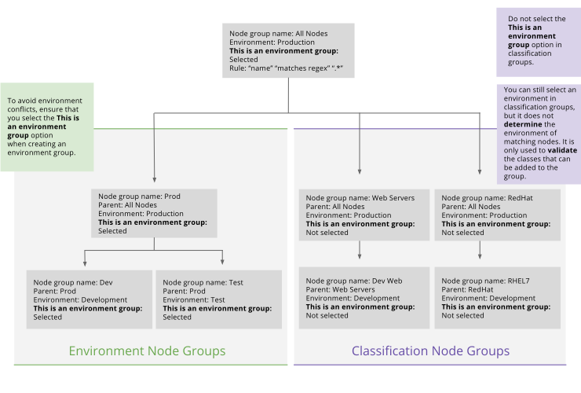

We recommend the following environment-based workflow for testing new code in the node classifier, before pushing it to production. In this workflow, you create a set of node groups that are used exclusively for **assigning environments to nodes**, and another set of node groups that are used for **applying classes to nodes**. This workflow avoids the environment conflicts that can occur if a node is a member of two different node groups, each with a different environment specified.

> **Note:** To be assigned an environment, your nodes need to match an environment group. To be assigned classes, they need to match the applicable classification groups. 

<a href="./images/console/env_workflow.svg"> (Click to enlarge)</a>

> **Important Note:** This is a design pattern for architecting and laying out node groups to implement the recommended workflow for using environments. The differences illustrated here between environment node groups and classification node groups are purely conventional. The Node Classifier makes no such distinction on a technical level, and does not show them separately. The Node Classifier is only aware of one kind of primitive: a node group. It is up to you to maintain design separation between environment node groups and classification node groups.

### Creating Environment Node Groups

1. Create a set of node groups that you will use exclusively for specifying which environment a node is in. Note that your PE install comes with a **Production environment** group already set up. The **Production environment** group has a rule that matches all nodes. All additional environment node groups that you create must have the **Production environment** as their parent (see the diagram above). This ensures that you are overriding the production environment that has been applied to all nodes by default through the **Production environment** group. 

2. In your *environment node groups*, add rules that match the nodes you want to include in the environment. **Do not add any classes to the environment node groups**.

3. When creating an environment node group, always select **This is an environment node group**. This ensures that the environment setting persists even when the matching nodes also match a classification node group that has a different environment specified. To select the **This is an environment node group** option:

    1. On the **Classification** page, click the node group that you want to edit.

    2. Click **Edit node group metadata** at the upper right.

    3. Under **ENVIRONMENT**, select the **This is an environment node group** checkbox.

    4. To commit the change, click the commit button.

    In the **All node groups** view, an **ENV GROUP** tag is displayed next to the node groups that have **This is an environment node group** selected.

### Creating Classification Node Groups

1. Create a set of node groups that you will use exclusively for assigning classification to nodes. This is where you will add classes, along with rules that specify which nodes to match. You can leave the environment set to the default production environment, or change it to whatever environment you need to validate your classes and parameters against. **Do not** select **This is an environment node group** in any of your classification groups.

2. To set a test parameter, make a child group under a production node group. In the child group, set a parameter that overrides the value of the production parameter. To move the parameter to production, manually change the parameter in the production group and then delete the child group you were testing in.

3. To add parameters that are only available in the test environment, set the environment of the classification node group to `test` so that the node classifier validates your parameters against the test environment.

* * *

- [Next: Using Event Inspector](./console_event-inspector.html)