The Pipelines administrator console allows on premises administrators (SuperUsers) to administer the Pipelines on premises installation.

Activities that can be accomplished from the console include:

<ul>
<li>User account management</li>
<ul>
<li>Change a user's password</li>
<li>Change a user's email</li>
<li>Manage which users are Super Users</li>
<li>See a user's account details</li>
</ul>
<li>View the Task Queue (Builds)</li>
<li>View the DM Queue (Deploys)</li>
<li>View Pipelines Services and Status</li>
<li>Access the on-premises Enterprise Options</li>
<ul>
<li>Enterprise integrations configuration</li>
<li>Agent information</li>
<li>DynamoDB table information</li>
<li>Docker image configuration</li>
<li>Switching between Pipelines for Applications and Pipelines for Containers</li>
</ul>
</ul>

## Navigate to the Pipelines Console

To navigate to the <b>console</b> of a Pipelines on premises install, you must first ensure you are logged in with a Pipelines Super User.

Simply change the path, query, and any parameters of the URL to <b>console</b>. Here is an example:

~~~
http://www.distelli.example.com/console
~~~

## Enable switching between Pipelines for Applications and Pipelines for Containers

If your organization uses both Pipelines for Applications and Pipelines for Containers, you can enable easy switching between your instances of the two products. 

1. In the Pipelines console, click **Settings,** then click **PFA/PFC.**
2. Set the toggle to **Enable Pipelines for Containers.**
3. Enter the URL for your Pipelines for Containers instance. 
4. Click **Confirm URL.**

Users of your Pipelines for Applications instance will now be able to switch between the two products by using the product switching feature in the main navigation bar of the Pipelines for Applications web UI. 

## Set up SAML

Pipelines on-premise enterprise installations can support SAML (Security Assertion Markup Language) authentication from a SAML IDP (IDentity Provider).

This document describes the configuration of Pipelines' SAML feature to integrate with a SAML IDP.

In the console, navigate to the <b>Enterprise</b> tab.

In the Console / Enterprise Settings click the <b>SAML</b> tab.

The fields are as follows:

<h4>Enable SAML Authentication</h4>

This checkbox toggles SAML authentication on and off.

**Note:** If you save a misconfigured SAML configuration or your SAML IDP is not properly configured, you may be locked out of Pipelines. This scenario would require someone to disable SAML from the database.

<h4>Public Signing Certificate</h4>

The SAML IDP public signing certificate is used to verify SAML assertions from the IDP. This will need to be provided by your enterprise SAML team.

<h4>Attribute Mapping</h4>

Certain attributes need to be sent to Pipelines in the SAML assertion. Pipelines needs to know what are the field names, from your SAML IDP assertion, that correspond to the attribute needed by Pipelines. These are as follows:

<ul>
  <li><b>First name</b> - The user's first name.</li>
  <li><b>Last name</b> - The user's last name.</li>
  <li><b>Email address</b> - The user's email address. This field must be unique across all users as this is the unique identifier of a user.</li>
  <li><b>Username</b> - The user's Pipelines username.</li>
</ul>

<h4>Run Test</h4>

The <b>Run Test</b> button will execute a simple authentication query to your SAML IDP and expect a working response.

<h4>Save</h4>

Remember that after you save, if things are not configured correctly on Pipelines or the SAML IDP, users may be locked out. It would be best if you test this from a separate browser window.

<h3>SAML IDP</h3>

Your enterprise SAML team will have to configure their IDP to communicate with Pipelines. They will need the following information:

* They will have to provide the IDP **public signing certificate** to enter in Pipelines.
* They will have to register Pipelines as an application with permissions to interact with the IDP.
* They will need to know the Pipelines SAML redirect url of `<your-distelli-www-url.domain>/saml`.
* They will have to provide the **IDP initiated SSO URL** that Pipelines will use to direct user auth requests.
* They will need to provide the SAML attribute names that come back in the SAML assertion for the following fields.
    * **First name** - The user's first name.
    * **Last name** - The user's last name.
    * **Email address** - The user's email address. This field must be unique across all users as this is the unique identifier of a user.
    * **Username** - The user's Pipelines username. This field must be globally unique across all users.

## Set up LDAP

Pipelines on-premise enterprise installations can support LDAP (Lightweight Directory Access Protocol) authentication. When enabling LDAP on Pipelines, all users are managed through LDAP. This includes group (team) memberships. Users can no longer sign in to Pipelines without an LDAP login.

Pipelines uses <b>samAccountName</b> as the Pipelines username and the <b>mail</b> field as the Pipelines email. These must be unique across all users and must remain consistent. A Pipelines super user can change a users email. Pipelines usernames cannot be changed.

When logging in to Pipelines with LDAP, the following rules apply.

<ol>
  <li>The username must exist in LDAP.</li>
  <li>The user must not have "User must change password at next log on" enabled. Pipelines will appropriately message in this case.</li>
  <li>The user must belong to an LDAP security group that is mapped to a Pipelines group. If not, the user will be denied entry.</li>
</ol>

The first time a user logs in to Pipelines with their LDAP username, an account will be created for them.

When a user logs into Pipelines with their LDAP username, any LDAP groups they are a member of that are mapped to Pipelines groups will cause that user to be added as a user to the account the Pipelines group exists in, and the user will be added to that accounts Pipelines group for RBAC permissions.

After LDAP is enabled, you can no longer manage account users and group memberships in Pipelines. These are solely managed by LDAP now.

<h2>Setup LDAP</h2>

You can access the LDAP setup screen from the Pipelines administrator console. This requires logging into Pipelines with a super user or the d1 root account.

On the console, click the <b>Enterprise</b> tab.

Finally click the <b>LDAP</b> tab.

**Note:** Your first time visiting this page may throw an error regarding "cannot retrieve LDAP groups". It is safe to ignore this.

Here you will want to enter the appropriate values for your LDAP configuration. An example:

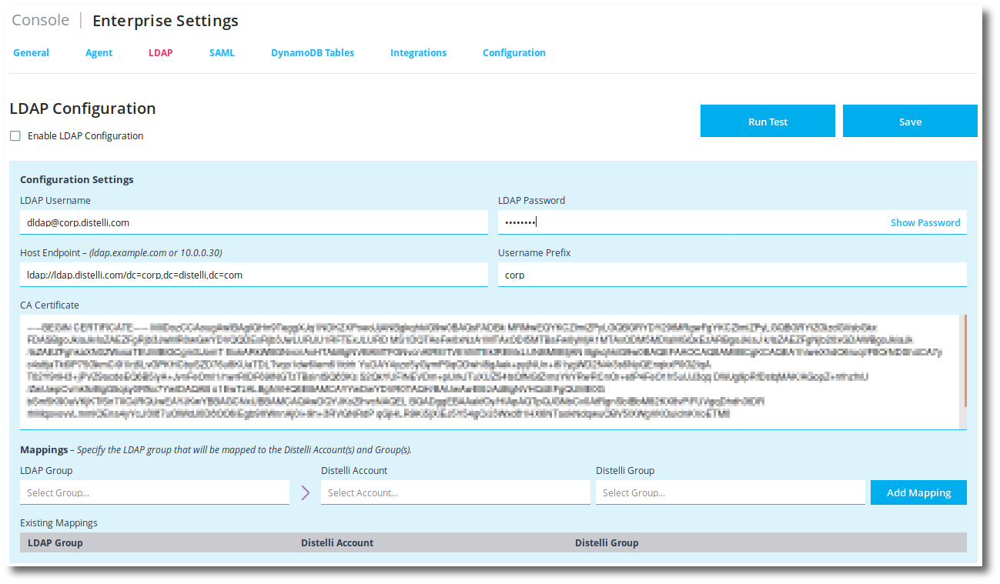

The fields are as follows

<ul>
  <li><b>LDAP Username</b> - The LDAP userPrincipalName (UPN) that will be used to search LDAP groups for creating LDAP group to Pipelines group mappings.</li>
  <li><b>LDAP Password</b> - The password associated with the previous UPN.</li>
  <li><b>Host Endpoint</b> - The LDAP connection string for the top of the tree you wish Pipelines to search through recursively.</li>
  <li><b>Username Prefix</b> - The LDAP domain that users exist in. When logging in, this string will be prepended to the samAccountName as domain/samAccountName.</li>
  <li><b>CA Certificate</b> - The domain root certificate. Pipelines only uses LDAPS to communicate.</li>
</ul>

After entering the values, click the <b>Run Test</b> button to ensure they are working as expected.

**Warning:** Do NOT Enable LDAP Configuration until you have read the balance of this document.

Click the <b>Save</b> button to save the settings.

<h2>Before Enabling LDAP</h2>

<h3>Pipelines Groups</h3>

You must first ensure you have at least one Pipelines group that is mapped to one or more LDAP groups. These are typically created in a shared team account. You can create a shared team account from the Pipelines console.

<h5>Create a shared team account:</h5>

<ol>
  <li>While in the Pipelines concole, click <b>Accounts</b> from the top.</li>
  <li>On the top right, click <b>Create Account</b>.</li>

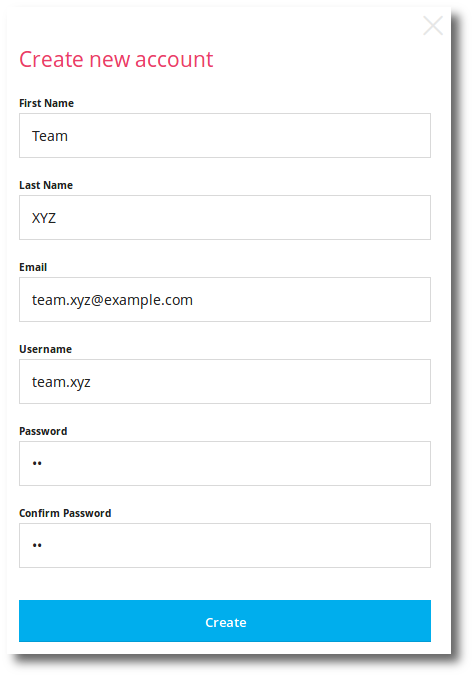

  <li>Click <b>Create</b>.</li>
</ol>

<h5>Navigate to the shared team account:</h5>

<ol>
  <li>Change the URL to the username of the account just created.</li>
</ol>

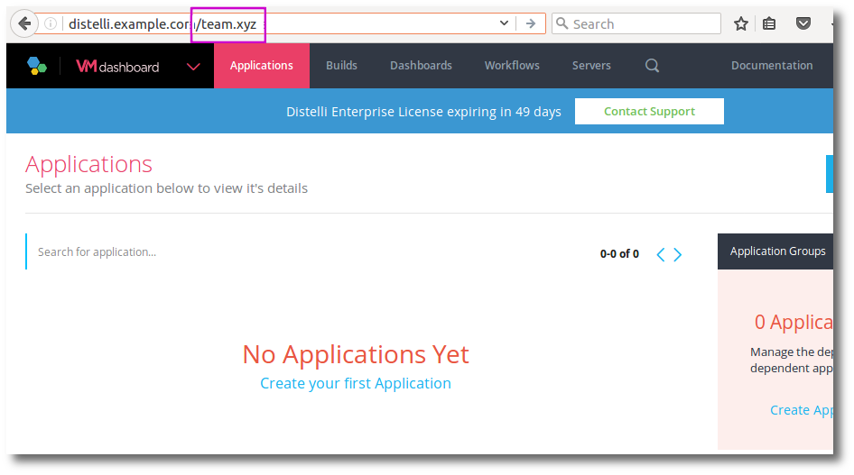

<h5>Create a Group:</h5>

<ol>
  <li>Click the <b>gear</b> icon on the top right.</li>
  <li>Click the <b>Groups</b> link on the left menu.</li>
  <li>Click the <b>+ Create New Group</b> link.</li>
  <li>Give the group a <b>Group Name</b> and an optional Group Description.</li>
  <li>Click the <b>Create</b> button.</li>

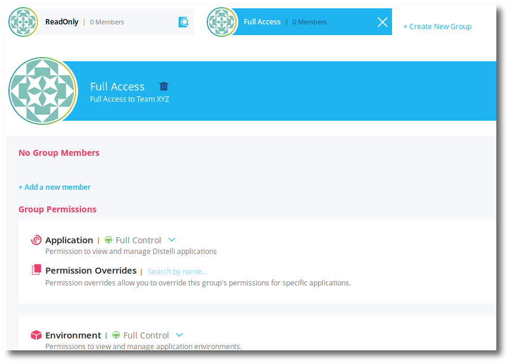

  <li>Go through and set the permissions as appropriate for this group. You will typically want a full access group for each team account to ensure you can delegate administration of the team account.</li>
  <li><b>Save</b> the group when you are finished.</li>
</ol>

<h5>Create an LDAP Group Mapping</h5>

The next steps will be done back in the LDAP Enterprise console page.

<ol>
  <li>On the LDAP Enterprise console page, at the bottom, under <b>LDAP Group</b>, click <b>Select Group</b>.</li>

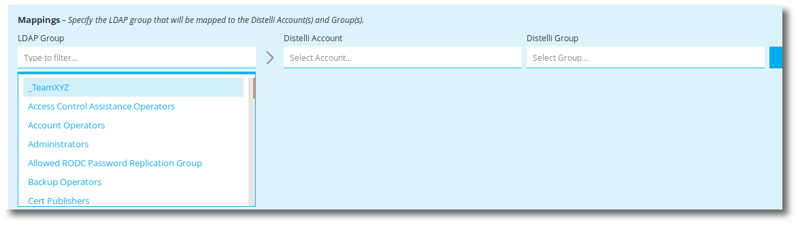

  <li>Select the <b>LDAP Group</b> you wish to map to a Pipelines group.</li>
  <li>Now select the <b>Pipelines Account</b> that the Pipelines group is in.</li>
  <li>Select the <b>Pipelines Group</b> that will be mapped to the LDAP group.</li>
  <li>Finally click <b>Add Mapping</b>.</li>
</ol>

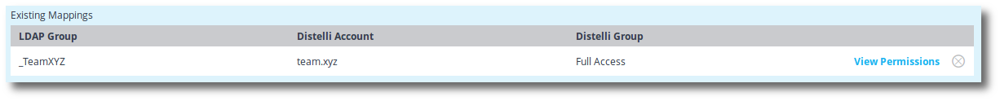

When you enable LDAP and a user logs in, that is a member of a mapped LDAP group, that user will be provided RBAC based access to the team account that the Pipelines group belongs to based on the Pipelines group permissions.

Pipelines will periodically query the mapped LDAP groups for membership and update user membership in the appropriate Pipelines group(s).

An LDAP group can be mapped to multiple Pipelines groups and multiple LDAP groups can be mapped to the same Pipelines group. You must create individual mappings for each.

If you click the <b>View Permissions</b> link on the right, you will be navigated to the Pipelines group to view the permissions.

<h5>Create a Super User</h5>

You must create a Pipelines super user that has an LDAP login. Remember, for this user to log into Pipelines after LDAP is enabled, the user must be in an LDAP group mapped to a Pipelines group.

<ol>
  <li>Find an LDAP user that will be used to administer Pipelines at a root level, for example, your LDAP login.</li>
  <ol>
    <li>Get the users LDAP samAccountName = Pipelines username.</li>
    <li>Get the users LDAP mail = Pipelines email</li>
  </ol>

If this user already exists in Pipelines with these exact same values you will not need to create the user, but will still need to make the user a super user.

Remember, you can edit a Pipelines users email from the console. You cannot change a Pipelines username.

  <li>Using the Pipelines console <b>Create Account</b> button, create the LDAP user in Pipelines. Make sure you remember this users Pipelines password. The Pipelines password does not have to be the same as the users LDAP password.</li>
  <li>In the Pipelines console make the user a Super User by clicking the <b>Make Super User</b> link under the <b>User Settings</b> gear icon.</li>

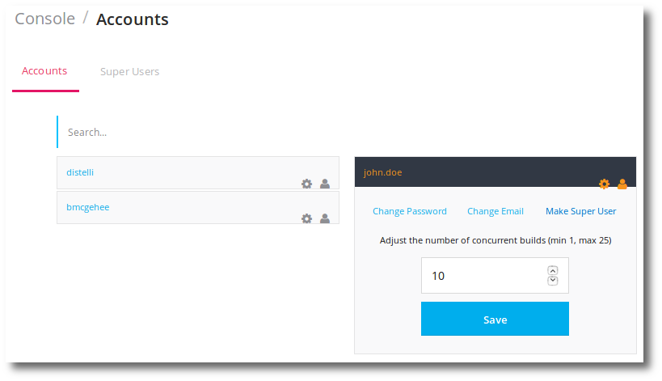

</ol>

<h2>Enable LDAP</h2>

Before enabling LDAP, login to Pipelines with the super user from the previous section <b>Create a Super User</b>.

Navigate to the Enterprise console LDAP Configuration page.

Check the <b>[x] Enable LDAP Configuration</b>.

Pipelines will validate whether the current super user, that is attempting to enable LDAP, can login to LDAP before allowing LDAP to be enabled.

**Warning:** After successfully activating LDAP, DO NOT leave this page. There are some tests to be done first to ensure things are working and you won't get locked out.

In a new browser window, not tab, but a full new browser session open Pipelines. This can be easily accomplished by using a Chrome icognito browser session. Do not do this with the browser you currently have open to the LDAP page. You may want to go to another computer.

Attempt to login to Pipelines with your super user LDAP samAccountName and LDAP password.

If this is successful, congratulations. You are ready to have your users login to Pipelines with LDAP. Remember:

<ul>
  <li>Users who do not belong to an LDAP group that is mapped to a Pipelines group will be denied access to Pipelines.</li>
  <li>Users whose LDAP account is in a state of "User must change password at next log on" cannot login to Pipelines.</li>
  <li>If an LDAP user attempts to log in and their email already exists for a Pipelines user but the LDAP user samAccountName doesn't match that Pipelines user username, the user will be denied access.</li>
  <li>If an LDAP users samAccountName already exists as a Pipelines username and the Pipelines email is not the same as the LDAP users mail, the user will be denied access.</li>
  <li>LDAP users that are disabled will be denied access to Pipelines.</li>
</ul>

In all the situations above, the user will be appropriately messaged so action can be taken.

A Pipelines super user can resolve email conflicts.

## GCP OAuth

When running Pipelines on premises, certain OAUTH services require an OAUTH application for clients (users) to authenticate against.

To accomodate this, Pipelines asks that you login to the service and create an OAUTH application for this usage.

<h3>Creating a GCP OAUTH Application</h3>

<ol>
<li>Login to <a href="cloud.google.com">Google Cloud</a>. Realize that you want to use a google account that will not leave your organization.</li>
<li>Go to the <b>Console</b>, at the top right.</li>
<li>Ensure you are on the <b>Dashboard</b> on the left.</li>
<li>Under the section titled <b>Explore other services</b> click the <b>Enable APIs and get credentials like keys</b>.</li>

This should take you to <a href="https://console.cloud.google.com/apis/library">https://console.cloud.google.com/apis/library</a>

<li>Click <b>Compute Engine API</b>.</li>
<li>Click <b>Credentials</b> on the left.</li>
<li>Click <b>Create Credentials</b>.</li>
<li>Click <b>Oauth client ID</b> from the drop down list.</li>
<li>Enter the following:</li>

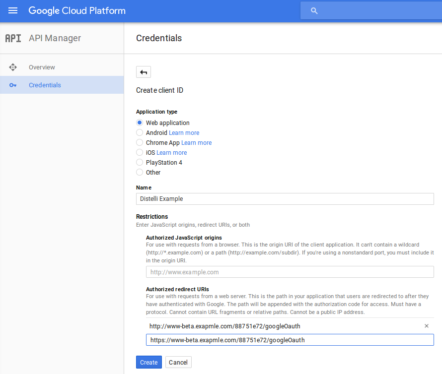

<b>Notes about the above entries:</b>
<ul>
<li>You can see that this is a <b>Web application</b>.</li>
<li>The name <b>Pipelines Example</b> can be any name you wish. This will be shown to your users when they OAUTH their GCP account to Pipelines.</li>
<li>Finally, you must set the <b>Authorized redirect URIs</b>. This will always be:</li>

<code>
PROTOCOL://URL_TO_DISTELLI_web UI/88751e72/googleOauth
</code>

If you are using HTTP and HTTPS, ensure you include both.

</ul>

<li>Click <b>Create</b>.</li>

You will be shown your OAUTH <b>Client ID</b> and <b>Client secret</b>. Copy these to enter in the console in Pipelines next.

<li>Login to your instance of Pipelines as a Super User.</li>
<li>Navigate to the Console.</li>
<li>Click <b>Enterprise</b> link at top.</li>
<li>Select <b>Integrations</b> tab.</li>
<li>Scroll down to <b>Google</b> and enter the <b>Client ID</b> and <b>Client secret</b>.</li>

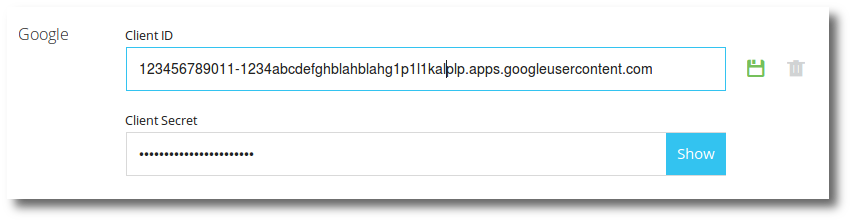

<li>Click the <b>Save</b> icon on the right to save your settings.</li>
</ol>

<h3>Validate</h3>

To validate, connect a Pipelines user to GCP.

<ol>
<li>Have a user who has a GCP account, login to Pipelines.</li>
<li>Click the <b>Gear</b> at the top right.</li>
<li>Click the <b>Integrations</b> link on the left.</li>
<li>Click the <b>Google Cloud</b> icon.</li>
<li>Click the <b>Connect Google Cloud Platform</b> button.</li>

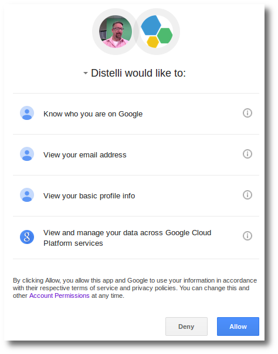

<li>Click the <b>Allow</b> button.</li>
</ol>

Your users are successfully connecting their GCP account with your installation if Pipelines on premises.

**Note:** If you change the GCP application Auth ID/Secret in the console, your users will have to re-auth their GCP accounts.

## Slack OAuth

When running Pipelines on premises, certain OAUTH services require an OAUTH application for clients (users) to authenticate against.

To accomodate this, Pipelines asks that you login to the service and create an OAUTH application for this usage.

<h3>Creating a Slack OAUTH Application</h3>

<ol>
<li>Login to <a href="http://slack.com">slack.com</a>.</li>
<li>Go to the <b>Team</b> you wish to own the Slack Application.</li>
<li>Click the <b>drop down</b> from the top left of Slack.</li>

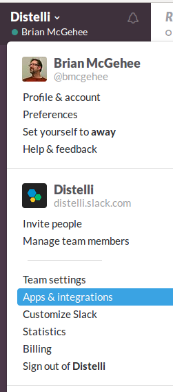

<li>Select <b>Apps & integrations</b> from the drop down.</li>

This will take you to the Slack App Directory.

<li>Click the <b>Build</b> link at the top right.</li>
<li>Click the <b>Get Started with Slack Apps</b> button.</li>
<li>Click the <b>Your Apps</b> link at the top right.</li>
<li>Click the <b>Create App</b> button.</li>
<li>Set the options similar to below.</li>

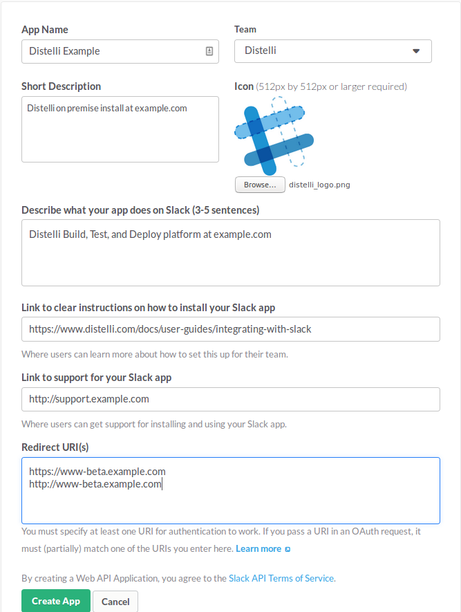

Notes about the above entries:
<ul>
<li>The <b>App Name</b> will be the name your users see when authorizing the slack OAUTH.</li>
<li>The <b>Team</b> is the team you wish to own this application.</li>
<li>You can use the following graphic for the <b>Icon</b>.</li>

<li>You can find instructions on how to install your Slack app <a href="./integrate-slack.html">here</a>.</li>

<li>Set the <b>Link to support for your Slack app</b> as appropriate for your organization.</li>
<li>The <b>Redirect URI(s)</b> are critical.</li>
</ul>

<li>Click the <b>Create App</b> button.</li>

After your app is created you will find yourself at the App page in Slack.

<li>Click the <b>App Credentials</b> link on the left.</li>

You will be shown your OAUTH <b>Client ID</b> and <b>Client secret</b>. Copy these to enter in the console in Pipelines next.

<h3>Validate</h3>

To validate, connect a Pipelines user to Slack.

<ol>
<li>Hava a user who is a member of a Slack team, login to Pipelines.</li>
<li>Click the <b>Gear</b> at the top right.</li>
<li>Click the <b>Integrations</b> link on the left.</li>
<li>Click the <b>Slack</b> icon.</li>
<li>Click the <b>Add to Slack</b> button.</li>

You may be prompted to choose your team if you are a member of more than one. Choose the one you wish to integrate with Pipelines.

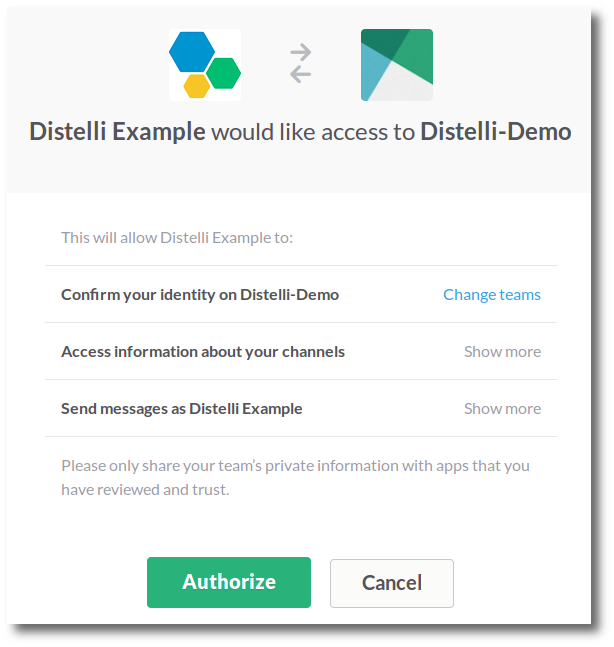

<li>Click the <b>Authorize</b> button to authorize.</li>

Your users are successfully connecting their Slack team with your installation if Pipelines on premises.

**Caution:** If you change the Slack application Auth ID/Secret in the console, your users will have to re-auth their Slack accounts.

