Application groups (app groups) allow you to build a grouping of dependent applications and create a specific snapshot of the app group for executing coordinated deployments.

## Application groups

The image below depicts the applications and dependencies in a small app group named <b>Full_Stack</b>.

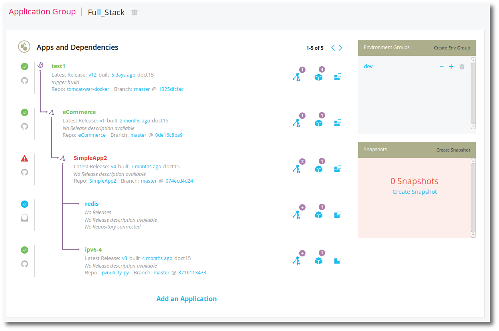

In the above image you can interpret:

* Applications <b>ipv6-4</b> and <b>redis</b> (at bottom) are dependencies of <b>SimpleApp2</b>
* Application <b>SimpleApp2</b> is a dependency of <b>eCommerce</b>
* Application <b>eCommerce</b> is a dependency of <b>test1</b>

From this view you can also see:

* Application <b>SimpleApp2</b> last build failed
* Application <b>redis</b> has never had a successful build or release

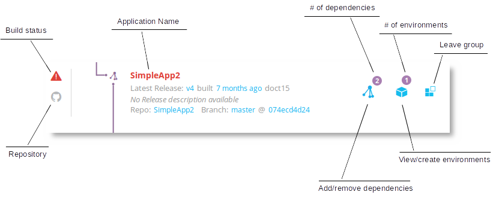

## Creating an application group

> **Note:** You must have at least two applications set up before you can create an application group. 

To create an app group:

<ol>
<li>Navigate to applications by clicking the <b>Applications</b> link at the top of the page.</li>
<li>On the right, in the Applications Groups box, click <b>Create Group</b> link.</li>

A dialog box will open from the right.

<li>Enter an app group name.</li>
<li>Click <b>Create Application Group</b> button.</li>
</ol>

You have created an app group.

## Managing an application group

Application groups (app groups) allow you to build a grouping of dependent applications, and create a specific snapshot of the app group for executing coordinated deployments.

### Adding an application to an app group

<ol>
<li>To add applications to an app group, click <b>Add an Application</b> while viewing the app group.</li>

<li>You will be presented with a dialog box, where you can select all the applications you want to include in this app group. Select them now.</li>

<li>When you are done, click <b>Add Application</b>.</li>
</ol>

### Removing an application from an app group

<ol>
<li>To remove an application from an app group, click the <b>Remove from Group</b> icon.</li>

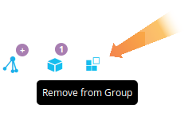

<li>Then click <b>Leave Group</b>.</li>
</ol>

### Adding app group dependencies

<ol>
<li>To add a dependency of an application, click the <b>dependency tree icon</b> on the application you wish to add the dependency to.</li>

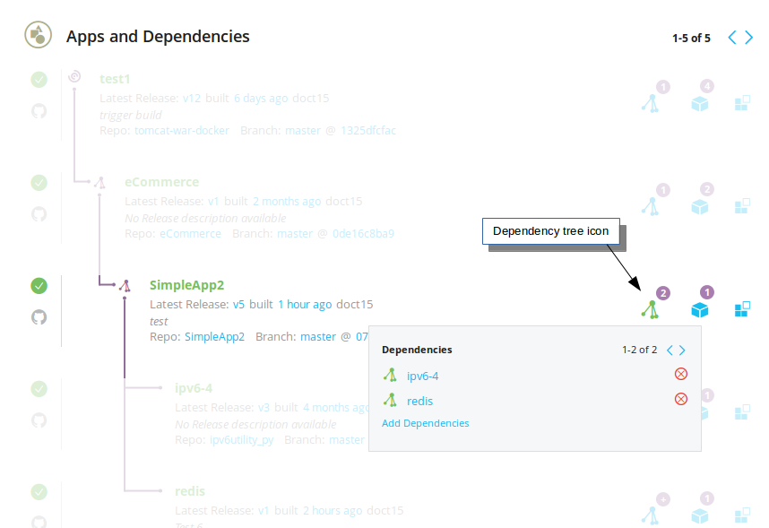

<li>Next, click <b>Add Dependencies</b>.</li>

You will be provided with a list of app group applications that are valid as a dependency of this application. 

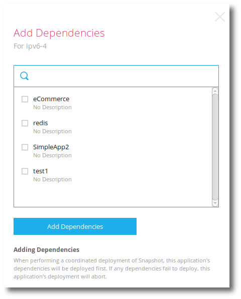

<li>Check the apps you wish to be a dependency of this application.</li>
<li>Click <b>Add Dependencies</b> to choose your dependency/dependencies.</li>
</ol>

### Removing app group dependencies

<ol>
<li>To remove an app group dependency, click the <b>Dependencies</b> icon on the application you wish to remove a dependency from.</li>
<li>Click the <b>Red X</b> to remove a dependency.</li>
</ol>

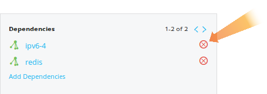

## Environment groups

Each application in an app group may have 0 or more <a href="./environment.html">application environments</a> for doing deployments. An environment group is a grouping of application environments for enabling coordinated deployments of snapshots.

Here is an environment group called <b>dev</b>.

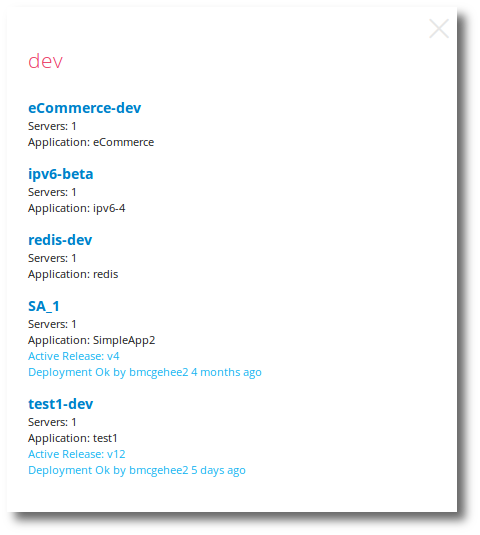

## Create an environment group

<ol>
<li>Navigate to the app group you wish to create an environment group for.</li>
<li>In the Environment Groups box click the <b>Create Env Group</b> link.</li>

A dialog box will open on the right.

<li>Enter a name for the environment group.</li>
<li>Click <b>Create Environment Group</b>.</li>
</ol>

You have created an environment group.

## Delete an environment group

To delete an environment group, click the trash can icon.

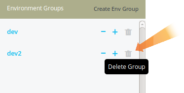

## Managing an environment group

An environment groups is a grouping of enviornments to facilitate a coordintated deploy of an app group.

After creating an environment group, you will need to manage the application environments that make up the environment group.

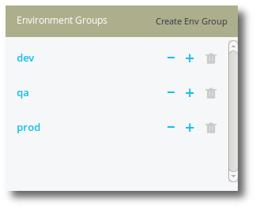

### Adding an environment to an environment group

<ol>
<li>To add an environment to an environment group, click the <b>Add Environment + icon</b>.</li>

You will be provided with a list of available environments to add to the environment group.

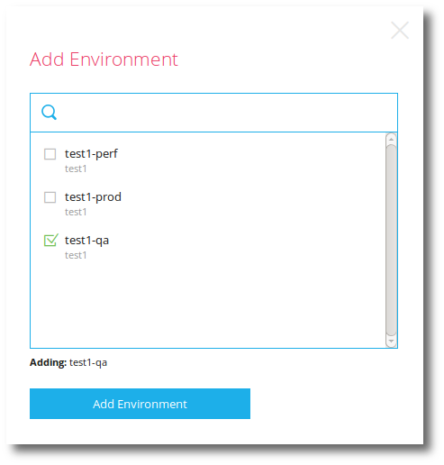

<li>Select the application environments you wish to add to this environment group.</li>
<li>Click <b>Add Environment</b>.</li>
</ol>

You have added environment(s) to your environment group.

### Removing an environment from an environment group

<ol>
<li>To remove an environment from an environment group, click the <b>Remove Environment</b> icon.</li>

You will be provided with a list of existing environments to remove from the environment group.

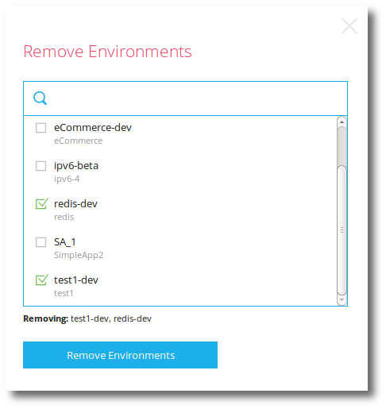

<li>Select the application environments you wish to remove from this environment group.</li>
<li>Click <b>Remove Environments</b>.</li>
</ol>

## Application group snapshots

An application group snapshot is a "point in time" snapshot of the applications that make up an app group, and the specific release (version) of each application that makes up this snapshot. Snapshots are immutable: they last forever and can not be deleted. 

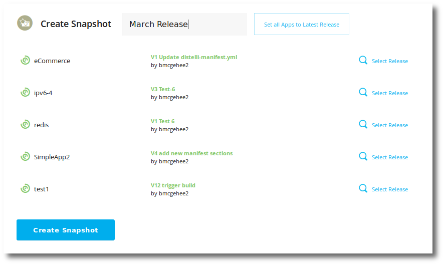

This snapshot represents a <b>March Release</b> consisting of the following five dependent applications:

* eCommerce release v1
* ipv6-4 release v3
* redis release v1
* SimpleApp2 releease v4
* test1 release v12

You can do a coordinated deploy of app group snapshots.

## Create a snapshot

To create a snapshot:

> **Note:** You must have at least one application in your app group, and the application must have at least one prior release. 

<ol>
<li>Navigate to the application group you wish to snapshot.</li>
<li>In the Snapshot box, click <b>Create Snapshot</b> link.</li>

Select the release version for each dependent applications in the application group.

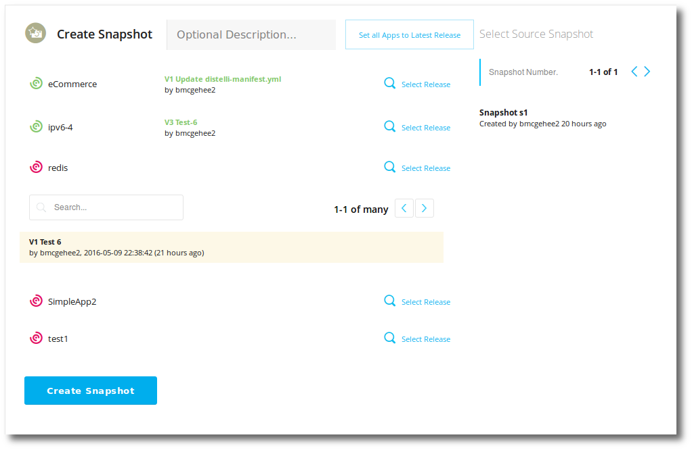

<b>Optional Description</b> - This description is key to helping you identify the release. Enter a useful description representing this snapshot. (i.e. April Release).

<b>Set all Apps to Latest Release</b> - Clicking this button will set all the app group applications snapshot release to their latest release version, for this snapshot.

<b>Select Source Snapshot</b> - This section, on the right, will allow you to select an existing snapshot to populate the applications release versions.

<li>For each application, click <b>Select Release</b> and choose the release version for this snapshot.</li>

<li>Click <b>Create Snapshot</b> when you are done.</li>
</ol>

You have created a snapshot.

## Deploying a snapshot

A deploy of an application group snapshot is also known as a coordinated deploy. The app group applications are deployed in a hierarchical method that ensures dependencies are deployed in order of dependency.

To deploy a snapshot:

> **Note:** You must have created an app group snapshot, and have an app group environment group to deploy to, before you can deploy a snapshot. 

<ol>
<li>Navigate to the application group you wish to deploy a snapshot of.</li>
<li>In the list of snapshots, locate the snapshot you wish to deploy and click the <b>rocket icon</b> to the right.</li>
<li>Select the <b>app group environment group</b> that you wish to deploy the snapshot to.</li>
<li>Click the <b>Go to Overview</b> button.</li>

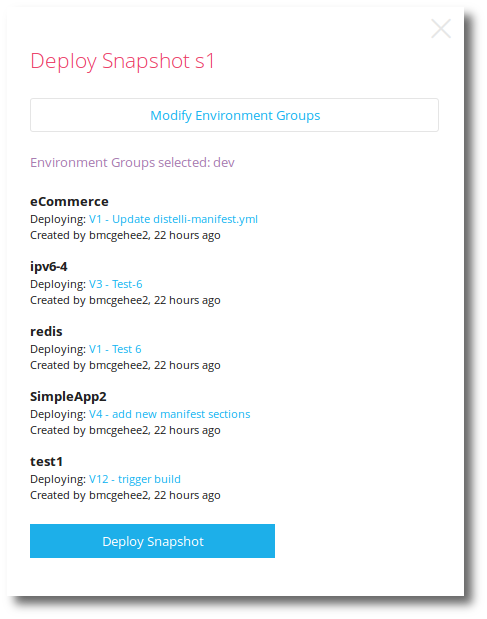

If you'd like to edit the environment groups chosen, click <b>Modify Environment Groups</b>.

<li>When you are ready to begin the deploy, click the <b>Deploy Snapshot</b> button.</li>

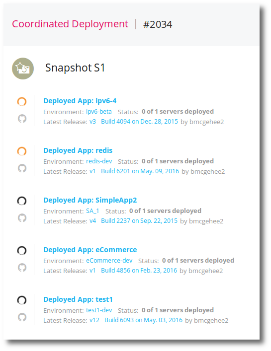

From the above page, you can monitor the app group deployments.

</ol>
