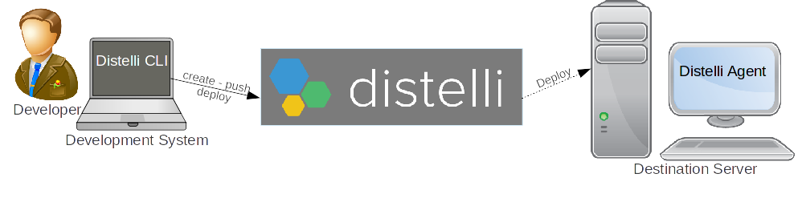

In this tutorial we will discuss deploying PHP web content that will be served via NGINX running on an Ubuntu server. These steps have been validated on Ubuntu 14 and 15*.

This scenario assumes the following:
* You want to deploy a PHP application
* The PHP application will use NGINX to serve content
* If the PHP application uses a database, the database already exists and is up and running
* The server(s) hosting the application are Ubuntu 14 (if using Ubuntu 15 see [last section](php-w-nginx-on-ubuntu.html#ubuntu-15)
* The server(s) will need PHP and NGINX installed and configured on deploy

We will start by setting up the application directory where we will stage the needed files for deployment. This will be done on what we will call your development system. To communicate with the Pipelines SaaS this system will need the Pipelines CLI installed. You can view the installation instructions here [Installing the CLI](./cli.html). Please install the CLI now.

Next, to get things started, you will do a `git clone` of a Pipelines public GitHub repository. If you do not have git you can find installation instructions here <a href="http://git-scm.com/downloads" target="_blank">Download git</a>.
Use the following command:

~~~
git clone https://github.com/Distelli/PHPNGINXUbuntu.git

~~~

In the last step a subdirectory called PHPNGINXUbuntu was created. Change (**cd**) to that directory now and take a look at the contents. We will discuss this further.

~~~
cd PHPNGINXUbuntu

~~~

<h3>Steps to Deploy</h3>

These are the steps that must be taken on a bare-bones Ubuntu server to successfully deploy a PHP application on NGINX. In other words, if one were to manually walk through the install and setup, this is what must be accomplished. [**Do not do these steps, these are for discussion.**]

<ol>
<li>Update the Ubuntu repository to ensure it has the latest index: <code>sudo apt-get -y update</code></li>
<li>Install PHP: <code>sudo apt-get -y php5-fpm</code></li>
<li>Configure PHP: Edit /etc/php5/fpm/php.ini and add cgi.fix_pathinfo=0</li>
<li>Install NGINX: <code>sudo apt-get -y nginx</code></li>
<li>Configure NGINX: Edit /etc/nginx/sites-available/default and add the following</li>

<code>
location ~ \\.php$ {
fastcgi_split_path_info ^(.+\\.php)(/.+)$;
# NOTE: You should have \cgi.fix_pathinfo = 0;\ in php.ini
# With php5-fpm:
fastcgi_pass unix:/var/run/php5-fpm.sock;
fastcgi_index index.php;
include fastcgi_params;
#Unremark the following for Ubuntu15
#include fastcgi.conf;
}

</code>

<li>Link content to correct directory <code>sudo ln -sf /$DISTELLI_APPHOME/webapp/ /usr/share/nginx/html/</code></li>
<li>Restart PHP and NGINX: <code>sudo service php5-fpm restart</code> and <code>sudo service nginx restart</code></li>
</ol>

Following the above steps an Ubuntu server will be prepared to serve .php files from the `/usr/share/nginx/html` directory.

You can accomplish the above steps, during a Pipelines for Applications deployment, by using the correct syntax in your `distelli-manifest.yml` file.

<h3>Pipelines Manifest</h3>

When you cloned the repository earlier, you obtained a `distelli-manifest.yml` file. Take a look at the contents of that file by opening it in your favorite editor.

~~~
&lt;username&gt;/PHPNGINXUbuntu:

PkgInclude:
- configs/*
- webapp.php
- webapp/*

PkgExclude:
- README.md

PreInstall:
- echo "===Starting PreInstall==="
- echo "---Updating apt-get---"
- sudo apt-get -y update

- echo "---Install for php---"
- sudo apt-get -y install php5-fpm

- echo "---Install for NGINX---"
- sudo apt-get -y install nginx
- echo "=====Done with PreInstall======"

PostInstall:
- echo "===Begin PostInstall==="
- echo "---Updating /etc/php5/fpm/php.ini---"
- sudo cp /$DISTELLI_INSTALLHOME/configs/php.ini /etc/php5/fpm/php.ini

- echo "---Updating /etc/nginx/sites-available/default---"
- sudo cp /$DISTELLI_INSTALLHOME/configs/default /etc/nginx/sites-available/default

- echo "---linking to content---"
- sudo ln -sf /$DISTELLI_APPHOME/webapp/ /usr/share/nginx/html/
- sudo ln -sf /$DISTELLI_APPHOME/webapp.php /usr/share/nginx/html/
- echo "=====Done with PostInstall======"

Start:
- echo "===Begin Start==="
- echo "---restarting php---"
- sudo service php5-fpm restart

- echo "---restarting nginx---"
- sudo service nginx restart
- echo "=====Done with Start======"

~~~

Lets take a deeper look at what each of the steps is doing in the manifest.

<h3>Stepping through the distelli-manifest.yml</h3>

<h3>The First Line</h3>

Every distelli-manifest.yml must have the following information on the first line. This is:

~~~
YOUR_DISTELLI_USERNAME/APPLICATION_NAME:

~~~

In the example distelli-manifest.yml you should find this on the first line:

~~~
&lt;username&gt;/PHPNGINXUbuntu:

~~~

Make sure you change the `&lt;username&gt;` to your Pipelines <b>username</b>.

<h3>PkgInclude</h3>

~~~
PkgInclude:
- configs/*
- webapp.php
- webapp/*

~~~

This section determines which files will be bundled on a `distelli push` and ultimately deployed in a `distelli deploy`.

`configs/*`
<ul>
<li>the configs files contain the various php and nginx file adjustments that must occur.</li>

</ul>
`webapp.php`
<ul>
<li>is a simple php application that can be served via nginx.</li>

</ul>
`webapp/*`
<ul>
<li>is an example to show how a user may want to put their php application files into a directory for deployment to the nginx server.</li>

</ul>

<h3>PkgExclude</h3>

~~~
PkgExclude:
- README.md

~~~

This section determines which files in the directory will be excluded from the bundle.

<h3>PreInstall</h3>

~~~
PreInstall:
- echo "===Starting PreInstall==="

~~~

The preinstall section occurs before the Install section. In this section one should prepare pre-requisites before installing the software.
Realize that during the Install phase, using this distelli-manifest.yml file, Pipelines will copy and unbundle only the PkgInclude files to the destination server.
<h3>Updating apt-get</h3>

~~~
- echo "---Updating apt-get---"
- sudo apt-get -y update

~~~

This command will use apt-get to install php5-fpm. This will install the PHP FastCGI Process Manager for serving dynamic web content.

Note the use of the -y switch! This option forces a “Yes” answer when the user would normally be prompted “Do you want to continue [Y/n]?” when using apt-get install. A `distelli deploy` will fail waiting for user input without this option.
<h3>Install for php</h3>

~~~
- echo "---Install for php---"
- sudo apt-get -y install php5-fpm

~~~

This command will use apt-get to install php5-fpm. This will install the PHP FastCGI Process Manager for serving dynamic web content.

Note the use of the -y switch! This option forces a “Yes” answer when the user would normally be prompted “Do you want to continue [Y/n]?” when using `apt-get install`. A `distelli deploy` will fail waiting for user input without this option.
<h3>Install for NGINX</h3>

~~~
- echo "---Install for NGINX---"
- sudo apt-get -y install nginx

~~~

This command will use apt-get to install nginx. nginx is an open source reverse proxy server for HTTP, HTTPS, SMTP, POP3, and IMAP protocols, as well as a load balancer, HTTP cache, and a web server.

<h3>PostInstall</h3>

~~~
PostInstall:
- echo "===Begin PostInstall==="

~~~

This section occurs after the install phase. As noted earlier, during the install, the bundled files are unbundled to the $DISTELLI_INSTALLHOME directory. These files are available in PostInstall.
<h3>Updating php.ini</h3>

~~~
- echo "---Updating /etc/php5/fpm/php.ini---"
- sudo cp /$DISTELLI_INSTALLHOME/configs/php.ini /etc/php5/fpm/php.ini

~~~

The deployed files are now available. We can copy our version of php.ini over the newly installed one on the server.
<h3>Updating sites-available/default</h3>

~~~
- echo "---Updating /etc/nginx/sites-available/default---"
- sudo cp /$DISTELLI_INSTALLHOME/configs/default /etc/nginx/sites-available/default

~~~

Here we copy the deployed version of the file <b>default</b> over the newly installed one.
<h3>Link to Content</h3>

~~~
- echo "---linking to content---"
- sudo ln -sf /$DISTELLI_APPHOME/webapp/ /usr/share/nginx/html/
- sudo ln -sf /$DISTELLI_APPHOME/webapp.php /usr/share/nginx/html/

~~~

In this step we link the php web content from the $DISTELLI_APPHOME directory to the nginx html directory. Now the content can be served.
Understanding this step is key to being able to deploy your own applications content. In the example provided, the content can be kept in the webapp directory or a directory of your choosing.

<h3>Start</h3>

~~~
Start:
- echo "===Begin Start==="

~~~

This section occurs after the PostInstall section. It also occurs on a Restart
<h3>Restart Services</h3>

~~~
- echo "---restarting php---"
- sudo service php5-fpm restart

- echo "---restarting nginx---"
- sudo service nginx restart

~~~

And finally we restart the services to pick up any configuration changes.

<h3>Preparing to Deploy</h3>

Now that you have an understanding of what is going to be done, let’s get ready to do your deploy using the example you cloned.

These steps assume you have already created your free Pipelines account at [http://pipelines.puppet.com/signup.](http://pipelines.puppet.com/signup).
<h3>Step 1. </h3>

Install the Pipelines Agent on the destination servers you are deploying to. Each server that you wish to deploy the application to will need the Pipelines agent installed. You can find instructions for installing the agent here.
<h3>Step 2. </h3>

On the computer where you cloned the example repository, above, edit the distelli-manifest.yml and change the &lt;username&gt; to your Pipelines username. For example, if your username is jdoe, then the first line in the distelli-manifest.yml should be:

~~~
jdoe/PHPNGINXUbuntu:

~~~

> **Note:** Pipelines username is not the same as the email you used to sign-up with.

<h3>Step 3. </h3>

On the computer where you cloned the example repository, ensure you have already installed the CLI. You can validate by doing a:

~~~
distelli version

~~~

If not, you can find instructions here [Installing the CLI](./cli.html).

<h3>Step 4. </h3>

In the same directory as the distelli-manifest.yml file, use `distelli create` to create the example application in your account on Pipelines, then `distelli push` the application. Replace &lt;username&gt; with your Pipelines username.

~~~
distelli create &lt;username&gt;/PHPNGINXUbuntu
distelli push -m “First Push”

~~~

You have created and pushed your first release of the application PHPNGINXUbuntu to your Pipelines account.
<h3>tep 5. </h3>

Create an application environment in the Pipelines web UI. If you have not done this before, here are summarized steps:
<ol>
<li>Login to Pipelines at pipelines.puppet.com/login</li>

<li>Click on the Application you just created in the last step <b>PHPNGINXUbuntu</b>.</li>

<li>Click the <b>Environments</b> link.</li>

<li>Click the <b>Create Environment</b> link.</li>

<li>Give the environment a unique name (i.e. NGINX_TEST) and then click <b>Create Environment</b>.</li>

</ol>
You have created an environment named NGINX_TEST. Stay on this UI page to continue.
<h3>Step 6. </h3>

Add servers to the environment.
Ensure you are viewing the newly created environment <b>NGINX_TEST</b> and:
<ol>
<li>Click the Servers link.</li>

<li>Click the Add Servers link.</li>

<li>Check the Add Server box for each server you want to deploy to.</li>

<li>Click the Add Selected Servers link.</li>

</ol>
The server(s) are now added to your environment. Stay on this page to continue.

<h3>Deploying the Application</h3>

<h3>Step 7.</h3>

Deploy the application.
<ol>
<li>From where you left off in Step 6 in the Pipelines web UI, looking at your environment NGINX_TEST, click the link <b>Overview</b>.</li>

<li>Click the top Green <b>Deploy</b> button. </li>

<li>In the resulting dialog box click the <b>Deploy</b> button.</li>

</ol>
You should now see deployment(s) to your server(s). From this screen you can watch the logs, which can be useful in troubleshooting.
FYI, you could have also initiated the deploy from the command line. In the directory where the `distelli-manifest.yml` file sits, enter the following command: (**Don’t do this if you already initialized the deploy using the web UI above**.)

~~~
distelli deploy -m “First deployment” --env NGINX_TEST

~~~

<h3>Validation</h3>

After the deployment(s) are done, you can validate the application is working on the destination deploy server by browsing to the server file:

~~~
http://SERVER_IP/webapp.php

~~~

or browsing to the directory

~~~
http://SERVER_IP/webapp/

~~~

If you’re really in a pinch and don’t have access via a browser you can use lynx, curl, wget, or telnet on the destination deployed server to validate the php page is being served.
Try one of the following:

~~~
lynx http://127.0.0.1/webapp/
curl -sSL http://127.0.0.1/webapp/
wget -qO- http://127.0.0.1/webapp/

telnet 127.0.0.1 80
Trying 127.0.0.1…
Connected to 127.0.0.1.
Escape character is '^]'.
GET http://127.0.0.1/webapp/ HTTP/1.0

~~~

<h3>Ubuntu 15</h3>

If you are using Ubuntu 15, there is one line that will need to be unremarked. Check in:

~~~
/etc/nginx/sites-available/default

~~~

and look for this:

~~~
#Unremark the following for Ubuntu15
#include fastcgi.conf;

~~~

And unremark the line like this:

~~~
#Unremark the following for Ubuntu15
include fastcgi.conf;

~~~

