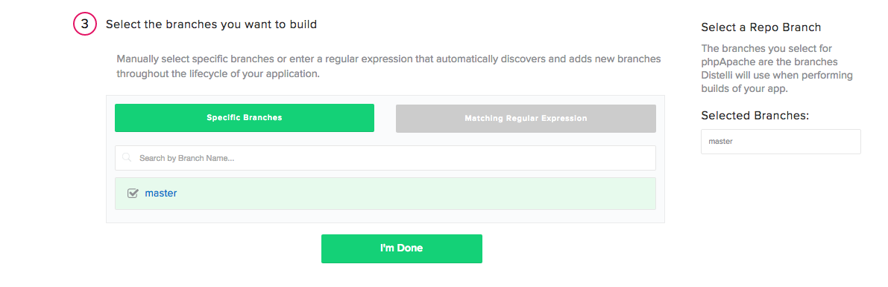

 

In this, we will tutorial will walk through creating an automated unit test for your Python application. We will take an existing Flask application and test its output.

## Before You Begin

Before beginning this tutorial, you should have a Python application created. You may also find it helpful to read up on testing in Python and the different types of testing you can do, <a href="https://docs.python.org/2/library/unittest.html" target="_blank">here</a>. This tutorial will cover a basic test on a "Hello World" Python application.

Below is the code for a simple "Hello World" Flask application, in the file `simpleapp.py`:

~~~
from flask import Flask
import sys
import optparse
import time

app = Flask(__name__)

start = int(round(time.time()))

@app.route("/")
def hello_world():

    return "Hello World from Pipelines!"

if __name__ == '__main__':
    parser = optparse.OptionParser(usage="python simpleapp.py -p <port>")
    parser.add_option('-p', '--port', action='store', dest='port', help='The port to listen on.')
    (args, _) = parser.parse_args()
    if args.port == None:
        print "Missing required argument: -p/--port"
        sys.exit(1)
    app.run(host='0.0.0.0', port=int(args.port), debug=False)
~~~

## Step 1. Create the Test Suite

To create a test suite, we use a `test.py` file to define what we are testing. Below is the full `test.py` we will be using for this tutorial:

~~~
import unittest
from simpleapp import hello_world

class HelloWorldTestCase(unittest.TestCase):
    """Tests for `simpleapp.py`."""

    def test_is_output_hw(self):
        """Is the output of your Python Application what you expect?"""
        self.assertTrue(hello_world() == "Hello World from Pipelines!")

if __name__ == '__main__':
    unittest.main()
~~~

We first define our testing framework and import the `hello_world()` function from `simpleapp.py`.

~~~
import unittest
from simpleapp import hello_world
~~~

We then define what we will test. For this tutorial, we will test to make sure the `hello_world()` function outputs what I am expecting.

~~~
class HelloWorldTestCase(unittest.TestCase):
    """Tests for `simpleapp.py`."""

    def test_is_output_hw(self):
        """Is the output of your Python Application what you expect?"""
        self.assertTrue(hello_world() == "Hello World from Pipelines!")

if __name__ == '__main__':
    unittest.main()
~~~

## Step 2. Test Locally

Before we push our application into Pipelines, we should test locally to make sure everything works as expected. Open your terminal and navigate to the folder containing your project's files.

First let's run the test with the following command:

~~~
$ python test.py
~~~

You should see an output similar to this:

~~~
.
----------------------------------------------------------------------
Ran 1 test in 0.000s

OK
~~~

Now we are going to change what we are outputing the output of our `simpleapp.py`. For Example:

~~~
def hello_world():

    return "Hi World from Pipelines!"
~~~

Run your test again and you should see an output similar to the one below:

~~~
F
======================================================================
FAIL: test_is_output_hw (__main__.HelloWorldTestCase)
Is the output of your Python Application what you expect?
----------------------------------------------------------------------
Traceback (most recent call last):
  File "test.py", line 11, in test_is_output_hw
    self.assertTrue(hello_world() == "Hello World from Pipelines!")
AssertionError: False is not true

----------------------------------------------------------------------
Ran 1 test in 0.000s

FAILED (failures=1)
~~~

Now undo the change to `simpleapp.py` so that it will pass the test we just wrote and we are ready to push the files into a repository!

## Step 3. Push the Code to Your Repository

The easiest way to build and deploy your application with Pipelines you will have to store your applications files in a source control repository. Create a repository in either GitHub or BitBucket, push your application's files, and then you are ready to connect your application to Pipelines!

## Step 4. Create Your Pipelines Application

If you do not have a Pipelines account, [sign up](https://pipelines.puppet.com/signup) for one now. To create your app in Pipelines, follow these steps:

Click the new application button on your Pipelines account home screen

Name your app and select the repository where you are storing your application's files.

After connecting to our repository, select the appropriate repository that contains your code.

Select the appropriate branch for your deployment. I have only a master branch, but you can deploy any branch from your repo!

### Build Steps

Next Pipelines will ask you set your build steps. This is where we will add the steps for Pipelines to build and test our application. You can see the steps in the below screen shot. We are updating our server, installing python and a virtual environment, installing our application dependencies, and then finally running our test.

#### Build
~~~
sudo apt-get update
sudo apt-get install python -y
sudo apt-get install python-pip -y
sudo apt-get install python-virtualenv -y
virtualenv pythonEnv
source pythonEnv/bin/activate
pip install -r requirements.txt
python test.py
~~~

#### PkgInclude
~~~
*
~~~

### Build

The final step is select our Build Image. In this case we are going to select "Pipelines Python (Docker)" for our Python Application. Select the "Auto Build" checkbox and the the "Looks good. Start Build!".

> **Warning:** The Auto-Build feature builds your application everytime you commit code to your repository

Now our application should be automatically building. You can watch its progress by navigating to the builds tab on your Pipelines account and clicking on your build.

## Step 5. Run Tests

While our application is automatically building we can navigate to our <b>Builds page</b>, select our build, and watch its progress. When the application is done building your screen should look similar to the one below:

Now let's repeat the process we did earlier to see what happens when a test fails. Change the output string of the `hello_world()` function in the `simpleapp.py` so that it will fail our unittest. Once you are done, commit and push your new code into your repository. After your push, Pipelines starts an automatic build of your new application.

As you can see, our `unittest` failed and in turn Pipelines failed the build of your application and didn't create a new release of your application. Try to run some of your own tests on this application or a different application and let us know the results!

