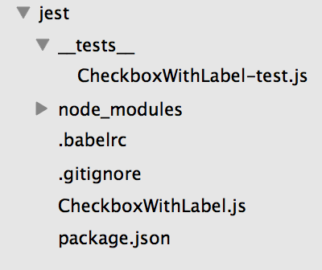
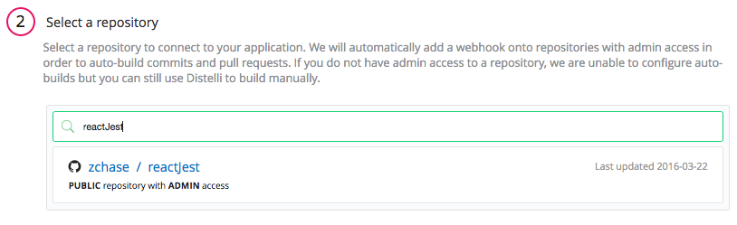
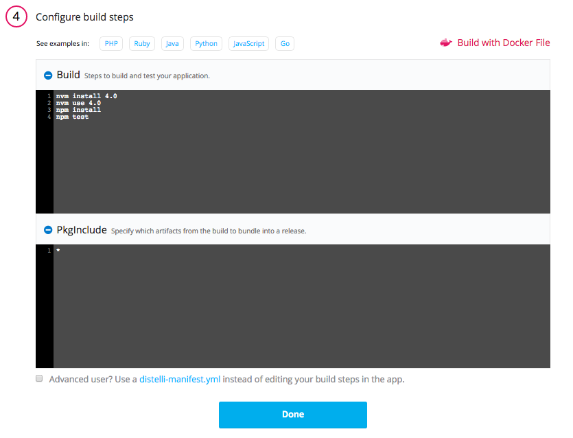
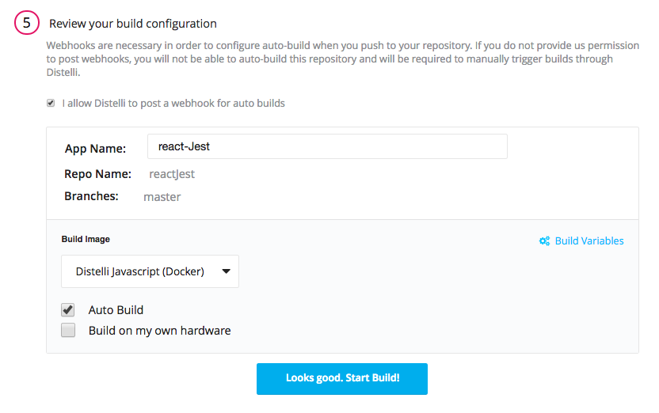
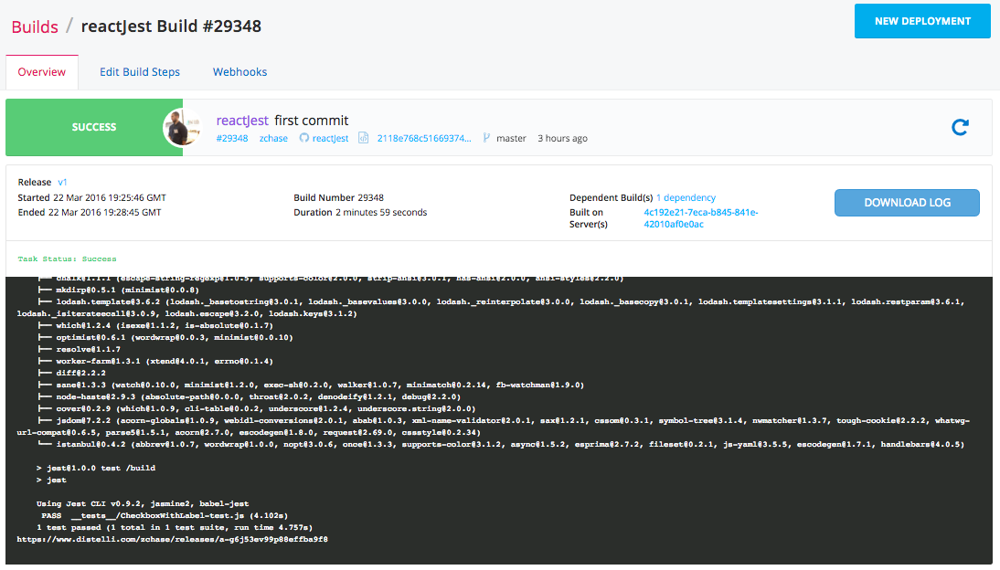
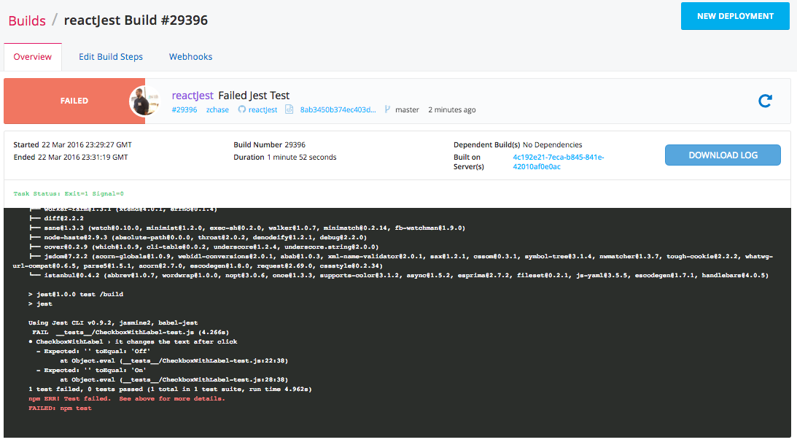

 

In this tutorial we will walk through how to create automated tests for your React Components with Jest. By the completion of this tutorial we will have created a React checkbox component, and a test to ensure the label of our checkbox changes when clicked. This tutorial uses the example from Jest's Documentation for <a href="https://facebook.github.io/jest/docs/tutorial-react.html" target="_blank">Testing React Components</a>. We will walk through how to implement this testing framework in Pipelines.

## Prerequisites

There are no prerequisites needed to complete this tutorial. All application dependencies and tools will be installed during the tutorial.

## Step 1. Create Your Project

On your local machine, you will need to create your project. Create the directory where you would like to store your project's files. My directory is called `jest` but feel free to name your project otherwise. Below is the structure of our project:

Create all the files and folders in your project so they match what is above. To create your `package.json` file, run the command `npm init` in your project's directory. You can ignore the `node_modules/` folder, as this will be automatically generated when we run our `npm install` command later.

## Step 2. Create your Component and Tests

Now that we have our project all set up, we can now create our component and the tests for our component. As a reminder this tutorial follows Jest's Documentation for <a href="https://facebook.github.io/jest/docs/tutorial-react.html" target="_blank">Testing React Components</a>.

### CheckboxWithLabel.js

~~~
// CheckboxWithLabel.js
'use strict';

import React from 'react';

export default class CheckboxWithLabel extends React.Component {

  constructor(props) {
    super(props);
    this.state = {isChecked: false};

    // bind manually because React class components don't auto-bind
    // http://facebook.github.io/react/blog/2015/01/27/react-v0.13.0-beta-1.html#autobinding
    this.onChange = this.onChange.bind(this);
  }

  onChange() {
    this.setState({isChecked: !this.state.isChecked});
  }

  render() {
    return (
      &lt;label&gt;
        &lt;input
          type="checkbox"
          checked={this.state.isChecked}
          onChange={this.onChange}
        /&gt;
        {this.state.isChecked ? this.props.labelOn : this.props.labelOff}
      &lt;/label&gt;
    );
  }
}
~~~

### __tests__/CheckboxWithLabel-test.js

~~~
// __tests__/CheckboxWithLabel-test.js
'use strict';

jest.unmock('../CheckboxWithLabel');

import React from 'react';
import ReactDOM from 'react-dom';
import TestUtils from 'react-addons-test-utils';
import CheckboxWithLabel from '../CheckboxWithLabel';

describe('CheckboxWithLabel', () => {

  it('changes the text after click', () => {
    // Render a checkbox with label in the document
    const checkbox = TestUtils.renderIntoDocument(
      <CheckboxWithLabel labelOn="On" labelOff="Off" />
    );

    const checkboxNode = ReactDOM.findDOMNode(checkbox);

    // Verify that it's Off by default
    expect(checkboxNode.textContent).toEqual('Off');

    // Simulate a click and verify that it is now On
    TestUtils.Simulate.change(
      TestUtils.findRenderedDOMComponentWithTag(checkbox, 'input')
    );
    expect(checkboxNode.textContent).toEqual('On');
  });

});
~~~

### package.json

~~~
{
  "name": "jest",
  "version": "1.0.0",
  "description": "",
  "main": "CheckboxWithLabels.js",
 "dependencies": {
   "react": "~0.14.0",
   "react-dom": "~0.14.0"
 },
 "devDependencies": {
   "babel-jest": "^9.0.0",
   "babel-preset-es2015": "*",
   "babel-preset-react": "*",
   "jest-cli": "*",
   "react-addons-test-utils": "~0.14.0"
 },
 "scripts": {
   "test": "jest"
 },
 "jest": {
   "unmockedModulePathPatterns": [
     "<rootDir>/node_modules/react",
     "<rootDir>/node_modules/react-dom",
     "<rootDir>/node_modules/react-addons-test-utils"
   ]
 },
  "repository": {
    "type": "git",
    "url": ""
  },
  "author": "",
  "license": "ISC",
  "bugs": {
    "url": ""
  },
  "homepage": ""
}
~~~

### .babelrc

~~~
// .babelrc
{
  "presets": ["es2015", "react"]
}
~~~

## Step 3. Run your Test

To ensure that everything has been set up correctly, we will run our newly created test on our local machine. To do some open your terminal and navigate to your project's directory. Run the following command:

~~~
npm install
~~~

This will install your application's `dependencies` and its `devdependencies` in one step. As soon as `npm install` has finished you are ready to run your test. Enter the following command in your terminal:

~~~
npm test
~~~

Once completed your terminal will output:

~~~
> jest@1.0.0 test /Users/zack/ws/src/jest
> jest

Using Jest CLI v0.9.2, jasmine2, babel-jest
 PASS  __tests__/CheckboxWithLabel-test.js (0.869s)
1 test passed (1 total in 1 test suite, run time 1.973s)
~~~

### Change Component

Now let's make a change to our component and see what happens during our test. Our test checks to see if the label of our checkbox component changes when clicked. To ensure the test will fail remove `{this.state.isChecked ? this.props.labelOn : this.props.labelOff}` from your component. Then run your test with `npm test`. Your output will be:

~~~
> jest@1.0.0 test /Users/zack/ws/src/jest
> jest

Using Jest CLI v0.9.2, jasmine2, babel-jest
 FAIL  __tests__/CheckboxWithLabel-test.js (6.436s)
● CheckboxWithLabel › it changes the text after click
  - Expected: '' toEqual: 'Off'
        at Object.eval (__tests__/CheckboxWithLabel-test.js:22:38)
  - Expected: '' toEqual: 'On'
        at Object.eval (__tests__/CheckboxWithLabel-test.js:28:38)
1 test failed, 0 tests passed (1 total in 1 test suite, run time 7.546s)
npm ERR! Test failed.  See above for more details.
~~~

Because we removed the label from our checkbox the test fails. Now put the label back on our checkbox component and we are ready to set up our test in Pipelines.

## Step 4. Push to Repository

Before we can add our application into Pipelines, we need to push our application's file into a source control repository. You can use either [GitHub](https://github.com/) or [BitBucket](https://bitbucket.org/). I am using a GitHub repository for this specific tutorial.

Once you have create a repository and pushed your files, we can create a Pipelines application and define our build steps.

## Step 5. Create Application in Pipelines

If you do not have a Pipelines account, [sign up](https://pipelines.puppet.com/signup) for one now. To create your app, follow these steps:

Click the new application button on your Pipelines account home screen

Name your app and select the repository where you are storing your application's files.

After connecting to our repository, select the appropriate repository that contains your code.

Select the appropriate branch for your deployment. I have only a master branch, but you can deploy any branch from your repo!

### Build Steps

Next Pipelines will ask you set your build steps. This is where we will add the steps for Pipelines to build and test our application. You can see the steps in the below screen shot. We are updating our server, installing python and a virtual environment, installing our application dependencies, and then finally running our test.

#### Build
~~~
nvm install 4.0
nvm use 4.0
npm install
npm test
~~~

#### PkgInclude
~~~
*
~~~

### Build

The final step is select our Build Image. In this case we are going to select "Pipelines Javascript (Docker)". Each Pipelines image was different tolls pre-installed to help speed up the build process. Select the "Auto Build" checkbox and the the "Looks good. Start Build!".

> **Warning:** The Auto-Build feature builds your application every time you commit code to your repository

Now our application should be automatically building. You can watch its progress by navigating to the builds tab on your Pipelines account and clicking on your build.

## Step 6. Build & Deploy

Once you're on your Builds page, you should see the code you just pushed to your repository is already building in Pipelines! Isn't that convenient? While your building, let's take a look at the log. You should see something very similar to the tests we ran locally:

Next let's make the same change we made our application earlier. Remove the label from your checkbox component, save your changes, then commit your changes to your repository. A build will kick off in Pipelines, which you can view from your <b>Builds</b> tab.

Because the Jest test failed, the build fails within Pipelines. This help ensures that only code that outputs what we are expecting is successfully built and ready to deploy.

