 

This tutorial will get you setup and deploying a simple Rust & Nickel.rs application with Pipelines in minutes.
The tutorial assumes you have already:

* [Created a Pipelines account](https://pipelines.puppet.com/signup)
* Have a [GitHub](https://www.github.com) or [BitBucket](https://bitbucket.org/) Account

## Set-Up

For this tutorial we will be using a basic "Hello World" Rust & Nickel.rs app, but you can use your own custom application if you like. To start you are going to need to open your terminal and navigate to the folder where you would like to store your files. Next we will install <b>Nickel.rs</b> if you haven't already:

~~~
$ curl -s https://static.rust-lang.org/rustup.sh | sudo sh
~~~

The command above will install the latest version of Rust and Cargo on your machine. You will need both of these to run your Nickel.rs application locally.

Next, create a new a project with Nickel:

~~~
$ cargo new hello-world --bin && cd nickel-demo
~~~

Now that we have everything all set up we can start by creating a basic Rust & Nickel.rs "Hello World" app. Open `src/main/rs` in the  text editor of your choice and paste in the below code:

~~~
#[macro_use] extern crate nickel;

use nickel::Nickel;

fn main() {
    let mut server = Nickel::new();

    server.utilize(router! {
        get "**" => |_req, _res| {
            "Hello world from Pipelines!"
        }
    });

    server.listen("127.0.0.1:6767");
}
~~~

Now that everything has been created, you can test your application by entering the command:

~~~
$ cargo run
~~~

This will compile your application and serve it at <b>localhost:6767</b>.

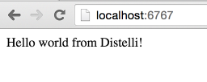

Before we move on, make sure you have set up a repository in GitHub or BitBucket.

## Step 1. Push your Code to GitHub/BitBucket

The next step to complete is to put your code into a source control repository. If you are unfamiliar with source control the steps below will guide through the process. For this tutorial I am using GitHub as my repository, but you can use BitBucket or GitLab as well without any issue.

First you will need to create a repo in GitHub and push your code to that repository. Once created, open your terminal and make sure you are in the directory that your app's code is in.

Initialize the local directory as a Git Repo
~~~
$ git init
~~~

Add the files in your new local repo
~~~
$ git add .
~~~

Commit the files you have just staged
~~~
$ git commit -m "First Commit. Created app.js"
~~~

Navigate to your GitHub or BitBucket Repo and find your remote repository URL. Once you have your remote repository URL use the following commands to finish setting up your repo.

~~~
$ git remote add origin "Your Remote Repository URL"
# Sets the new URL
$ git remote -v
# Verify the URL
~~~

Now push the changes to your repo
~~~
$ git push origin master
~~~

## Step 2. Set Up Your Server

If you do not have a Pipelines account, please [Sign Up](http://pipelines.puppet.com/signup) for one now.

The next step in deploying our app is to make sure you have a server to run your application on. You can use any type of server - public cloud, private cloud or physical. Pipelines will let you deploy your code to  Vagrant VMs or servers in a VPC. You can even deploy to the server under your desk. For this tutorial I am going to be deploying to a server hosted by Digital Ocean.

To be able to deploy your application to your server you will need to install the Pipelines Agent. You will need remote access to your server to complete the installation. Please consult the below information on how to install the Pipelines Agent on your server.

> **Note:** This installation requires root (administrator) permissions.

<h3>Linux and macOS X</h3>

To install on Linux or macOS X you can use either curl <b>or</b> wget with one of the following syntaxes.
<h4>wget example</h4>

~~~
wget -qO- https://pipelines.puppet.com/download/client | sh
~~~

<h4>curl example</h4>

~~~
curl -sSL https://pipelines.puppet.com/download/client | sh
~~~

<h3>Windows</h3>

To install on Windows copy and paste the following powershell command into a command (cmd) window.

~~~
powershell -NoProfile -ExecutionPolicy Bypass -Command "iex ((new-object net.webclient).DownloadString('https://pipelines.puppet.com/download/client.ps1'))" & SET PATH=%PATH%;%ProgramFiles%/Distelli
~~~

<h3>Complete the Install</h3>

To complete the install of the agent, you must issue the `/usr/local/bin/distelli agent install` command.

~~~
/usr/local/bin/distelli agent install
~~~

~~~
ServerA:~$ <b>wget -qO- https://pipelines.puppet.com/download/client | sh</b>
This script requires superuser privileges to install packages
Please enter your password at the sudo prompt

[sudo] password for bmcgehee:
    Installing Pipelines CLI 3.51 for architecture 'Linux-x86_64'...
    Downloading https://s3.amazonaws.com/download.distelli.com/distelli.Linux-x86_64/distelli.Linux-x86_64-3.51.gz
To install the agent, run:
    sudo /usr/local/bin/distelli agent install
ServerA:~$ <b>sudo /usr/local/bin/distelli agent install</b>
Distelli Email: jdoe@distelli.com
      Password:
    1: User: jdoe
    2: Team: janedoe/TeamJane
Team [2]: <b>1</b>
Server Info: https://www.distelli.com/jdoe/servers/12345678-4765-ac42-bd7a-080027c8277c
Starting upstart daemon with name:
~~~

<h3>Verify the Install</h3>

To validate the agent is installed and working use the `/usr/local/bin/distelli agent status` command.

> **Note:** This installation requires root (administrator) permissions.

~~~
/usr/local/bin/distelli agent status
Pipelines Agent (serverA) is Running with id
~~~

If you would like more information on installing the Pipelines agent, visit [Installing the Pipelines Agent](./agent.html). 

## Step 3. Create Pipelines Application

To create your app in Pipelines, follow these steps:

Click the new application button on your Pipelines account home screen

Select the Repository type where you are storing your applications files.

After we click the button to connect to our Repository, we then select the appropriate repo that contains your code.

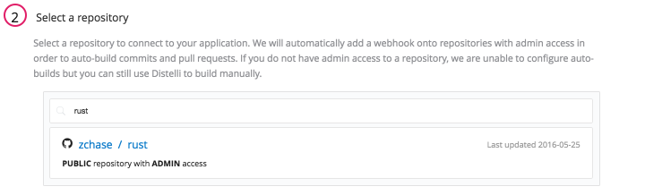

Select the appropriate branch for your deployment. I have only a master branch, but you can deploy any branch from your repo!

Next Pipelines will ask you set your build steps. For this particular application we will use the PkgInclude section. The Build section is where you would want to include any tests or tasks you would like to run while your application is building. Please make sure your PkgInclude section looks identical to the one below.

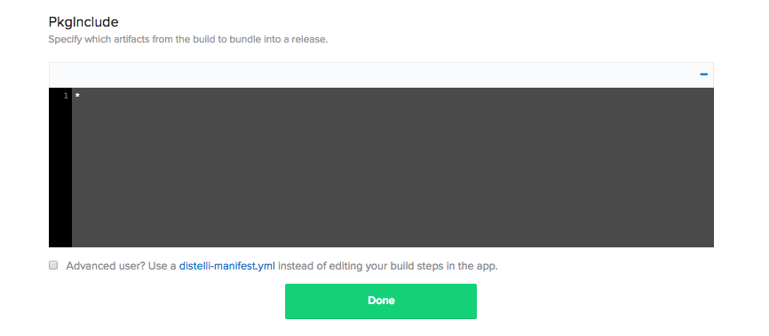

The final step is select our Build Image. In this case we are going to select <b>Pipelines Base</b> for our Rust & Nickel.rs Application. Select the <b>Auto Build</b> checkbox and the the <b>Looks good. Start Build!</b>.

> **Warning:** The Auto-Build feature builds your application everytime you commit code to your repository

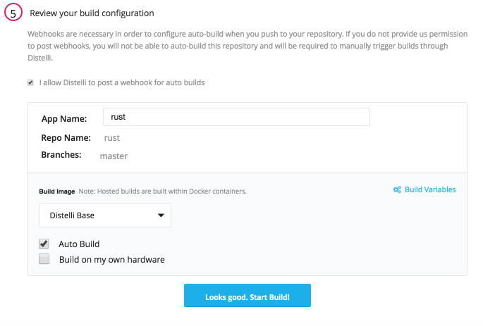

Now our application should be automatically building. You can watch its progress by navigating to the builds tab on your Pipelines account and clicking on your build.

## Step 4. Build & Deploy Steps

Once your build has completed, our next step is to define our <b>Build</b> and <b>Deploy</b> steps for our application. To accomplish this, we will use the <b>In-App Manifest</b>, located in your application page. Navigate to your application's page and then click the <b>Manifest</b> to get started:

### Build Steps

Expand the <b>Build Manifest</b> section by clicking on the plus sign. This is where we are going to tell Pipelines what commands to run during our Build.

#### PreBuild

Scroll down to your PreInstall section and enter in the following

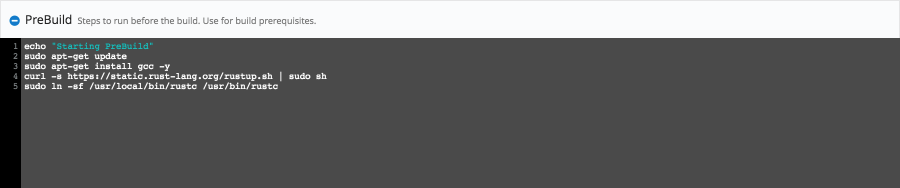

Copy/Paste
~~~
echo "Starting PreBuild"
sudo apt-get update
sudo apt-get install gcc -y
curl -s https://static.rust-lang.org/rustup.sh | sudo sh
sudo ln -sf /usr/local/bin/rustc /usr/bin/rustc
~~~

#### Build

Scroll down to your PreInstall section and enter in the following

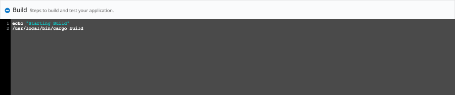

Copy/Paste
~~~
echo "Starting Build"
/usr/local/bin/cargo build
~~~

### Deploy Steps

Expand the <b>Deployment Manifest</b> section by clicking on the plus sign. This is where we are going to tell Pipelines what commands to run during our Deployment.

> **Note:** This tutorial assumes that the server is out of the box and needs to have your application dependencies installed & configured. Once your application dependencies are installed & configured you can remove those commands from your <b>Manifest</b>.

#### PreInstall

Scroll down to your PreInstall section and enter in the following

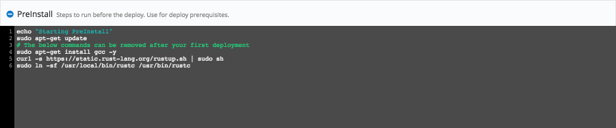

Copy/Paste
~~~
echo "Starting PreInstall"
sudo apt-get update
# The below commands can be removed after your first deployment
sudo apt-get install gcc -y
curl -s https://static.rust-lang.org/rustup.sh | sudo sh
sudo ln -sf /usr/local/bin/rustc /usr/bin/rustc
~~~

#### Exec

Scroll down to your Exec section and enter in the following

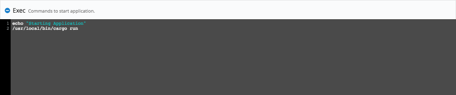

Copy/Paste
~~~
echo "Starting Application"
/usr/local/bin/cargo run
~~~

### Re-Build Application

Because we have changed our deployment steps we need to rebuild our application. First save your changes by clicking the "Publish Manifest" button and then rebuild your application. To trigger a new build, click the wrench icon in the right hand corner! That button triggers a build of your latest code, build steps, and deployment steps.

## Step 5. Deploy Application

Now that we have successfully built our application we are ready to deploy to our server. On the builds page select the "New Deployment" button in the right hand corner.

### Deploy your Rust & Nickel.rs Application

Once you click the button, you should be directed to the deployment page. The first step is to select the <b>Deploy a Release</b> option.

Pipelines will now prompt you to select the application you want to deploy. Please select the application we created earlier in the tutorial.

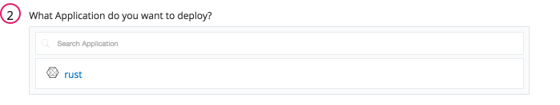

Then you will be asked to select the release you would like to deploy. For now there should be only one release for deployment.

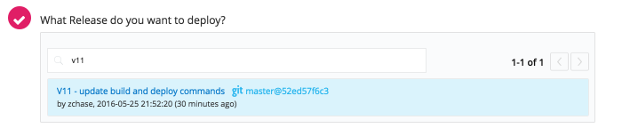

The last step in our deployment is to select the environment you wish to deploy in. First you will need to create an environment by enter a name and selecting the <b>Add Environment</b> button.

Next select the Environment you just created and click <b>All Done</b>.

Now Pipelines will ask you to add your server. Click the <b>Add Servers</b> button to get started. Select the server you configured earlier in the tutorial and add it to your account. Once you have added your server, you can close the <b>Add Servers</b> panel and continue with your deployment. You will see a final option to set your delay between deployments on your servers and a <b>Deploy!</b> button.

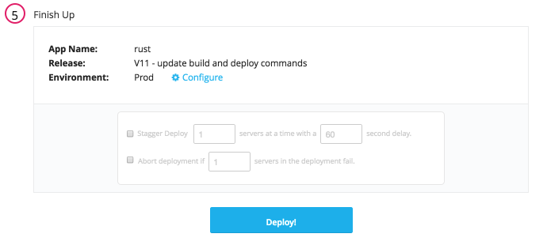

Click the <b>Deploy!</b> button to begin your deployment. You will redirected to a page where you can view the progress of your deployment. Click the "log" button on the left side to enable you to view realtime streaming logs for the deployment.

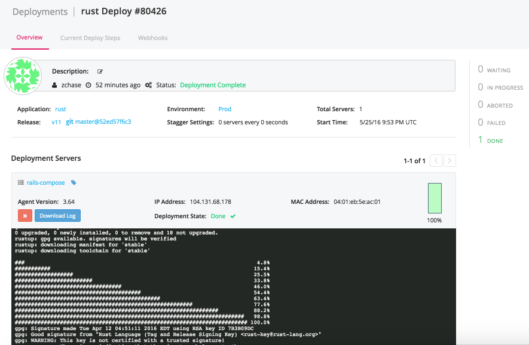

### View Your Application

And that's it! Once your application has finished deploying, you can close your deployment log by click the red box, and open your <b>Stdout</b> to watch your deployment finish. Point your browser to <b>http://<-You Server's IP Address->:6767</b> and see your Rust & Nickel.rs Application!

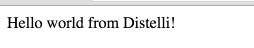

