Dashboards is an exciting feature that allows you to graphically visualize your entire software release workflow.

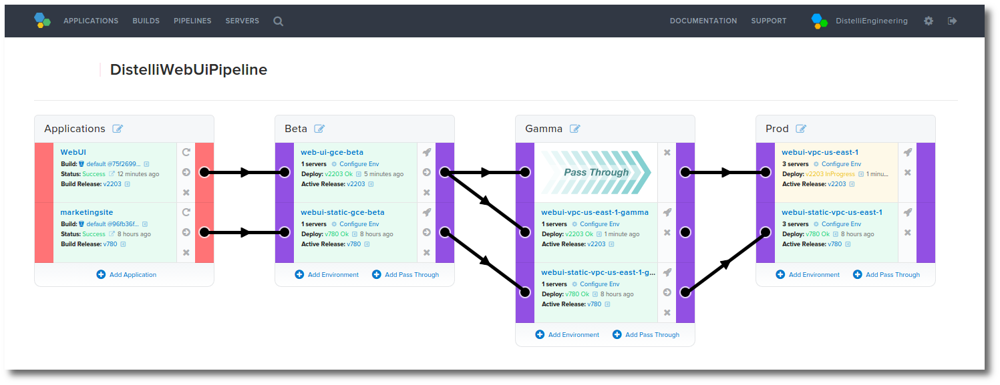

You can visualize your deployment workflow from applications on the left to the associated environment stages on the right. You can also promote an application release from the application or from one stage to the next in a stack or rollback to a previous release anywhere along the flow.

<h2>Your First Dashboard</h2>

Before you can create a dashboard you must first have at least one application with at least two environments.

<ol>
<li>Click the <b>Dashboard</b> link at the top of the Pipelines web UI.</li>
<li>In the Dashboard Overview page, click the <b>New Dashboard</b> button.</li>

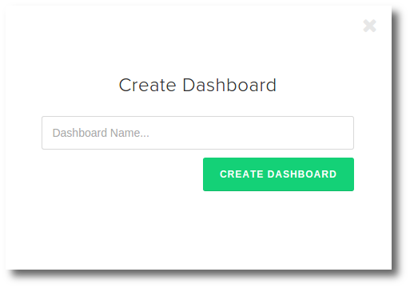

<li>Give your dashboard a <b>Dashboard Name</b>.</li>
<li>Click the <b>Create Dashboard</b> button.</li>

Next you will find yourself in the dashboard page for your newly create dashboard. You will also see a prompt for you to create the first column for applications on the left.

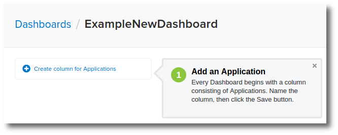

<li>Click the <b>Create column for Applications</b> link.</li>

The default name for this first column is Applications. You can change it now or edit it later. For this document I will refer to it as the Application Column.

<li>Click the <b>Save</b> button.</li>
</ol>

You can close the helpful dialog box with the <b>X</b>

In the next steps you will be adding columns for deployment stages. These stages represent your deployment process during your software development lifecycle.

Here is an example when code is checked in it is automatically built and on successful build is automatically deployed to our "beta" stage. This means the deploy can be validated in beta and, as necessary, promote the release to gamma and/or production.

<h2>Dashboard Deployment Stages</h2>

To continue creating the dashboard you will now add deployment stage columns. For this example exercise let's add three columns for the following stages:

<ul>
<li>Test</li>
<li>Staging</li>
<li>Production</li>
</ul>

<ol>
<li>To begin, click the <b>New column for Stage</b> link.

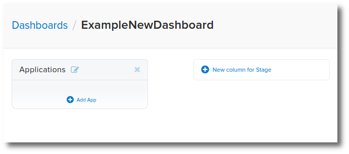

<li>Name the column <b>Test</b>.</li>
<li>Click <b>Save</b> to save the column.</li>
<li>Create two more columns for <b>Staging</b> and <b>Production</b>.</li>
</ol>

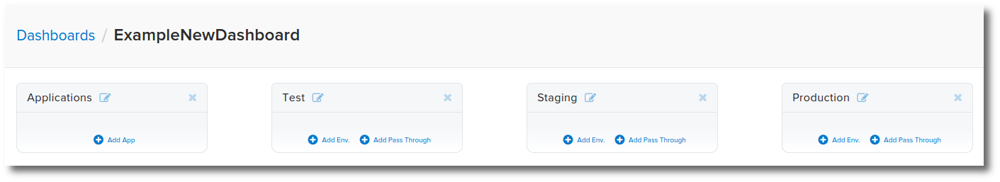

<h2>Dashboards Apps and Environments</h2>

<ol>
<li>In the Applications column click the <b>Add App</b> link.</li>
<li>From the Add Application list chose one of your applications that has at least two environments.</li>
<li>Click the <b>Add</b> button.</li>

Take a moment to look at the information shown on this application card.

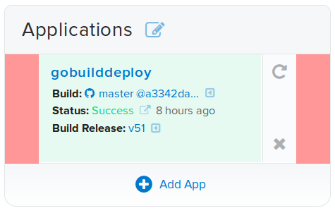

The application card provides links to:

<ul>
<li>The application.</li>
<li>The repository commit information page.</li>
<li>The build logs.</li>
<li>The most recent release.</li>
<li>Rebuild the latest code.</li>
<li>Delete this application card.</li>
</ul>

Let's add the first environment to the <b>Test</b> stage column.

<li>Click the <b>Add Env</b> link in the <b>Test</b> stage column.</li>
<li>In the dialog drop down, select the application from step 2 above.</li>
<li>Now select an application environment that you would consider a <b>Test</b> environment.</li>
<li>Click the <b>Add</b> button.</li>
</ol>

I chose my <b>-beta</b> environment.

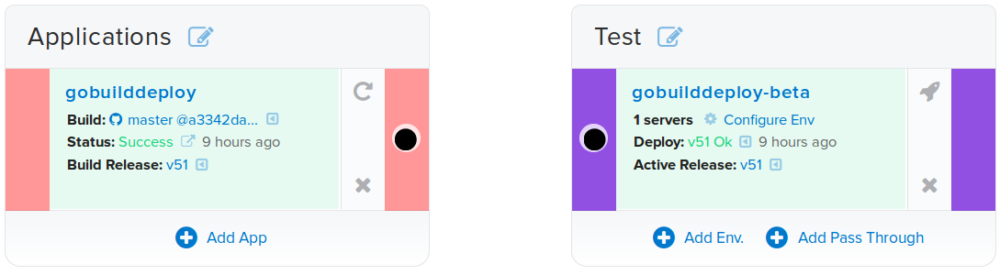

The environment card provides useful information, including:

<ul>
<li>How many servers are in the environment.</li>
<li>What release is currently active in the environment.</li>
<li>When the release was deployed to the environment.</li>
</ul>

The environment card also provides links to:
<ul>
<li>The environment.</li>
<li>A dialog that allows you to:</li>
<ul>
<li>Add servers.</li>
<li>Remove servers.</li>
<li>Set Environment Variables.</li>
</ul>
<li>Deployment details.</li>
<li>Release details.</li>
<li>Deploy, Restart, Terminate, or Promote the release.</li>
<li>Delete the environment card.</li>
</ul>

<h2>Connecting Apps and Envs</h2>

Next you will connect the application to the environment to visually denote and allow promotions of releases from the application to the environment stage.

<ol>
<li>Hover your mouse over the black dot (connector) on the right of the Applications card.</li>
<li>Click and hold while dragging the dot (connector) to the right to the corresponding dot (connector) on the left of the environment in the Test stage column.</li>

Notice the environment cards left bar turns from purple to green. This identifies a qualified connection.

<li>Let go of your mouse button when you have the appropriate line connecting the two cards.</li>
</ol>

Great. You have created your first line connecting an application to an environment in the Test stage.

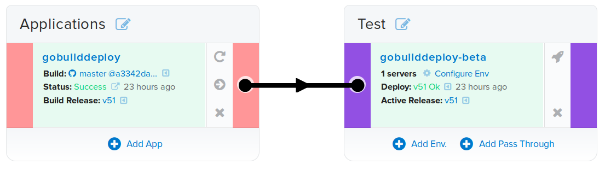

If this application has at least one release, you will see a new command in the Application card. Let's look at the application card in more details.

<h3>Application Card</h3>

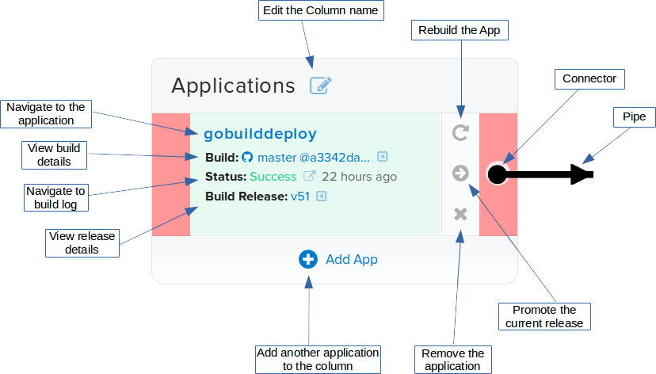

Commands you can perform include:
<ul>
<li>Promoting the current release to the connected environment(s).</li>
<li>Kicking off a build of the current repository branch commit.</li>
</ul>

> **Note:** Deleting an application card does not delete the application.

<h3>Environment Card</h3>

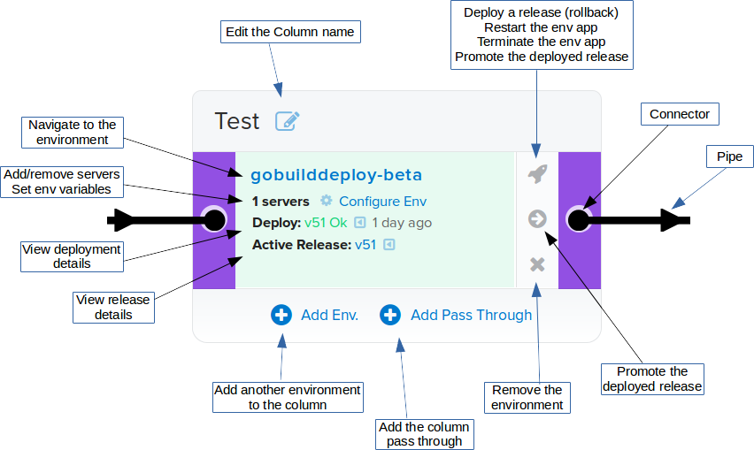

> **Note:** Deleting an environment card does not delete the environment.

<h2>Building out the Dashboard</h2>

<ol>
<li>To continue, add an environment to the <b>Production</b> stage column.</li>

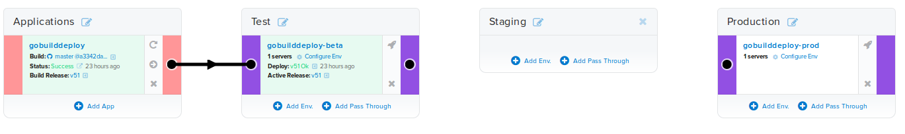

<li>In the Staging column click the <b>Add Pass Through</b> link.</li>
<li>Now connect the environment in the Test column to the Staging column pass through.</li>

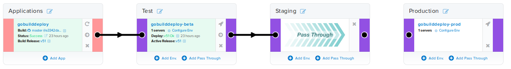

<li>And finally, connect the Staging pass through to the Production column.</li>

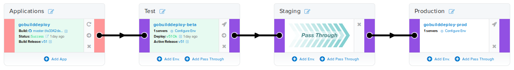

</ol>

You can now promote a release from the Test column environment through to the Production column environment.

Also note that you can rearrange cards from one column to another. You can not move applications to a stage column nor can you move environments to the application column.

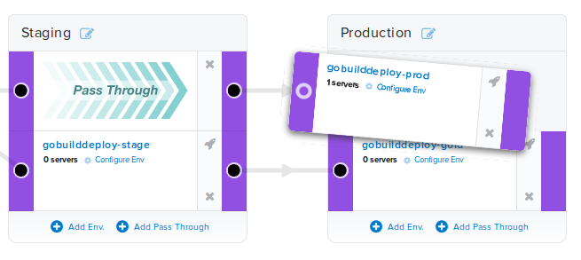

The above design was created to illustrate the features of dashboards.

<h3>Dashboard Strategies</h3>

Dashboards allow you to visualize your deployment workflow and strategies. 

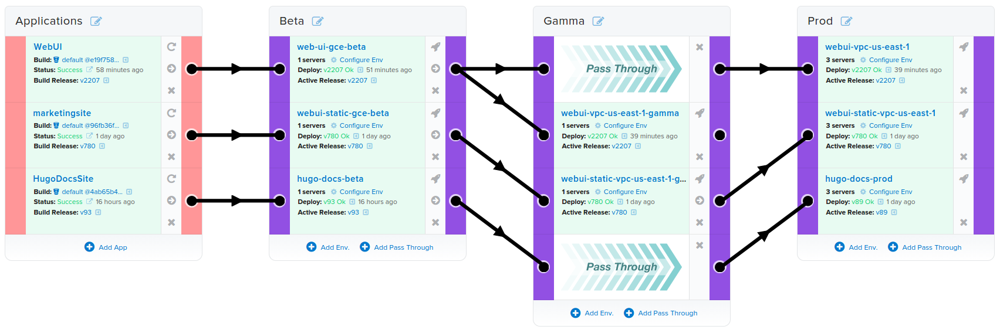

Some information you can ascertain.

You can see in the Beta stage at the bottom environment <b>hugo-docs-beta</b> that release v93 is currently successfully deployed. Follow the pipeline forward through the pass through and on to the final environment in the Prod stage <b>hugo-docs-prod</b> and release v89 is currently deployed.

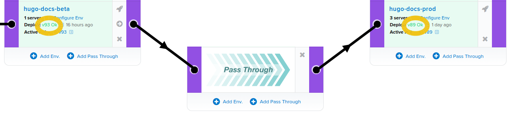

Also interesting to note. For all three applications, the production stage environments each have 3 servers. All three applications coexist and run on the same servers.

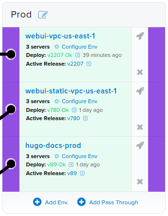

