
 

This tutorial will get you setup and deploying a simple C# application with Pipelines in minutes.

Before you begin the tutorial you must:

* Install the Pipelines CLI on the development system. [Installing the CLI](./cli.html)
* Ensure git is installed on the development system. [Download Git](http://git-scm.com/downloads)
* Have a destination server available to deploy software to. 
* Install the Pipelines agent on the destination server. [Installing the agent](./agent.html)

The tutorial assumes you have already:

* [Created a Pipelines account](https://pipelines.puppet.com/signup)
* Have a [GitHub](https://www.github.com) or [BitBucket](https://bitbucket.org/) Account
* A basic knowledge of C#

It is also important to note that I am building and deploying on Linux Ubuntu servers.

### 1. Create Application

For this tutorial we will be using a basic `Hello World` C# web-application, but you can use your own custom application if you like. Below are the contents of my web application. My file is named `webserver.cs`.

#### webserver.cs

~~~
using System;
using System.Net;
using System.Threading;
using System.Linq;
using System.Text;
 
namespace SimpleWebServer
{
    public class WebServer
    {
        private readonly HttpListener _listener = new HttpListener();
 
        public WebServer()
        {
            if (!HttpListener.IsSupported)
                throw new NotSupportedException("Needs Windows XP SP2, Server 2003 or later.");
 
            _listener.Prefixes.Add("http://*:8080/");
        }
 
        public void start()
        {
            _listener.Start();
            for(;;)
            {
                HttpListenerContext ctx = _listener.GetContext();
                new Thread(new Worker(ctx).ProcessRequest).Start();
            }
        }

        public void Stop()
        {
            _listener.Stop();
            _listener.Close();
        }

        static public void Main ()
        {
            WebServer webServer = new WebServer();
            webServer.start();
        }
    }

    public class Worker
    {
        private HttpListenerContext context;
 
       public Worker(HttpListenerContext context)
       {
          this.context = context;
       }
 
       public void ProcessRequest()
       {
          StringBuilder sb = new StringBuilder();
          sb.Append("&#60;html&#62;&#60;body&#62;&#60;h1&#62;Hello World from C# and Distelli&#60;/h1&#62;");
 
          byte[] b = Encoding.UTF8.GetBytes(sb.ToString());
          context.Response.ContentLength64 = b.Length;
          context.Response.OutputStream.Write(b, 0, b.Length);
          context.Response.OutputStream.Close();
       }
    }
}
~~~

Next we need to create a script to compile our code. Create a file called `build_mono.sh` and with the below contents:

#### build_mono.sh

~~~
#!/bin/bash

mkdir -p release

mcs webserver.cs -out:release/webserver.exe
~~~

## 2. Push your Code to GitHub/BitBucket

The next step to complete is to put your code into a source control repository. If you are unfamiliar with source control the steps below will guide through the process. For this tutorial I am using GitHub as my repository, but you can use BitBucket as well without any issue.

First you will need to create a repo in GitHub and push your code to that repository. Once created, open your terminal and make sure you are in the directory that your app's code is in.

Initialize the local directory as a Git Repo
~~~
$ git init
~~~

Add the files in your new local repo
~~~
$ git add .
~~~

Commit the files you have just staged
~~~
$ git commit -m "First Commit"
~~~

Navigate to your GitHub or BitBucket Repo and find your remote repository URL. Once you have your remote repository URL use the following commands to finish setting up your repo.

~~~
$ git remote add origin "Your Remote Repository URL"
# Sets the new URL
$ git remote -v
# Verify the URL
~~~

Now push the changes to your repo
~~~
$ git push origin master
~~~

## 3. Set Up Your Server

If you do not have a Pipelines account, please [sign Up](http://pipelines.puppet.com/signup) for one now. 

The next step in deploying our app is to make sure you have a server to run your application on. You can use any type of server - public cloud, private cloud or physical. Distelli will let you deploy your code to  Vagrant VMs or servers in a VPC. You can even deploy to the server under your desk. For this tutorial I am going to be deploying to a server hosted by DigitalOcean. 

**Note:** You will need remote access to the server you are deploying to & root (administrator) permissions.

### Install Pipelines Agent on Your Server

To be able to deploy your application to your server you will need to install the Pipelines Agent. You will need remote access to your server to complete the installation. Please consult the below information on how to install the Pipelines Agent on your server.

#### Linux and macOS X

To install on Linux or macOS X you can use either curl <b>or</b> wget with one of the following syntaxes.
##### wget example

~~~
wget -qO- https://pipelines.puppet.com/download/client | sh
~~~

##### curl example

~~~
curl -sSL https://pipelines.puppet.com/download/client | sh
~~~

#### Complete the Install

To complete the install of the agent, you must issue the `/usr/local/bin/distelli agent install` command.

~~~
/usr/local/bin/distelli agent install
~~~

~~~
ServerA:~$ **wget -qO- https://pipelines.puppet.com/download/client | sh**
This script requires superuser privileges to install packages
Please enter your password at the sudo prompt

[sudo] password for bmcgehee: 
    Installing Distelli CLI 3.51 for architecture 'Linux-x86_64'...
    Downloading https://s3.amazonaws.com/download.distelli.com/distelli.Linux-x86_64/distelli.Linux-x86_64-3.51.gz
To install the agent, run:
    sudo /usr/local/bin/distelli agent install
ServerA:~$ **sudo /usr/local/bin/distelli agent install**
Distelli Email: jdoe@distelli.com
      Password: 
    1: User: jdoe
    2: Team: janedoe/TeamJane
Team [2]: **1**
Server Info: https://www.distelli.com/jdoe/servers/12345678-4765-ac42-bd7a-080027c8277c
Starting upstart daemon with name:  
~~~

#### Verify the Install

To validate the agent is installed and working use the `/usr/local/bin/distelli agent status` command.

**Note:** This installation requires root (administrator) permissions.

~~~
/usr/local/bin/distelli agent status
Distelli Agent (serverA) is Running with id 
~~~

If you would like more information on installing the Pipelines agent, visit [Installing the Pipelines Agent](./agent.html). 

## 4. Create Pipelines Application

To create your app in Pipelines, follow these steps:

Click the new application button on your Pipelines account home screen

Select the Repository type where you are storing your applications files. 

After we click the button to connect to our Repository, we then select the appropriate repo that contains your code.

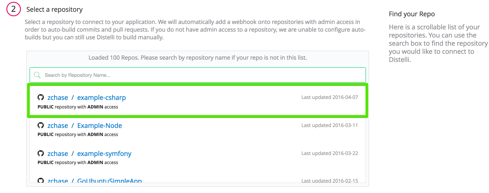

Select the appropriate branch for your deployment. I have only a master branch, but you can deploy any branch from your repo!

Next Pipelines will ask you set your build steps. For now we will leave this section as is. After we create the application we will set our **Build and Deploy** steps.

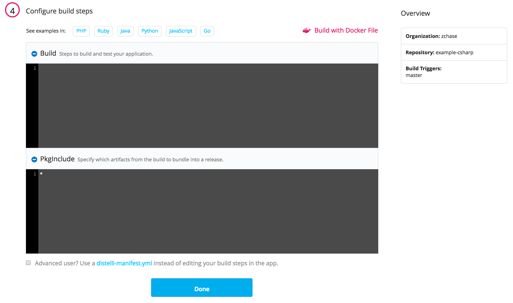

The final step is select our Build Image. In this case we are going to select **Distelli Base (Docker)** for our C# Application. Select the **Auto Build** checkbox and the **Looks good. Start Build!**.

**Note:** The Auto-Build feature builds your application every time you commit code to your repository

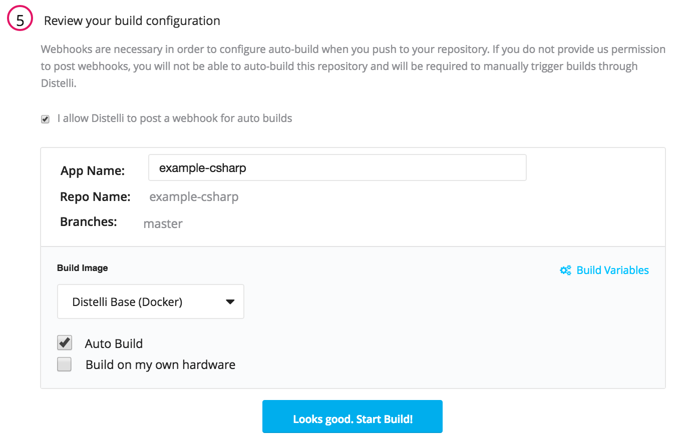

## 5. Build and Deploy Steps

**Note:** This tutorial assumes that the server is out of the box and needs to have your application dependencies installed & configured. Once your application dependencies are installed & configured you can remove those commands from your <b>Manifest</b>.

Navigate to your **Application** page and select your application.

Select the Manifest tab

### Build Steps

Expand the **Deployment Manifest** section by clicking on the plus sign. This is where we are going to tell Pipelines what commands to run during our Deployment. 

#### PreBuild

Scroll down to your PreBuild section and enter in the following

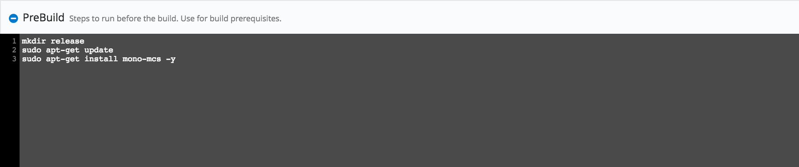

Copy/Paste
~~~
mkdir release
sudo apt-get update
sudo apt-get install mono-mcs -y
~~~

#### Build

Scroll down to your Build section and enter in the following

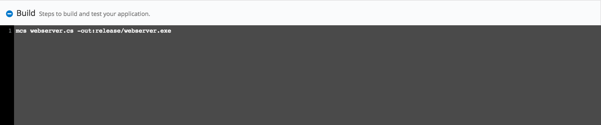

Copy/Paste
~~~
mcs webserver.cs -out:release/webserver.exe
~~~

#### PkgInclude

Scroll down to your PkgInclude section and enter in the following

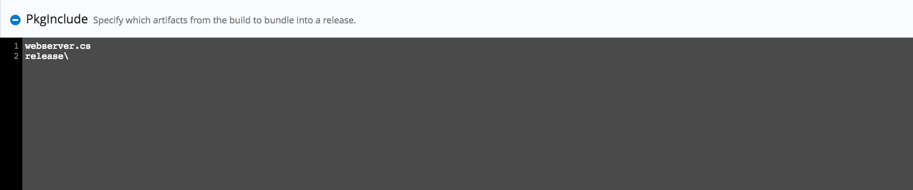

Copy/Paste
~~~
webserver.cs
release\
~~~

Click the **Save** button to save all your changes.

### Deploy Steps

Expand the **Deployment Manifest** section by clicking on the plus sign. This is where we are going to tell Pipelines what commands to run during our Deployment. 

#### PreInstall

Scroll down to your PreInstall section and enter in the following

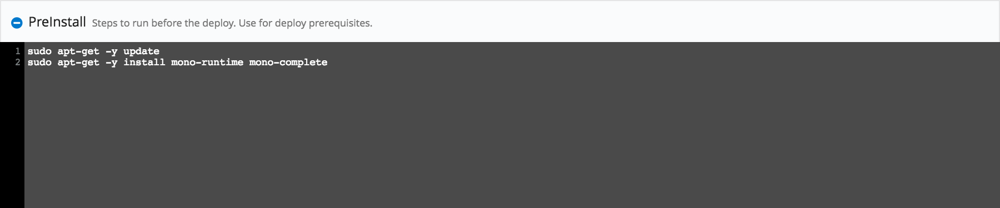

Copy/Paste
~~~
sudo apt-get -y update
sudo apt-get -y install mono-runtime mono-complete
~~~

#### Exec

Scroll down to your Exec section and enter in the following

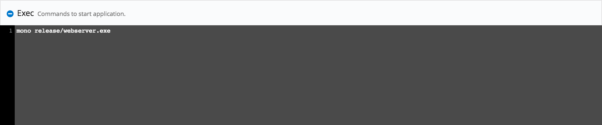

Copy/Paste
~~~
mono release/webserver.exe
~~~

### Re-Build Application

Because we have changed our deployment steps we need to rebuild our application. First save your changes by clicking the **Save Manifest** button and then rebuild your application. To trigger a new build just click the wrench icon in the right hand corner! That button triggers a build of your latest code, build steps, and deployment steps.

After you trigger your new build, you can watch it progress from your **Builds** page.

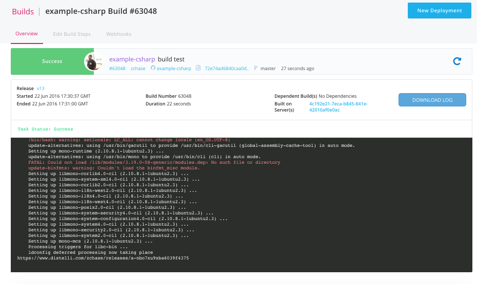

## Step 6. Deploy Application

Now that we have successfully built our application we are ready to deploy to our server. On the builds page select the **New Deployment** button in the right hand corner.

### Deploy your C# Application

Once you click the button, you should be directed towards the Pipelines deployment page. The first step is to select the **Deploy a Release** option.

Pipelines will now prompt you to select the application you want to deploy. Please select the application we created earlier in the tutorial.

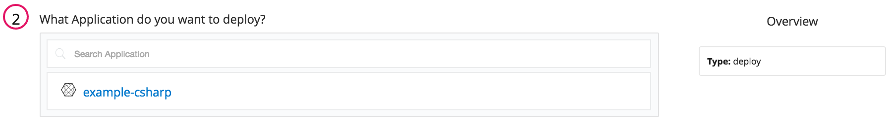

Then you will be asked to select the release you would like to deploy. For now there should be only one release for deployment.

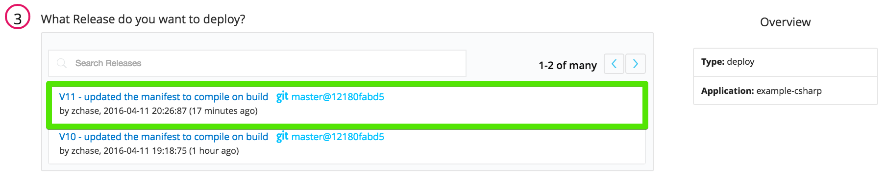

The last step in our deployment is to select the environment you wish to deploy in. First you will need to create an environment by enter a name and selecting the **Add Environment** button.

 Next select the Environment you just created and click **All Done**.

Now Pipelines will ask you to add your server. Click the **Add Servers** button to get started. Select the server you configured earlier in the tutorial and add it to your account. Once you have added your server, you can close the **Add Servers** panel and continue with your deployment. You will see a final option to set your delay between deployments on your servers and a **Deploy!** button.

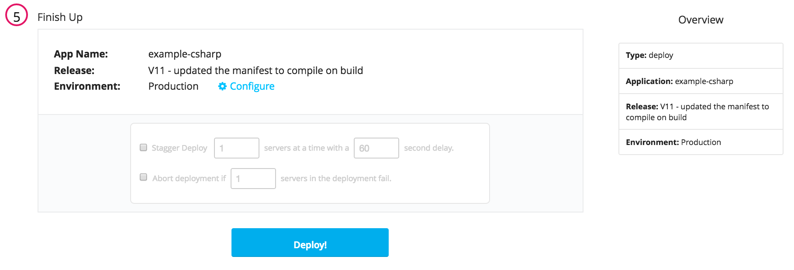

Click the **Deploy!** button to begin your deployment. You will redirected to a page where you can view the progress of your deployment. Click the **log** button on the left side to view real time streaming logs for the deployment.

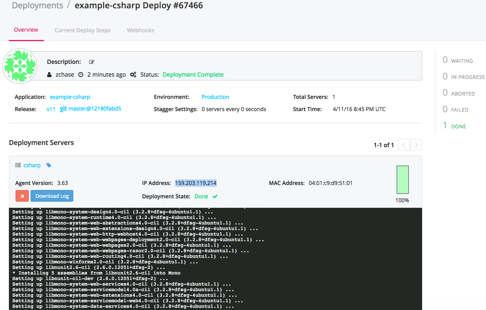

### View Your Application

And that's it! You should now be able to point your browser to **http://<-Your Server's IP Address->:8080** and see your C# Application!

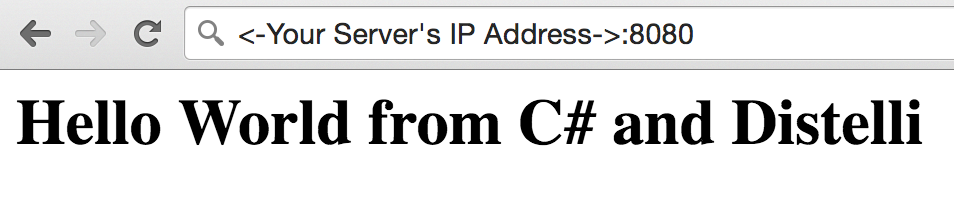
