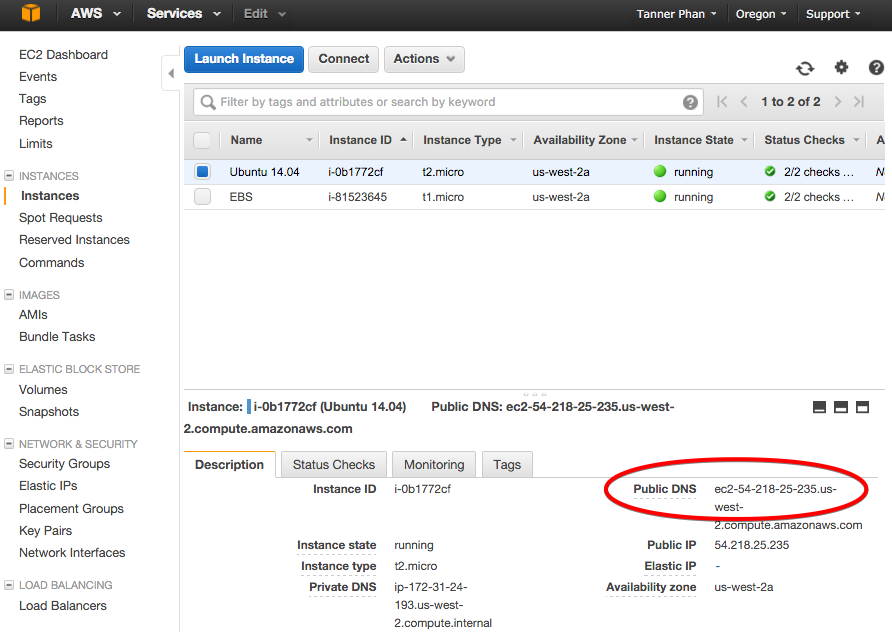

## Introduction

In this tutorial, we will walk through the steps to configure an EC2 instance for MEAN-stack development, and set up automatic deployments with Pipelines.

MongoDB, ExpressJS, AngularJS, and NodeJs (MEAN) is a full-stack web  framework. Each layer in the stack works effortless with one another. MEAN stack is operating system-independent, and it's optimized for I/O usages.

Before you begin, ensure you have the following:

<ul>
<li>Installed git in your local machine.</li>
<li>A GitHub account. <a href="http://github.com/join" target="_blank"> Register for a GitHub account here.</a></li>
<li>A Pipelines account.<a href="https://pipelines.puppet.com/signup" target="_blank"> Register for a Pipelines account here.</a></li>
<li><a href="./integrate-amazon.html" target="_blank">A running AWS EC2 instance, and installed Pipelines Agent</a></li>
<li>NPM and NodeJS installed.</li>
</ul>

## Step 1. Create Key Pairs

Key Pairs are used to securely log into AWS services. We will create a Key Pair to access our EC2 instance.
<ol>
<li> To create new Key Pairs, navigate to the <b>AWS Console</b>, then click <b>EC2</b>. </li>

<li>On the left pane, click <b>Key Pairs</b>, then click <b>Create Key Pair</b></li>

<li>Enter a name for your key, then click <b>Create Key Pair</b>. The Key Pair will be automatically downloaded. You should move this key to a different directory.
</li>
</ol>

> **Important** You will need to change the permissions of this key to read-only, refer the following code: `chmod 400 youKeyName.pem`

## Step 2. Launch an EC2 instance with Bitnami

In this step, we will launch an EC2 instance from an Amazon Machine Image (AMI). With AMI, you can spin up an EC2 instance that is ready for  development without much configuration.

Bitnami provides a preconfigred MEAN image, which we will use to get set up.
<ol>
<li>First, navigate to <b>AWS console</b>, click on <b>AWS Marketplace</b>.</li>

<li>Search for <i>MEAN powered by Bitnami</i>, then select the 64-bit AMI to continue.</li>

<li>Under <b>Pricing Details</b>, to get the best delivery speed, pick a region that is closest to you, then click <b>Continue</b>.</li>

<li>For the <b>Security Group</b> choose <b>Create new based on seller settings</b>  </li>

<li>Ensure you have the following Connection Methods:</li>

	<ul>
	<li>SSH, My IP</li>
	<li>HTTP, Anywhere</li>
	<li>HTTPS, Anywhere</li>
	</ul>

<li>Under <b>Key Pair</b>, select the Key Pair you created in Step 1.</li>

<li>Finally, click <b>Launch with 1-click</b>, to launch the instance. </li>
</ol>

## Step 3. Connect to Your EC2

To SSH to your instance, you will need your instance Public IP and the Key Pair you created. First, let's retrieve your Public IP for your instance.

<ol>
<li>Inside EC2, click <b>Instances</b>, select the newly launched instance from previous step, then click <b>Connect</b>. </li>
<li>On the popup, copy the code under <b>Example</b>, as shown in the picture below:</li>

<li>In your terminal, navigate to the directory where your Key Pair is saved, then paste the code last step. Here is what a successful connection looks like: </li>

</ol>

## Step 4. Install Pipelines Agent to Instance

Nicely done! Now that you have have access to your instance, let's install the Pipelines Agent. Use the following syntaxes:

~~~
curl -sSL https://pipelines.puppet.com/download/client | sh
~~~

<h3>Complete the Install</h3>

~~~
  sudo /usr/local/bin/distelli agent install
~~~

<h3>Verify the Install</h3>

To validate the agent is installed and working use the `agent status` command.

~~~
 sudo /usr/local/bin/distelli agent status
~~~

## Step 5. Fork the Sample App from GitHub

If you already have a MEAN application, create a GitHub repository for your application, and push your code to the repository. Then, move to Step 6 of this tutorial.

To Fork a repository, ensure you are logged into your GitHub account.
<ol>
<li>Fork the sample application from the <a href="https://github.com/distelli/Example-MEAN-App" target="_blank">Pipelines GitHub repository.</a></li>
<li> Click  <b>Fork</b>. </li>
(Forking copies this reposity to your collection of repositories without having to start a new repository.)

<li>In your terminal, navigate to a directory where you'd like to store the codebase. Then, clone the repository with following syntax:</li>

<code>git clone https://github.com/YOUR_GITHUB_USERNAME/nodejsbuilddeploy.git</code>

</ol>
 
Next, we will link the GitHub repository with Pipelines. From there, Pipelines will be notified each time you `git push`  and initicate your automated  processeses.

## Step 6. Create an Application in Pipelines
<ol>
<li><a href="/login" target="_blank"> Log into your Pipelines account.</a> Click <b>Get Started</b>, and follow the steps to create your app. In Step 4, under <b>PkgInclude</b>, add an asterisk.
This will include all the files generated from the build, and send them to the server. Note you can also specifies only certain files to be sent to the server.</li>

<li> In the final step, under <b>Build Image</b> select <b>Pipelines JavaScript(Docker)</b>. Then click <b>Start Build</b> to finish adding an app.</li>
<li> Next, click <b> Go to build</b>. There you will be able to see your builds.
</ol>

## Step 7. Deploy to Server

Let's recap what we have done so far:
<ul> <ul type="circle">
<li> Installed & configured Pipelines Agent on your EC2 instance, Step 4.</li>
<li> Connected your GitHub account to Pipelines, Step 6. </li>
<li> Set up automatic deployment, Step 7. </li>
</ul></ul>

<ol>
<li> Login to your Pipelines account. At the top menu, click <b>Applications.</b></li>
<li>To edit the settings for an app, click on the application name. Click the application you just added.</li>

<li>In your application settings, click  <b>Environments</b>, then click <b> Create Environment</b></li>

<li> For this tutoral, name your environment <i>Test_Env</i>.  Click <b>Create Environment</b>. Here is an example:</li>

<li> To add a server to this environment, click the <b>Plus Button</b>.</li>
<li> When you first added your application, a Release should be generated if the build succeeds. If you successfully generated a Release, click <b>Deploy</b> to start the deployment process.<li>

</ol>

Great! After you have added your application. Pipelines will be notified each time you `git push` and trigger any of the automation process. In the next step, we will enable auto deployment.

## Step 8. Enable Auto Build & Deploy

 To enable auto build and auto deploy, login to your Pipelines account.
<ol>
<li>In Pipelines, at the top menu, click <b>Applications</b>.</li>
<li>In the application list, click your new application. </li>

<li> Under the <b>Overview</b> tab, ensure <b>Auto Build</b> is toggled-on.</li>
<li> Click <b>Add Step</b>, select <i>Test_Env</i>, then click <b>Add</b>. </li>
<li> To enable auto deploy, check the <b>Auto Deploy</b> box and select <b>If the Build succeeds</b></li>

</ol>

## Step 9. Start & Configure MongoDB

On starting a new EC2 instance, Binami starts all its services. Let's terminate all, and run only the services we need. Connect to your instance (Step 3), and enter the following commands:

~~~
sh ~/stack/ctlscript.sh stop
sh ~/stack/ctlscript.sh start mongodb
~~~

With Mongo daemon running in background, let's log into it to set up our database for the application. You need to use the password Bitnami created for you.

1. To get the password, click <b>Connection</b>, hover on <b>Instance Settings</b>, then click <b>Get System Log</b>, refer to the pictures below:

1. Search for the password in the System Log popup. 

1. The defalt username is <b>root</b>. Connect to your instance, enter the following commands with your password obtained from previous step:

~~~
mongo admin -u "root" -p "<YOUR_PASSWORD>"
use appDB
db.createUser(
    { user: "app",
      pwd: "myPassword",
      roles: [{ role: "readWrite", db: "appDB" }]
 })
~~~

You will need to reroute external requests to your running NodeJS port.

1. Log into your instance (Step 3), enter the following commands:

~~~
iptables -t nat -A PREROUTING -p tcp --dport 80 -j REDIRECT --to 8080
~~~

1. Run your app with the following commands:

~~~
cd /distelli/_apps/YOUR_APP_NAME
sudo node server.js
~~~

1. To view your app, navigate to your EC2 instance and locate the public DNS. 

1. Finally, enter the DNS address in your web browser. Here is what the sample app looks like:

## Step 10. Trigger Auto Build & Deploy

To ensure auto build and  deploy is cofingured correctly, let's make a small change to the codebase, push the changes to GitHub and observe the automation process on Pipelines.

1. Open up the application, and motify the landing page, home.html (refer to image below). Refer to the file structure below:

1. To observe auto build, log into your Pipelines account. At the top menu, click <b>BUILDS</b>.
1. Orient your terminal next to your browser to see both windows (browser and terminal). Make a code push to GitHub, enter the following commands in your terminal:

~~~
    git add config.js
    git commit -m "Testing Pipelines auto build"
    git push
~~~

You should notice a new build initiate at this point. If you don't, verified that you have auto build toggled on. Once the build is complete, visit your public DNS to ensure the new version is deployed.

It could be cumbersome to configure each server like we did here. [Pipelines Manifest](./manifest.html) allows you to create a configuration one time, and apply it to multiple servers automatically. 

