 

Meteor is a an open-source JavaScript web application framework that gives you a radically simpler way to build real-time mobile and web apps, entirely in JavaScript. In this tutorial, I’ll review creating and deploying a sample Meteor app with Pipelines.

Before you begin the tutorial you must:

* Install the Pipelines CLI on the development system. [Installing the CLI](./cli.html)
* Ensure git is installed on the development system. [Download Git](http://git-scm.com/downloads)
* Have a destination server available to deploy software to. 
* Install the Pipelines agent on the destination server. [Installing the agent](./agent.html)

### Prerequisites

For this tutorial you will need a basic understanding of shell commands and know how to create and update a repo in GitHub or BitBucket. Knowledge of HTML/JS/CSS is helpful if you want change your application, but it is not required to get your simple Meteor app deployed to your server.

You will also need a server to deploy your Meteor app to. I will be using a Ubuntu 14.4 server hosted by <a href="https://www.digitalocean.com/" target="_blank">DigitalOcean</a>.

### Set-Up

Prior to starting this tutorial, make sure you have a server available to deploy to. If you do not have a server set up at this point, please set one up. For more information on setting up a server with DigitalOcean, see <a href="https://www.digitalocean.com/docs/droplets/quickstart/" target="_blank">Droplet Quickstart</a> 

Once you have your server ready, we can get our application ready to deploy!

## Step 1. Install the Pipelines Agent on your Server

Now that we have a server running, we can set up Pipelines to deploy our application. To start off you will need Sign In to your Pipelines Account. If you do not have a Pipelines Account please [Sign Up](pipelines.puppet.com/signup) for one now.

Now that we are all set up with Pipelines we can install the agent on our sever. First we need to SSH into our Server. To do this we enter the following command into our terminal:

~~~
$ ssh root@'IP Address of Server'
~~~

Now you will be prompted for the password to your server. If you used DigitalOcean, like I have, when you set up your server DigitalOcean should have send you an email containing the password to that server. If you didn't use DigitalOcean, please enter the password to the server that you configured. Now that we have access to our server, we can install the Pipelines Agent onto it:

<h4>Linux and macOS X</h4>

To install on Linux or macOS X you can use either curl <b>or</b> wget with one of the following syntaxes.
<h5>wget example</h5>

~~~
wget -qO- https://pipelines.puppet.com/download/client | sh
~~~

<h5>curl example</h5>

~~~
curl -sSL https://pipelines.puppet.com/download/client | sh
~~~

<h4>Windows</h4>

To install on Windows copy and paste the following powershell command into a command (cmd) window.

~~~
powershell -NoProfile -ExecutionPolicy Bypass -Command "iex ((new-object net.webclient).DownloadString('https://pipelines.puppet.com/download/client.ps1'))" & SET PATH=%PATH%;%ProgramFiles%/Distelli
~~~

<h4>Complete the Install</h4>

After downloading the agent, you must run the install command to install the agent. To do so use the `agent install` command.

> **Note:** This installation requires root (administrator) permissions.

~~~
jdoe@ServerB:~$ <b>wget -qO- https://pipelines.puppet.com/download/client | sh</b>
This script requires superuser privileges to install packages
Please enter your password at the sudo prompt

[sudo] password for jdoe:
    Installing Pipelines CLI 3.55 for architecture 'Linux-x86_64'...
    Downloading https://s3.amazonaws.com/download.distelli.com/distelli.Linux-x86_64/distelli.Linux-x86_64-3.55.gz
To install the agent, run:
    sudo /usr/local/bin/distelli agent install
jdoe@ServerB:~$ <b>sudo /usr/local/bin/distelli agent install</b>
Pipelines Email: <b>jdoe@distelli.com</b>
      Password:
    1: User: jdoe
    2: Team: janedoe/teamjane
Team [2]: <b>1</b>
Server Info: https://www.distelli.com/jdoe/servers/d0c4b300-9fcf-2846-ba90-080027c8277c
Starting upstart daemon with name:  dtk-supervise-cc1233c06f7ad94a8d34ac610381242f9ae28bb8
jdoe@ServerB:~$
~~~

<h4>Verify the Install</h4>

To validate the agent is installed and working use the `agent status` command.

~~~
# /usr/local/bin/distelli agent status
Pipelines Agent (serverA) is Running with id 766b88c8-e925-11e4-ae8b-080027cc07f7
~~~

You now have the Pipelines agent installed and this server can be added to an environment for application deployments.

For more information on the Pipelines Agent, see the [Pipelines Agent Reference Guide](./agent.html).

## Step 2. Install Meteor

Next you will need to install Meteor on your local machine. To do to so please follow the steps outlined below:

<h3>Linux and macOS X</h3>

You can install Meteor from your terminal by entering the command:

~~~
curl https://install.meteor.com/ | sh
~~~

<h3>Windows</h3>

Download the official Meteor Installer <a href="https://install.meteor.com/windows" target="_blank">here</a>.

<h4>And that is it! We are ready to create our simple Meteor Application and deploy it to our server!!</h4>

## Step 3. Create Meteor App

You can use Meteor to create a sample application. All you have to do is navigate to where you would like to store your application in your terminal and Meteor will do the rest with one command. Once you are in the directory you would like to store your files, enter the below command.

~~~
meteor create --example todos
~~~

That command will create a directory called 'todos' that contains an example meteor application. To run this file, `cd` into the directory you just created and enter the command `meteor`. Once Meteor has finished building your app you should see something similar to this in your terminal:

~~~
[[[[[ ~/ws/src/meteor/todos ]]]]]

=> Started proxy.
=> Started MongoDB.
=> Started your app.

=> App running at: http://localhost:3000/
~~~

All this is saying, is that your app is running on your `localhost` on port `3000`. Point your browser towards <b>localhost:3000</b> and look at what you just created!

This app counts how many times you have clicked the 'Click Me' button. Feel free to edit the HTML, JS, CSS however you want. However, make sure that the app works as expected by running it locally after your changes. Below you can see the changes I have made to my files

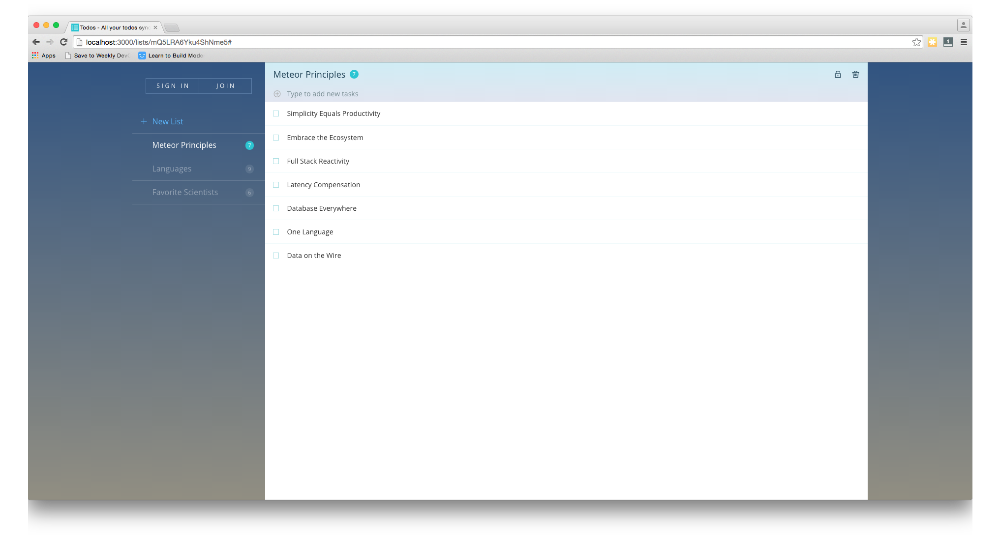

Before we can deploy this application there is one more step we need to accomplish. In your projects directory find the `.meteor/local/platforms` file and make sure the you have only browser and server enabled. Your file contents should look identical to what is below

~~~
browser
server
~~~

Now that we have your app running and ready to deploy all we have to do is push it to GitHub/BitBucket repo and deploy!

## Step 4. Push your App to GitHub/BitBucket

Create a repository in GitHub/BitBucket for your app. For this tutorial, I’m using GitHub. As a reminder, here is how you add your code to your repo using Git.

~~~
git init
git add .
git commit -m "first commit"
git remote add origin "SSH or HTTP URL"
git push -u origin master
~~~

Once your code is in your repo we are ready to deploy the application to our server!

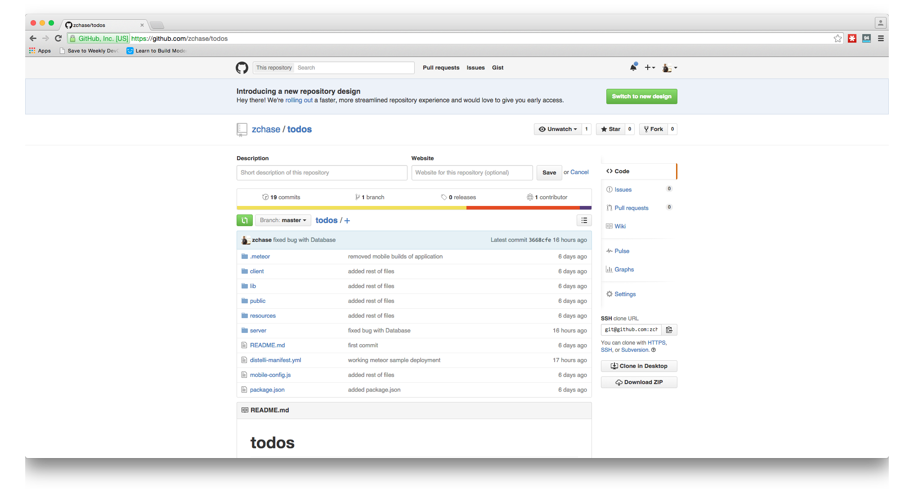

## Step 5. Add your Application to Pipelines

Now that we have our code in our repository and installed the Pipelines Agent on our Server, we are ready to deploy our app. Navigate to pipelines.puppet.com and make sure you are logged in. Once you are logged in, go the Applications Page and click the 'New App' button.

Name your app and then select the Repository you would like to connect to. As a reminder, I have been using GitHub as our repository but you an use BitBucket as well.

After we click the button to connect to our Repository, we then select the appropriate repo that contains our code. In this example I store my code in the repo name 'meteorDistelli'. Make sure to select the repo we set up earlier in the tutorial.

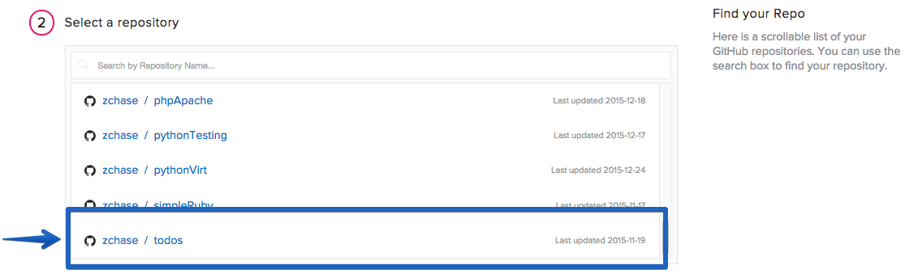

Then select the appropriate branch for your deployment. I have only a master branch, but you can deploy any branch from your repo!

Pipelines will now prompt you to assign your build steps. For now we will skip this step and press the "Done" button. We will be setting our Build and Deploy steps during the next step of the tutorial.

The final step is select our Build Image. In this case we are going to select "Pipelines Javascript (Docker)" for our Meteor App. Select the "Auto Build" checkbox and the the "Looks good. Start Build!".

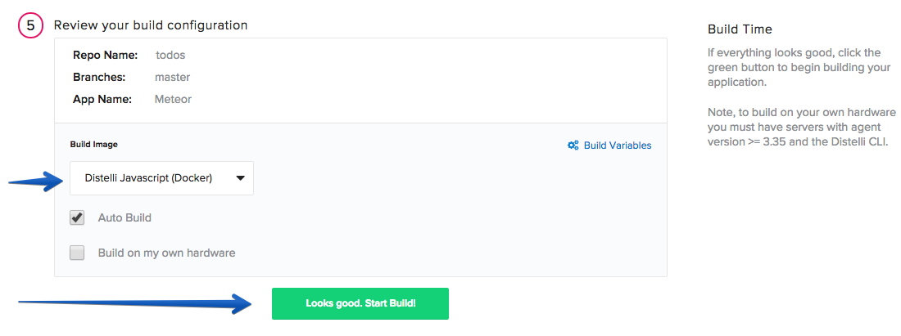

Now our build should be automatically building. Your build will be successful but that is because we have not added the step that will run the Meteor Build command. We also need to add our steps for deployment

## Step 6. Build and Deploy Steps

> **Note:** This tutorial assumes that the server is bare metal and needs to have your application dependencies installed & configured. Once your application dependencies are installed & configured you can remove those commands from your <b>Manifest</b>.

Once your build has completed navigate back to your application page and open your application.

Select the Manifest tab

### Build Steps

Expand the "Build Manifest" section by clicking on the plus sign. This is where we are going to tell Pipelines what commands to run during our Build.

#### PreBuild

Scroll down to your PreBuild section and enter in the following

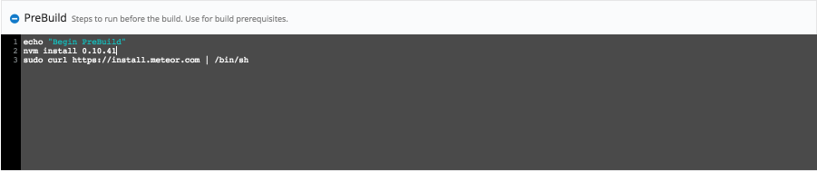

Copy/Paste
~~~
echo "Begin PreBuild"
nvm install 0.10.41
sudo curl https://install.meteor.com | /bin/sh
~~~

#### Build

Scroll down to your Build section and enter in the following

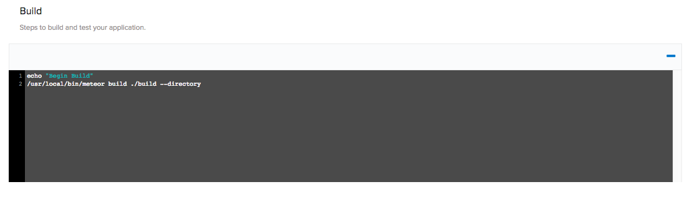

Copy/Paste
~~~
echo "Begin Build"
/usr/local/bin/meteor build ./build --directory
~~~

#### PkgInclude

Scroll down to your PkgInclude section and enter in the following

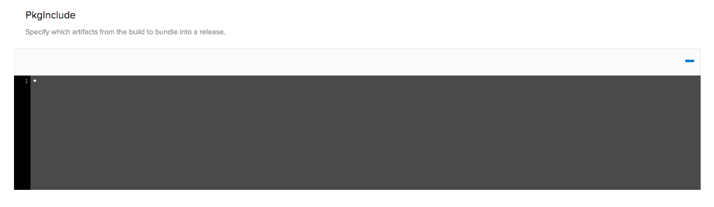

Copy/Paste
~~~
*
~~~

Make sure to click the <b>Save</b> button to save your manifest and you can move on to creating your deployment steps.

### DEPLOY STEPS

Expand the "Deployment Manifest" section by clicking on the plus sign. This is where we are going to tell Pipelines what commands to run during our Deployment.

#### PreInstall

Scroll down to your PreInstall section and enter in the following

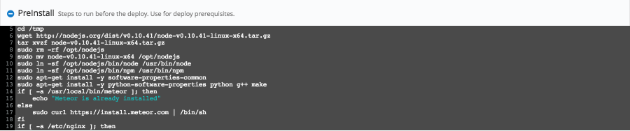

Copy/Paste
~~~
echo "Begin PreInstall"
sudo apt-get -y update
sudo apt-get install -y mongodb-server
sudo apt-get -y install build-essential libssl-dev git curl
cd /tmp
wget http://nodejs.org/dist/v0.10.41/node-v0.10.41-linux-x64.tar.gz
tar xvzf node-v0.10.41-linux-x64.tar.gz
sudo rm -rf /opt/nodejs
sudo mv node-v0.10.41-linux-x64 /opt/nodejs
sudo ln -sf /opt/nodejs/bin/node /usr/bin/node
sudo ln -sf /opt/nodejs/bin/npm /usr/bin/npm
sudo apt-get install -y software-properties-common
sudo apt-get install -y python-software-properties python g++ make
if [ -a /usr/local/bin/meteor ]; then
    echo "Meteor is already installed"
else
    sudo curl https://install.meteor.com | /bin/sh
fi
~~~

#### PostInstall

Scroll down to your PostInstall section and enter in the following

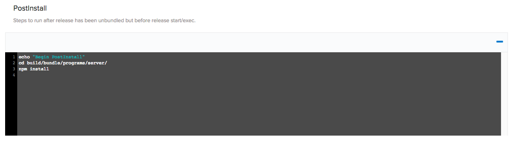

Copy/Paste
~~~
echo "Begin PostInstall"
cd build/bundle/programs/server/
npm install
~~~

#### Exec

Scroll down to your Exec section and enter in the following

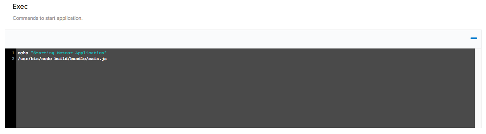

Copy/Paste
~~~
echo "Starting Meteor Application"
/usr/bin/node build/bundle/main.js
~~~

Make sure to click the <b>Save</b> button to save your manifest. The last step is to set our environment variables in our environment.

#### Environment Variables

Navigate to the Environments tab in your application

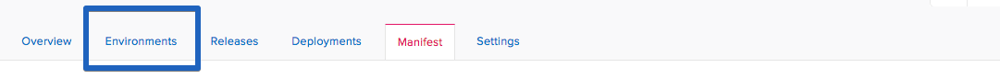

Now click the "Create Environment" text and enter in a name for your environment and a description. Once you are done select the "CREATE ENVIRONMENT" button to continue.

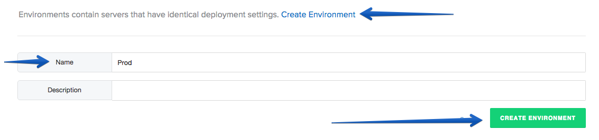

Now click on the Environemnt Variables section to add your variables

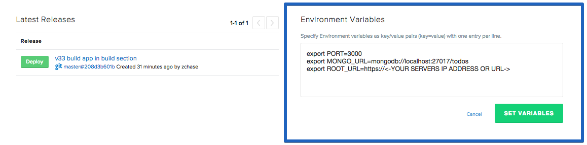

Copy/Paste
~~~
export PORT=3000
export MONGO_URL=mongodb://localhost:27017/todos
export ROOT_URL=https://<-YOUR SERVERS IP ADDRESS OR URL->
~~~

Once you have entered in your Environment Variables click the "Set Variables" button to continue.

### Re-Build Application

Because we have changed our build & deployment steps we need to rebuild our application. Navigate back to your application's home page. To trigger a new build, click the wrench icon in the right hand corner! That button triggers a build of your latest code, build steps, and deployment steps.

## Step 7. Deploy Your Meteor App

Now that we have successfully built our application we are ready to deploy to our server. On the builds page select the "New Deployment" button in the right hand corner.

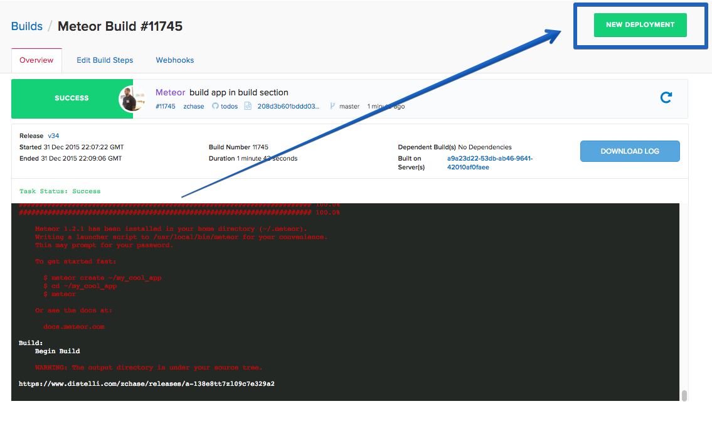

Once you click the button, you should be directed to the deployment page. The first step is to select the "Deploy a Release" option.

Pipelines will now prompt you to select the application you want to deploy. Please select the application we created earlier in the tutorial. For my purposes, my application is "Meteor".

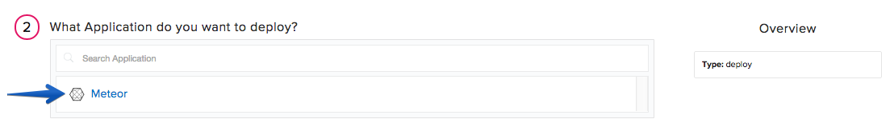

Then you will be asked to select the release you would like to deploy. Please select that latest release, which will be located at the top of the list

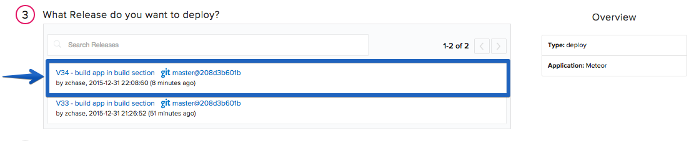

The last step in our deployment is to select the environment you wish to deploy in. Select the environment we created earlier in this tutorial. This should also be the only environment in your application right now

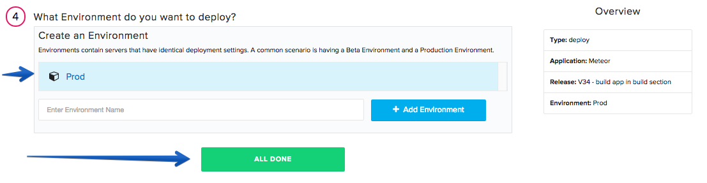

Once you've set up your deployment settings, Pipelines will ask you to add servers. Click the "Add Servers" button to get started. Select the server you configured earlier in the tutorial and add it to your account. Once you have added your server, you can close the "Add Servers" panel and continue with your deployment. You will see a final option to set your delay between deployments on your servers and a "Start Deployment" button.

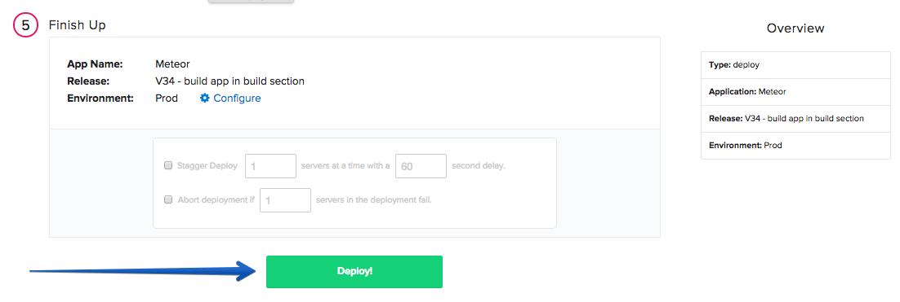

Click the "Start Deployment" button to begin your deployment. You will redirected to a page where you can view the progress of your deployment. Click the "log" button on the left side to view realtime streaming logs for the deployment. Once your deployment is complete, your screen should be similar to the screenshot below:

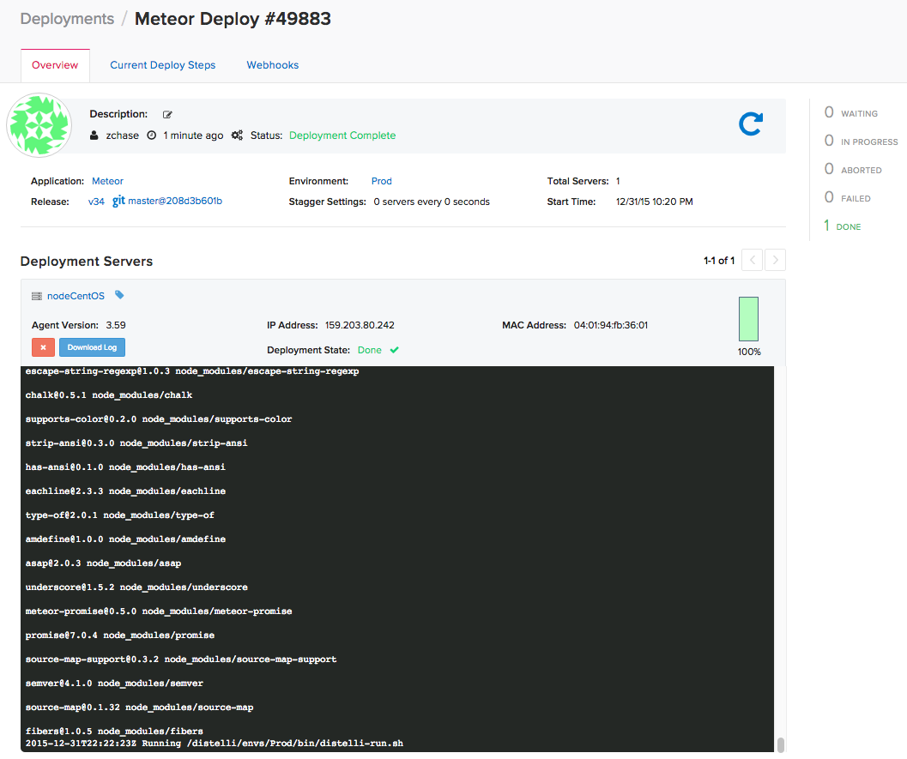

And that's it! You should now be able to point your browser to "You Server's IP Address:3000" and see the sample Meteor Application running on your server!

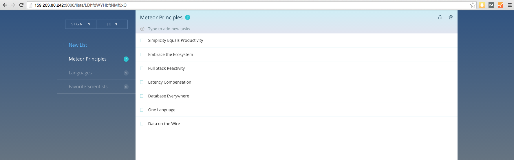

Thank you for following along, and I hope that you have learned how Pipelines can simplify the process behind deploying your Meteor applications to your servers.

