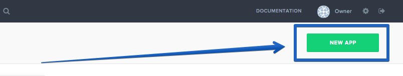

 
PM2 is an advanced, production process manager for Node.js.

### Prerequisites

To complete this tutorial you should have a Node.js app, a server, and knowledge of how to deploy Node.js using Pipelines. If you need a refresher on how to deploy Node.js, visit our deployment tutorial <a href="./application-nodejs-digitalocean.html" target="_blank">here</a>.

Before you begin the tutorial you must:

* Install the Pipelines CLI on the development system. [Installing the CLI](./cli.html)
* Ensure git is installed on the development system. [Download Git](http://git-scm.com/downloads)
* Have a destination server available to deploy software to.
* Install the Pipelines agent on the destination server. [Installing the agent](./agent.html)

## Step 1. Set-up our Project

The first thing we need to do is set up our project.

### Create Node.js Application

For this tutorial I am using a simple "Hello World" Node.js and Express app. To run this application you need to create a directory on your local machine to store your projects files, install express, and then create your `app.js` file.

First lets create our directory and files

~~~
$ mkdir node-pm2
$ cd node-pm2
$ touch app.js
$ npm init
~~~

After entering those commands and following the prompt given by `npm init`, we are now ready to install Express. To install Express enter the following command

~~~
$ npm install express --save-dev
~~~

The last thing we need to do is create the acutal Node.js application. Open `app.js` in your favorite text editor and paste in the following code

~~~
var express = require('express');
var app = express();

app.get('/', function(req, res){
  res.send('Hello World');
});

var server = app.listen(3000, function(){
  console.log('Magic is happening on port 3000')
});
~~~

This application starts a server and listens on port 3000 for a connection and responds with "Hello World."

### Create and Push to a Repository

The next task we need to complete is pushing our files into a GitHub/BitBucket repository. For this tutorial I am using GitHub for my source control. Once you have created a repository and pushed your files into that repository we are ready to deploy our application with Pipelines.

### Login/Create Pipelines Account

Please login to your Pipelines account at this point in the tutorial. If you do not have a Pipelines account, please sign up for one <a href="http://pipelines.puppet.com/signup" target="_blank">here</a>. Once you have logged in/signed up, we are ready to create our app in Pipelines.

### Install the Pipelines Agent on Your Server

Now that we are all set up with Pipelines we can install the agent on our sever. First we need to SSH into our Server. To do this we enter the following command into our terminal:

~~~
$ ssh root@'IP Address of Server'
~~~

Now you will be prompted for the password to your server. If you used Digital Ocean, like I have, when you set up your server Digital Ocean should have send you an email containing the password to that server. If you didn't use Digital Ocean, please enter the password to the server that you configured. Now that we have access to our server, we can install the Pipelines Agent onto it:

<h4>Linux and macOS X</h4>

To install on Linux or macOS X you can use either curl <b>or</b> wget with one of the following syntaxes.
<h5>wget example</h5>

~~~
wget -qO- https://pipelines.puppet.com/download/client | sh
~~~

<h5>curl example</h5>

~~~
curl -sSL https://pipelines.puppet.com/download/client | sh
~~~

<h4>Windows</h4>

To install on Windows copy and paste the following powershell command into a command (cmd) window.

~~~
powershell -NoProfile -ExecutionPolicy Bypass -Command "iex ((new-object net.webclient).DownloadString('https://pipelines.puppet.com/download/client.ps1'))" & SET PATH=%PATH%;%ProgramFiles%/Distelli
~~~

<h4>Complete the Install</h4>

After downloading the agent, you must run the install command to install the agent. To do so use the `agent install` command.

> **Note:** This installation requires root (administrator) permissions.

~~~
jdoe@ServerB:~$ <b>wget -qO- https://pipelines.puppet.com/download/client | sh</b>
This script requires superuser privileges to install packages
Please enter your password at the sudo prompt

[sudo] password for jdoe:
    Installing Distelli CLI 3.55 for architecture 'Linux-x86_64'...
    Downloading https://s3.amazonaws.com/download.distelli.com/distelli.Linux-x86_64/distelli.Linux-x86_64-3.55.gz
To install the agent, run:
    sudo /usr/local/bin/distelli agent install
jdoe@ServerB:~$ <b>sudo /usr/local/bin/distelli agent install</b>
Distelli Email: <b>jdoe@distelli.com</b>
      Password:
    1: User: jdoe
    2: Team: janedoe/teamjane
Team [2]: <b>1</b>
Server Info: https://www.distelli.com/jdoe/servers/d0c4b300-9fcf-2846-ba90-080027c8277c
Starting upstart daemon with name:  dtk-supervise-cc1233c06f7ad94a8d34ac610381242f9ae28bb8
jdoe@ServerB:~$
~~~

<h4>Verify the Install</h4>

To validate the agent is installed and working use the `agent status` command.

~~~
# /usr/local/bin/distelli agent status
Distelli Agent (serverA) is Running with id 766b88c8-e925-11e4-ae8b-080027cc07f7
~~~

You now have the Pipelines agent installed and this server can be added to an environment for application deployments.

For more information on the Pipelines Agent, see the [Pipelines Agent Reference Guide](./agent.html).

## Step 2. Create Pipelines App

To create your app in Pipelines, follow these steps:

Click the new application button on your Pipelines account home screen

Name your app and then select the Repository you would like to connect to. I named my app "node-pm2"

After we click the button to connect to our Repository, we then select the appropriate repo that contains our code. In this example I stored my code in the repo name 'nodePM2'. Make sure to select the repo we set up earlier in the tutorial.

Then select the appropriate branch for your deployment. I have only a master branch, but you can deploy any branch from your repo!

### Create `distelli-manifest.yml`

**Note:** This tutorial assumes that the server is out of the box and needs to have your application dependencies installed & configured. Once your application dependencies are installed & configured you can remove those commands from your <b>Manifest</b>.

You will need to create a `distelli-manifest.yml` file so you can tell Pipelines what your Build & Deployment steps are. Create a `distelli-manifest.yml` in your project's directory and paste the below contents into your file:

> **Note:** Replace <-username-> with your Pipelines username & <-app name-> with your Pipelines Application's Name.

~~~
<-username->/<-app name->:

  PkgInclude:
    - '*'

  PkgExclude:
    - node_modules/

  PreRelease:
    - npm install

  PreInstall:
    - sudo apt-get update
    - sudo apt-get install nodejs-legacy -y
    - echo "Installing PM2"
    - sudo npm install -g pm2
    - echo "Done Installing PM2"

  PostInstall:
    - npm install

  Start:
    - echo "Starting application"
    - /usr/bin/pm2 start app.js
~~~

One other thing you will notice is that we are installing `nodejs-legacy` and not `nodejs`. We are doing this because PM2 is looking for `/usr/bin/node` when running the Node.js app, but installing `nodejs` doesn't create that file. Installing `nodejs-legacy` will allow you run PM2 without any further configuration steps.

### Build Steps

Next Pipelines will ask you set your build steps. You will need to the lower part of the section and check the box that says "Advanced User? Use a `distelli-manifest.yml` instead of editting your build steps in the app". Instead of using the Builds Steps, we will use the `distelli-manifest.yml` we just created.

The final step is select our Build Image. In this case we are going to select **Distelli Javascript (Docker)** for our Node.js App. Select the **Auto Build** checkbox and the the **Looks good. Start Build!**

Now our build should be automatically building. You can watch its progress in the builds tab on your Pipelines account. You should see that your build has been built successfully.

## Step 5. Deploy Your Build

Now that we have successfully built our application we are ready to deploy to our server. On the builds page select the "New Deployment" button in the right hand corner.

Once you click the button, you should be directed towards the Pipelines deployment page. The first step is to select the "Deploy a Release" option.

Pipelines will now prompt you to select the application you want to deploy. Please select the application we created earlier in the tutorial. For my purposes, my application is "node-pm2".

Then you will be asked to select the release you would like to deploy. For now there should be only one release for deployment.

The last step in our deployment is to select the environment you wish to deploy in. For this tutorial, I will be deploying to our production environment, but for your purposes you can select whichever environment you please.

Once you've set up your deployment settings, Pipelines will ask you to add servers. Click the "Add Servers" button to get started. Select the server you configured earlier in the tutorial and add it to your account. Once you have added your server, you can close the "Add Servers" panel and continue with your deployment. You will see a final option to set your delay between deployments on your servers and a "Start Deployment" button.

Click the "Start Deployment" button to begin your deployment. You will redirected to a page where you can view the progress of your deployment. Click the "log" button on the left side to view realtime streaming logs for the deployment. Once your deployment is complete, your screen should be similar to the screenshot below:

And that's it! You should now be able to point your browser to "You Server's IP Address:3000" and see the "Hello World" text displayed!

Thank you for following along, and I hope that you have learned how Pipelines can simplify the process behind deploying your Node.js with PM2 applications to your servers.
