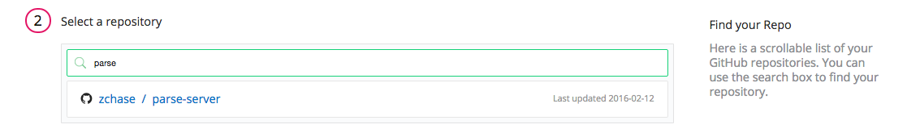

 

This guide will help you migrate your Parse application from a Parse hosted back-end to a self-hosted back-end using Docker. If you do not want to use Docker with your Parse-Server, please use this <a href="/docs/tutorials/migrate-parse-app">guide</a>. This is based on <a href="https://github.com/ParsePlatform/parse-server/wiki/Migrating-an-Existing-Parse-App" target="_blank">Parse's migration guide</a>. The guide assumes the following:

* [Created a Pipelines account](https://pipelines.puppet.com/signup)
* Have a Parse Application
* Using MongoDB as your new database
* Beta and Production server with [Docker Installed](https://docs.docker.com/engine/installation/)
* A [GitHub](https://github.com/)/[BitBucket](https://bitbucket.org/) Repository to store your application

## Step 1. Migrate Your Database

Our first step to complete is migrating your Parse database. Parse recommends using MongoDB and they have built a great tool to make the migration as painless as possible. Parse has a Database migration guide [here](https://parse.com/docs/server/guide#database). Before we can continue you will need to have your production database set up. After you database instance is ready, we can migrate over your Parse data. If you do not want to migrate your data right now, you can still get everything set up with an empty MongoDB instance. Please keep in mind that for testing your new Parse-Server it is highly reccomended you migrate your existing data. Once you have completed your migration, we can set up your development & production environments.

## Step 2. Create your Parse Server

To get started create a directory on your local machine for your Parse server. In your directory create an `app.js` file and run the following command:

~~~
$ npm init
~~~

Follow the prompts and at the end you will have a `package.json` file. This file will assist you in making the migration from your local machine to your beta/production servers. Next run the following command to install the Parser Server & Express module in your project and save it as an application dependency.

~~~
$ npm install parse-server express --save
~~~

Open your `app.js` file and replace the bold text with the values that map back to your application and database:

~~~
var express = require('express');
var ParseServer = require('parse-server').ParseServer;

var app = express();

var port = process.env.PORT || 8080;

// Specify the connection string for your mongodb database
// and the location to your Parse cloud code
var api = new ParseServer({
  databaseURI: <b>YOUR MONGODB CONNECTION STRING</b>,
  cloud: <b>YOUR CLOUD PATH</b>, // Provide an absolute path
  appId: <b>YOUR APP ID</b>,
  masterKey: <b>YOUR MASTER KEY</b>, //Add your master key here. Keep it secret!
  fileKey: <b>OPTIONAL FILE KEY</b>,
  serverURL: 'http://<b>SERVER IP ADDRESS</b>:' + port + '/parse' // Don't forget to change to https if needed
});

// Serve the Parse API on the /parse URL prefix
app.use('/parse', api);

// Hello world
app.get('/', function(req, res) {
  res.status(200).send('Express is running here.');
});

app.listen(port, function() {
  console.log('parse-server-example running on port ' + port + '.');
});

~~~

Save your new `app.js` file. The next step is to push your Parse-Server application to source control. Commit and push your application to your GitHub or BitBucket Repository.

### Create Dockerfile

To Dockerize your Parse-Server we need to create a Dockerfile in your project's directory. The contents of the Dockerfile are below:

~~~
FROM alpine:3.1

# Update
RUN apk add --update nodejs

# Install app dependencies
COPY package.json /src/package.json
RUN cd /src; npm install

# Bundle app source
COPY . /src

EXPOSE  8080
CMD ["node", "/src/app.js"]
~~~

## Step 3. Create & Set-Up Pipelines Application

Now that we have your Parse-Server application ready to go, we can set up your application in Pipelines. The goal of this step is the create a Beta and Production environment for your new application.

### Create Application

To create your app in Pipelines, follow these steps:

Click the new application button on your Pipelines account home screen

Select the Repository type where you are storing your applications files.

After we click the button to connect to your Repository, we then select the appropriate repo that contains your code.

Select the appropriate branch for your deployment. I have only a master branch, but you can deploy any branch from your repo!

Next, we set your build steps. This is the step where you declare that you are building a Docker container. In the right corner, click <b>Build With Docker File</b>, and enter in your Docker Hub or ECR credentials

The final step is select your Build Image. In this case we are going to select **Distelli Javascript (Docker)** for your Node.js Application. Select the **Auto Build** checkbox and the the **Looks good. Start Build!**

**Note:** The Auto-Build feature builds your application everytime you commit code to your repository

Now your application should be automatically building. You can watch its progress by navigating to the builds tab on your Pipelines account and clicking on your build.

### Setting Up Port Mapping

To be able to access the application running in your Docker container, we need to set up Docker Port Mapping. Navigate to your application's page in Pipelines, click the <b>Settings</b> tab, and expand the <b>Docker</b> section. You will see a section to define your Docker Port Mapping. Set your Container Port to `8080` and the Host Port to `80`.

### Create Environments

Now that your application has been successfully built, it is ready to be deployed. First we will set up your environments within Pipelines. To start navigate to your application and click on the <b>Environments</b> tab.

Click the <b>Create Environment</b> link to create your first environment. Enter in the information for your Parse Beta environment:

Repeat the same process to create your Parse Production Environment. When you have finished you will have two environments for you application.

#### Install Agent on Servers

To add your severs to your Application's environments you need to install the Pipelines Agent on each of your servers. You will need remote access to each of your servers to complete the install. If you would like more information on installing the Pipelines agent, visit [Installing the Pipelines Agent](./agent.html). 

To add your server to your environment navigate to your Pipelines Environment, click the <b>Servers</b> tab, and then select the <b>Add Servers</b> link on the right hand side of the screen.

A side panel will prompt you to select a Server to add to your environment. Remember we have a Beta and Production environment, so add the appropriate server to the appropriate environment. 

### Create Application Pipeline

The final step for setting-up your application in Pipelines is create your application pipelines. This feature will help you control you application and set deployment rules. Every time we successfully build your Parse-Server application, we want it to automatically deploy to your Beta stack. To start navigate to your application in Pipelines and find the <b>App pipeline</b> section.

Click the <b>Add Step</b> button, select your Beta environment, and click <b>Add</b>. A pipeline will be created for your Beta environment. Select the <b>Auto Deploy</b> checkbox. Now your application will automatically be deployed upon every successful build of your Parse-Server application.

Repeat the same steps to create an additional pipeline for your Production environment. For you Production environment, <b>DO NOT</B> select the auto-deploy checkbox. We want to control when your server is deployed to your production environment.

## Step 4. Deploy to Beta

Our application has been created, and build & deployment steps have been configured. your next step is deploy your Parse-Server to your Beta Stack and begin testing. In your <b>App pipelines</b> section, click <b>Promote</b> for your Beta environment.

After your server has successfully deployed to your Beta environment, you need to create a Development version of your Parse application. To create your Development clients update your application to the latest Parse SDK, and point your application at your new Parse-Server URL. Below are code examples on how to point your client at your new server:

### Swift
~~~
let configuration = ParseClientConfiguration {
    $0.applicationId = "<b>YOUR_APP_ID</b>"
    $0.clientKey = ""
    $0.server = "http://<b><-BETA SERVER IP ADDRESS-></b>/parse"
}
Parse.initializeWithConfiguration(configuration)
~~~

### Objective-C
~~~
[Parse initializeWithConfiguration:[ParseClientConfiguration configurationWithBlock:^(id<ParseMutableClientConfiguration> configuration) {
   configuration.applicationId = @"<b>YOUR_APP_ID</b>";
   configuration.clientKey = @"";
   configuration.server = @"http://<b><-BETA SERVER IP ADDRESS-></b>/parse";
}]];
~~~

### Android
~~~
Parse.initialize(new Parse.Configuration.Builder(myContext)
    .applicationId("<b>YOUR_APP_ID</b>")
    .clientKey(null)
    .server("http://<b><-BETA SERVER IP ADDRESS-></b>/parse")

    ...

    .build()
);
~~~

### JavaScript
~~~
Parse.initialize("<b>YOUR_APP_ID</b>");
Parse.serverURL = 'http://<b><-BETA SERVER IP ADDRESS-></b>/parse'
~~~

### .NET
~~~
ParseClient.initialize(new ParseClient.Configuration {
    ApplicationId = "<b>YOUR_APP_ID</b>",
    Server = "http://<b><-BETA SERVER IP ADDRESS-></b>/parse"
});
~~~

### PHP
~~~
ParseClient::initialize('<b>YOUR_APP_ID</b>', '<b>YOUR_CLIENT_KEY</b>', '<b>YOUR_MASTER_KEY</b>');
ParseClient::setServerURL('http://<b><-BETA SERVER IP ADDRESS-></b>/parse');
~~~

### Test Your New Server

Once your Development client has been created. Test your new Parse-Serve with your new clients. Make sure everything is working as expected. This process can take a few days or weeks, so do not rush your testing. You want to make sure nothing in your application is broken and it works as expected.

## Step 5. Promote to Production

Once you are satisfied with your testing promote your server into production, and release your migrated Parse application to your customers. You can follow the same steps as above for your Beta environment:

1. Promote your release from your Beta environment to your Production environment
2. Point your clients to your new Production environment
3. Test your application
4. Publish your application

## Summary

Once you have completed this guide you will have:

* Migrated your Parse Application's back-end
* Created a Beta Environment for your application's back-end
* Created a Production Environment
* Published a new Parse Application using your new Back-end

The Beta environment is where you can test any changes you need to make to your application's back-end before you push it to production. This helps ensure that only fully tested features and changes are pushed to your customers.
