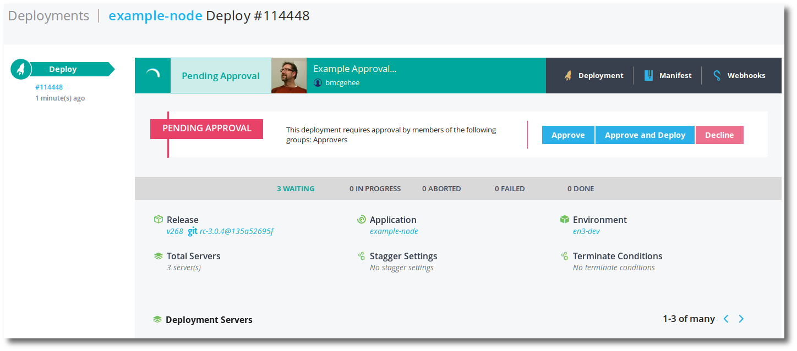
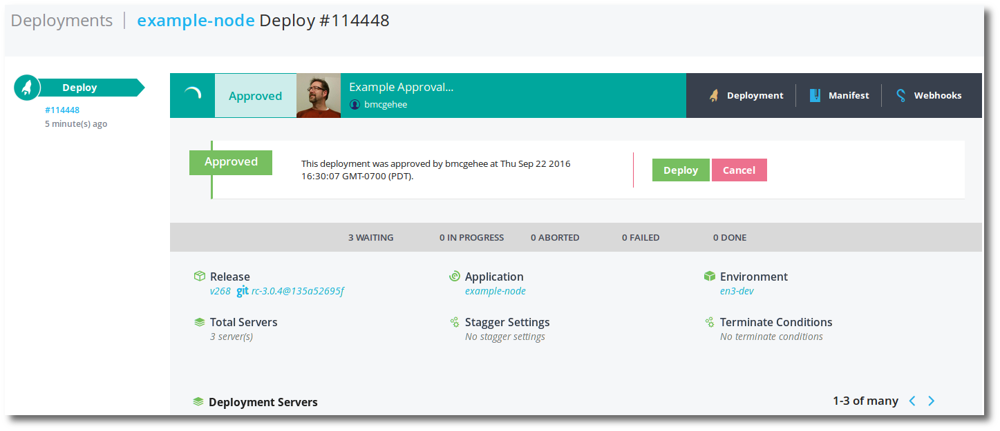
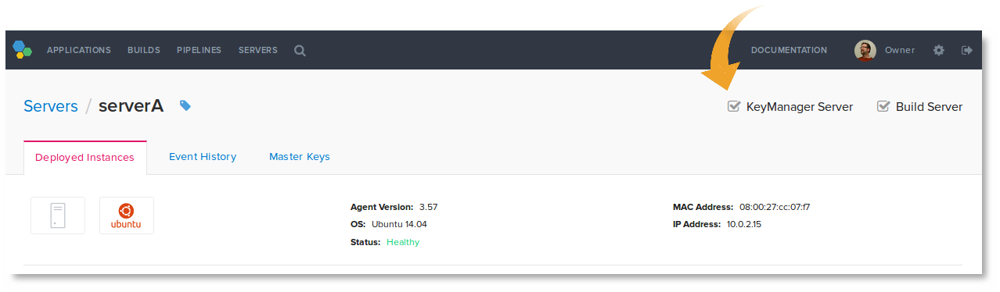
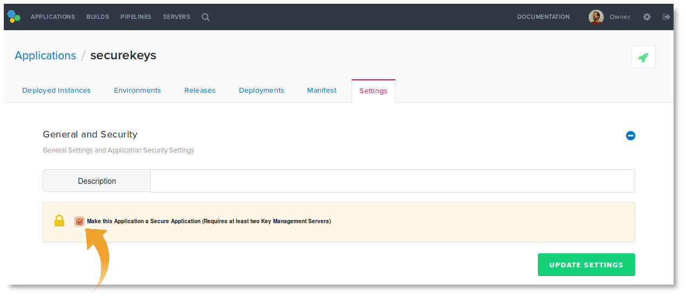
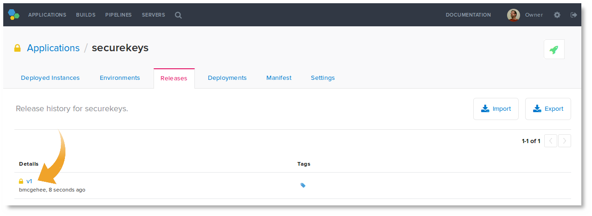
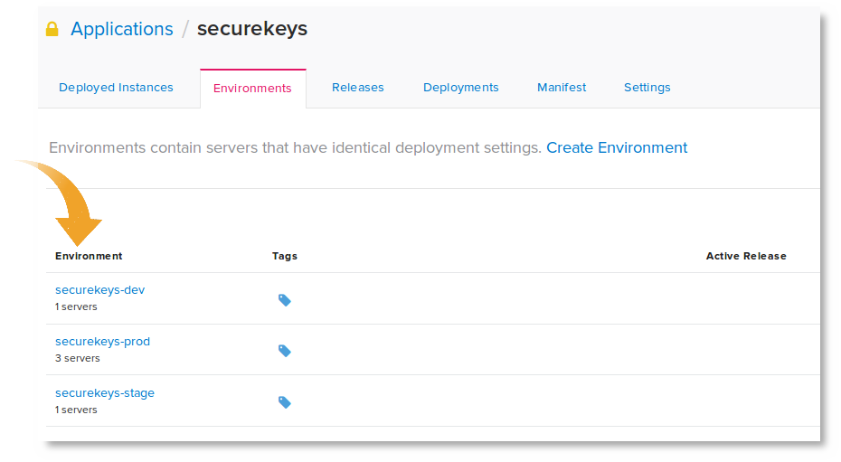
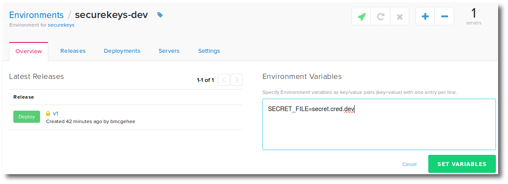
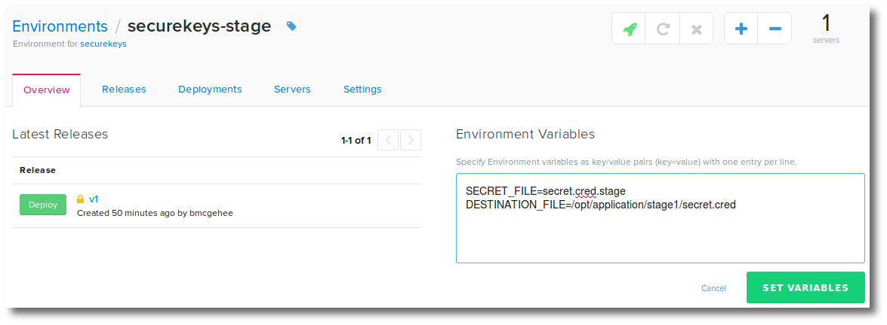
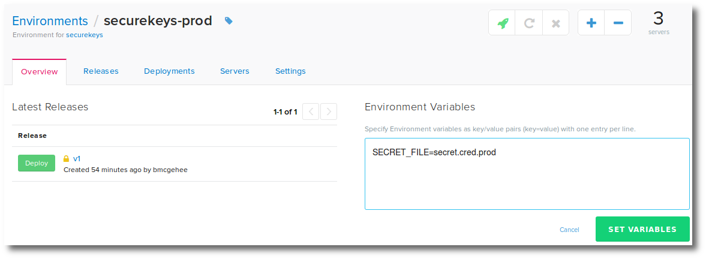

## Implementing deployment approvals

Deployments to an environment supports approvals. To configure an environment for approvals, the following steps must be completed.

1. [Add users (approvers) to the account.](./users.html)
1. [Create an approvers group.](./group.html)
1. [Add approvers to the group.](./group.html)
1. [Enable approvals on an environment.](./environment.html)

### Approval Roles

There are three roles in an approval:

* Account Owner - The creator and owner of the account.
* Deployer - The account that triggers the deployment.
* Approver - The account that can approve the deployment.

These roles may be the same account or different accounts.

### Approval Process

#### 1. Initiate a deployment

This deployment initiation can be done manually, by the <i>Deployer</i>, or automated via an [Application Pipeline](./pipeline.html). When a deployment that requires approval is initiated, the deployment enters into a state of **Pending Approval**.

An email is sent to the eligible Approver(s) indicating a deployment is awaiting approval, with a link to the deploy.

#### 2. Approval

An <i>Approver</i> can approve or decline the deployment. When approving the pending deployment, there are 3 approval options:

<table>
  <tr><th>Option</th><th>Description</th><th>Next State</th></tr>
  <tr><td><b>Approve</b></td><td>Approve the deployment. This will approve the application deployment, but not begin the deploy.</td><td>Approved</td></tr>
  <tr><td nowrap><b>Approve and Deploy</b></td><td>Approve and begin the deployment.</td><td nowrap>In Progress</td></tr>
  <tr><td><b>Decline</b></td><td>Decline the deployment. This will cancel the deployment and provide a message on why declined.</td><td>Declined</td></tr>
</table>

#### 3. Deploy (if only Approved)

If the <i>Approver</i> only Approved the deploy, the deploy will enter the state **Approved**. This state still requires a user (Approver or Account owner) to complete the deploy by clicking the **Deploy** option.

The approved deployment can also be **Canceled**.

**Note:** The __Account Owner__ can both Deploy and Approve deployments.

## Using secure packages to deploy secrets

This document describes setting up and using Pipelines secure packages to securely deliver secret keys.

Secure packages allows you to easily securely encrypt a release that will only be decrypted on deployment. 

### The Example Scenario

To illustrate this solution, consider an example scenario where you need to secure a set of applications secrets that differ depending on what environment they deploy to, dev, stage, or production.

There are three secret files and three environments.

<table>
    <tr>
        <td><b>Environment</b></td><td><b>Filename</b></td>
    </tr><tr>
        <td>dev</td><td>secret.cred.dev</td>
    </tr><tr>
        <td>stage</td><td>secret.cred.stage</td>
    </tr><tr>
        <td>prod</td><td>secret.cred.prod</td>
    </tr>
</table>

### Provisioning Key Management Servers

Secure packages requires you provision at least two key management servers and they remain up and available for encryptions and decryptions. You can easily rotate in and out key management servers as long as one is up to exchange key information.

If you lose all key management server you can not deploy an encrypted release.

**Note:** To enable key management on a server, the server must be running Pipelines Agent 3.59 or greater.

To provision a key management server in Pipelines:

1. Add a server (or use an existing one) by installing the [Pipelines Agent](./agent.html).
1. In Pipelines, navigate to the server details.
1. Enable the **Key Management Server** feature.

Ensure you do this with at least two servers.

**Note:** These key management servers can still do builds and consume deployments.

### Creating the Application

Next you will create an application in Pipelines to store the encrypted credentials for future deployments. This will be one application with the three secrets files.

This application must be marked as secure before pushing the first release.

**Note:** You should setup your own S3 bucket in Pipelines before doing your first push to ensure your encrypted release is in your S3 bucket. To do so see [Using Amazon S3 Bucket in Pipelines](./integrate-amazon.html).

To create a secure application for this scenario do the following:

1. On a secure computer place the three secret files into an empty folder.

~~~
jdoe@ServerB~$ mkdir securekeys
jdoe@ServerB~$ cd securekeys
jdoe@ServerB~/securekeys$ cp /keys/dev/secret.cred ./secret.cred.dev
jdoe@ServerB~/securekeys$ cp /keys/stage/secret.cred ./secret.cred.stage
jdoe@ServerB~/securekeys$ cp /keys/prod/secret.cred ./secret.cred.prod
~~~

1. Create a Pipelines manifest file and place it in the same directory.

~~~
jdoe/securekeys:
  Env:
    - SECRET_FILE: "set_this_value_in_the_distelli_web UI_env_variables"
    - DESTINATION_FILE: "/opt/application/secret.cred"
  PkgInclude:
    - secret.cred.*
  PostInstall:
    - if [ $SECRET_FILE == "set_this_value_in_the_distelli_web UI_env_variables"]; then
    -   echo "You must set the SECRET_FILE environment variable in the Pipelines web UI."
    -   rm secret.cred.*
    -   exit 1
    - fi
    - mv -f $SECRET_FILE $DESTINATION_FILE
    - rm secret.cred.*
    - chmod 600 $DESTINATION_FILE
~~~

1. Create the application using the Pipelines CLI <code>distelli create</code> command.

**Note:** This assumes you have installed the Pipelines CLi on this computer. See [Installing the Pipelines CLI](./cli.html).

~~~
distelli create jdoe/securekeys
~~~

You have created the application. **Do not do a push of the release**. You must first make the application a secure package in the Pipelines web UI.

### Securing your Application

To enable encryption of your releases do the following:

1. In the Pipelines web UI, navigate to the application **securekeys**.
1. Click **settings**.
1. Expand the **General and Security** section.
1. Check the **Make this Application a Secure Application (Requires at least two Key Management Servers)** option.

    

That is it. When you build or push the application Pipelines will encrypt the release and put it in your S3 bucket.

### Pushing your Release

On the secure computer, return back to the directory where you stored the three secret files and do a `distelli push`.

~~~
jdoe@ServerB~/securekeys$ distelli push
https://www.distelli.com/jdoe/releases/a-123456789abc
~~~

You have now created a secure release of your application. You can view the encrypted release in your S3 bucket, but not the contents. You can also view the release in the Pipelines web UI and determine this is an encrypted package by the lock icon.

**Note:** If you pushed a release before securing the application you can delete that release from your S3 bucket.

**Note:** You can deploy this release **only** if you have a key management server.

At this point you can safely delete your clear-text secret files from the directory you created to push to Pipelines.

### Setting up Environments

Next you will set up three environments for doing deplyments to.

1. In the Pipelines web UI navigate to the application **securekeys**.
1. Create three new environments with the following names:
   * securekeys-dev
   * securekeys-stage
   * securekeys-prod
1. And add server(s) to the environments.

### Setting the Application Environment Environment Variables

Go to each environment and set the appropriate environment variables:

### Deploying the Secure Application

You can now deploy the secure release of the application to your environments. On deployment they will be decrypted, the correct file will be moved to the correct destination, and any other files are destroyed.

### Conclusion

You no longer have to keep the secrets in a clear text file. You have them in an encrypted storage and can deploy them as necessary. 

If, in the future, the secrets change, you will have to push the secrets back up to a new encrypted release.

### About Key Management Servers

Initially, when you setup key servers, you must provision two or more. Imagine the following scenarios.

* You initially provision key server A and key server B. They are both up and running and providing keys for encryption and decryption.
* Key server B goes down fatally.
* Things will continue to work as expected.
* You bring up key server C.
* Key server C will learn the keys from key server A.
* Key server A goes down fatally.
* Things will continue to work as expectred.
* You bring up key server D.
* Key server D learns the keys from key server C.
* Key server C and key server D fatally go down.
* You bring up key server E.
* Key server E never learned the keys.
* Any currently encrpyted packages will not be able to be deployed and decrypted.
* New releases can be encrypted and decrypted with key server E.
* If you attempt to make an application secure with only one key server working, it will fail. You must have at least two.

