
 

Docker Compose is a tool for defining and running multi-container Docker applications. This tutorial will walk you through how to deploy a Django, NGNIX, Postgres, & Redis Application. We will be deploying a sample application from <a href="https://realpython.com/blog/python/django-development-with-docker-compose-and-machine/" target="_blank">Real Python</a>.

## Before You Begin

To successfully complete this tutorial you will need:

* [A free Pipelines account](https://pipelines.puppet.com/signup)
* A [GitHub](https://www.github.com) or [BitBucket](https://bitbucket.org/) Account
* A server with <a href="https://docs.docker.com/engine/quickstart/" target="_blank">Docker</a> and <a href="https://docs.docker.com/compose/install/" target="_blank">Docker Compose</a> Installed

## Step 1. Fork Application Repository

The first step is to fork the application's GitHub repository. You can find the repository <a href="https://github.com/realpython/dockerizing-django" target="">here</a>. Once you have forked the repository clone it onto your local machine.

~~~
$ git@github.com:<-github username->/dockerizing-django.git
~~~

Once you have successfully cloned the repository to your local machine navigate into your project's directory.

## Step 2. Create distelli-manifest.yml

Inside of your project's directory create a new file, name `distelli-manifest.yml`. The Pipelines Manifest is a set of instructions for building and deploying your application. Below are the contents of our `distelli-manifest.yml`:

#### distelli-manifest.yml

> **Note:** Replace <-username-> with your Pipelines username & <-app name-> with your Pipelines Application's Name. 

~~~
<-username->/dockerizing-django:
  PkgInclude:
    - '*'
  PreInstall:
    - echo "Starting PreInstall"
    # Uncomment this section after the first deployment
    #- cd /distelli/env/$DISTELLI_ENV
    #- sudo /usr/local/bin/docker-compose down
  Start:
    - cd $DISTELLI_INSTALLHOME
    - echo "Start Application"
    - sudo /usr/local/bin/docker-compose build
    - sudo /usr/local/bin/docker-compose up -d
    - sudo /usr/local/bin/docker-compose run web /usr/local/bin/python manage.py migrate
~~~

Below are explanations of what is happening in during each section of the manifest:

#### PreInstall

The PreInstall section is stopping and removing any old containers spun up by Docker Compose. This step is important because we need to ensure that each time we deploy our applications there are no leftover containers running.

#### Start

In our start section we are doing three things: building the images, spinning up and running the containers, and performing any necessary migrations.

#### Push your Code to GitHub

Once you have finished create your `distelli-manifest.yml` you can push your changes to your repository. To push your changes run the following commands:

~~~
$ git add .
$ git commit -m "added distelli manifest"
$ git push origin master
~~~

## Step 3. Create Pipelines Application

If you do not have a Pipelines account, please [Sign Up](http://pipelines.puppet.com/signup) for one now. 

To create your app in Pipelines, follow these steps:

Click the new application button on your Pipelines account home screen

Select the Repository type where you are storing your applications files. 

After we click the button to connect to our Repository, we then select the appropriate repo that contains your code.

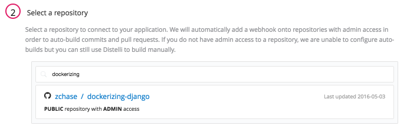

Select the appropriate branch for your deployment. I have only a master branch, but you can deploy any branch from your repo!

Next Pipelines will ask you set your build steps. We have created a `distelli-manifest.yml`, so we will check the checkbox to use this file:

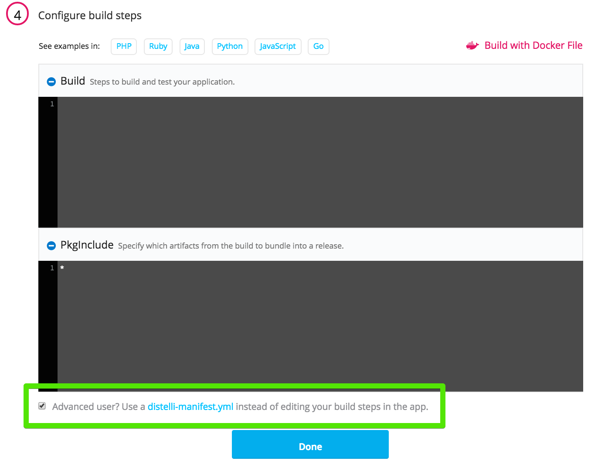

The final step is select our Build Image. In this case we are going to select "Pipelines Base" for our Application. Select the <b>Auto Build</b> checkbox and the the <b>Looks good. Start Build!</b>.

> **Note:** The Auto-Build feature builds your application every time you commit code to your repository.

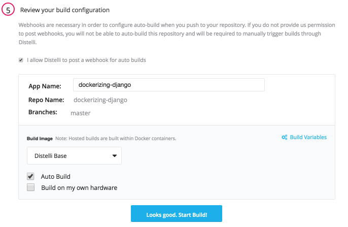

Visit the <b>Builds</b> to view the progress of your application's build.

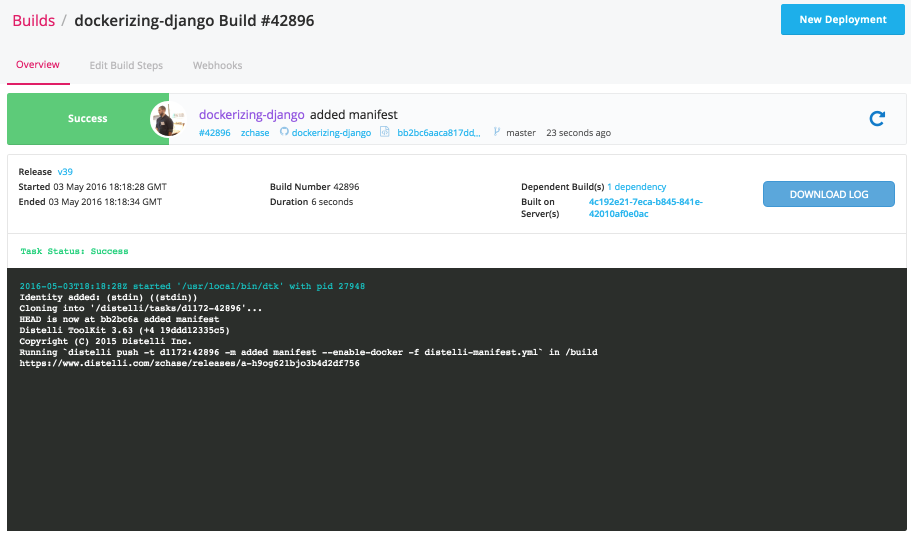

## Step 4. Install Pipelines Agent and Add Server

The next step in deploying our app is to make sure you have a server to run your application on. You can use any type of server - public cloud, private cloud or physical. Pipelines will let you deploy your code to  Vagrant VMs or servers in a VPC. You can even deploy to the server under your desk. For this tutorial I am going to be deploying to a server hosted by DigitalOcean. 

> **Note:** You will need remote access to the server you are deploying to & root (administrator) permissions.

### Install Pipelines Agent on Your Server

To be able to deploy your application to your server you will need to install the Pipelines Agent. You will need remote access to your server to complete the installation. Please consult the below information on how to install the Pipelines Agent on your server.

#### Linux and macOS X

To install on Linux or macOS X you can use either curl <b>or</b> wget with one of the following syntaxes.
##### wget example

~~~
wget -qO- https://pipelines.puppet.com/download/client | sh
~~~

##### curl example

~~~
curl -sSL https://pipelines.puppet.com/download/client | sh
~~~

#### Complete the Install

To complete the install of the agent, you must issue the `/usr/local/bin/distelli agent install` command.

~~~
/usr/local/bin/distelli agent install
~~~

~~~
ServerA:~$ <b>wget -qO- https://pipelines.puppet.com/download/client | sh</b>
This script requires superuser privileges to install packages
Please enter your password at the sudo prompt

[sudo] password for bmcgehee: 
    Installing Distelli CLI 3.51 for architecture 'Linux-x86_64'...
    Downloading https://s3.amazonaws.com/download.distelli.com/distelli.Linux-x86_64/distelli.Linux-x86_64-3.51.gz
To install the agent, run:
    sudo /usr/local/bin/distelli agent install
ServerA:~$ <b>sudo /usr/local/bin/distelli agent install</b>
Distelli Email: jdoe@distelli.com
      Password: 
    1: User: jdoe
    2: Team: janedoe/TeamJane
Team [2]: <b>1</b>
Server Info: https://www.distelli.com/jdoe/servers/12345678-4765-ac42-bd7a-080027c8277c
Starting upstart daemon with name:  
~~~

#### Verify the Install

To validate the agent is installed and working use the `/usr/local/bin/distelli agent status` command.

> **Note:** This installation requires root (administrator) permissions.

~~~
/usr/local/bin/distelli agent status
Distelli Agent (serverA) is Running with id 
~~~

If you would like more information on installing the Pipelines agent, visit [Installing the Pipelines Agent](./agent.html). 

### Create New Environment

Now that we have installed the Pipelines Agent we need to create an environment and add our server to that environment. To start navigate to your application's page in Pipelines and click on the <b>Environments</b> tab.

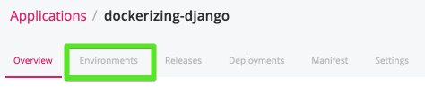

On the Environments page click the <b>New Environment</b> button. Enter in a name for your new environment and then click the <b>Create Environment</b> button.

## Step 5. Deploy Application

Now that we have successfully built our application we are ready to deploy to our server. On the builds page select the <b>New Deployment</b> button in the right hand corner.

### Deploy your Application

Once you click the button, you should be directed to the Pipelines deployment page. The first step is to select the <b>Deploy a Release</b> option.

Pipelines will now prompt you to select the application you want to deploy. Please select the application we created earlier in the tutorial.

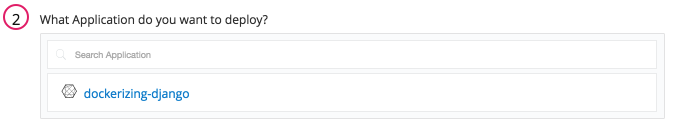

Then you will be asked to select the release you would like to deploy. Make sure to select your latest release, which is located at the top of the list.

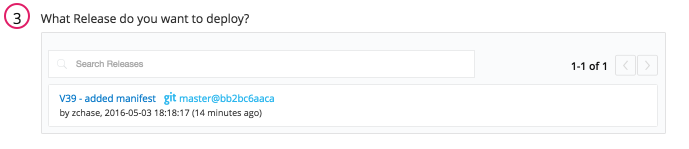

The last step in our deployment is to select the environment you wish to deploy in. Select the environment we created earlier in the tutorial.

Now Pipelines will ask you to add your server. Click the <b>Add Servers</b> button to get started. Select the server you configured earlier in the tutorial and add it to your account. Once you have added your server, you can close the <b>Add Servers</b> panel and continue with your deployment. You will see a final option to set your delay between deployments on your servers and a <b>Deploy!</b> button.

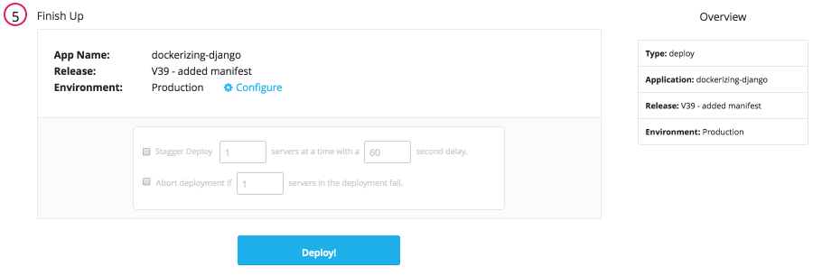

Click the <b>Deploy!</b> button to begin your deployment. You will redirected to a page where you can view the progress of your deployment. Click the <b>log</b> button on the left side to view real time streaming logs for the deployment.

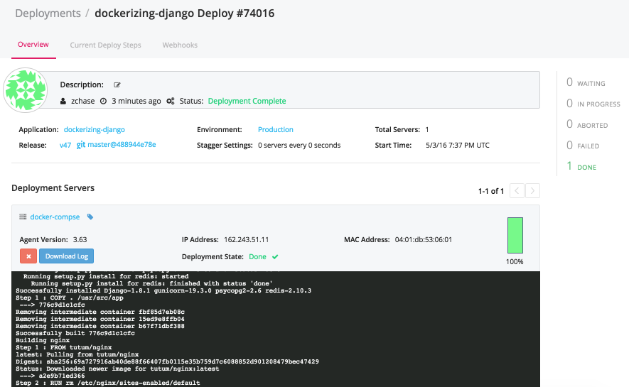

### View Your Application

And that's it! Your Django application has been deployed. Point your browser towards <b>http://<-Your Server’s IP Address-></b> to view your application.

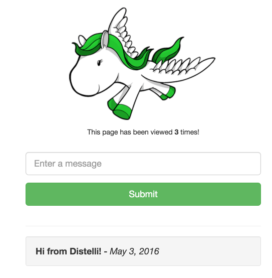

## Step 6. Update Application

Our final step is to update our application. You can do this however you want. I will be changing some text in the application, but feel free to play around with the application as much as you want. Once you are done making changes we will update our manifest. Uncomment all the lines in the manifest. It should be identical to below:

~~~
<-username->/dockerizing-django:
  PkgInclude:
    - '*'
  PreInstall:
    - echo "Starting PreInstall"
    - cd /distelli/env/$DISTELLI_ENV
    - sudo /usr/local/bin/docker-compose down
  Start:
    - cd $DISTELLI_INSTALLHOME
    - echo "Start Application"
    - sudo /usr/local/bin/docker-compose build
    - sudo /usr/local/bin/docker-compose up -d
    - sudo /usr/local/bin/docker-compose run web /usr/local/bin/python manage.py migrate
~~~

Commit your changes, watch Pipelines kick off a build, and finally deploy your application's changes to your server!

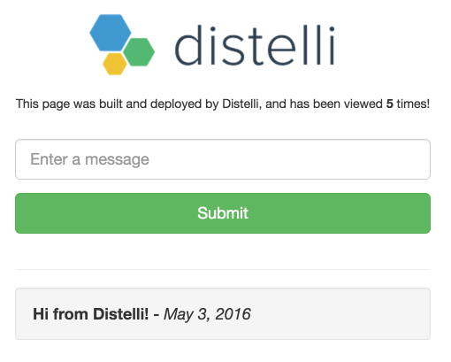

