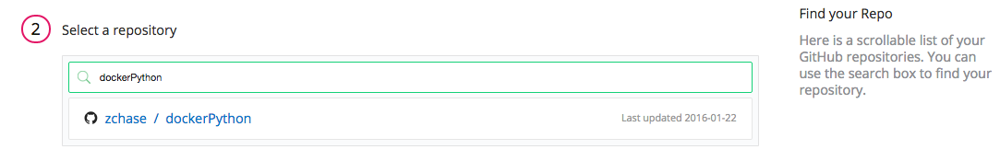
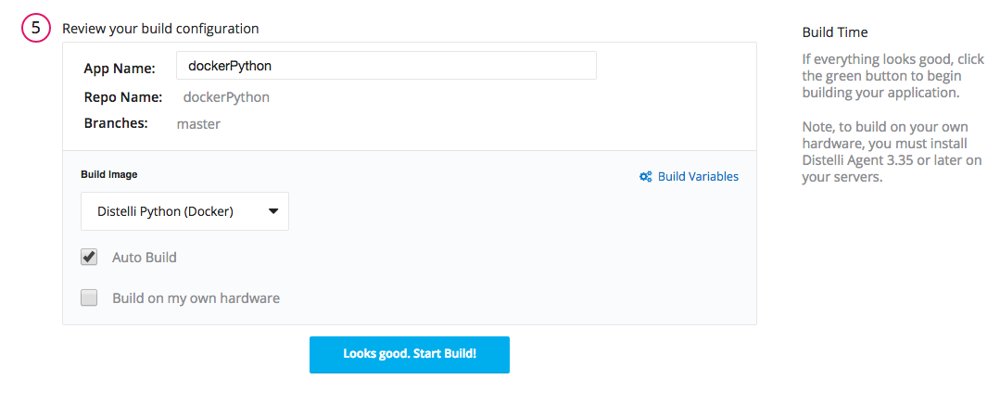
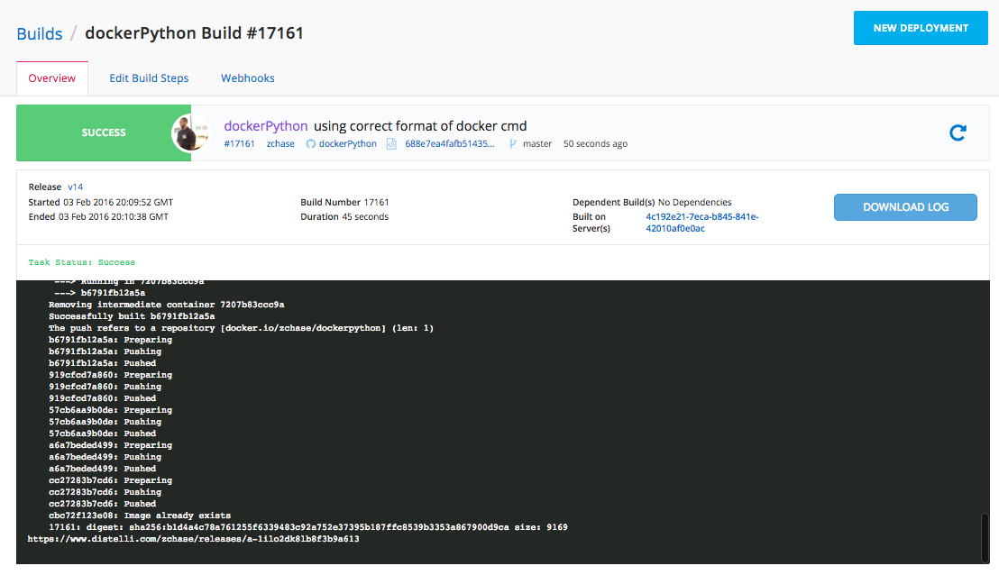
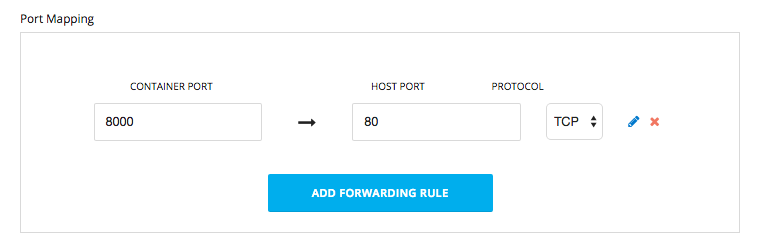
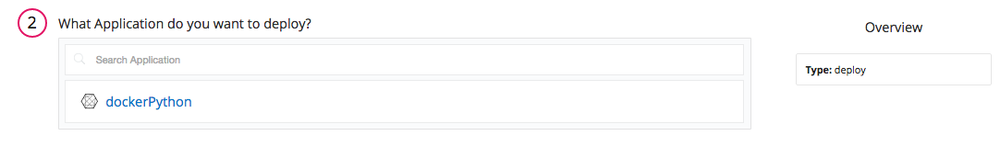
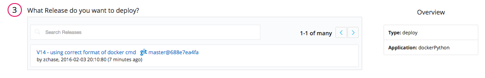
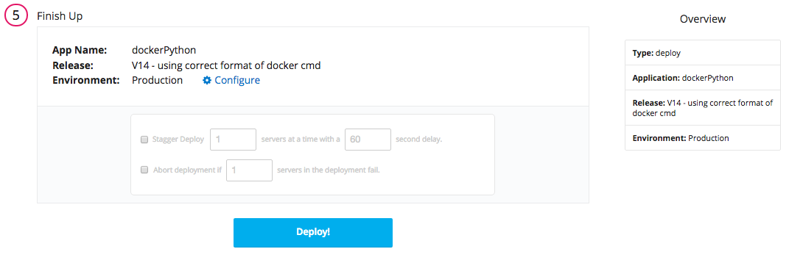
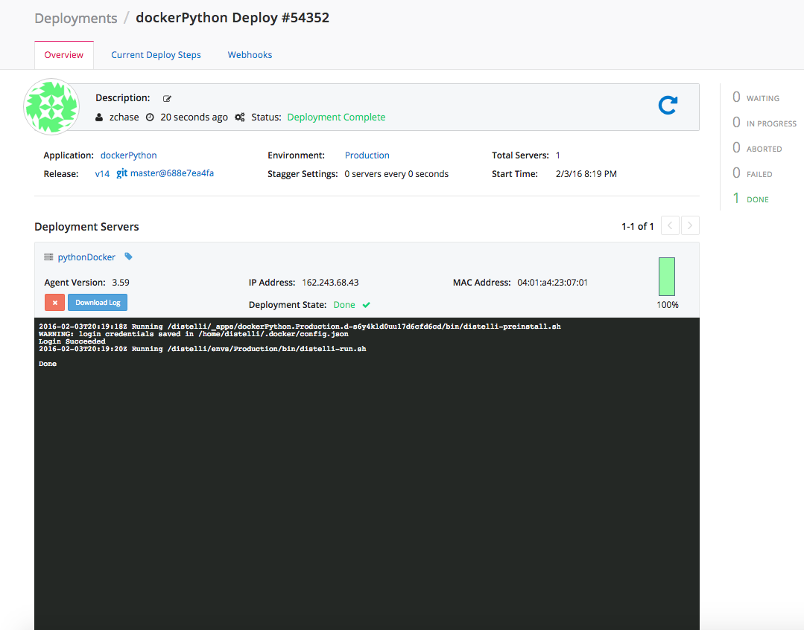
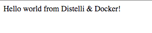

 

This tutorial will walk you through how to build and deploy a Docker container with a Python Application. 

### Before You Begin

To successfully complete this tutorial, you need:

- A <a href="https://github.com/" target="_blank">GitHub</a>/<a href="https://bitbucket.org/" target="_blank">BitBucket</a> Repository to hold your files
- A <a href="https://hub.docker.com/" target="_blank">Docker Hub</a>/<a href="https://aws.amazon.com/ecr/" target="_blank">Amazon EC2 Container Registry</a> (ECR) Repository
- A server you can deploy your application to and has Docker installed
- Python installed on your local machine
- A Pipelines Account

### Setting Up

For this tutorial, we will use a basic "Hello World" Python-Flask application, but you can use your own application if you have one. To start, you need to open your terminal and navigate to the folder where you want to store your files. Make a directory called `dockerPython` to store our Python app and create our app file.

~~~
$ mkdir dockerPython
$ cd dockerPython
$ touch simpleapp.py requirements.txt
~~~

Now that we have everything set up, we can start by creating a basic Python "Hello World" app. Open `simpleapp.py` in a text editor of your choice, and paste in the code below:

~~~
from flask import Flask
import sys
import optparse
import time

app = Flask(__name__)

start = int(round(time.time()))

@app.route("/")
def hello_world():

    return "Hello world from Distelli & Docker!"

if __name__ == '__main__':
    parser = optparse.OptionParser(usage="python simpleapp.py -p ")
    parser.add_option('-p', '--port', action='store', dest='port', help='The port to listen on.')
    (args, _) = parser.parse_args()
    if args.port == None:
        print "Missing required argument: -p/--port"
        sys.exit(1)
    app.run(host='0.0.0.0', port=int(args.port), debug=False)
~~~

After we have created our application, we need to create a `requirements.txt` file to ensure that all of our application's dependencies are installed in our container. Open `requirements.txt` in a text editor of your choice and paste in the code below:

~~~
Flask>=0.9
~~~

## Step 1. Create the Docker File

To build our application in a Docker container, we need to create a Dockerfile. A Dockerfile contains the instructions to build your application in a container. The Dockerfile we will use for our Python application is below:

~~~
FROM alpine:3.1

# Update
RUN apk add --update python py-pip

# Install app dependencies
RUN pip install Flask

# Bundle app source
COPY simpleapp.py /src/simpleapp.py

EXPOSE  8000
CMD ["python", "/src/simpleapp.py", "-p 8000"]
~~~

### Breakdown of the Dockerfile

In the first part of our Dockerfile, we define the base Docker Image we want to use for the container.

~~~
FROM alpine:3.1
~~~

We are going to use Alpine as our base image. When creating a Docker container, you want your container to be as lightweight as possible. Alpine is a lighter Linux distribution, with the Alpine Docker image being ~5MB compared to ~188MB for the Ubuntu Docker image. Using the lighter image provides faster build times, because we are building only the dependencies our application needs.

Next, we add Python to our Docker Image:

~~~
# Update
RUN apk add --update python py-pip
~~~

Then we install our dependencies, that we defined in our `requirements.txt` file, and bundle our application:

~~~
# Install app dependencies
RUN pip install -r requirements.txt

# Bundle app source
COPY simpleapp.py /src/simpleapp.py
~~~

Finally, we expose port `8000` and run our application:

~~~
EXPOSE  8000
CMD ["python", "/src/simpleapp.py", "-p 8000"]
~~~

### Push Files to Your Repository

The final step in creating our application is to push our files into a GitHub or BitBucket repository. If you are unfamiliar with using repositories, you can find more information for GitHub <a href="https://help.github.com/articles/set-up-git/" target="_blank">here</a> and more information for BitBucket <a href="https://confluence.atlassian.com/bitbucket/get-started-with-bitbucket-cloud-675385635.html" target="">here</a>.

## Step 2. Install the Pipelines Agent on your Server

To deploy the application to your server you, need to install the Pipelines Agent on the server. Make sure you have registered for a Pipelines account and follow the steps below to install the agent on your server. To complete the installation you will need remote access to your server.
> **Note:** This installation requires root (administrator) permissions.

<h3>Linux and macOS X</h3>

To install on Linux or macOS X you can use wget with the following command:
<h4>wget example</h4>

~~~
wget -qO- https://pipelines.puppet.com/download/client | sh
~~~

<h3>Windows</h3>

To install the Pipelines Agent on Windows, copy and paste the following powershell command into a command (cmd) window.

~~~
powershell -NoProfile -ExecutionPolicy Bypass -Command "iex ((new-object net.webclient).DownloadString('https://pipelines.puppet.com/download/client.ps1'))" & SET PATH=%PATH%;%ProgramFiles%/Distelli
~~~

<h3>Complete the Install</h3>

After downloading the agent, run the install command to install the agent. To do so use the `agent install` command.

> **Note:** This installation requires root (administrator) permissions.

~~~
jdoe@ServerB:~$ <b>wget -qO- https://pipelines.puppet.com/download/client | sh</b>
This script requires superuser privileges to install packages
Please enter your password at the sudo prompt

[sudo] password for jdoe:
    Installing Distelli CLI 3.55 for architecture 'Linux-x86_64'...
    Downloading https://s3.amazonaws.com/download.distelli.com/distelli.Linux-x86_64/distelli.Linux-x86_64-3.55.gz
To install the agent, run:
    sudo /usr/local/bin/distelli agent install
jdoe@ServerB:~$ <b>sudo /usr/local/bin/distelli agent install</b>
Distelli Email: <b>jdoe@distelli.com</b>
      Password:
    1: User: jdoe
    2: Team: janedoe/teamjane
Team [2]: <b>1</b>
Server Info: https://www.distelli.com/jdoe/servers/d0c4b300-9fcf-2846-ba90-080027c8277c
Starting upstart daemon with name:  dtk-supervise-cc1233c06f7ad94a8d34ac610381242f9ae28bb8
jdoe@ServerB:~$
~~~

<h3>Verify the Install</h3>

To confirm that the agent is installed and working, use the `agent status` command.

~~~
# /usr/local/bin/distelli agent status
Distelli Agent (serverA) is Running with id 766b88c8-e925-11e4-ae8b-080027cc07f7
~~~

For more information on the Pipelines Agent, see the [Pipelines Agent Reference Guide](./agent.html).

> **Note:** Your server also needs to have Docker installed to be able to deploy your image.

## Step 3. Build And Upload the Docker Image

Now that we have our application in GitHub/BitBucket and our server is ready to be deployed to, we are going to build our Docker Image. Log into your Pipelines account and click the <b>New App</b> button in the right hand corner.

Select the repository type where you are storing your application's files.

After clicking the button to connect to our repository, select the appropriate repository that contains the files.

Select the appropriate branch for your deployment. We have a master branch, but you can deploy any branch from your repository.

Next, we set our build steps. This is the step where you declare that you are building a Docker container. In the right corner, click <b>Build With Docker File</b>, and enter in your Docker Hub or ECR credentials. After you enter your credentials your <b>Build</b> section should be similiar to below:

Finally, we make sure all of settings look correct and then click the <b>Looks Good. Start Build!</b> button to build your Docker container

After your build has started, click the build to view its progress. You can view realtime logs of your application building.

### Setting Up Port Mapping

To be able to access the application running in our Docker container, we need to set up Docker Port Mapping. Navigate to your application's page in Pipelines, click the <b>Settings</b> tab, and expand the <b>Docker</b> section. You will see a section to define your Docker Port Mapping. Set your Container Port to `8000` and the Host Port to `80`.

## Step 4. Deploy Your Docker Container

Now that we have successfully built our Docker image, we are ready to deploy it to our server. On the Builds page click <b>New Deployment</b> in the right hand corner.

The New Deployment page opens. Select the <b>Deploy a Release</b>

Now, select the application you want to deploy. Select the application we created earlier in the tutorial.

Next, select the release you would like to deploy. For now there should be only one release for deployment.

The last step in our deployment is to select the environment you want to deploy to. First, you create an environment by entering a name and selecting the <b>Add Environment</b>.

Next, select the Environment you just created and click <b>All Done</b>.

Next, add your server. Click <b>Add Servers</b> to get started. Select the server you configured earlier in the tutorial, and add it to your account. Once you have added your server, you can close the <b>Add Servers</b> panel and continue with your deployment. You will see a final option to set your delay between deployments on your servers.

Click <b>Start Deployment</b> to begin your deployment. You are redirected to a page where you can view the progress of your deployment. <b>Log</b> enables you to view realtime streaming logs for the deployment.

Now navigate to "http://<-You Server's IP Address->" and see your Python Application!

And that's it! You have built a Python App, built a Docker image, and deployed that image as a container.

