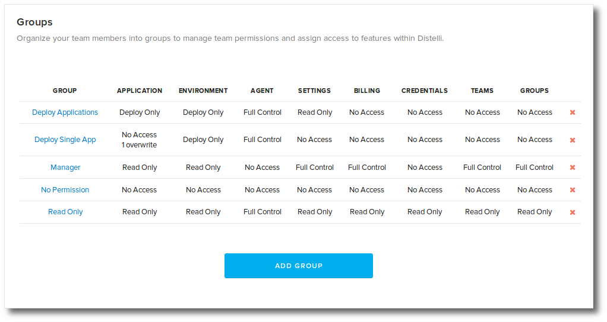
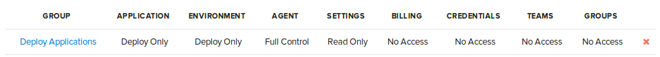
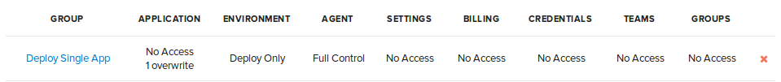
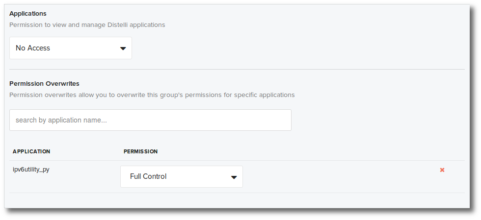
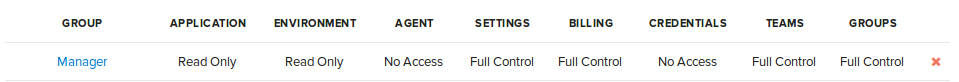

With Puppet Pipelines teams and groups you can define permissions for team members. This document will layout the permissions required for example roles.

<h3>Groups</h3>

Permissions are defined in groups. Users are assigned to groups. For more information see:

* [Group and group permissions documentation](./group.html)
* [Users documentation](./users.html)

To create group permissions you will need to do the following:

1. Create a group. 
1. Assign permissions to the group. 
1. Assign users to the group. 

<h3>Roles</h3>

The following are four example roles.

**Read-Only** providing read-only access to team activities, including; builds, releases, and deploys.

**Deploy and Build any Application** providing the ability to create, build, and deploy any team application.

**Deploy and Build a Single Application** providing the ability to build and deploy an application.

**Manager** providing the ability to manage the team account.

<h3>Read-only</h3>

These permissions will allow a user to view most details for the team. They will not be able to deploy or make changes.

A user assigned these permissions can/cannot:

<ul>
<li>View all applications</li>
<li>View all application environments</li>
<li>View all servers</li>
<li>View all builds</li>
<li>View all releases</li>
<li>View all deployments</li>
<li>Cannot view application settings</li>
<li>Cannot view environment settings</li>
<li>Cannot view team global settings</li>
</ul>

<h3>Deploy and Build any Application</h3>

These permissions will allow a user to build and deploy all applications in the team.

A user assigned these permissions can/cannot:

<ul>
<li>Build and deploy any application</li>
<li>Deploy to any application environments</li>
<li>Manage servers</li>
<li>View all builds</li>
<li>View all releases</li>
<li>View all deployments</li>
<li>Cannot view application settings</li>
<li>Cannot view environment settings</li>
<li>Cannot view team global settings</li>
</ul>

<h3>Deploy and Build a Single Application</h3>

These permissions will allow a user to build and deploy on a specific application. In this example Applications access is set to No Access and Full Access is granted to one application. Note, you can grant full access to more than one application.

A user assigned these permissions can/cannot:

<ul>
<li>Build and deploy a specific application</li>
<li>Deploy to the specific application environments</li>
<li>Manage servers</li>
<li>View all releases</li>
<li>View all deployments</li>
<li>Cannot view application settings</li>
<li>Cannot view environment settings</li>
<li>Cannot view team global settings</li>
</ul>

<h3>Manager</h3>

A user assigned these permissions can/cannot:

<ul>
<li>View all applications</li>
<li>View all application environments</li>
<li>View all servers</li>
<li>View all builds</li>
<li>View all releases</li>
<li>View all deployments</li>
<li>View team global setting</li>
<li>Edit Billing Plan</li>
<li>Edit Groups</li>
<li>Edit Team</li>
<li>Edit Integrations</li>
<li>Cannot view application settings</li>
<li>Cannot view environment settings</li>
<li>Cannot view credentials</li>
</ul>

<h3>Notes</h3>

To allow a user access to <b>Application Settings</b> they must have Full Control for Applications.

To allow a user access to <b>Environment Settings</b> they must have Full Control for Environments.

To allow a user the ability to <b>Delete Servers</b> they must have Full Control to Agent.

