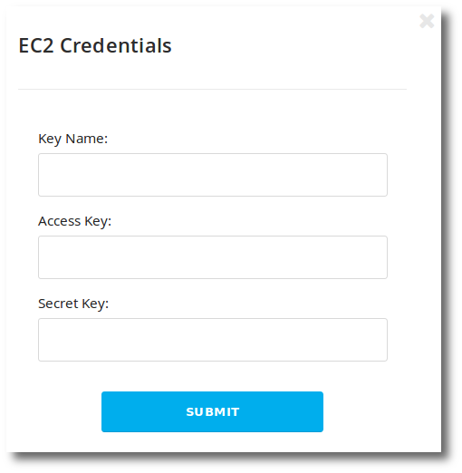
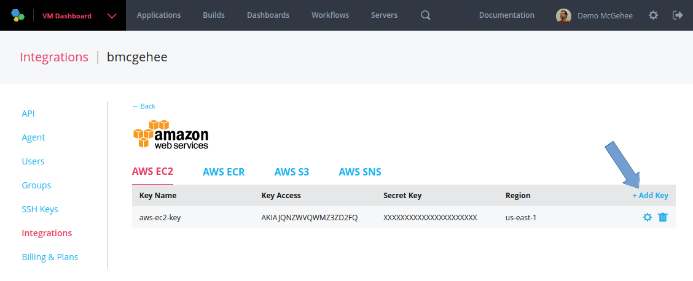
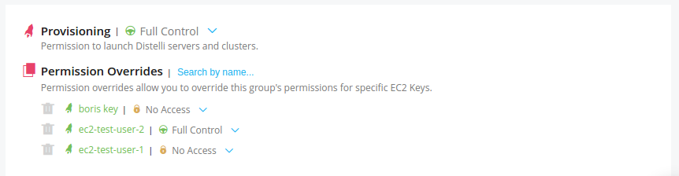
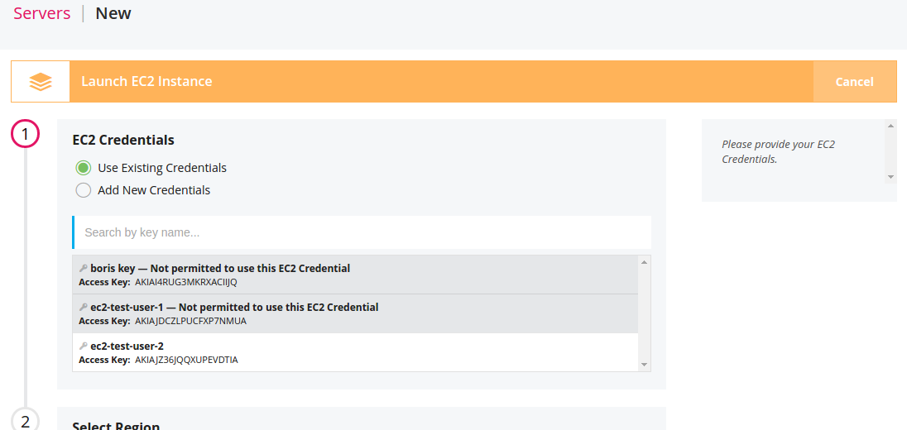
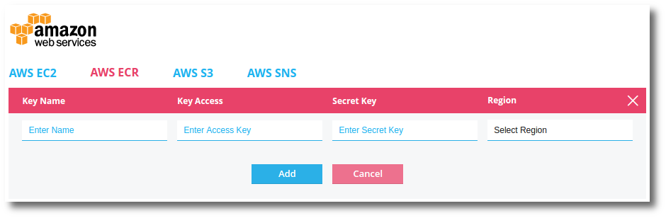

## Integrate with AWS EC2

Integrating your Pipelines account with AWS EC2 provides the necessary credentials for you to successfully provision EC2 instances with Pipelines.

For more information on getting started with Amazon and EC2 see [http://docs.aws.amazon.com/AWSEC2/latest/UserGuide/get-set-up-for-amazon-ec2.html](http://docs.aws.amazon.com/AWSEC2/latest/UserGuide/get-set-up-for-amazon-ec2.html).

For more information on setting up your Amazon Access Key see <a href="http://docs.aws.amazon.com/AWSSimpleQueueService/latest/SQSGettingStartedGuide/AWSCredentials.html" target="_blank">docs.aws.amazon.com/AWSSimpleQueueService/latest/SQSGettingStartedGuide/AWSCredentials.html</a>.

The AWS IAM user role must have access to ec2. An example IAM policy that would allow ec2 access:

~~~
{
    "Version": "2012-10-17",
    "Statement": [
        {
            "Action": "ec2:*",
            "Effect": "Allow",
            "Resource": "*"
        }
    ]
}
~~~

If you need to lock the user down to a specific set of resourses, please see:
<a href="http://docs.aws.amazon.com/AWSEC2/latest/UserGuide/iam-policy-structure.html" target="_blank">http://docs.aws.amazon.com/AWSEC2/latest/UserGuide/iam-policy-structure.html</a>.

<h3>Configure AWS EC2 Credentials</h3>

Ensure you are [using the correct account](./users.html) before continuing.

<ol>
<li>In the Pipelines web UI at the top right, click the <b>gear</b> to navigate to the account settings.</li>
<li>Click the <b>Integrations</b> link on the left.</li>
<li>Click the <b>AWS</b> button.</li>

You will find yourself at the AWS integrations credentials page.

<li>Scroll down to <b>AWS EC2</b> section and click <b>Add Creds</b>.</li>

<li>Enter your AWS EC2 <b>Key Name, Access Key,</b> and <b>Secret Key</b>.</li>
<li>Click <b>Submit</b> when you are ready.</li>
</ol>

## Using multiple EC2 credentials

This feature allows the addition of multiple AWS EC2 credentials from which to launch EC2 instances. This includes launching instances for a Kubernetes cluster in AWS.

<h3>Setup Multiple EC2 credentials</h3>

To navigate to the EC2 credentials:

<ol>
    <li>Ensure you are on the <b>Pipelines for Applications</b> web UI.</li>
    <li>Click the <b>Gear</b> icon at the top right of the Pipelines web UI.</li>
    <li>Click the <b>Integrations</b> link on the left.</li>
    <li>Click the <b>Amazon Web Services</b> icon.</li>
    <li>Select the <b>AWS EC2</b> tab.</li>
</ol>

You can add multiple keys by clicking the <b>Add Key</b> link.

<h3>RBAC Permissions for EC2 Credentials</h3>

After adding one or more AWS EC2 credentials, a permission group can be configured to control which users have access to which credentials.

To create group permissions for access to AWS EC2 credentials:

<ol>
    <li>Ensure you are on the <b>Pipelines for Applications</b> web UI.</li>
    <li>Click the <b>Gear</b> icon at the top right of the Pipelines web UI.</li>
    <li>Click the <b>Groups</b> link on the left.</li>
    <li>Either <b>Create New Group</b> or edit an existing group.</li>
    <li>Scroll to the bottom of the group permissions to find the <b>Provisioning</b> section.</li>
</ol>

From here the group permission specifies what EC2 credentials users of this group have and do not have access to.

For more information on users and group permissions see:

* [Users](./users.html)
* [Groups](./group.html)

<h3>Using Multiple EC2 Credentials</h3>

Now, when launching EC2 instances (or EC2 clusters) a user will be prompted which credentials to use, based on the available credentials to that user.

## Integrate with Amazon ECR

Integrating your Pipelines account with AWS EC2 Container Registry provides the necessary credentials for you to successfully build and deploy Docker images/containers with Pipelines.

> **Note:** The following credential configuration can be completed when **Enabling Docker for new Applications**, **Enabling Docker for Existing Applications**, and in the **Docker Settings** See the [Docker](./docker.html) documentation for details.

<h3>Configure AWS ECR Credentials</h3>

Ensure you are [using the correct account](./users.html) before continuing.

<ol>
<li>In the Pipelines web UI at the top right, click the <b>gear</b> to navigate to the account settings.</li>
<li>Click the <b>Integrations</b> link on the left.</li>
<li>Click the <b>AWS</b> icon.</li>

You will find yourself at the AWS integrations credentials page.

<li>Select the <b>AWS ECR</b> tab.</li>
<li>Click the <b>Add AWS ECR Credentials</b> link.</li>

<li>Enter your AWS ECR <b>Key Name, Access Key,</b> and <b>Secret Key</b>.</li>
<li>Click <b>Add</b> when you are ready.</li>
</ol>

## Integrate with S3 Bucket

You can specify an S3 bucket that Pipelines will use to store your bundled releases when you do a `distelli push`. When you deploy the software the Pipelines agent will retrieve the bundle from your S3 bucket.
This document shows you how to create, authorize, and setup that bucket so Pipelines will use it to store your release bundles.
For Pipelines to access the S3 bucket you will need to provide:

<ul>
<li>The bucket name</li>
<li>An access token</li>
<li>A secret key</li>
</ul>

<h3>Overview</h3>

When you incorporate an S3 bucket with your Pipelines account Distelli will keep your bundled application releases in your S3 bucket.
After adding your S3 credentials to Pipelines on your first application push, Pipelines will create, in your S3 bucket, a folder called distelli-packages.

When you issue a `distelli push` command and push your application release, the application release will be bundled and uploaded to your S3 bucket using SSL. This bundle is in a gzip tar format. The files bundled depend on your [Pipelines Manifest PkgInclude section](./manifest.html)
When deploying an application release, on the destination server the Pipelines agent will retrieve the application bundle from your S3 bucket.

<h3>Create an S3 Bucket on AWS</h3>

First step will be to create an S3 bucket. If you already have an existing bucket you wish to use, you may skip to the **Create an AWS Policy to Grant S3 Bucket Permissions** step.

1. [Sign in to the AWS console](https://console.aws.amazon.com)
1. In the Amazon Web Services under Storage & Content Delivery select <b>S3 (Scalable Storage in the Cloud)</b>.
1. Click the <b>Create Bucket</b> button.
1. Enter the <b>Bucket Name</b> (for example, "Pipelines").
1. Select a <b>Region</b>.
1. Click the <b>Create</b> button.

You have created an S3 Bucket. Remember your bucket name.

<h3>Create an AWS Policy to Grant S3 Bucket Permissions</h3>

These steps will create an AWS policy to grant access to an S3 Bucket.

1. In the AWS console, click the square logo on the top left to go back to the main console menu.
1. In the Amazon Web Services under Administration and Security select <b>Identity & Access Management</b>.
1. In the left Dashboard select <b>Policies</b>.
1. Click the <b>Create Policy</b> button.
1. For <b>Create Your Own Policy</b> click the <b>Select</b> button.
1. Give the policy a <b>Policy Name</b> (for example, "Pipelines_S3_Bucket").

    > **Important:** For the following steps, replace <b>BUCKETNAME</b> with your AWS S3 bucket name.

1. Give the policy a <b>Description</b> (for example "Provides Pipelines access to the S3 bucket BUCKETNAME".
1. In the policy, enter the following:

~~~
{
  "Version": "2012-10-17",
  "Statement": [
    {
      "Effect": "Allow",
      "Action": [
        "s3:GetObject",
        "s3:PutObject",
        "s3:DeleteObject",
        "s3:ListBucket"
      ],
      "Resource": [
        "arn:aws:s3:::BUCKETNAME/*"
      ]
    }
  ]
}
~~~

    Did you remember to replace <b>BUCKETNAME</b> with your S3 bucket name?

1. Click the <b>Validate Policy</b> button.

You should see a <b>This policy is valid.</b> message.

1. Click <b>Create Policy</b> button.

You have created a policy that can be used to provide a user or group access to the S3 bucket.

<h3>Create an AWS User</h3>

These steps will create an AWS User to access the S3 Bucket. If you already have an AWS user you would like to use and you know their associated security key and token skip forward to
These steps will create a single AWS user account.

1. Make sure you are in the AWS Console and have selected <b>Identity & Access Management</b> under Administration & Security.
1. In the left Dashboard select <b>Users</b>.
1. Click <b>Create New Users</b> button.
1. Ensure the <b>Generate an access key for each user</b> box is checked.
1. In field <b>1</b> enter a user name (for example "Pipelines").
1. Click the <b>Create</b> button.

    > **Note:** The Security Credentials are available for download <b>one time only</b>. These security credentials are required to add your S3 bucket to Pipelines. Keep them safe.

1. Click the <b>Show User Security Credentials</b> link. 
1. Download the credentials from the <b>Download Credentials</b> button.

    > **Important:** Preserve these credentials in a secure manner that meets your organizations security requirements.

1. Click <b>Close</b> button.

You have created a new AWS user. You must apply the policy, created above, to the user to allow them access to the S3 bucket.

<h3>Apply AWS Policy to AWS User</h3>
 
In this section you will apply the Policy to the AWS User to grant that user access to the S3 bucket.

<ol>
<li>Make sure you are in the AWS Console and have selected <b>Identity & Access Management</b> under Administration & Security.</li>
<li>In the left Dashboard select <b>Users</b>.</li>
<li>Click the <b>user</b> you wish to apply the policy to.</li>
<li>Find the <b>Permissions</b> section and under Managed Policies, click the <b>Attach Policy</b> button.</li>
<li>Find the policy you created above, <b>Pipelines_S3_Bucket</b> and select it by clicking its checkbox.</li>
<li>Click the <b>Attach Policy</b> button.</li>
</ol>

With this policy now attached to the user, the user is now configured to access the S3 bucket.

<h3>Adding an S3 Bucket to Pipelines</h3>

The following steps must be completed in the Pipelines web UI.

1. Ensure you are [signed into Pipelines](https://pipelines.puppet.com/login).
1. Click the <b>gear icon</b> on the top right.
1. Click the <b>Integrations</b> link on the left.
1. Click the <b>AWS</b> button.
1. Under where it says "AWS S3" click the <b>Add Creds</b> button.
1. Enter your <b>S3 Bucket Name</b>.
1. Enter your AWS User <b>S3 Access Token</b>.
1. Enter your AWS User <b>S3 Secret Key</b>.

> **Note:** If you did not get your AWS user token and key during their one-time availability, or have lost it, see the next section [Getting New AWS User Credentials](#getting-new-aws-user-credentials).

<h3>Getting New AWS User Credentials</h3>

If you have an AWS account where you don't know the current token and key credentials, you can create new ones. Remember you will be able to view and download the secret key only one time.

1. Make sure you are in the AWS Console and have selected <b>Identity & Access Management</b> under Administration & Security.
1. In the left Dashboard select <b>Users</b>.
1. Click the <b>user</b> you wish to get new credentials for.
1. Find the <b>Access Keys</b> section under Security Credentials and click the <b>Create Access Key</b> button.

> **Important:** The Security Credentials are available for download <b>one time only</b>. These user credentials are required to add your S3 bucket to Pipelines. Keep them safe.

1. Click the <b>Show User Security Credentials</b> link. 
1. Download the credentials from the <b>Download Credentials</b> button.

> **Important:** Preserve these credentials in a secure manner that meets your organizations security requirements.

You now have new working known credentials for your AWS user. You may want to remove any extraneous credentials.

<h3>Doing a distelli push to AWS S3 Bucket</h3>

After you have correctly setup the S3 bucket in Pipelines, when doing a `distelli push` you can see the bundle being uploaded to S3.

~~~
$ distelli push
    Packaged 1 files in 1 directories
    Pushing App: SimpleApp
    Uploading Bundle to S3: [==========] 100%
    Creating Release... DONE
~~~

