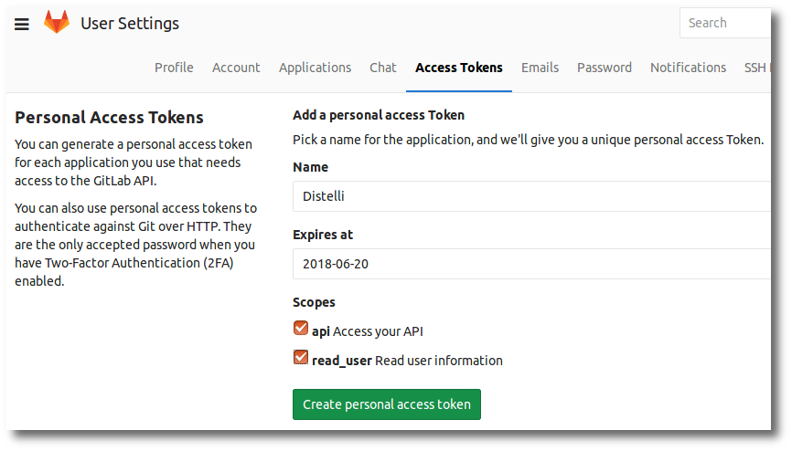

GitHub is a software repository hosting service that provides revision control and source code management.

Integrating GitHub with Pipelines provides continuous integration and continuous deployment. 

With GitHub integration you can create applications in Pipelines from a GitHub repository and enable auto-builds when a change is checked into the repository.

## Integrate with GitHub

Before beginning, ensure you are using the correct user account in Puppet Pipelines.

To enable GitHub integration, follow these steps.

<ol>
  <li>In the Pipelines web UI click the <b>gear</b> icon at the top right.</li>
  <li>Click the <b>Integrations</b> link on the left.</li>
  <li>Click the <b>GitHub</b> icon.</li>
  <li>Click the <b>Connect GitHub Account</b> button.</li>

  
At this point, your browser will be directed to Gibhub for you to authorize Pipelines. If you are not already logged into Gibhub, you will be prompted to.

  <li>Authorize Pipelines in GitHub.</li>
</ol>

## Integrate GitHub Enterprise

With GitHub Enterprise integration you can create applications in Pipelines from a GitHub Enterprise repository and enable auto-builds when a change is checked into the repository.

Before beginning, ensure you are using the correct user account in Puppet Pipelines.

To enable GitHub Enterprise integration, follow these steps.
<ol>
<li>In the Pipelines web UI click the <b>gear</b> icon at the top right.</li>

<li>Click the <b>Integrations</b> link on the left.</li>

<li>Click the <b>GitHub Enterprise</b> button.</li>

At this point you will have to login to your GitHub Enterprise account and create a Personal Access Token.

<li>Login to your <b>GitHub Enterprise</b> instance.</li>
<li>Click your <b>profile icon</b> on the top right.</li>
<li>Select <b>Settings</b> from the drop down.</li>
<li>In the left menu, click the <b>Personal access tokens</b> link.</li>
<li>Click the <b>Generate new token</b> button.</li>
<li>Ensure the following options are set:</li>

<ul>
<li><b>repo</b></li>

Access private repositories.

<li><b>user:email</b></li>

Access user email address (read-only).

<li><b>read:org</b></li>

Read org and team memberships.

</ul>

<li>Click <b>Generate token</b> button.</li>
<li>It is important you copy the token now as it will not be visible again.</li>

<li>Return to Pipelines.</li>

<li>Enter your <b>GitHub Enterprise Host/IP</b>.</li>

<li>Enter the <b>GitHub Enterprise Personal Access Token</b> you just created.</li>

<li>Click the <b>Add Credentials</b> button.</li>

</ol>

You have integrated your GitHub Enterprise account with Pipelines.

## Integrate GitLab

GitLab is a software repository hosting service that provides revision control and source code management.

With GitLab integration you can create applications in Pipelines from a GitLab repository and enable auto-builds when a change is checked into the repository.

Before beginning, ensure you are using the correct user account in Puppet Pipelines.

To enable GitLab integration, follow these steps.
<ol>
  <li>In the Pipelines web UI click the <b>gear</b> icon at the top right.</li>
  <li>Click the <b>Integrations</b> link on the left.</li>
  <li>Click the <b>GitLab</b> icon.</li>
  <li>Enter the <b>Host</b> http:// or https:// and the dns name for your GitLab host (i.e. gitlab.com for public GitLab).</li>
  <li>Retrieve a <b>Personal Access Token</b> from your instance of GitLab.</li>
  
You can find your access tokens under user settings in GitLab.

  
  <li>Enter the <b>Token</b></li>
  <li>The SSH User is Optional and defaults to <b>git</b>. Unless your specific GitLab instance has changed the default GitLab SSH username, you can leave this blank</li>
  <li>Click <b>Add Credentials</b> button.</li>
</ol>

Pipelines will attempt to validate your token. Realize that if your GitLab instance is on a private network behind a firewall, Pipelines may not be able to reach your GitLab. In this scenario we recommend obtaining the on-premises Enterprise version of Pipelines.

## GitHub OAuth Permissions

When building applications that interact with GitHub users it is helpful to understand the permissions.

To make API calls that interact with GitHub users you must first create an OAuth application. This OAuth application must specify the permissions necessry for the application. Pipelines is an example Oauth application.

<h3>Pipelines GitHub Permissions</h3>

Pipelines requires the following GitHub permissions:

<h5>Personel user data - Email addresses (read-only)</h5>

This application will be able to read your private email addresses.

<h5>Repositories - Public and private</h5>

This application will be able to read and write all public and private repository data. This includes the following:

<ul>
<li>Code</li>
<li>Issues</li>
<li>Pull requests</li>
<li>Wikis</li>
<li>Settings</li>
<li>Webhooks and services</li>
<li>Deploy keys</li>
</ul>

<h5>Organizations and teams - Read-only access</h5>

This application will be able to read your organization and team membership. 

<h3>Revoking Pipelines Oauth App from GitHub</h3>

<ol>
<li>Login to GitHub.</li>
<li>Click your GitHub profile image at the top right.</li>
<li>Click <b>Settings</b> from the drop down.</li>
<li>In the left menu, click <b>Oauth applications</b>.</li>
<li>Click the <b>Revoke</b> button for Pipelines.</li>
</ol>

You have revoked the Pipelines application from your GitHub account.

