Integrating Pipelines with Jenkins is already feasible using the Pipelines CLI.

The addition of Pipelines event APIs now allows greater integration with Jenkins, including the ability to:

<ul>
  <li>Create Pipelines application push events when Jenkins receives a commit.</li>
  <li>Create Pipelines application pull request events when Jenkins receives a pull request.</li>
  <li>Create Pipelines application build event when Jenkins starts builds.</li>
  <li>Update Pipelines build event when Jenkins completes builds.</li>
</ul>

This will provide users of Pipelines with links to the repository commits, links to Jenkins builds, and information on when and how long the build took.

This also provides for automated deployments upon succssful Jenkins builds using Pipelines.

Note, this document is geared towards Pipelines enterprise customers who are supporting multiple teams and/or users. Information <b>is</b> supplied on implementing this for a single user account in the Pipelines SaaS also.

<h2>Create Pipelines Jenkins user for Enterprise use</h2>

This section describes setting up a Pipelines Jenkins user for use in an enterprise team. With this scenario, only one Pipelines user is setup and given access to enterprise team accounts, as necessary. This allows centralized management of Pipelines authentications for Jenkins.

If, instead of an enterprise, this is a single user who would like to integrate with Jenkins build events, then please skip this section and go to **Install Jenkins Prerequisites**.

Creating a Pipelines Jenkins user for enterprise team use:

1. Create the Pipelines Jenkins user. Go to [https://pipelines.puppet.com/signup](https://pipelines.puppet.com/signup) and sign up. 

  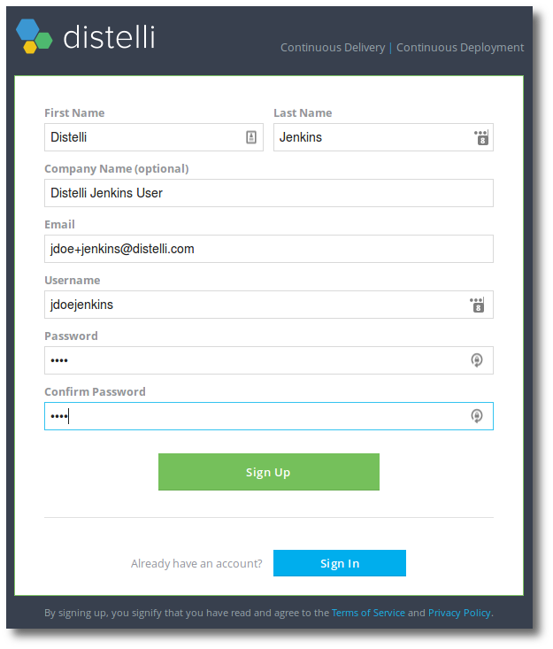

This user will be used to authenticate API requests to Pipelines. In the next section this user must be added to enterprise team users' accounts so that the Jenkins user can push other users' releases.

<h2>Add Pipelines Jenkins user to users' accounts.</h2>

For every user that wishes to build with Jenkins and deploy with Pipelines, the user must add the Pipelines Jenkins user to their account. This is an iterative process and as new users adopt, they will have to complete these steps.

How to add the Pipelines Jenkins user to an account.

<ol>
  <li>Login to the users account that wishes to do Jenkins builds with Pipelines (not the Pipelines Jenkins user just created).</li>
  <li>Click the <b>gear</b> at the top right of the Pipelines web UI.</li>
  <li>On the left click <b>Users</b>.</li>
  <li>Click the link <b>+ Add a New User</b>.</li>
  <li>Enter the <b>email</b> that was setup for the Pipelines Jenkins user.</li>

  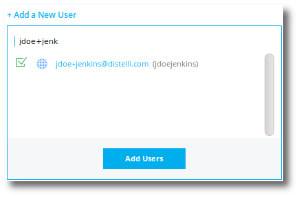

  <li>Select the Pipelines Jenkins user and click <b>Add Users</b>.</li>

  

</ol>

Now the Pipelines Jenkins user can push application releases from Jenkins to Pipelines.

<h2>Install Jenkins pre-requisites</h2>

<h3>Install Plugins</h3>

To perform this integration, Jenkins requires the following <b>plugins</b> are installed:

* [Credentials plugin](https://wiki.jenkins-ci.org/display/JENKINS/Credentials+Plugin) - provides a centralized way to define credentials that can be used by the Jenkins instance, plugins, and build jobs. 
* [Credentials Binding plugin](https://wiki.jenkins-ci.org/display/JENKINS/Credentials+Binding+Plugin) - allows the configuration of build jobs to inject credentials as environment variables.
* [Plain Credentials plugin](https://wiki.jenkins-ci.org/display/JENKINS/Plain+Credentials+Plugin) - a plugin dependency required by the Credentials Binding plugin.
* [Hudson Post Build Task](http://wiki.hudson-ci.org/display/HUDSON/Post+build+task) - provides scripting based on build log output. Can catch failed builds and execute scripts on failure. 

<h3>Install Utilities</h3>

Jenkins also requires that the following <b>utilities</b> are installed on the operating system:

* [jq 1.5+](https://stedolan.github.io/jq/download/) - This must be 1.5 or greater!
* [curl 7.33+](https://curl.haxx.se/download.html)

<h3>Install Pipelines CLI</h3>

Next, it is necessary to install the <b>Pipelines CLI</b> on Jenkins. Please follow these instructions to install the Pipelines CLI:

1. Login to the Jenkins server.

   > **Note: You could login as the jenkins user, or sudo to do this as the jenkins user. <code>sudo su jenkins -s /bin/bash</code>

1. <b>cd</b> to the jenkins user home directory. Typically this is: <code>/var/lib/jenkins</code>.
1. <b>Create</b> a file in the jenkins user home directory called <code>distelli.yml</code> and enter the following.

	~~~
	DistelliAccessToken: '<b>Distelli Access Token</b>'
	DistelliSecretKey: '<b>Distelli Secret Key</b>'
	~~~

1. To retrieve the values required for this file, <b>login</b> to Pipelines as the Pipelines Jenkins user.

   > **Note: If this an integration to Jenkins with a single user account, then <b>login</b> to Pipelines with the single account.

    * Click the <b>gear</b> icon at the top right of the Pipelines web UI.
    * Click <b>Agent</b> link on the left menu.
    * Click the <b>Show</b> button to see the required <b>Pipelines Access Token</b> and <b>Pipelines Secret Key</b>. Use these values in the <b>distelli.yml</b> file that is being editing on the Jenkins server.

	~~~
	DistelliAccessToken: '<b>12345678901234567890123456</b>'
	DistelliSecretKey: '<b>1234567890123456789012345678901234567</b>'
	~~~
  
    * Save the file.

	> **Note:** If you did the above file creation as any user other then jenkins user, you must ensure the file is owned by the jenkins user. This can typically be done with the following: <code>sudo chown jenkins:jenkins distelli.yml</code>

1. Install the CLI.

<h4>Linux and macOS X</h4>

To install on Linux/MAC use either curl <b>or</b> wget with one of the following syntaxes.

<h5>wget example</h5>

~~~
wget -qO- https://pipelines.puppet.com/download/client | sh
~~~

<h5>curl example</h5>

~~~
curl -sSL https://pipelines.puppet.com/download/client | sh
~~~

<h4>Windows</h4>

To install on Windows, copy and paste the following powershell command into a command (cmd) window.

~~~
powershell -NoProfile -ExecutionPolicy Bypass -Command "iex ((new-object net.webclient).DownloadString('https://pipelines.puppet.com/download/client.ps1'))" & SET PATH=%PATH%;%ProgramFiles%/Distelli
~~~

The Pipelines CLI is installed. This, and the credentials, can be validated. <b>This must be done as the jenkins user.</b>

<code>distelli login -conf distelli.yml</code>

There should be no response or error.

<h2>Add Pipelines API Token to Jenkins</h2>

Adding a Pipelines API token to Jenkins requires the following Jenkins plugins to be installed:
<ul>
  <li>Credentials plugin</li> 
  <li>Credentials Binding plugin</li>
  <li>Plain Credentials plugin</li>
</ul>

See the **Install Jenkins Prerequisites** section for more information on installing these plugins.

If this is an enterprise user that is using a shared Jenkins account in Pipelines, log in to that account now.

If this is a single user integrating with Jenkins, log in to the single user Pipelines account now.

The following will obtain the Pipelines API token for the account logged into.

<ol>
  <li>Click the <b>gear</b> at the top right in the Pipelines web UI.</li>
  <li>Ensure the <b>API</b> selection on the left menu is selected. If there is not a token currently, click the <b>Create API Token</b> button to create one.</li>
  <li>Copy the <b>Token</b>.</li>
  <li>Login to the <b>Jenkins</b> web inteface.</li>
  <li>From the Jenkins dashboard, click the <b>Credentials</b> link.</li>
  <li>Click to navigate to the <b>global</b> credentials.</li>
  <li>Click <b>Add Credentials</b>.</li>
  <li>Set the credentials <b>Kind</b> to <b>Secret text</b>.</li>
  <li>Paste the Pipelines API Token into the <b>Secret</b> field.</li>

  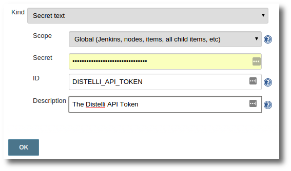

  <li>In the <b>ID</b> field enter <b>DISTELLI_API_TOKEN</b>.</li>
  <li>Click <b>OK</b> when done.</li>
</ol>

The Pipelines API Token has been added to the Jenkins global credentials. Next an application must be created in Pipelines and a distelli-manifest.yml must be created.

<h2>Create an Application in Pipelines</h2>

To deploy a Jenkins built applcation in Pipelines, there must first be an application in Pipelines.

This application that is created, must not be attached to a repository.

These steps are done from a Pipelines user account that wishes to build on Jenkins, not the Pipelines Jenkins user.

<ol>
  <li><b>Login</b> to Pipelines with the user account.</li>
  <li>Click <b>Applications</b> at the top of the Pipelines web UI.</li>
  <li>Click <b>New App</b> button at the top right.</li>
  <li>Click <b>No Repository</b> link.</li>

  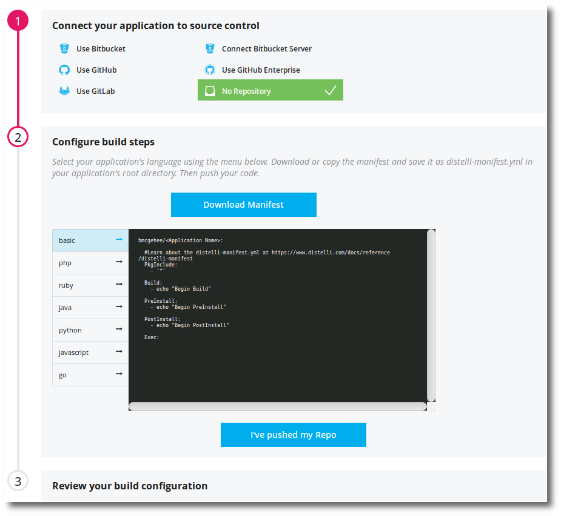

  <li>Click <b>I've pushed my Repo</b> button.</li>
  <li>Give the application an <b>App Name</b>. This is often the same as the software repository name.</li>

  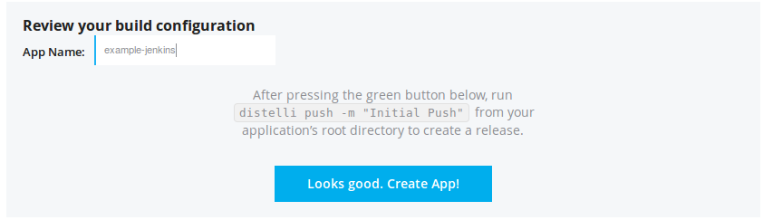

  <li>Click <b>Looks good. Create App!</b> button.</li>
</ol>

A new application has been created in Pipelines. Now the Jenkins build job must be configured to interact with Pipelines.

<h2>Create a distelli-manifest.yml</h2>

A distelli-manifest.yml file defines the application's build, test, and deployment instructions. In this scenario, the manifest will not require any build steps as Jenkins is doing the build. But the manifest must indicate what artifacts to keep from the build and the application deployment instructions.

Below is an example manifest. Use this as an initial starting point. 

1. Copy and edit this manifest:

~~~
USERNAME/APPLICATION_NAME: 
  # Distelli Manifest example 
  
  Build:
    - echo "Built and tested with Jenkins"
       
  PkgInclude:
    # Include ALL files in the release package
    - '*'

  ###Below is deployment phases   
  
  Env:
    # Set any environment variables in this section.   
    # These are available during all phases of a deploy.
 
  PreInstall:  
    # Use this section to install any deployment pre-requisites.
 
  PostInstall:
    # Use this section to affect any changes before running app.

  Exec:
    # Use this section to run the application.
~~~

1. Change <b>USERNAME</b> to the Pipelines username who owns the application. The Disetelli account in which the application was created.
1. Change <b>APPLICATION_NAME</b> to the new Pipelines application name that was created.
1. Save this file.
1. Check this file into the software repository being built with Jenkins and deployed with Pipelines.

<h2>Configure Jenkins Build Job to Update Pipelines Events</h2>

There are two scripts to configure in Jenkins.

The "before build" script will create a Pipelines push event. This event represents the commit that triggered the upcoming build. The before build script will also create a Pipelines build event and mark that build event status as <b>Running</b>, and set the build begin date/time.

Following a successful build, an "after build" script will execute a Pipelines CLI <code>distelli push</code> to push the build artifacts up to Pipelines. This push creates a release of your application in Pipelines which can be deployed, automatically, in true continuous delivery/continuous deployment style.

Also in the after build script, the previously created build event will be updated to status "Successful" and the build end date/time will be set.

<h3>Jenkins Project Environment Variables</h3>

<ol>
  <li>Navigate to the <b>project in Jenkins</b>.</li>
  <li>Click <b>Configure</b> link on the left.</li>
  <li>Navigate to the <b>Build Environment</b> section.</li>
  <li>Check (select) the <b>Use secret text(s) or file(s)</b> selection.</li>

  
This option is available only if the Jenkins plugin prerequisites are installed.

  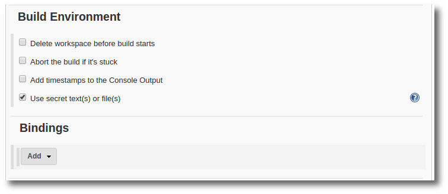

  <li>Under Bindings, click <b>Add</b>.</li>

  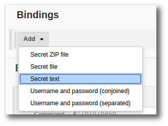

  <li>Select <b>Secret text</b> from the drop down.</li>

  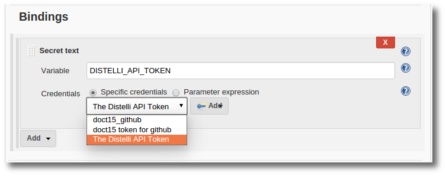

  <li>In the <b>Variable</b> field, enter <b>DISTELLI_API_TOKEN</b>.
<b>Note:</b> Do not shorten the env variable to DISTELLI_TOKEN. This is a reserved variable.
</li>

  <li>From the drop down, select <b>The Pipelines API Token</b> that was created above.</li>

  <li><b>Save</b> the changes.</li>
</ol>

<h3>Jenkins Project "Before Build" Script</h3>

<ol>
  <li>Navigate to the <b>project in Jenkins</b>.</li>
  <li>Click <b>Configure</b> link on the left.</li>
  <li>Navigate to the <b>Build</b> section.</li>
  <li>Click the <b>Add build step</b> button.</li>

  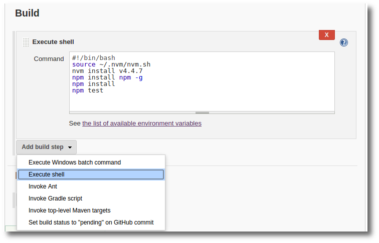

  <li>Select <b>Execute shell</b> from the drop down.</li>
  <li>In the <b>Shell</b> window, add the following code.</li>

<figure>
<pre>
<code>
#!/bin/bash
# This script creates a PUSH event in Distelli for the commit
# This script also creates a BUILD event setting the build as "Running"

# Setting global Distelli Env Variables
echo -e "\nSetting global Distelli environment variables\n"
<b>DISTELLI_USERNAME=jdoe</b>
<b>DISTELLI_API_URL="https://api.distelli.com/$DISTELLI_USERNAME"</b>
<b>DISTELLI_APP_NAME="example-jenkins"</b>
DISTELLI_CI_PROVIDER="jenkins"
DISTELLI_BUILD_STATUS="Running"

# Setting repo specific Env Variables
echo -e "Setting repository specific environment variables\n"
if [ ! -z "$GIT_COMMIT" ]; then
  echo -e "Using GIT variables.\n"
  DISTELLI_BUILD_ID=$BUILD_NUMBER
  DISTELLI_BUILD_URL=$BUILD_URL
  DISTELLI_CHANGE_URL=$GIT_URL
  DISTELLI_CHANGE_AUTHOR=$GIT_AUTHOR_NAME
  DISTELLI_CHANGE_AUTHOR_DISPLAY_NAME=$GIT_AUTHOR_NAME
  DISTELLI_CHANGE_TITLE="NoChangeMessage"
  DISTELLI_CHANGE_ID=$GIT_COMMIT
  DISTELLI_BRANCH_NAME=$GIT_BRANCH
  DISTELLI_CHANGE_TARGET=$GIT_URL
<b>elif [ ! -z "$YOUR_OTHER_VARIABLE" ]; then</b>
  # This section is for customizing your own software repo env variables.
  # Change the $YOUR_OTHER_VARIABLE above to one in your software repo env
  # variables that exists, to activate this block.
  echo -e "Using GIT variables.\n"
  DISTELLI_BUILD_ID=$YOUR_BUILD_ID
  DISTELLI_BUILD_URL=$YOUR_BUILD_URL
  DISTELLI_CHANGE_URL=$YOUR_CHANGE_URL
  DISTELLI_CHANGE_AUTHOR=$YOUR_CHANGE_AUTHOR
  DISTELLI_CHANGE_AUTHOR_DISPLAY_NAME=$YOUR_CHANGE_AUTHOR_DISPLAY_NAME
  DISTELLI_CHANGE_TITLE=$YOUR_CHANGE_TITLE
  DISTELLI_CHANGE_ID=$YOUR_CHANGE_ID
  DISTELLI_BRANCH_NAME=$YOUR_BRANCH_NAME
  DISTELLI_CHANGE_TARGET=$YOUR_CHANGE_TARGET
else
  echo -e "No GIT variables available. Using standard Jenkins variables.\n"
  DISTELLI_BUILD_ID=$BUILD_NUMBER
  DISTELLI_BUILD_URL=$BUILD_URL
  DISTELLI_CHANGE_URL="NoChangeURL"
  DISTELLI_CHANGE_AUTHOR="NoChangeAuthor"
  DISTELLI_CHANGE_AUTHOR_DISPLAY_NAME="NoChangeAuthorName"
  DISTELLI_CHANGE_TITLE="NoChangeMessage"
  DISTELLI_CHANGE_ID="NoChangeID"
  DISTELLI_BRANCH_NAME="NoChangeBranch"
  DISTELLI_CHANGE_TARGET="NoChangeTarget"
fi

# Creating Distelli PUSH event
echo -e "\nCreating Distelli PUSH Event\n"

API_JSON=$(printf '{"commit_url":%s, "author_username":%s, "author_name":%s, "commit_msg":%s, "commit_id":%s, "branch":%s, "repo_url":%s}' \
  "$(jq -R . <<<"$DISTELLI_CHANGE_URL")" \
  "$(jq -R . <<<"$DISTELLI_CHANGE_AUTHOR")" \
  "$(jq -R . <<<"$DISTELLI_CHANGE_AUTHOR_DISPLAY_NAME")" \
  "$(jq -R . <<<"$DISTELLI_CHANGE_TITLE")" \
  "$(jq -R . <<<"$DISTELLI_CHANGE_ID")" \
  "$(jq -R . <<<"$DISTELLI_BRANCH_NAME")" \
  "$(jq -R . <<<"$DISTELLI_CHANGE_TARGET")")
  
 
DISTELLI_RESPONSE=$(curl -s -k -X PUT -H "Content-Type: application/json" "$DISTELLI_API_URL/apps/$DISTELLI_APP_NAME/events/pushEvent?apiToken=$DISTELLI_API_TOKEN" -d "$API_JSON")
DISTELLI_PUSH_EVENT_ID=$(echo $DISTELLI_RESPONSE | jq .event_id | tr -d '"')
echo -e "push_event_id: $DISTELLI_PUSH_EVENT_ID\n"

# Creating Distelli BUILD event
echo -e "\nCreating Distelli BUILD Event\n"

DISTELLI_NOW=$(date -u +%Y-%m-%dT%H:%M:%S.0Z)
API_JSON=$(printf '{"build_status":%s, "build_start":%s, "build_id":%s, "build_provider":%s, "build_url":%s, "repo_url":%s, "commit_url":%s, "author_username":%s, "author_name":%s, "commit_msg":%s, "commit_id":%s, "branch":%s, "parent_event_id":%s}' \
  "$(jq -R . <<<"$DISTELLI_BUILD_STATUS")" \
  "$(jq -R . <<<"$DISTELLI_NOW")" \
  "$(jq -R . <<<"$DISTELLI_BUILD_ID")" \
  "$(jq -R . <<<"$DISTELLI_CI_PROVIDER")" \
  "$(jq -R . <<<"$DISTELLI_BUILD_URL")" \
  "$(jq -R . <<<"$DISTELLI_CHANGE_TARGET")" \
  "$(jq -R . <<<"$DISTELLI_CHANGE_URL")" \
  "$(jq -R . <<<"$DISTELLI_CHANGE_AUTHOR")" \
  "$(jq -R . <<<"$DISTELLI_CHANGE_AUTHOR_DISPLAY_NAME")" \
  "$(jq -R . <<<"$DISTELLI_CHANGE_TITLE")" \
  "$(jq -R . <<<"$DISTELLI_CHANGE_ID")" \
  "$(jq -R . <<<"$DISTELLI_BRANCH_NAME")" \
  "$(jq -R . <<<"$DISTELLI_PUSH_EVENT_ID")")

  
DISTELLI_RESPONSE=$(curl -s -k -H "Content-Type: application/json" \
  -X PUT "$DISTELLI_API_URL/apps/$DISTELLI_APP_NAME/events/buildEvent?apiToken=$DISTELLI_API_TOKEN" \
  -d "$API_JSON")
  
DISTELLI_BUILD_EVENT_ID=$(echo $DISTELLI_RESPONSE | jq .event_id | tr -d '"')
echo -e "build_event_id: $DISTELLI_BUILD_EVENT_ID\n\n"

# Saving build event id
DISTELLI_TMP_FILENAME="DISTELLI.$JOB_NAME.$BUILD_NUMBER.tmp"
echo "$DISTELLI_BUILD_EVENT_ID" > "$DISTELLI_TMP_FILENAME"

</code>
</pre>
</figure>

In the above code, you may need to change the following fields:

  <ul>
    <li><b>DISTELLI_USERNAME</b> - the Pipelines username of the user building with Jenkins and deploying with Pipelines.</li>
    <li><b>DISTELLI_API_URL</b> - If using the Pipelines SaaS, this is <code>https://api.distelli.com/$DISTELLI_USERNAME</code></li>
    <li><b>DISTELLI_APP_NAME</b> - The name of the application in Pipelines. This was configured in the Create an Application in Pipelines step.</li>
  </ul>

  <li>Now drag the <b>Execute shell</b> section, just created, above (before) the existing application build commands. This section can be moved by grabbing the grid, to the left of Execute shell, at the top left.</li>

  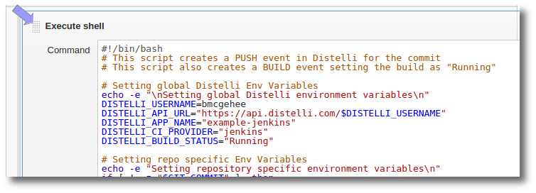

  <li><b>Save</b> your changes.</li></ol>

<h3>Jenkins Project "After Build" (Success) Script</h3>

<ol>
  <li>Navigate to the <b>project in Jenkins</b>.</li>
  <li>Click <b>Configure</b> link on the left.</li>
  <li>Navigate to the <b>Build</b> section.</li>
  <li>Click the <b>Add build step</b> button.</li>

  

  <li>Select <b>Execute shell</b> from the drop down.</li>
  <li>In the <b>Shell</b> window, add the following code.</li>

<figure>
<pre>
<code>
#!/bin/bash
# This script will update the Build status

# Push the release to Distelli with the Distelli CLI
echo -e "\n\nPushing the Distelli release\n"
<b>DISTELLI_USERNAME=jdoe</b>
<b>DISTELLI_API_URL="https://api.distelli.com/$DISTELLI_USERNAME"</b>
<b>DISTELLI_APP_NAME="example-jenkins"</b>
DISTELLI_TMP_RELEASE="DISTELLIrelease.$JOB_NAME.$BUILD_NUMBER.tmp"
DISTELLI_RESPONSE=$(distelli push -save-release "$DISTELLI_TMP_RELEASE")
DISTELLI_RELEASE_VERSION=$(cat "$DISTELLI_TMP_RELEASE")
DISTELLI_RESPONSE=$(rm "$DISTELLI_TMP_RELEASE")
echo -e "Distelli Release Version: $DISTELLI_RELEASE_VERSION\n"

# Setting global Distelli Env Variables
echo -e "\nSetting global Distelli environment variables\n"
DISTELLI_CI_PROVIDER="jenkins"
DISTELLI_BUILD_STATUS="Success"

# Preparing to update the build event with "Success" and build end time
echo -e "\nPreparing to update build event in Distelli\n"
DISTELLI_NOW=$(date -u +%Y-%m-%dT%H:%M:%S.0Z)
DISTELLI_TMP_FILENAME="DISTELLI.$JOB_NAME.$BUILD_NUMBER.tmp"
DISTELLI_BUILD_EVENT_ID=$(cat "$DISTELLI_TMP_FILENAME")
DISTELLI_RESPONSE=$(rm "$DISTELLI_TMP_FILENAME")

echo -e "Updating build event in Distelli\n"
# Updating build event with "Success" and build end time
API_JSON=$(printf '{"build_status":%s, "build_end":%s, "release_version":%s}' \
  "$(jq -R . <<<"$DISTELLI_BUILD_STATUS")" \
  "$(jq -R . <<<"$DISTELLI_NOW")" \
  "$(jq -R . <<<"$DISTELLI_RELEASE_VERSION")")
  
DISTELLI_RESPONSE=$(curl -s -k -H "Content-Type: application/json" \
  -X POST "$DISTELLI_API_URL/apps/$DISTELLI_APP_NAME/events/$DISTELLI_BUILD_EVENT_ID?apiToken=$DISTELLI_API_TOKEN" \
  -d "$API_JSON")
  
echo -e "Distelli Build Update Response:\n $DISTELLI_RESPONSE\n\n"

</code>
</pre>
</figure>

In the above code, you may need to change the following fields:

  <ul>
    <li><b>DISTELLI_USERNAME</b> - the Pipelines username of the user building with Jenkins and deploying with Pipelines.</li>
    <li><b>DISTELLI_API_URL</b> - If using the Pipelines SaaS, this is <code>https://api.distelli.com/$DISTELLI_USERNAME</code></li>
    <li><b>DISTELLI_APP_NAME</b> - The name of the application in Pipelines. This was configured in the create an application step above</a>.</li>
  </ul>

  <li>This Execute shell section should be after all build and test scripts have completed. <b>Save your changes</b>.</li></ol>

You are ready to build your application with Jenkins and push releases to Pipelines for automated deployments.

<h3>Jenkins Project "After Build Failure" Script</h3>

This section decribes how to setup Jenkins to update Pipelines build events in the case of a build failure. This requires the following Jenkins plugin to be installed.

<ul>
  <li>Hudson Post Build Task</li>
</ul>

<ol>
  <li>Navigate to the <b>project in Jenkins</b>.</li>
  <li>Click <b>Configure</b> link on the left.</li>
  <li>Navigate to the <b>Post-build Actions</b> section.</li>
  <li>Click the <b>Add post-build step</b> button.</li>

  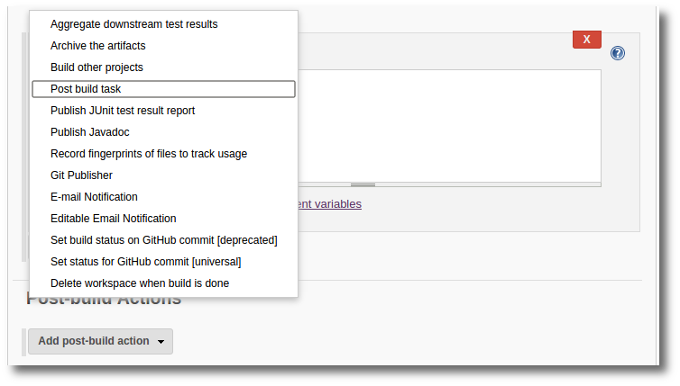

  <li>Select <b>Post build task</b> from the drop down.</li>

  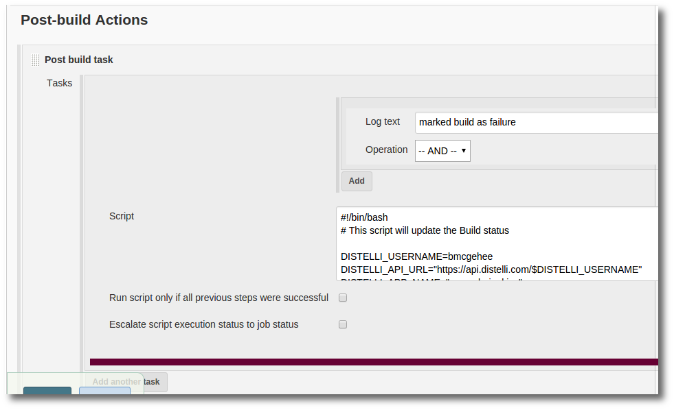

  <li>In the <b>Log text</b> field enter <code>marked build as failure</code>.</li>
  <li>In the <b>Script</b> section enter the following script:</li>

<figure>
<pre>
<code>
#!/bin/bash
# This script will update the Build status

<b>DISTELLI_USERNAME=jdoe</b>
<b>DISTELLI_API_URL="https://api.distelli.com/$DISTELLI_USERNAME"</b>
<b>DISTELLI_APP_NAME="example-jenkins"</b>
DISTELLI_TMP_RELEASE="DISTELLIrelease.$JOB_NAME.$BUILD_NUMBER.tmp"

# Setting global Distelli Env Variables
echo -e "\nSetting global Distelli environment variables\n"
DISTELLI_CI_PROVIDER="jenkins"
DISTELLI_BUILD_STATUS="Failed"

# Preparing to update the build event with "Failed" and build end time
echo -e "\nPreparing to update build event in Distelli\n"
DISTELLI_NOW=$(date -u +%Y-%m-%dT%H:%M:%S.0Z)
DISTELLI_TMP_FILENAME="DISTELLI.$JOB_NAME.$BUILD_NUMBER.tmp"
DISTELLI_BUILD_EVENT_ID=$(cat "$DISTELLI_TMP_FILENAME")
DISTELLI_RESPONSE=$(rm "$DISTELLI_TMP_FILENAME")

echo -e "Updating build event in Distelli\n"
# Updating build event with "Success" and build end time
API_JSON=$(printf '{"build_status":%s, "build_end":%s}' \
  "$(jq -R . <<<"$DISTELLI_BUILD_STATUS")" \
  "$(jq -R . <<<"$DISTELLI_NOW")")
  
DISTELLI_RESPONSE=$(curl -s -k -H "Content-Type: application/json" \
  -X POST "$DISTELLI_API_URL/apps/$DISTELLI_APP_NAME/events/$DISTELLI_BUILD_EVENT_ID?apiToken=$DISTELLI_API_TOKEN" \
  -d "$API_JSON")
  
echo -e "Distelli Build Update Response:\n $DISTELLI_RESPONSE\n\n"
</code>
</pre>
</figure>

In the above code, you may need to change the following fields:

  <ul>
    <li><b>DISTELLI_USERNAME</b> - the Distelli username of the user building with Jenkins and deploying with Distelli.</li>
    <li><b>DISTELLI_API_URL</b> - If using the Distelli SaaS, this is <code>https://api.distelli.com/$DISTELLI_USERNAME</code></li>
    <li><b>DISTELLI_APP_NAME</b> - The name of the application in Distelli. This was configured in the Create and Application in Distelli step.</li>
  </ul></ol>

<h3>Next</h3>

Now that you have Jenkins builds being pushed to Pipelines, you may want to look at the following:

  * [Setting up Manifest deploy steps](./manifest-deploy.html)
  * [Set up deployment automation in the app pipeline](./pipeline.html)
