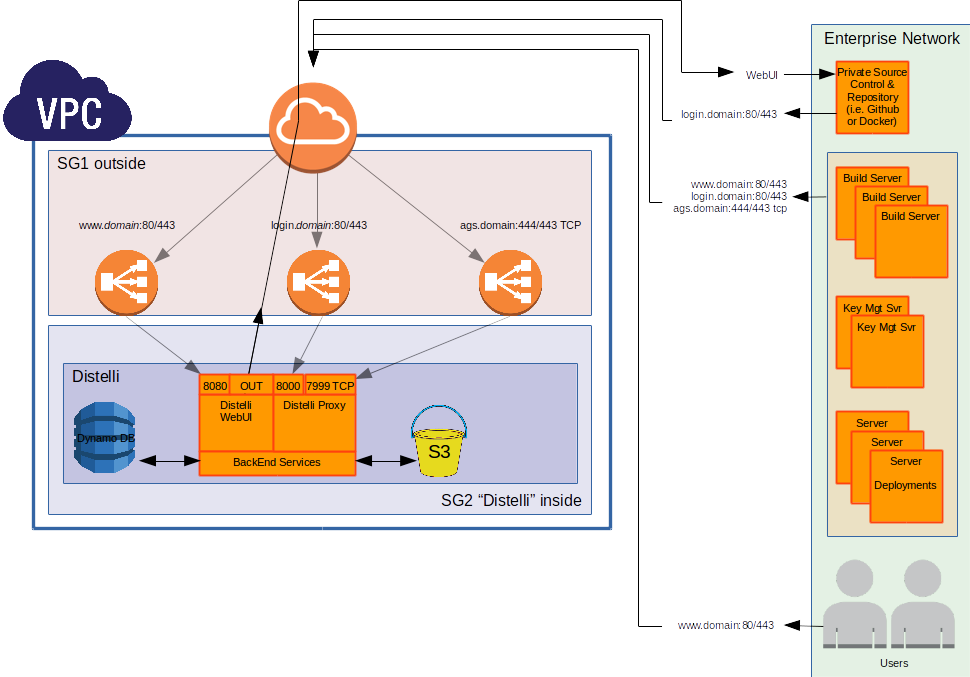
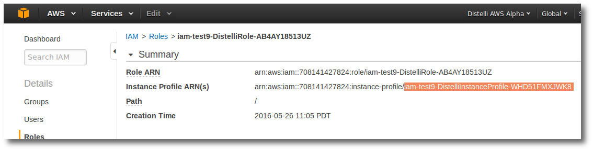

Pipelines can be completely installed and operate in an AWS environment.

The following graphic depicts the setup and services required.

<h3>Preparing for your AWS Pipelines on premises Install</h3>

<h4>VPC</h4>

First ensure you have a VPC to contain all the Pipelines resources. This can be an existing VPC or you can use the Pipelines AWS CloudFormation scripts to create this VPC.

Ensure this exists in the correct AWS Region that you have chosen.

<h4>Security Groups</h4>

Pipelines recommends creating 2 security groups:

<b>SG1 - outside :</b>

This security group represents the "outside" or "front door" before Pipelines. In this security group will sit 3 Elastic Load Balancers.

Network ACLs for this Security Group include:

<table>
<tr><th>Type</th><th>Protocol</th><th>Port</th><th>IP CIDR</th></tr>
<tr><td>Ingress</td><td>TCP</td><td>80</td><td>0.0.0.0/0</td></tr>
<tr><td>Ingress</td><td>TCP</td><td>443</td><td>0.0.0.0/0</td></tr>
<tr><td>Ingress</td><td>TCP</td><td>444</td><td>0.0.0.0/0</td></tr>
<tr><td>Egress</td><td>ALL</td><td>ALL</td><td>0.0.0.0/0</td></tr>
</table>

<b>SG2 - inside :</b>

This security group is where the Pipelines instance(s) will reside.

<table>
<tr><th>Type</th><th>Protocol</th><th>Port</th><th>IP CIDR</th></tr>
<tr><td>Ingress</td><td>TCP</td><td>7999</td><td>0.0.0.0/0</td></tr>
<tr><td>Ingress</td><td>TCP</td><td>8000</td><td>0.0.0.0/0</td></tr>
<tr><td>Ingress</td><td>TCP</td><td>8080</td><td>0.0.0.0/0</td></tr>
<tr><td>Egress</td><td>ALL</td><td>ALL</td><td>0.0.0.0/0</td></tr>
</table>

If necessary, you can create these security groups with the Pipelines AWS CloudFormation scripts.

<h4>S3 Bucket</h4>

There must exist an S3 bucket in the region you wish to run Pipelines. The Pipelines IAM Policy/Role must have permission to access this. 

If necessary, you can create this S3 bucket with the Pipelines AWS CloudFormation scripts.

<h4>IAM Policy/Role</h4>

The IAM Policy/Role is applied to the Pipelines EC2 Instances. This IAM Policy/Role needs the following permissions.

The IAM user must have access to the S3 bucket in its region. This <b>Allow</b> access must include:
<table>
<tr><th>Action</th><th>Resource</th></tr>
<tr><td>s3:ListBucket</td><td>arn:aws:s3:::BUCKET</td></tr>
<tr><td>s3:GetBucketLocation</td><td>arn:aws:s3:::BUCKET</td></tr>
<tr><td>s3:GetObject</td><td>arn:aws:s3:::BUCKET/&#42;</td></tr>
<tr><td>s3:PutObject</td><td>arn:aws:s3:::BUCKET/&#42;</td></tr>
<tr><td>s3:DeleteObject</td><td>arn:aws:s3:::BUCKET/&#42;</td></tr>
</table>

Here is an example IAM Policy, in this example BUCKET is named <b>distelli-onprem</b>:

~~~
{
    "Version": "2012-10-17",
    "Statement": [
        {
            "Effect": "Allow",
            "Action": [
                "s3:ListBucket",
                "s3:GetBucketLocation"
            ],
            "Resource": "arn:aws:s3:::distelli-onprem"
        },
        {
            "Effect": "Allow",
            "Action": [
                "s3:GetObject",
                "s3:PutObject",
                "s3:DeleteObject"
            ],
            "Resource": "arn:aws:s3:::distelli-onprem/*"
        }
    ]
}
~~~

The IAM user must also have access to the DynamoDB in its region.

During install, you can specify a prefix for you DynamoDB tables. This can provide you a mechanism to lock down Pipelines's access to your DynamoDB to only tables with this prefix. Here is an example policy, note the <b>PREFIX</b> followed by an asterisk.

~~~
{
    "Version": "2012-10-17",
    "Statement": [
        {
            "Sid": "Stmt1465427217000",
            "Effect": "Allow",
            "Action": [
                "dynamodb:BatchGetItem",
                "dynamodb:BatchWriteItem",
                "dynamodb:CreateTable",
                "dynamodb:DeleteItem",
                "dynamodb:DeleteTable",
                "dynamodb:DescribeReservedCapacity",
                "dynamodb:DescribeReservedCapacityOfferings",
                "dynamodb:DescribeStream",
                "dynamodb:DescribeTable",
                "dynamodb:GetItem",
                "dynamodb:GetRecords",
                "dynamodb:GetShardIterator",
                "dynamodb:ListStreams",
                "dynamodb:ListTables",
                "dynamodb:PurchaseReservedCapacityOfferings",
                "dynamodb:PutItem",
                "dynamodb:Query",
                "dynamodb:Scan",
                "dynamodb:UpdateItem",
                "dynamodb:UpdateTable"
            ],
            "Resource": [
                "arn:aws:dynamodb:us-west-1:123456789012:table/<b>PREFIX</b>*"
            ]
        }
    ]
}
~~~

<h4>EC2 Instance</h4>

The EC2 Instance created in AWS for Pipelines. 

Pipelines supports redundant instances, so it is recommended that 2 or more instances be stood up. Having 2 or more allows Pipelines to update Pipelines live.

The recommended minimum specifications for the Pipelines server instance is:
An AWS m4.large
<ul>
<li>2 cpu</li>
<li>8 GB RAM</li>
<li>50 GB EBS Volume</li>
</ul>

The following AWS resources will be needed to provision the instance(s).

<table>
<tr><th>Resource</th><th>Comment</th></tr>
<tr><td>Security Group</td><td>From above, this instance should be assigned to SG2</td></tr>
<tr><td>Subnet</td><td>This subnet must allow Pipelines to talk off-net so that Pipelines can communicate with the many Pipelines Agents, SCM repositories, Docker registries, and more.</td></tr>
<tr><td>Role</td><td>The IAM Instance Profile the Pipelines instance will use.</td></tr>
<tr><td>Instance Type</td><td>Pipelines recommends an r3.large or better EC2 instance.</td></tr>
<tr><td>SSH Key</td><td>An SSH Key for accessing the host to install the Pipelines software</td></tr>
</table>

<h4>Elastic Load Balancers</h4>

After the Pipelines instances are provisioned, the ELBs can be configured.

<b>ELB1</b>

This ELB is associated with <code>www</code> DNS entry.

<table>
<tr><th>LB Protocol</th><th>LB Port</th><th>Instance Protocol</th><th>Instance Port</th></tr>
<tr><td>HTTP</td><td>80</td><td>HTTP</td><td>8080</td></tr>
<tr><td>HTTPS</td><td>443</td><td>HTTP</td><td>8080</td></tr>
</table>

<table>
<tr><th>Health Check</th></tr>
<tr><td>Target:</td><td>TCP:8080</td></tr>
<tr><td>Timeout:</td><td>5 seconds</td></tr>
<tr><td>Interval:</td><td>30 seconds</td></tr>
<tr><td>Unhealthy threshold:</td><td>2</td></tr>
<tr><td>Healthy threshold:</td><td>2</td></tr>
</table>

<b>ELB2</b>

ELB2 represents various traffic to Pipelines. These include:
<ul>
<li>Pipelines Agent communication</li>
<li>Repository Webhooks</li>
<li>Pipelines API calls</li>
<li>more...</li>
</ul>

This ELB is associated with DNS entry for <code>login</code>.

<table>
<tr><th>LB Protocol</th><th>LB Port</th><th>Instance Protocol</th><th>Instance Port</th></tr>
<tr><td>HTTP</td><td>80</td><td>HTTP</td><td>8000</td></tr>
<tr><td>HTTPS</td><td>443</td><td>HTTP</td><td>8000</td></tr>
</table>

<table>
<tr><th>Health Check</th></tr>
<tr><td>Target:</td><td>TCP:8000</td></tr>
<tr><td>Timeout:</td><td>5 seconds</td></tr>
<tr><td>Interval:</td><td>30 seconds</td></tr>
<tr><td>Unhealthy threshold:</td><td>2</td></tr>
<tr><td>Healthy threshold:</td><td>2</td></tr>
</table>

<b>ELB3</b>

ELB3 is specifically for Pipelines Agent communication. This ELB is associated with DNS entry for <code>agent</code>

<table>
<tr><th>LB Protocol</th><th>LB Port</th><th>Instance Protocol</th><th>Instance Port</th></tr>
<tr><td>TCP</td><td>444</td><td>TCP</td><td>7999</td></tr>
</table>

<table>
<tr><th>Health Check</th></tr>
<tr><td>Target:</td><td>TCP:7999</td></tr>
<tr><td>Timeout:</td><td>5 seconds</td></tr>
<tr><td>Interval:</td><td>30 seconds</td></tr>
<tr><td>Unhealthy threshold:</td><td>2</td></tr>
<tr><td>Healthy threshold:</td><td>2</td></tr>
</table>

<h4>DNS Records</h4>

Before you can install Pipelines, you must determine your Pipelines DNS naming schema.

The DNS names that Pipelines uses are for the following endpoints. In a best case scenario, there should be FQDN DNS names for these.

<ul>
    <li>www</li>
    <li>login</li>
    <li>agent</li>
</ul>

<b>DNS and ELB mapping Table</b>

The DNS records associate (point to) an ELB.

<table>
<tr><th>DNS</th><th>ELB</th></tr>
<tr><td>www</td><td>ELB1</td></tr>
<tr><td>login</td><td>ELB2</td></tr>
<tr><td>agent</td><td>ELB3</td></tr>
</table>

<h4>DynamoDB Tables</h4>

The DynamoDB tables will be created as necessary by the Pipelines Install script. You can specify a unique prefix for each table. The table names also include the <b>stage</b> as the suffix. For the stage <b>beta</b> the table names without any prefix or suffix are as follows: 

**Note:** Table names are subject to change.

<ul>
<li>access</li>
<li>adeployments</li>
<li>af-tag-index</li>
<li>afidentry</li>
<li>app-branch-link</li>
<li>app-groups</li>
<li>app-pipelines</li>
<li>app-repo-link</li>
<li>app-settings</li>
<li>app-updates</li>
<li>appinstances</li>
<li>apps</li>
<li>archived-servers</li>
<li>artifacts</li>
<li>auth</li>
<li>aws-keys</li>
<li>batch-jobs</li>
<li>billing</li>
<li>deidentry</li>
<li>dinstances</li>
<li>dmq</li>
<li>docker-settings</li>
<li>domains</li>
<li>ec2-configs</li>
<li>endpoints</li>
<li>enterprise-data</li>
<li>env-branch-link</li>
<li>env-groups</li>
<li>envelope-keys</li>
<li>group-members</li>
<li>groups</li>
<li>instance-history</li>
<li>instance-images</li>
<li>instance-templates</li>
<li>instance-types</li>
<li>invoice-index</li>
<li>logins</li>
<li>master-keys</li>
<li>member-teams</li>
<li>metadata</li>
<li>news-feed</li>
<li>nftargets</li>
<li>oauth</li>
<li>pipelines</li>
<li>public-keys</li>
<li>pubsub-subjects</li>
<li>repos</li>
<li>roles</li>
<li>sequences</li>
<li>server-capability</li>
<li>server-history</li>
<li>server-inventory</li>
<li>server-launch-events</li>
<li>server-usage-2013-11</li>
<li>server-usage-2015-12</li>
<li>server-usage-2016-01</li>
<li>server-usage-2016-02</li>
<li>servers</li>
<li>snapshots</li>
<li>ssh-keys</li>
<li>stage-members</li>
<li>stage-settings</li>
<li>stages</li>
<li>tag-servers</li>
<li>tasks</li>
<li>tax-report</li>
<li>team-members</li>
<li>teams</li>
<li>tqueue</li>
<li>wh-results</li>
<li>workflow-items</li>
<li>workflows</li>
</ul>

## Puppet Pipelines AWS CloudFormation Scripts

Pipelines AWS CloudFormation scripts can provide automated setup of AWS resources for an on premises install of Pipelines.

This process is broken up into several dependent scripts. They are as follows:

**Note:** These steps must be done in order.

* VPC Creation
* Security Group Creation
* S3 Bucket Creation
* IAM Policy/Role Creation
* Instance Creation
* ELB Creation
* DynamoDB Creation

Any feature marked as <b>[*under development]</b> may not be available.

<h3>The Scripts and Usage</h3>

<h3>VPC Creation</h3>

An AWS VPC that supports the Pipelines AWS security groups, subnets, gateways, dhcp options, routes, and more. These must be created before moving on to the next step and creating the Pipelines Security Groups.

Pipelines `vpc-only.json` AWS CloudFormation script.

<table>

<tr>
<td>Description:</td><td>A minimum setup to create the AWS Networking elements for doing a Pipelines on-premise install.</td>
</tr>

<tr>
<td>Inputs:</td><td>None</td><td></td>
</tr>

<tr>
<td>Outputs:</td><td>Name</td><td>Description</td>
</tr>

<tr>
<td></td><td>distelli-vpc</td><td>VPCID</td>
</tr>
<tr>
<td></td><td>vpc-cidr</td><td>10.0.0.0/16</td>
</tr>
<tr>
<td></td><td>distelli-subnet</td><td>10.0.1.0/24</td>
</tr>
<tr>
<td></td><td>distelli-dopts</td><td>AmazonProvideDNS</td>
</tr>
<tr>
<td></td><td>distelli-rtb</td><td>10.0.0.0/16 -> 0.0.0.0/0</td>
</tr>
<tr>
<td></td><td>distelli-rtb(2)</td><td>10.0.0.0/16 -> 0.0.0.0/0</td>
</tr>
<tr>
<td></td><td>distelli-igw</td><td>10.0.0.0/16 -> Internet</td>
</tr>

<tr>
<td>Comments:</td><td>This creates all the needed underlying network infrastructure in AWS.

Typically, this script is not necessary as your <b>Operations</b> team may already have an appropriate VPC for you to use. If this is the case, move on to <b>Security Group Creation</b></td>
</tr>

</table>

<h3>Security Group Creation</h3>

Pipelines `security-groups.json` AWS CloudFormation script.

<table>

<tr>
<td>Description:</td><td>Creation of 2 security groups to support a Pipelines AWS on premises installation. This includes a Security Group for the ELBs and a Security Group for the Pipelines Instance.</td>
</tr>

<tr>
<td>Inputs:</td><td>Name</td><td>Description</td>
</tr>

<tr>
<td></td><td>distelli-vpc</td><td>The VPC in which to create the 2 security groups.</td>
</tr>

<tr>
<td>Outputs:</td><td>Name</td><td>Description</td>
</tr>

<tr>
<td></td><td>sgdistellielb</td><td>A Security Group for the Pipelines Elastic Load Balancers (ELB).</td>
</tr>

<tr>
<td></td><td></td><td>0.0.0.0/0 - port 80</td>
</tr>

<tr>
<td></td><td></td><td>0.0.0.0/0 - port 443</td>
</tr>

<tr>
<td></td><td></td><td>0.0.0.0/0 - port 444</td>
</tr>

<tr>
<td></td><td>sgdistelliinstance</td><td>A Security Group for the Pipelines Instance (Server).</td>
</tr>

<tr>
<td></td><td></td><td>0.0.0.0/0 - port 22</td>
</tr>

<tr>
<td></td><td></td><td>0.0.0.0/0 - port 7999</td>
</tr>

<tr>
<td></td><td></td><td>0.0.0.0/0 - port 8000</td>
</tr>

<tr>
<td></td><td></td><td>0.0.0.0/0 - port 8090</td>
</tr>

<tr>
<td>Comments:</td><td>This creates the necessary 2 security groups for Pipelines and the Pipelines ELBs. This includes the above required ACLs:</td>
</tr>

</table>

<h3>S3 Bucket Creation</h3>

Pipelines `s3.json` AWS CloudFormation script.

<table>

<tr>
<td>Description:</td><td>Creation of an S3 bucket.</td>
</tr>

<tr>
<td>Inputs:</td><td>Name</td><td>Description</td>
</tr>

<tr>
<td></td><td>s3name</td><td>The name of the S3 bucket to create for Pipelines.</td>
</tr>

<tr>
<td>Outputs:</td><td>An S3 Bucket</td>
</tr>

<tr>
<td>Comments:</td><td>This creates an S3 bucket in the region it is run in. This should be completed before creating the Pipelines IAM role.</td>
</tr>

</table>

<h3>IAM Policy Creation</h3>

Pipelines `iam.json` AWS CloudFormation script.

<table>

<tr>
<td>Description:</td><td>Create the appropriate IAM policy/role/profile for the Pipelines Istance.</td>
</tr>

<tr>
<td>Inputs:</td><td>None</td><td></td>
</tr>

<tr>
<td>Outputs:</td><td>Name</td><td>Description</td>
</tr>

<tr>
<td></td><td>distelli-role</td><td>The Pipelines Role</td>
</tr>
<tr>
<td></td><td>distelli-profile</td><td>The Pipelines Profile applied to the Pipelines Instance</td>
</tr>

<tr>
<td>Comments:</td><td>This creates an IAM profile for use by the Pipelines EC2 Instance. 
<b>You will be required to authorize the creation of IAM before creating this stack.</b></td>
</tr>

</table>

<h3>Instance Creation</h3>

Pipelines `instance.json` AWS CloudFormation script.

<table>

<tr>
<td>Description:</td><td>Create an EC2 Instance for running Pipelines. This requires an appropriate IAM role that includes access to DynamoDB and S3.</td>
</tr>

<tr>
<td>Inputs:</td><td>Name</td><td>Description</td>
</tr>

<tr>
<td></td><td>sgdinstelliinstance</td><td>The security group id assisnged to the Pipelines instance.</td>
</tr>

<tr>
<td></td><td>subnetdistelli</td><td>The subnet assisnged to the Pipelines instance.</td>
</tr>

<tr>
<td></td><td>distellirole</td><td>The IAM Instance Profile the Pipelines Instance will use.</td>
</tr>

<tr>
<td></td><td>InstanceType</td><td>The EC2 Instance Type [defaults to r3.large]</td>
</tr>

<tr>
<td></td><td>keyname</td><td>The SSH key to access the host</td>
</tr>

<tr>
<td>Outputs:</td><td>DistelliInstanceID</td>
</tr>

<tr>
<td>Comments:</td><td>This creates an EC2 Instance for hosting Pipelines and assigns it to the appropriate Security Group, subnet, ssh keypair, and IAM Role.</td>
</tr>

</table>

Note: The distellirole can be found here:

<h3>ELB Creation</h3>

Pipelines `elb.json` AWS CloudFormation script.

Pipelines *`elbssl.json` AWS CloudFormation script. <b>[*under developement]</b>

<table>

<tr>
<td>Description:</td><td>Create 3 AWS Elastic Load Balancers and attach them to the EC2 instance of Pipelines.</td>
</tr>

<tr>
<td>Inputs:</td><td>Name</td><td>Description</td>
</tr>

<tr>
<td></td><td>sgdinstelli3lb</td><td>The security group id assisnged to the Pipelines ELBs.</td>
</tr>

<tr>
<td></td><td>subnetdistelli</td><td>The subnet assisnged to the Pipelines ELBs.</td>
</tr>

<tr>
<td></td><td>DistelliInstanceID</td><td>The AWS EC2 Instance ID of the Pipelines Instance.</td>
</tr>

<tr>
<td>Outputs:</td><td>Name</td><td>Description</td>
</tr>

<tr>
<td></td><td>ELBweb UI</td><td>HTTP(s)://0.0.0.0/0:80/443 -> Distelli:8080</td>
</tr>
<tr>
<td></td><td>ELBProxy (app, agent, sys, login </td><td>HTTP(s)://0.0.0.0/0:80/443 -> Distelli: 8000</td>
</tr>
<tr>
<td></td><td>ELBAgs (Agent)</td><td>TCP://0.0.0.0/0:444/443 -> Distelli: 7999</td>
</tr>

<tr>
<td>Comments:</td><td>This create 3 ELBs, health checks, and assigns them to the Pipelines instance.</td>
</tr>

</table>

<h3>DynamoDB Table Creation</h3>

Pipelines *`DistelliDDB_MASTER.json` AWS CloudFormation script. <b>[*under developement]</b>

<table>

<tr>
<td>Description:</td><td>Creates the necessary Dynamo DB Tables for Pipelines. *Not necessary as currently the Pipelines bootscrap script does this.</td>
</tr>

<tr>
<td>Inputs:</td><td>Name</td><td>Description</td>
</tr>

<tr>
<td></td><td>TableNamePrefix</td><td>The prefix for the table names.</td>
</tr>

<tr>
<td></td><td>Region</td><td>The AWS region to create the dynamo db table in.</td>
</tr>

<tr>
<td></td><td>StageName</td><td>The "Environment" Pipelines is manifesting in (i.e. Beta, Gamma, or Prod)</td>
</tr>

<tr>
<td>Outputs:</td><td>Table Name</td><td>Description</td>
</tr>

<tr>
<td></td><td>AccessTable</td><td>AccessTable</td>
</tr>
<tr>
<td></td><td>AfidEntryTable</td><td>AfidEntryTable</td>
</tr>
<tr>
<td></td><td>AfTagIndexTable</td><td>AfTagIndexTable</td>
</tr>

<tr>
<td>Comments:</td><td>This create 3 ELBs, health checks, and assigns them to the Pipelines instance.</td>
</tr>

</table>

<h3>How to Run the CloudFormation Scripts</h3>

<ol>
<li><a href="http://console.aws.amazon.com">Log into Amazon WebServices Console</a></li>
<li>Navigate to the <a href="http://console.aws.amazon.com/cloudformation">CloudFormation Console.</a></li>
<li>Click <b>Create Stack</b></li>
<li>Click the <b>Browse...</b> button</li>
<li>Browse to the Pipelines CloudFormation Script file you wish to run and <b>Open</b></li>
<li>Click <b>Next</b></li>

You will find yourself on the <b>Specify Details</b> Page.

<li>Create a unique meaningful <b>Stack name</b></li>
<li>Enter the appropriate <b>Parameters</b></li>
<li>Click <b>Next</b></li>

You will find yourself on the <b>Options</b> page.

<li>Enter any appropriate <b>Tags</b> for the stack</li>
<li>Click <b>Next</b></li>
<li>Review your settings and when ready, click <b>Create</b></li>
</ol>

<h3>Removing the Pipelines Stack</h3>

You must remove the Pipelines stack in reverse order, and ensure each removal is complete before continuing to the next.

**Caution:** Removing the stack will remove all the AWS resources created by the stack.

**Note:** Before removing the S3 bucket, you must first remove its contents manually.

Order:

* [DynamoDB Creation](./onpremises-aws.html#dynamodb-table-creation)
* [ELB Creation](./onpremises-aws.html#elb-creation)
* [Instance Creation](./onpremises-aws.html#instance-creation)
* [IAM Policy/Role Creation](./onpremises-aws.html#iam-policy-creation)
* [S3 Bucket Creation](./onpremises-aws.html#s3-bucket-creation)
* [Security Group Creation](./onpremises-aws.html#security-group-creation)
* [VPC Creation](./onpremises-aws.html#vpc-creation)

