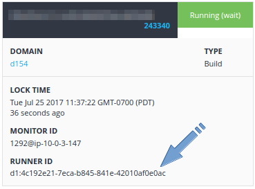

Due to the volatile nature of a shared build server, it is not uncommon for some errant processes to cause issues. This may include full disk, cluttered disk (inodes), leftover Docker images, and other issues. To deal with this, we recommend periodically cleaning your build server.

These instructions are specifically for Enterprise on-premise shared D1 account build servers. For more information on setting up a shared build server, see [Setting up Docker build images](./onpremises-setup.html#set-up-on-premises-docker-build-images).

**Note:** These instructions assume you have at least two build servers, so that while you clean one, another will continue to process builds. If not, you should set up a second build server before continuing.

1. Un-mark the server as a build server by navigating to the server details page in the Pipelines web UI and using the **Job/Build Server** toggle.

1. Ensure there are no builds currently running on the server. To do this, you will need to know the BUILD_SERVER_ID. 
    
    When you are viewing the server details page, the BUILD_SERVER_ID is in the URL. A BUILD_SERVER_ID looks like this: `4c192e21-7eca-b845-841e-42010af0e0ac`.
    
    After obtaining your BUILD_SERVER_ID, navigate to the Pipelines **/console**, then click on the **Task Queue**.
    
    Ensure all build tasks with the Runner ID of D1:BUILD_SERVER_ID are completed before continuing. After you turned off the server as a build server, no more new builds will be dispatched to it.
    
    
    
1. Login (ssh) to the build server.

1. Stop the Pipelines agent supervise process: `sudo distelli supervise stop`

1. Stop the Docker service: `sudo service docker stop`

1. Delete any task logs: `sudo rm -rf /distelli/logs/tasks/*`

1. Delete any build tasks: `sudo rm -rf /distelli/tasks/d*`

1. Delete any docker tmp files: `sudo rm -rf /home/distelli/.dtk/*`

1. Stop any ssh-agent processes: `sudo killall ssh-agent`

1. Clean up duplicates in `known_hosts`: `sudo rm -f /home/distelli/.ssh/known_hosts`

1. Restart the Docker service: `sudo service docker start`

1. Delete all Docker images not referenced:

   ~~~    
   sudo docker images | grep '^<none>' | perl -awnle 'print $F[2]' | xargs sudo docker rmi
   ~~~

1. Ensure there are no tasks in the queue:

   ~~~
   sudo sqlite3 /distelli/.dtk/app_state.sqlite 'select label from supervise_commands' | grep ^task: | sudo xargs -I '{}' sqlite3 /distelli/.dtk/app_state.sqlite 'delete from supervise_commands where label="{}"'`
   sudo sqlite3 /distelli/.dtk/app_state.sqlite 'delete from tasks'
   ~~~

1. Restart the Pipelines supervise process: `sudo distelli supervise start`

1. Mark the server as a build server by navigating to the server details page in the Pipelines web UI and using the **Job/Build Server** toggle.
